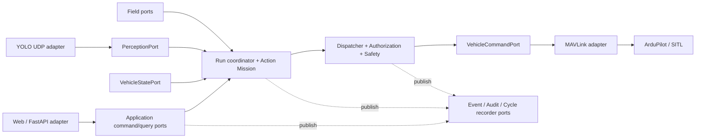
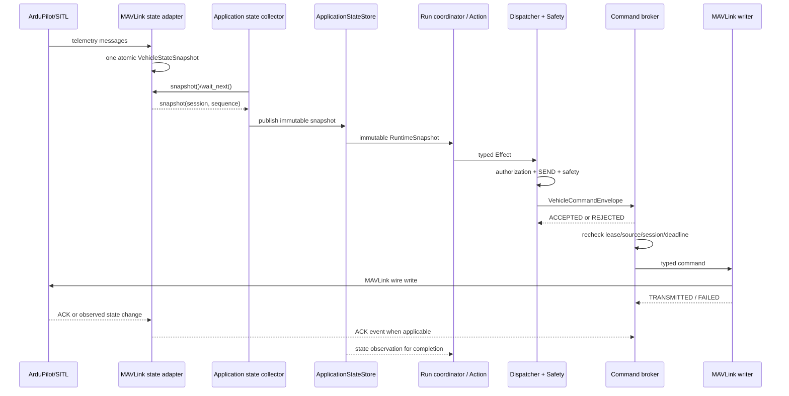
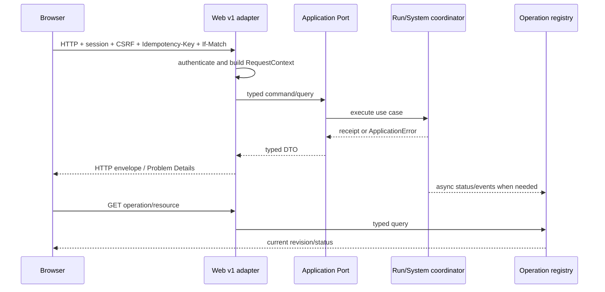
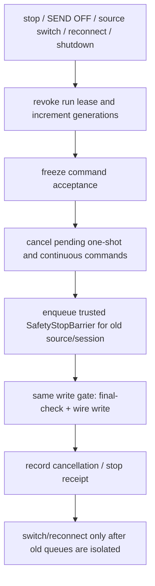
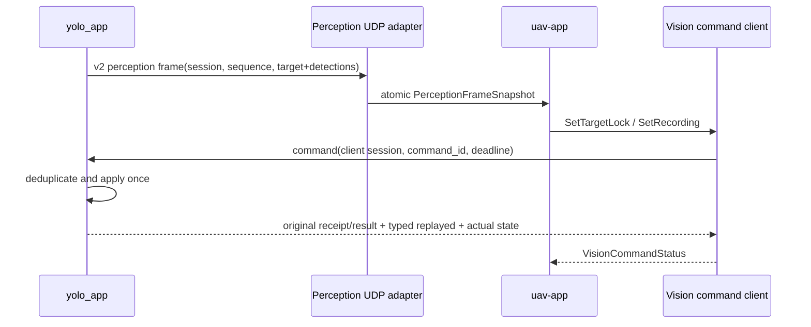
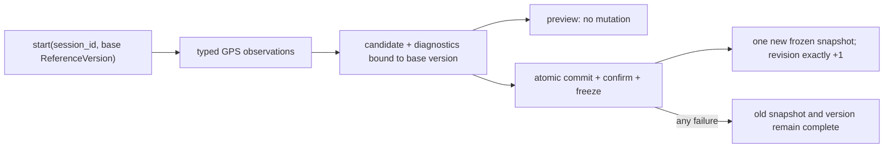
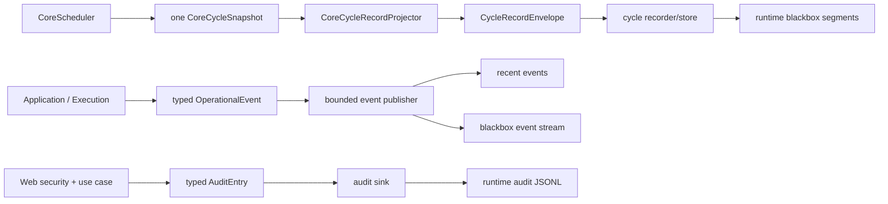
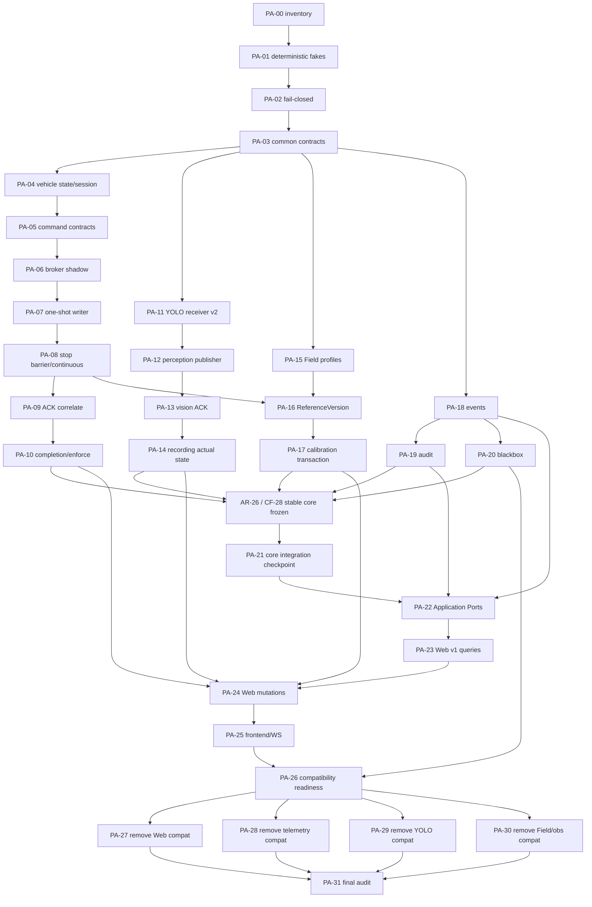

# 平台边界 Port/DTO 与生命周期重构执行计划

本文是 [全项目架构重构任务书](architecture_refactor_tasks.md) 中 `AR-25` 的详细执行计划。
目标是把 Web API、MAVLink、YOLO UDP、Field 服务和可观测性整理为稳定的端口与适配器，使普通
任务变化不再修改这些平台边界。通常只修改 Action、ActionDefinition 和 Mission；若新 Action
获得发送能力，仍必须显式更新 Execution capability policy 及安全测试。只有硬件、传输协议、操作
客户端或存储介质变化时，才修改对应适配器。

本文描述的是目标接口和迁移步骤，**不是当前已生效接口**。当前事实仍以
`AGENTS.md`、[当前架构](../architecture/current_architecture.md)、
[当前接口](../architecture/interfaces.md)、实际代码和配置为准。

Action/Mission/Effect/Run 的稳定核心实现已单独归入
[稳定核心层冻结与改造执行计划](stable_core_refactor_plan.md)。两份计划的唯一执行顺序是
`PA-00～PA-20 → CF-00～CF-28 → PA-21～PA-31`。本文 `PA-21` 只做冻结核心与 Application/平台 Port 的
集成检查，不得另建第二套 RunCoordinator、scheduler 或状态快照。

## 0. 文档状态与执行规则

- 创建日期：2026-08-16。
- 任务状态：以第 14 节复选框和完成记录为准；截至 2026-08-16，`PA-00～PA-06` 已完成，
当前第一个依赖满足的未完成项是 `PA-07`。
- 本轮批量执行的本地 readiness、验证结果和未越过的 SITL/硬件/跨计划门禁见
[`platform_adapter_interface_execution_status.md`](../records/platform_adapter_interface_execution_status.md)。
- 每个新会话只执行一个明确的 `PA-xx` 任务，不得顺手推进下一项。
- 完成全部验收前不得勾选任务；部分完成要记录剩余项，不能用兼容空壳掩盖。
- 与 `AGENTS.md`、安全文档或坐标规范冲突时，采用更严格的规则。
- 当前工作目录若没有 `.git`，必须明确记录为“源码快照”，不得伪造 revision、diff 或工作区状态；
  有 Git 元数据时必须先检查并保留用户已有修改。
- 未经用户单独授权，不连接或修改远程测试机，不启动真实硬件服务，不打开 SEND，不发送 arm、
  takeoff、land、位置、速度、yaw、servo 或 payload 命令。
- 发送相关任务默认只运行纯逻辑、fake、SITL 和 SEND=false 路径。拆桨台架或实飞不是本计划的
  自动验收步骤。

新会话开始时必须完整阅读：

```text
README.md
AGENTS.md
docs/ai/README.md
docs/ai/architecture/current_architecture.md
docs/ai/architecture/action_contracts.md
docs/ai/architecture/deprecated_paths.md
docs/ai/architecture/interfaces.md
docs/ai/guides/task_checklist.md
docs/developer/coordinate_frames.md
docs/developer/field_origin_heading.md
docs/developer/safety.md
docs/ai/plans/architecture_refactor_tasks.md
docs/ai/plans/platform_adapter_interface_refactor_plan.md
docs/ai/plans/stable_core_refactor_plan.md
```

然后只读取所选 `PA-xx` 中列出的源码和测试，不以整仓重写开始任务。

新会话先核对第 14 节，选择第一个依赖已满足的未完成项；用该编号替换下面的 `<PA-xx>`。截至
2026-08-16，该编号是 `PA-07`。推荐第一条指令：

```text
阅读 AGENTS.md、docs/ai/plans/architecture_refactor_tasks.md 和
docs/ai/plans/platform_adapter_interface_refactor_plan.md，核对任务状态后严格只执行 <PA-xx>。
先报告基线、前置与风险，再修改；不要推进下一项，不连接真机，不打开 SEND。
```

### 快速导航

- 第 1～5 节：目标、约束、当前问题和职责边界。
- 第 6～8 节：共同规则、目录和目标接口。
- 第 9～13 节：工作流、API、兼容/回滚和测试门禁。
- 第 14 节：`PA-00～PA-31` 单会话执行任务。
- 第 15～17 节：依赖、最终完成定义和完成记录。

任务分组：

| 范围 | 主题 | 是否切换外部 writer |
| --- | --- | --- |
| PA-00～PA-03 | 基线、测试设施、fail-closed、共同契约 | 否 |
| PA-04～PA-10 | Vehicle state、CommandBroker、stop barrier、ACK/完成观察 | PA-07/PA-08 |
| PA-11～PA-14 | YOLO perception、command ACK、录像真实状态 | PA-12～PA-14 |
| PA-15～PA-17 | Field profile、ReferenceVersion、calibration transaction | PA-16/PA-17 |
| PA-18～PA-20 | event、audit、blackbox recorder 基础设施 | PA-18～PA-19；PA-20 只准备，CF-26 才接入 cycle writer |
| PA-21～PA-25 | 冻结核心集成检查、Application Ports、Web v1、前端 | PA-23～PA-25 |
| PA-26～PA-31 | 兼容 readiness、分域删除、最终审计 | 删除门禁 |

## 1. 最终目标

重构完成后的稳定关系为：



核心代码只依赖稳定 Port 和不可变 DTO。具体实现由 `app/bootstrap.py` 组装：

- 换飞控、链路或 MAVLink 库：只替换 telemetry/MAVLink adapter。
- 换相机、RKNN 模型进程或视觉传输：只替换 YOLO adapter；正式推理仍限 RK3588/RKNNLite。
- 换 Field 标定输入或 profile 存储：只替换 Field adapter/repository，不改 Action 坐标语义。
- 换日志文件、数据库或远程采集：只替换 observability sink/store。
- 换网页前端或 HTTP 框架：只替换 Web inbound adapter，不改任务用例。
- 增加或调整比赛任务：改 `missions/common/actions/`、ActionDefinition、
  `config/action_missions/*.json` 和对应测试；涉及发送能力时同步更新 Execution capability policy，
  但平台 adapter/API 不变。

只有出现真正的新平台能力时才扩展契约，例如增加一种飞控命令或传感器字段。扩展必须走版本化
契约，不能让 Mission 直接调用具体硬件对象。

## 2. 永久架构与安全约束

- Action Mission 是唯一任务主线；Web UI 是唯一正式人工操作入口。
- 不恢复 `MissionRunner`、`StageRegistry`、`CommandShaper`、`FlightCommandExecutor`、旧
  mission/stage/control 栈或独立 terminal 人工入口。
- `executor.send_commands` 默认永久保持 `false`。
- Action 只产生 typed Effect；所有飞行和 payload 请求继续经过
  `ActionDispatcher → ActionSafetyPipeline → VehicleCommandPort`。
- 系统 SEND 与 run authorization 双门控不减少、不合并到 adapter，也不得由 adapter 自行放宽。
- `pymavlink` 只属于 `telemetry_link/`；Action、Mission、Web、Field、Fusion 和 YOLO 不导入它。
- `yolo_app/` 不连接 MAVLink、不产生飞行命令；不增加 x86/CUDA/PyTorch 推理路径。
- 连续 BODY_NED 控制必须有 deadman、明确 zero/stop、代际隔离和队列清理。
- 投放只走 `payload_release Action → SetServo → MAV_CMD_DO_SET_SERVO`。
- schema v3 Field 只承诺 FIELD ↔ GPS/GLOBAL，不伪造 FIELD → LOCAL_NED 原点。
- 运行产物只写入 `runtime/`；磁盘、audit、blackbox 或录像故障不得阻塞 emergency stop、SEND OFF
  或其他安全收口动作。
- 不引入 ROS、消息代理、微服务、通用 DI 框架、全局命令总线或通用全局事件总线。事件发布器只能是
  composition root 注入的窄 typed port。

## 3. 范围与非目标

### 3.1 本计划范围

1. Web inbound command/query Port、API v1、错误、幂等、资源 revision、WebSocket 事件 envelope。
2. 原子 VehicleStateSnapshot、typed VehicleCommand、队列生命周期、link session、取消和 ACK 语义。
3. 原子 PerceptionFrame、YOLO producer/client session、typed vision command、ACK 和录像真实状态。
4. Field immutable snapshot、revision、profile repository 和 calibration transaction。
5. OperationalEvent、AuditEntry、CycleRecordEnvelope 及对应 sink/store adapter。
6. composition root 的显式 `PlatformPorts` 组装及旧实现兼容适配。
7. contract、并发、故障、SITL、部署兼容和静态依赖测试。

### 3.2 非目标

- 不修改识别、定位、融合、制导、投放或飞行算法参数。
- 不改比赛 Mission 步骤、失败策略和正式模板含义。
- 不借接口重构调整 Safety Pipeline 的速度、距离、TTL、Field 或 payload 策略。
- 不把 adapter 重构变成新控制栈或并行发送链。
- 不新增 Field profile 写入、删除或自动迁移功能；首轮 repository 保持只读。
- 不在首个新版本上线时同时删除全部兼容路径；删除必须是独立任务和独立门禁。
- 不把“命令入队”“UDP 已发出”描述为“飞控已执行”或“录像已经开始”。

## 4. 当前基线与主要问题

| 当前位置 | 当前现象 | 风险 | 归属任务 |
| --- | --- | --- | --- |
| `application/web_services.py:8-58` | Port 含 `Any`、裸 `dict`、自由 callable，`from_runner()` 镜像 Runner 内部 | Web 与内部实现共同变化 | PA-22、PA-27 |
| `application/web_services.py:22,30` | Web 可手工 tick Action/Mission | 调度所有权不清，重试可能推进两次 | PA-21、PA-27 |
| `contracts/ports.py:6-21` | State Port 同时切源；Command Port 只列少量方法且返回 `Any` | 读写边界和结果语义不完整 | PA-02～PA-05、PA-28 |
| `telemetry_link/ports.py:35-47` | Command adapter 用 `__getattr__` 动态透传 LinkManager | 新方法可绕过明确接口审计 | PA-05、PA-07、PA-28 |
| `execution/dispatcher.py:835-839` | Command port 没有读方法时 source 隐式回落为 `test` | `test` 会绕过 telemetry 安全检查 | PA-02 |
| `execution/safety_pipeline.py:266-283` | `source == "test"` 时跳过连接、stale 和 control_allowed 校验 | 生产 wiring 错误可能 fail-open | PA-02 |
| `contracts/perception_protocol.py:11-49` | v1 target/scene 是 Mapping，缺 producer session、frame identity 和 command ACK | 重启低序号可能被误丢，状态可能跨帧 | PA-11、PA-12、PA-29 |
| `application/system_control.py:74-119` | Vision 命令以字符串解析；录像 UDP 发出后立刻本地标记 recording | 非 typed，显示状态不可信 | PA-13、PA-14、PA-24、PA-29 |
| `field/service.py:18-129` | Field 状态、telemetry、标定、profile 目录和 Web dict 混在一个 service | 多职责，难替换和测试 | PA-15～PA-17、PA-30 |
| `field/service.py:34-36`、`field/models.py:49` | 对外暴露可变 live `FieldReference` | Action tick 可能混用不同引用状态 | PA-16、PA-30 |
| `observability/blackbox.py:109-177` | `record()` 接收大量具体对象并保留 raw/shaped 旧术语 | Runner 与文件格式强耦合 | PA-20、PA-30 |
| `web_ui/audit.py:9-60` | Web 层直接做 JSONL I/O，字段无统一 schema/event ID | 审计与 Web 实现绑定，全文件读取 | PA-19、PA-30 |

`PA-00` 必须重新确认行号、调用点、接口清单和测试基线；上表是计划创建时的审计快照，不代替执行
会话的现状核对。

## 5. 边界职责：负责什么，不负责什么

| 层 | 负责 | 不负责 |
| --- | --- | --- |
| `contracts/platform/` | 标准库-only DTO、enum、Protocol、字段单位、版本和生命周期语义 | I/O、线程、文件、FastAPI、pymavlink、业务策略 |
| `application/ports/` | Web 可调用的任务/系统/Field/Vision 用例接口 | HTTP、JSON、Pydantic、socket、MAVLink 编码 |
| `application/` | run 生命周期、命令/查询用例、资源 revision、跨 adapter 协调 | 具体 HTTP/UDP/MAVLink/JSONL 实现 |
| `missions/` | Action 生命周期和 Mission 编排 | 平台连接、重试、ACK、文件和 Web 响应 |
| `execution/` | capability policy、授权、SEND、安全裁决、Effect → VehicleCommand | MAVLink message 构造、Mission 策略、Web |
| `telemetry_link/` adapter | 连接、状态解析、MAVLink 编码、队列、wire write、ACK 关联 | 任务完成条件、Action/Mission 选择、放宽安全策略 |
| YOLO adapter / `yolo_app/` | 感知帧协议、目标选择命令、录像真实状态、UDP 兼容 | 飞控命令、Mission 决策、MAVLink |
| `field/` | 纯坐标、Field reference、标定事务、profile repository | Web JSON、飞行发送、伪造 LOCAL_NED reference |
| `observability/` | typed event/audit/cycle 记录和存储策略 | 改变控制结果、阻塞安全动作、替代业务状态源 |
| `web_ui/` | HTTP/WS 解析、认证、CSRF、DTO 映射、统一错误和审计入口 | 直接 tick、读 Runner/Dispatcher、读写 YAML、业务 source 判断 |
| `app/bootstrap.py` | 创建具体 adapter 并注入 Port | 控制公式、业务分支、隐式 service locator |

## 6. 所有接口共同规则

1. DTO 使用 `@dataclass(frozen=True, slots=True)` 或等价不可变结构。
2. 边界字段不得使用无约束 `Any`、裸 `dict[str, object]` 或动态 `__getattr__`。
3. 距离、速度、角度和坐标字段必须在名字中标明单位/方向，例如 `_m`、`_mps`、`_rad`、
   `_deg`、`_down`、`_forward`。
4. 不可用数据使用 `None` 并附 validity/health；不得用 `0` 冒充有效值。
5. UTC 用于审计和跨进程关联；monotonic ns 用于同一 clock domain 内的 TTL、deadline、顺序和
   耗时，并携带 `clock_domain_id/boot_id`。跨主机 monotonic epoch 不可比较，wire command 使用
   `ttl_ms` 由接收端从本地接收时开始计时，或使用经过明确同步且带不确定度的 UTC。不得直接用
   wall clock 回拨敏感值计算安全超时。
6. 所有跨进程/持久化 envelope 带 `schema_major`、`schema_minor`；minor 只允许兼容性新增，破坏性
   变化增加 major。
7. 所有长生命周期源带 session ID；所有资源写带 revision 或 generation；所有操作带 request/
   command/operation ID。
8. 重试必须复用相同 idempotency key 和 command ID，不得通过重建 ID 产生二次副作用。
9. 状态读取必须是单次原子 snapshot，不能分别读取 target/scene 或 drone/gimbal/link 后自行拼接。
10. desired-state 操作使用 `set(enabled=...)`，不使用 toggle 作为正式接口。
11. adapter 返回“接纳、排队、传输、ACK、观察完成”五种独立语义，不能统一叫 `sent` 或 `ok`。
12. 旧兼容只存在于最外层 adapter；核心不同时理解新旧两套格式。

## 7. 目标目录

只有对应 `PA` 任务实际落地时才创建文件，不预先建立空抽象。

```text
contracts/platform/
  common.py
  vehicle_state.py
  vehicle_commands.py
  perception.py
  field.py
  observability.py
  ports.py

application/ports/
  runs.py
  system.py
  field.py
  vision.py
  localization.py
  configuration.py
  observability.py
  idempotency.py
  operations.py

adapters/
  configuration/
    yaml_configuration_adapter.py
  persistence/
    sqlite_idempotency.py
    sqlite_operation_registry.py

telemetry_link/
  mavlink_state_adapter.py
  mavlink_command_adapter.py
  command_broker.py
  command_events.py
  ack_router.py
  mavlink_encoder.py

observability/
  event_publisher.py
  jsonl_audit_adapter.py
  cycle_recorder.py
  jsonl_cycle_store.py

web_ui/
  routers/v1/
  http_error_mapper.py
  response_envelope.py
```

现有文件可在迁移期实现 compatibility adapter；文件拆分必须晚于行为契约测试，不能把机械拆分与
安全语义改变混在同一任务。

## 8. 接口设计

### 8.1 通用 DTO

```python
SourceId = Literal["real", "sitl"]
JsonScalar = None | bool | int | float | str
JsonValue = JsonScalar | tuple["JsonValue", ...] | Mapping[str, "JsonValue"]

# PA-07 前冻结在 contracts/platform/common.py 的跨层 canonical identity/fence 类型。
# ID/string 与 generation/int 均为彼此不可替换的 NewType 或等价 validated value object。
RunId = NewType("RunId", str)
RunResourceGenerationId = NewType("RunResourceGenerationId", str)
ActionInstanceId = NewType("ActionInstanceId", str)
LeaseId = NewType("LeaseId", str)
LinkSessionId = NewType("LinkSessionId", str)
CommandId = NewType("CommandId", str)
CancellationId = NewType("CancellationId", str)
SubmissionReceiptId = NewType("SubmissionReceiptId", str)

RunExecutionGeneration = NewType("RunExecutionGeneration", int)
AuthorizationGeneration = NewType("AuthorizationGeneration", int)
LeaseGeneration = NewType("LeaseGeneration", int)
SendGeneration = NewType("SendGeneration", int)
CancellationGeneration = NewType("CancellationGeneration", int)

@dataclass(frozen=True, slots=True)
class ResourceVersion:
    generation_id: str
    revision: int

@dataclass(frozen=True, slots=True)
class ConfigurationValue:
    schema_id: str
    schema_revision: int
    data: Mapping[str, JsonValue]

@dataclass(frozen=True, slots=True)
class SchemaVersion:
    major: int
    minor: int

@dataclass(frozen=True, slots=True)
class RequestContext:
    request_id: str
    actor_id: str
    actor_role: str
    source_address: str | None
    idempotency_key: str | None
    run_id: RunId | None

@dataclass(frozen=True, slots=True)
class ApplicationError(Exception):
    code: str
    message: str
    retryable: bool = False
    details: Mapping[str, JsonValue] = field(default_factory=dict)

class OperationOwner(Enum):
    CORE_CONTROL = "core_control"
    PLATFORM_ADMIN = "platform_admin"

@dataclass(frozen=True, slots=True)
class OperationRefDto:
    owner: OperationOwner
    operation_id: str

@dataclass(frozen=True, slots=True)
class RunTokenDto:
    run_id: RunId
    generation_id: RunResourceGenerationId

@dataclass(frozen=True, slots=True)
class StepExecutionTokenDto:
    run_token: RunTokenDto
    step_id: str
    step_generation: int

@dataclass(frozen=True, slots=True)
class OperationReceipt:
    operation_ref: OperationRefDto
    disposition: Literal["accepted", "applied", "unchanged"]
    resource_type: str
    resource_id: str
    resource_version: ResourceVersion | None

class OperationState(Enum):
    PENDING = "pending"
    RUNNING = "running"
    SUCCEEDED = "succeeded"
    FAILED = "failed"
    TIMED_OUT = "timed_out"
    INTERRUPTED = "interrupted"
    UNKNOWN = "unknown"

class OperationPhase(Enum):
    QUEUED = "queued"
    QUIESCING = "quiescing"
    READY_FOR_EXTERNAL = "ready_for_external"
    SUBMITTED = "submitted"
    APPLYING = "applying"
    RECONCILING = "reconciling"

@dataclass(frozen=True, slots=True)
class OperationSnapshot:
    operation_ref: OperationRefDto
    kind: OperationKind
    state: OperationState
    phase: OperationPhase | None
    resource_version: ResourceVersion
    created_at_utc: datetime
    updated_at_utc: datetime
    finished_at_utc: datetime | None
    child_operation_refs: tuple[OperationRefDto, ...]
    result: OperationResult | None
    error: OperationError | None
```

上述类型的所有权按“跨层 wire/DTO vocabulary”划分，不按谁推进状态划分：

| 类型 | canonical owner | 谁可创建/递增 |
| --- | --- | --- |
| RunId、RunResourceGenerationId、ActionInstanceId、LeaseId | `contracts/platform/common.py` | 迁移期 LegacyExecutionFenceAuthority；CF-25 后稳定核心 |
| LinkSessionId、CommandId、SubmissionReceiptId | `contracts/platform/common.py` | 对应 PA session/broker/receipt owner |
| RunExecutionGeneration、AuthorizationGeneration、LeaseGeneration、SendGeneration、CancellationGeneration | `contracts/platform/common.py` | 当前唯一 ExecutionFenceAuthority；Broker 永不递增 |
| CancellationId | `contracts/platform/common.py` | 当前唯一 cancellation coordinator/authority transaction |

PA-07 必须在第一次构造 `ExecutionFenceSnapshot` 前补齐并冻结这些共享类型。稳定核心可以直接 import/re-export，
但不能在 `contracts/core` 再定义同名或结构相似的副本；反过来，类型放在 platform contract 并不授权 PA adapter
推进 run、lease、SEND 或 cancellation 状态。

失败不塞入成功 receipt；由 typed `ApplicationError` 表达并在最外层映射。`actor_id` 来自认证
session，不相信请求 body 中的 operator 字段。

### 8.2 Web inbound / Application Ports

Web 最终只持有以下显式组合，不接收 `SystemRunner`、Dispatcher、LinkManager 或任意 host：

```python
RunStartRequestDto = StartActionRunRequestDto | StartMissionRunRequestDto

class RunCommandPort(Protocol):
    def start(self, request: RunStartRequestDto,
              context: RequestContext) -> RunOperationReceiptDto: ...
    def stop(self, run_token: RunTokenDto,
             context: RequestContext) -> RunOperationReceiptDto: ...
    def reset(self, run_token: RunTokenDto,
               context: RequestContext) -> RunOperationReceiptDto: ...
    def skip_step(self, expected_step: StepExecutionTokenDto,
                   context: RequestContext) -> RunOperationReceiptDto: ...

class RunQueryPort(Protocol):
    def current(self) -> RunResourceDto | None: ...
    def get(self, run_id: str) -> RunResourceDto: ...
    def action_catalog(self) -> tuple[ActionDefinitionDto, ...]: ...
    def mission_catalog(self) -> tuple[MissionDefinitionDto, ...]: ...
    def mission_definition(self, definition_id: str,
                           revision: str | None = None) -> MissionDefinitionDto: ...

class SystemCommandPort(Protocol):
    def set_send_state(self, enabled: bool, expected_version: ResourceVersion,
                       context: RequestContext) -> OperationReceipt: ...
    def set_active_source(self, source: SourceId, expected_version: ResourceVersion,
                          context: RequestContext) -> OperationReceipt: ...
    def reconnect_telemetry(self, context: RequestContext) -> OperationReceipt: ...
    def restart_service(self, service: ManagedServiceId,
                        context: RequestContext) -> OperationReceipt: ...

class SystemQueryPort(Protocol):
    def snapshot(self) -> SystemSnapshot: ...
    def operation(self, operation_ref: OperationRefDto) -> OperationSnapshot: ...

class FieldUseCasePort(Protocol):
    def reference(self) -> FieldReferenceSnapshot: ...
    def profiles(self) -> tuple[FieldProfileSummary, ...]: ...
    def profile(self, profile_id: str) -> FieldProfileSnapshot: ...
    def validate_profile(self, profile_id: str) -> FieldProfileDiagnostics: ...
    def start_calibration(self, command: CalibrationStart,
                          context: RequestContext) -> CalibrationStatus: ...
    def calibration(self, session_id: str) -> CalibrationStatus: ...
    def commit_calibration(self, session_id: str, expected_version: ReferenceVersion,
                           context: RequestContext) -> OperationReceipt: ...
    def cancel_calibration(self, session_id: str, expected_session_revision: int,
                           context: RequestContext) -> OperationReceipt: ...
    def freeze_reference(self, expected_version: ReferenceVersion,
                         context: RequestContext) -> OperationReceipt: ...
    def reset_reference(self, expected_version: ReferenceVersion,
                        context: RequestContext) -> OperationReceipt: ...

class VisionUseCasePort(Protocol):
    def snapshot(self) -> VisionSnapshot: ...
    def stream(self) -> VisionStreamSnapshot: ...
    def set_target_lock(self, track_id: int | None,
                         expected_process_session_id: str,
                         expected_frame_sequence: int,
                         expected_revision: int,
                         context: RequestContext) -> OperationReceipt: ...
    def select_adjacent_target(self, direction: TargetCycleDirection,
                               expected_process_session_id: str,
                               expected_frame_sequence: int,
                               expected_revision: int,
                               context: RequestContext) -> OperationReceipt: ...
    def set_recording(self, enabled: bool, expected_process_session_id: str,
                      expected_revision: int,
                      context: RequestContext) -> OperationReceipt: ...

class LocalizationUseCasePort(Protocol):
    def result(self) -> LocalizationResultSnapshot: ...
    def clear(self, expected_revision: int,
              context: RequestContext) -> OperationReceipt: ...

class ConfigurationUseCasePort(Protocol):
    def list(self) -> tuple[ConfigurationSummary, ...]: ...
    def get(self, config_id: str) -> ConfigurationSnapshot: ...
    def put(self, config_id: str, value: ConfigurationValue,
            expected_revision: str, context: RequestContext) -> OperationReceipt: ...
    def apply(self, config_id: str, expected_revision: str,
              context: RequestContext) -> OperationReceipt: ...
    def restore(self, config_id: str, expected_revision: str,
                context: RequestContext) -> OperationReceipt: ...

class ObservabilityQueryPort(Protocol):
    def events(self, limit: int, cursor: str | None = None) -> OperationalEventPage: ...
    def audit(self, limit: int, cursor: str | None = None) -> AuditPage: ...

class AuthSessionPort(Protocol):
    def login(self, command: LoginCommand,
              metadata: ClientRequestMetadata) -> AuthSessionReceipt: ...
    def logout(self, session_id: str, csrf_token: str,
               metadata: ClientRequestMetadata) -> None: ...

class IdempotencyRepositoryPort(Protocol):
    def claim(self, scope: IdempotencyScope, key: str, request_hash: str,
              expires_at_utc: datetime) -> IdempotencyClaim: ...
    def complete(self, claim_token: str,
                 outcome: StoredOperationOutcome) -> IdempotencyRecord: ...
    def get(self, scope: IdempotencyScope, key: str) -> IdempotencyRecord | None: ...

class OperationRegistryPort(Protocol):
    def create(self, operation: NewOperation) -> OperationSnapshot: ...
    def transition(self, operation_id: str, expected_version: ResourceVersion,
                   transition: OperationTransition) -> OperationSnapshot: ...
    def get(self, operation_id: str) -> OperationSnapshot: ...
    def interrupt_owned(self, owner_session_id: str,
                        reason: str) -> tuple[str, ...]: ...

@dataclass(frozen=True, slots=True)
class WebInboundPorts:
    auth: AuthSessionPort
    run_commands: RunCommandPort
    run_queries: RunQueryPort
    system_commands: SystemCommandPort
    system_queries: SystemQueryPort
    field: FieldUseCasePort
    vision: VisionUseCasePort
    localization: LocalizationUseCasePort
    configuration: ConfigurationUseCasePort
    observability: ObservabilityQueryPort
```

这里的类型是 PA-22 外部 Application DTO，不是稳定核心 contract 的第二份定义。唯一映射器把 core
`StartRunCommand/RunCommandReceipt/RunSnapshot` 映射为下列 request/resource DTO；外部 DTO 不得被
RunCoordinator、ActionRunner 或 MissionOrchestrator 导入。

`RunResourceDto` 对 Action 和 Mission 提供共同字段：`run_id`、`run_token`、`current_step_token`、`kind`、
`state`、`reason_code`、`target_source`、`created/started/updated/finished_at`、
`resource_version: ResourceVersion`；Action/Mission 专属结果放在带
`output_schema` 的 typed detail 中。正式 API 不暴露完整 Blackboard、Dispatcher 内部 dict 或
Safety 对象。

外部 Run DTO 不再保留第二个裸 `revision: int`；HTTP ETag 从完整 ResourceVersion 的 generation + revision
确定性派生，只用于强缓存/representation consistency。stop/reset/clear 不使用这个会随后台 progress 改变的
ETag 做 CAS，而回传 `RunTokenDto`；skip 回传 `StepExecutionTokenDto`。SEND/source 等低频可写资源仍用
If-Match + ResourceVersion。Web route 中的 `{run_id}` 必须与 token 内 run ID 完全一致，否则 409 typed conflict；
adapter 不修正或忽略其中任一值。

Application DTO 的最小稳定字段如下；具体 detail 可版本化扩展，但不能删除或改变这些字段语义：

| DTO | 最小字段 |
| --- | --- |
| `StartActionRunRequestDto` | `action_name`、`definition_revision`、typed `params`、`target_source`、`operator_confirmed` |
| `StartMissionRunRequestDto` | `definition_ref` 或 typed immutable `inline_definition`（二选一）、typed `inputs`、`target_source`、`operator_confirmed` |
| `RunOperationReceiptDto` | `operation_receipt`、当前 `run_resource` |
| `RunResourceDto` | 上述稳定公共字段、`RunTokenDto`、可空 `StepExecutionTokenDto`、`ResourceVersion`、版本化 typed detail |
| `ActionDefinitionDto` | `name`、`revision`、`label`、`description`、`params_schema`、`required_capabilities` |
| `MissionDefinitionDto` | `definition_id`、`revision`、`label`、只读 step summaries、`required_capabilities` |
| `SystemSnapshot` | view revision、各自带 revision 的 SEND/source state、link/vision health、active run ID |
| `OperationRefDto` | opaque ID、`owner: CORE_CONTROL | PLATFORM_ADMIN`；两个 namespace 不碰撞、不靠字符串猜 owner |
| `OperationSnapshot` | `operation_ref`、kind、state、可空 typed phase、ResourceVersion、created/updated/finished UTC、typed result/error、child operation refs |
| `VisionSnapshot` | `revision`、process session/frame identity、target、recording desired/actual、last command/health |
| `VisionStreamSnapshot` | stream ID、transport、endpoint/codec、width/height/fps、health、revision；敏感凭据不返回 |
| `LocalizationResultSnapshot` | `revision`、`available`、结果时间、typed pose/quality；无结果时字段为 `None` |
| `ConfigurationSummary` | `config_id`、label、schema ID、current/applied revision、apply/restart requirement |
| `ConfigurationSnapshot` | summary 字段、typed value、validation diagnostics；revision 可用内容 hash，不返回文件路径 |

`IdempotencyRepositoryPort` 和 `OperationRegistryPort` 的接口归 `application/ports/`；内存、SQLite 等
具体实现归 `adapters/persistence/`。`AuthSessionPort` 只归 Web security boundary；`LoginCommand` 中的
credential 不进入 Application 业务 DTO、audit detail、Mission 或 Execution，`AuthSessionReceipt` 只返回
session/CSRF/expiry 所需数据。

`IdempotencyClaim` 只能是 `CLAIMED|REPLAY|CONFLICT|IN_PROGRESS|INDETERMINATE`，`claim()` 必须是单库
原子 compare-and-set。`REPLAY` 返回原始 receipt/error，`CONFLICT` 表示同 key 不同 request hash；
`IN_PROGRESS/INDETERMINATE` 都禁止再次执行副作用。claim 必须在副作用前持久化，complete 必须保存原始
结果；进程崩溃留下的未完成 claim 不自动重跑非幂等操作，而是关联到 `INTERRUPTED/UNKNOWN` operation，
等待显式查询或 reconciliation。

相关 DTO 最小字段固定为：`IdempotencyScope(actor_id, command_type, resource_type, resource_id)`；
`IdempotencyClaim(disposition, claim_token, original_record)`；`IdempotencyRecord(request_hash, state,
operation_id, sanitized outcome, created/completed/expires UTC)`；`StoredOperationOutcome` 是原始成功 receipt
或稳定 Problem Details 快照二选一。`NewOperation` 包含 operation/kind/owner session/request/run/correlation
ID 和创建时间；`OperationTransition` 包含 expected from-state、to-state、progress、typed result/error 和
完成时间。不得持久化 credential、CSRF token 或未脱敏异常对象。

`OperationSnapshot.state` 固定为 `PENDING|RUNNING|SUCCEEDED|FAILED|TIMED_OUT|INTERRUPTED|UNKNOWN`；
transition 使用 operation revision 做 CAS，终态不可退回运行态。app 启动生成新的 owner session，并在
接纳新 mutation 前把旧 owner 的 PENDING/RUNNING operation 标记 `INTERRUPTED`，除非对应 adapter 有
明确的只读 reconciliation 证据；恢复流程绝不自行重发飞控、录像或 payload 命令。SQLite 实现可以让
两个 Port 共享同一数据库/transaction，但 Application 只依赖上述 Protocol。
`phase` 只细分非终态进度，不替代 state；尤其 READY_FOR_EXTERNAL 仍是 `state=RUNNING`，只表示 core 已完成
静止门禁、外部 supervisor 可以开始，不表示 restart/apply 已成功。终态 `phase=None`。

`OperationRegistryPort` 只拥有 `PLATFORM_ADMIN` operation（restart、configuration apply 等），不得复制 core
system operation。`CORE_CONTROL` operation 由 CoreSystemQueryPort 唯一拥有。外部 OperationRefDto 带明确 owner，
SystemQueryPort 按 owner 路由只读查询；platform-admin restart snapshot 用 child operation ref 关联 core maintenance，
而不是合并两边 revision/state。

`inline_definition` 只包含 versioned Action reference、typed params 和 failure policy，不导入
`MissionActionStep`。旧 `/api/action-mission/configure` 的能力折叠进一次幂等 `POST /api/v1/runs`：
提交并启动同一 immutable definition，不再保留“先改全局草稿、后 start”的竞态。`operator_confirmed`
只是请求事实，不等于 run authorization；角色、preflight 和 capability policy 仍由 Application/Execution
裁决。

兼容期旧 configure/start 两步调用只能在 Web compatibility adapter 内保存“认证 session 作用域、带
revision 和短 expiry”的 immutable draft；旧 start 原子读取该 revision 并调用同一个
`RunCommandPort.start(StartMissionRunRequestDto)`。不得继续写 Application 全局可变 Mission 草稿，PA-27 随旧 route
一起删除该兼容 draft。

Configuration boundary 只接受 allowlist 中的稳定 `config_id`，由 concrete adapter 映射到固定文件；
API 不接受路径。读取时按 schema 脱敏，`put` 先做 typed validation，再以临时文件、flush 和同目录原子
replace 产生新 current revision，同时保留可恢复备份；`put` 不等于已经 apply。`apply` 只能触发登记过的
reconnect/restart/reload operation；任何 restart 或可能影响 control/snapshot 的 reload 都复用
BeginMaintenance→READY_FOR_EXTERNAL→supervisor/apply→EndMaintenance 链，先撤销授权、cancel 并保持 SEND=false；失败时
current/applied revision 和 rollback 状态必须可查询。`restore` 恢复已登记备份，不接受任意文件来源。

Web adapter 只负责：

- 认证、角色、Host/Origin/CSRF/rate limit；
- HTTP/Pydantic 与 Application DTO 的双向转换；
- request/idempotency/If-Match context；
- ApplicationError → HTTP Problem Details；
- 同一 request ID 下的传输审计。

Web adapter 不负责：

- 判断 source 与 active source 是否匹配；
- 构造 `MissionActionStep`、直接 tick、启动线程或访问 Runner；
- 读取/写入 YAML、Field profile、日志文件或 YOLO socket；
- 根据错误字符串猜 HTTP status；
- 捕获所有异常后返回 HTTP 200 + `{ok:false}`。

### 8.3 telemetry / MAVLink State Ports

```python
class VehicleStatePort(Protocol):
    def snapshot(self, source: SourceId | None = None) -> VehicleStateSnapshot: ...
    def wait_next(self, *, after_session_id: str, after_sequence: int,
                  timeout_s: float, source: SourceId | None = None
                  ) -> VehicleStateSnapshot | None: ...

class LinkControlPort(Protocol):
    def status(self) -> LinkControlSnapshot: ...
    def activate_source(self, source: SourceId, expected_revision: int) -> SourceSwitchReceipt: ...
    def reconnect(self, source: SourceId | None = None) -> OperationReceipt: ...
```

`VehicleStatePort` 是纯只读接口，不能切源。`VehicleStateSnapshot` 一次锁内生成，至少包含：

| 分组 | 必要字段 |
| --- | --- |
| identity | `schema`、`source`、`link_session_id`、`sequence` |
| time | `captured_at_utc`、`captured_at_monotonic_ns`、各子状态 age |
| link | `connected`、`stale`、`control_allowed`、system/component ID、last RX |
| flight | armed、mode、landed/in_air、failsafe |
| attitude | roll/pitch/yaw `_rad`、yaw rate `_rad_s` |
| local | north/east/down `_m`、对应速度 `_mps`、valid |
| global | latitude/longitude `_deg`、MSL/relative altitude `_m`、valid |
| GPS | fix type、satellites、eph/epv、valid |
| power | battery voltage/current/remaining，未知为 `None` |
| gimbal | angle/rate、health、反馈 age |

每次真实 connect/reconnect 生成新的 `link_session_id`。旧 session 的晚到数据、命令、retry 和 ACK
不能污染新 session。

MAVLink 原始包本身不带本系统 session，因此 reconnect 必须通过 receiver generation 实现隔离：停止并
join 旧 receiver，关闭/重建 transport/socket，清空 state/ACK/inflight，启动捕获不可变
`receiver_generation` 的新 receiver，等待新 heartbeat 和 target identity 握手完成后才发布新
`link_session_id`。StateCache update 必须携带 generation，非当前 generation 一律拒绝；UDP 模式
重建 socket 并尽可能排空旧缓冲。

snapshot 表示“同一次锁内 publication cut”，不是 MAVLink 各传感器物理同帧；drone、gimbal、GPS
等子状态保留各自 sample time、age 和 validity。`wait_next()` 若发现 caller 的 session ID 与当前
session 不同，应立即返回当前 snapshot，不能用旧 sequence 继续等待。

### 8.4 telemetry / MAVLink Command Ports

```python
@dataclass(frozen=True, slots=True)
class ExecutionFenceSnapshot:
    resource_version: ResourceVersion
    source: SourceId
    link_session_id: LinkSessionId
    run_id: RunId | None
    run_execution_generation: RunExecutionGeneration | None
    authorization_generation: AuthorizationGeneration | None
    action_instance_id: ActionInstanceId | None
    execution_lease_id: LeaseId | None
    lease_generation: LeaseGeneration | None
    send_generation: SendGeneration
    cancellation_generation: CancellationGeneration
    published_at_monotonic_ns: int

class ExecutionFenceQueryPort(Protocol):
    def snapshot(self) -> ExecutionFenceSnapshot: ...

class VehicleCommandPort(Protocol):
    def submit(self, command: VehicleCommandEnvelope) -> CommandSubmissionReceipt: ...
    def cancel(self, request: CancelRequest) -> CancellationReceipt: ...
    def status(self, command_id: str) -> CommandStatusSnapshot: ...

class CommandEventPort(Protocol):
    def read_after(self, cursor: int, limit: int = 100,
                   timeout_s: float = 0.0) -> CommandEventPage: ...
```

`ExecutionFenceSnapshot` 是 broker admission/dequeue/wire-final-check 的唯一当前事实切面；一次原子引用读取包含
全部 generation/source/session，禁止分别查询多个 owner 后拼装。Command envelope 携带的是创建时 grant，broker
每次都与当前 snapshot 精确比较。最终该 snapshot 由冻结核心的 RunCoordinator/SystemSendState 在同一 control
transaction 内通过唯一 CoreExecutionFenceAuthority 原子发布；PA broker 只持 QueryPort，不能修改或“补齐”
generation。authority/store 拒绝 generation 回退、跳代非法组合和同 version 异 payload；对外不暴露通用
PublisherPort，避免第二个 caller 绕过 run/system transition table。

为保持既定 `PA-00～PA-20 → CF-*` 顺序，PA-07～CF-25 迁移窗只允许一个
`LegacyExecutionFenceAuthority`：它仅根据旧 ActionRuntime/MissionService/SystemControl/LinkControl 的显式
start/authorized-child/stop/SEND/source/session 事件原子递增并发布同一 canonical snapshot，不按 Action 名、ID
或当前 getter 猜值，也不授予旧策略尚未批准的能力；迁移期该 authority/store 是唯一 publisher，但只暴露
read-only QueryPort 给 broker。PA-07 切 writer 前必须先接通并完成 characterization；
CF-17 的 LegacyLeaseBridge 只读这个 snapshot 做最小权限投影，CF-25 在无 active run/SEND=false/空队列下由
RunCoordinator/SystemSendState 原子接管 publisher，CF-27 删除 legacy authority。任一时刻只能有一个 publisher。

`CommandSubmissionReceipt` 与 `VisionSubmissionReceipt` 共享以下 typed replay 语义：

```text
receipt_id: SubmissionReceiptId       # PA-07 在 contracts/platform/common.py 冻结的强类型 identity
submission_state / result_state: ...  # 始终保留第一次处理的真实结果
replayed: bool                        # 本次返回是否命中同 key/command 的幂等缓存
reason_code: stable enum | None
```

命中幂等缓存时返回相同 `receipt_id` 和相同业务结果，只把 `replayed=true`；同 key 但不同 payload 必须
返回 typed conflict，不能解析自由字符串 `idempotent_replay`，也不能把 replay 改写成一种新的成功状态。
PA-07 在 Vehicle writer 切换前补齐并验证这些字段；PA-13 对 Vision receipt 使用同一语义。

`VehicleCommandEnvelope` 必须包含：

```text
schema
command_id
run_id
run_execution_generation
execution_lease_id
lease_generation
authorization_generation
send_generation
source
expected_link_session_id
created_at_monotonic_ns
deadline_monotonic_ns
priority
idempotency_key
ack_policy: DISABLED | RECORD_ONLY | REQUIRED
completion_policy: TRANSPORT_ONLY | STATE_OBSERVED
ack_timeout_ms
payload: VehicleCommand
```

`VehicleCommand` 是 discriminated union：

```text
SetMode
Arm / Disarm
Takeoff / Land
LocalPositionTarget
GlobalPositionTarget
BodyVelocity
ConditionYaw
ChangeSpeed
SetServo
GimbalAngle / GimbalRate
StopMotion
```

不得加入 `release_payload` 或 RC override。Action Effect 仍表达任务意图；Dispatcher/Safety 在裁决后
把 Effect 转为 VehicleCommand，transport session/ACK 字段不能反向泄漏进 Action。

提交、排队、传输、ACK 与任务完成是独立状态轴，不能压成一个互斥 enum：

```text
submission_state: REJECTED | ACCEPTED
queue_state:      NOT_QUEUED | QUEUED | DEQUEUED | CANCELLED | EXPIRED | SUPERSEDED
transport_state:  NOT_ATTEMPTED | TRANSMITTED | FAILED
ack_state:        NOT_APPLICABLE | WAITING | IN_PROGRESS | ACKED | NACKED | TIMEOUT
completion_state: NOT_REQUIRED | WAITING | OBSERVED | GOAL_TIMEOUT | SESSION_LOST
```

`CommandStatusSnapshot` 与 `VisionCommandStatus` 都必须携带完整 `resource_version: ResourceVersion`；只有
可观察 lifecycle/actual-state 变化才增加 revision，重复查询不增。Application EffectStatusProjectionPort
用它去重归一化 feedback，不能拿 event cursor 或裸 sequence 代替资源版本。

- `ACCEPTED/QUEUED` 只表示平台接受，不能显示为 sent。
- `TRANSMITTED` 只表示 writer 成功写到 wire，不表示飞控执行完成。
- `ACKED` 后仍可继续等待 `OBSERVED`；`ACK TIMEOUT` 表示 ACK 未知，不阻止同 session 的后续新状态
  证明 `OBSERVED`。`NACKED` 不得伪装为 observed completion。
- latest-only 旧命令被新命令替换时标记 `SUPERSEDED`，不能混作 cancelled/failed。
- `COMMAND_LONG/INT` 的关联主键使用 link session、`COMMAND_ACK.command` 和 ACK 消息头来源
  sysid/compid；ACK target extension 非零时只用于校验该 ACK 是否发给本端，不作为飞控身份主键。
- 所有可能产生 ACK 的 COMMAND_LONG/INT write 都注册 correlate slot；即使 ack policy 为 DISABLED，
  也注册 discard/quarantine slot，防止迟到 ACK 错配给后续同 MAV_CMD 命令。同 key 严格单 inflight，
  不依赖 COMMAND_LONG confirmation 字段。
- inflight 在 wire write 前注册，早到 ACK 先缓存，对外事件仍规范排序。ACK timeout 与 command total
  deadline 分离；IN_PROGRESS 可以更新进度，但不能无限延长 total deadline。
- local/global setpoint、BODY velocity、zero stop 和当前 set_mode 路径不能假设有 per-command ACK；
  由 Application observer 根据 vehicle state 产生 completion state。observer 只接受同 link session、
  sample sequence/time 晚于 TRANSMITTED 的新状态；reconnect 终止为 SESSION_LOST，不能用发送前已经
  满足的 cache 或跨 session 状态判 OBSERVED。
- ACK timeout 表示结果未知，非幂等命令不得盲目重发。

按实际命令类型冻结策略：

| 命令类别 | ACK policy | Completion policy |
| --- | --- | --- |
| ARM/DISARM、TAKEOFF/LAND、CONDITION_YAW、CHANGE_SPEED、SET_SERVO、单次 GimbalAngle | 可逐项 `REQUIRED` | 仅需飞控接纳且无可靠反馈的使用 `TRANSPORT_ONLY`；起飞/降落等使用 `STATE_OBSERVED` |
| 当前 SET_MODE message | `DISABLED` | `STATE_OBSERVED`，观察新 heartbeat mode |
| local/global position setpoint | `DISABLED` | `STATE_OBSERVED` |
| BODY velocity | `DISABLED` | stream refresh/deadman，不把单帧当任务完成 |
| SafetyStopBarrier | `DISABLED` | 以 TRANSMITTED 和 write ordering 为准 |
| 高频 GimbalRate | 不逐样本等待；仍注册 ACK discard slot（若编码可能产生 ACK） | latest-only/TTL/deadman |

`CancelRequest` 可按 `command_id`、`run_id`、`execution_lease_id`、`source` 或 continuous stream
取消，并包含 `emit_stop_barrier` 和 reason。SEND OFF、授权撤销、source switch、reconnect、stop、
shutdown 必须复用同一 cancel primitive。

PA-08 必须把以下 DTO 冻结为 `contracts/platform/vehicle_commands.py` 的 canonical 类型；稳定核心直接引用，
不得再定义同名副本：

```text
CancelRequest
  schema_version
  cancellation_id
  scope: COMMAND | EXECUTION_LEASE | RUN | SOURCE | CONTINUOUS_STREAM
  command_id / execution_lease_id / run_id / stream_id（按 scope 恰好满足要求）
  source
  expected_link_session_id
  target_run_execution_generation
  target_lease_generation
  target_authorization_generation
  target_send_generation
  cancellation_generation
  emit_stop_barrier
  reason_code
  deadline_monotonic_ns

CancellationReceipt
  schema_version
  cancellation_id
  matched_pending_ids
  already_transmitted_ids
  not_found_ids
  barrier_id
  barrier_disposition: NOT_REQUIRED | TRANSMITTED | STOP_UNDELIVERABLE
  source
  link_session_id
  completed_monotonic_ns
```

这里必须区分两类 generation：`target_*` 是要从 queue/inflight/stream 中清除的旧 command envelope fencing，
按 scope 精确匹配；`cancellation_generation` 是本次 privileged cancel/STOP barrier 的当前安全授权。broker 在
同一个 write gate 内校验 current cancellation generation，并且只删除 target generations 匹配的旧命令。
因此迟到旧 cancel 不能清掉新 run，而 SEND 已关闭/lease 已撤销后产生的新安全 cancel 仍可发送 barrier。
`RunAuthorizationGrant.authorization_generation`、Effect envelope/run-execution generation、
ExecutionLease.lease_generation
由当前唯一 fence authority/grant 原样带入 VehicleCommandEnvelope；最终 authority 是稳定核心，迁移期是上述
LegacyExecutionFenceAuthority。PA 不按 ID 猜 generation，也不维护第二套映射。

`cancellation_generation` 的唯一 allocator 也是当前 fence authority，而不是 Broker：stop/system intent 在控制
事务中先保存被撤销的 target generations，再递增 cancellation generation、失效 command admission 并原子发布
新 ExecutionFenceSnapshot，随后才构造携带**新/current cancellation generation** 的 CancelRequest。Broker 只读
snapshot 并校验。迁移窗由 legacy authority 执行同一事务，CF-25 后由 RunCoordinator/system-control aggregate
执行。

控制面 cancellation 必须是按 `source + link_session_id` 串行的 single-flight transaction：同一时刻最多一个
已分配 generation、尚未收到 terminal `CancellationReceipt` 的请求。新 stop trigger 若已被当前 targets 覆盖，
复用同一 `cancellation_id`/generation 并合并 reason、`emit_stop_barrier=true` 的升级和更早 deadline；若引入新
targets，则在 request 尚未提交时并入当前 immutable materialization，已经提交后只排入 authority/coordinator 的
下一 transaction，**不得先递增 generation**。当前 transaction terminal 并 commit 后才可为下一批分配更高
generation；整个队列排空前 command admission/新 run activation 保持冻结。这样不会让后一个 cancel 把仍在
Broker 内执行的前一个 cancel 变成 stale，也不会遗漏较早请求持有的 targets。Broker 不拥有该队列，只同步执行
已经 materialize 的一个 canonical request，并在 deadline 内返回 terminal receipt。

这是对当前源码中旧 `CancelRequest/CancellationReceipt` shape 的破坏性升级，不能只改计划调用方。PA-08
必须按 PA-03 规则提升 contract major（准确版本由 PA-00 baseline 记录）、实现 scope-specific one-of/
generation/deadline 校验，并在同一切换中迁移 `VehicleCommandPort.cancel()` 与所有 production caller；旧
shape 只能由一个最外层、单向 legacy decoder 在有期限迁移窗口读取，核心永远只看到 canonical 新 DTO。

`VehicleCommandPort.cancel()` 可在 broker 内部排队，但必须在 request deadline 内返回上述 terminal receipt；
不能把 `QUEUED` 当完成。如果未来改为异步 cancel，必须先版本化新增 `CancellationStatusPort/EventPort`，
不能让调用方读取 broker 内部状态。

取消策略按 scope 固定：

| scope | 行为 |
| --- | --- |
| pending one-shot command ID | 只取消该命令，不发 barrier |
| continuous/motion stream | 清该 stream；存在 active/recent motion 时发 barrier |
| SEND OFF、run revoke、source switch、shutdown | 清全部 pending；存在 active/recent motion 时发 barrier |
| 已 transmitted one-shot | receipt=`already_transmitted`，不自动发反向补偿 |

`SafetyStopBarrier` 是 Broker/Safety 内部可信消息，不是 Action 可构造的普通 `StopMotion`。控制面 cancel 产生的
barrier 绑定被停止的旧 active source 和旧 link session，使用 fence authority 已发布的新 cancellation generation，
有独立短 deadline；只绕过已经撤销的 run lease/SEND gate，仍校验 source、link session 和自身 deadline。任何
普通 Action 都无权设置 bypass。

wire deadman 是唯一明确例外：它必须在 scheduler/Coordinator 完全卡死时仍可独立把连续输出归零，因此它
**不等待控制面分配新 cancellation generation，也不构造外部 CancelRequest**。Broker 在唯一 write gate 内根据
当前 active continuous-stream record 构造私有 `WireDeadmanStopProof`，再次确认 TTL 已过期、target stream 仍是
当前 active/recent stream、source/link session 未被替换，并读取 gate 内的**当前** cancellation generation；随后
原子清该 stream/待发位置、把 `(source, session, run-execution, action, lease-generation, stream-id)` 置为
`DEADMAN_LATCHED`，再发送 SafetyStopBarrier。这里复用当前 generation 只证明 barrier 产生时的 gate cut，不推进
任何 control-plane generation，也不能被普通 cancel/Action 调用。

deadman latch 后，同一 execution lease generation/stream identity 的任何非零 refresh 一律返回 typed
`DEADMAN_LATCHED`；scheduler 恢复本身不能自动重启运动。只有核心观察 terminal deadman status、完成安全状态
转换并由唯一 fence authority 签发新的 execution lease generation（以及新的 stream incarnation）后才可重新
接纳。若 gate 内发现 source/session 已换或该 stream 已被新 active stream supersede，则不向新 session 重放旧
barrier，而是记录 `STOP_UNDELIVERABLE`/superseded 的 typed terminal status。该本地安全路径不参与上述控制面
single-flight generation 队列，二者仍由同一个 Broker event loop/write gate 排序去重，确保同一 target 最多一个
有效 barrier wire write。

由 stop/system intent 触发的控制面连续取消顺序固定为（wire deadman 使用上面的独立本地路径）：

```text
control authority 冻结接纳/失效旧 command fence → 发布新 cancellation generation → 提交 CancelRequest
→ Broker 清旧 stream/待发位置
→ 插入 SafetyStopBarrier → 在同一 write gate 内完成 final check + wire write → 记录结果
```

Broker/cancel/send 必须由单一事件循环串行，或让 snapshot read/generation final-check 与 wire write位于同一
critical write gate；Broker 不增 control-plane generation。保证是“barrier TRANSMITTED 后绝无旧 generation
非零 write”；不能声称 cancel 瞬间前已经越过 write gate 的命令从未写出。

`CancellationReceipt` 至少返回 matched pending IDs、already transmitted IDs、barrier ID、source/
session 和 `barrier_disposition=TRANSMITTED|STOP_UNDELIVERABLE|NOT_REQUIRED`。source switch 先对旧
source/session 等待 barrier 结果；旧链路断开时可在明确 STOP_UNDELIVERABLE 后继续切换，但 UI/audit
不得显示旧源已安全停止。

shutdown 顺序为 freeze/cancel → 有界等待 barrier TRANSMITTED 或 STOP_UNDELIVERABLE → stop/join
唯一 sender → close transport。不能先设置 sender stop event 导致 barrier 永远无法发送。

断线时必须返回 `STOP_UNDELIVERABLE`，旧 stop 不跨 reconnect 自动重放。`hold_current_local_position`
属于上层 recovery use case，不属于 transport Port。

### 8.5 YOLO / Perception Ports

```python
class PerceptionPort(Protocol):
    def snapshot(self) -> PerceptionFrameSnapshot: ...
    def wait_next(self, *, after_session_id: str, after_sequence: int,
                  timeout_s: float) -> PerceptionFrameSnapshot | None: ...
    def health(self) -> PerceptionHealthSnapshot: ...

class VisionCommandPort(Protocol):
    def submit(self, command: VisionCommandEnvelope) -> VisionSubmissionReceipt: ...
    def status(self, command_id: str) -> VisionCommandStatus: ...
```

`VisionCommandEnvelope` 不是裸 UDP payload，必须先冻结 authority union：

```text
RunVisionAuthority
  run_id, run_execution_generation, action_instance_id
  execution_lease_id, lease_generation, authorization_generation, source

OperatorVisionAuthority
  operation_id, actor_id, authorization_policy_revision

VisionCleanupAuthority
  cleanup_operation_id, target_run_id, target_run_execution_generation
  target_action_instance_id, target_yolo_process_session_id

VisionCommandEnvelope
  schema_version, command_id, idempotency_key
  client_id, client_session_id, target_yolo_process_session_id
  authority: RunVisionAuthority | OperatorVisionAuthority | VisionCleanupAuthority
  created_at_monotonic_ns, deadline_monotonic_ns
  payload: SetTargetLock | SetRecording
```

Action/Effect 产生的 SetTargetLock 必须使用 RunVisionAuthority；Application 人工 target/recording use case 使用
OperatorVisionAuthority；Run terminal/session cleanup 只使用受信 VisionCleanupAuthority。普通 run/operator command
不能伪造 cleanup，普通 `SetTargetLock(track_id=None)` 不能绕过 owner check。Vision command adapter/broker 在 admission
和每次 UDP send/retry 前读取同一个 ExecutionFenceQueryPort：Run authority 任一 generation/ID 已失效就返回
REJECTED/SUPERSEDED，不得让旧 UDP retry 在新 run 中重新锁定。cleanup 只清理 exact target run/action/session
拥有的 desired state；若当前 owner 已变，返回 unchanged/stale，不能清新状态。Operator authority 不借用 Run fence，
但必须由 Application authorization policy 签发且仍受 target process session/deadline/idempotency 约束。

`PerceptionFrameSnapshot` 必须是同一帧的原子对象：

```text
schema
producer_id
yolo_process_session_id
sequence
frame_id
captured_at_utc
captured_at_monotonic_ns
producer_clock_domain_id
received_at_monotonic_ns
image_width_px / image_height_px
target
detections
truncated / original_detection_count
producer_status
```

target 和 detections 不再由两个 getter 分别读取。重启判重键为
`(yolo_process_session_id, sequence)`。active session 只能通过受信 endpoint 的显式 HELLO/capability/
heartbeat 建立；不能把任意“不同 UUID 的普通 frame”自动当成新 session。切换后把旧 session 放入
有界 tombstone/LRU，覆盖最大网络迟到与重试窗口，旧 session 晚到包永不重新激活。

v2 wire envelope 统一包含：

```text
common: schema_major/minor, message_type, sequence, sent_at_utc, ttl_ms, payload
perception/hello/status: producer_id + yolo_process_session_id + producer_clock_domain_id
  command: client_id + client_session_id + target_yolo_process_session_id + command_id
           + typed authority fencing（run/operator/cleanup one-of）
ack/status reply: producer_id + yolo_process_session_id
                  + echoed client_id/client_session_id/command_id
```

正式 vision command 使用 typed desired-state：

```text
SetTargetLock(track_id | None)
SetRecording(enabled)
```

App 的“下一/上一目标”用例必须从原子 PerceptionFrame 选出明确 track ID，再发送
`SetTargetLock(track_id)`；不向 YOLO 发送不可重放的 CycleTarget 边沿命令。

App 没有当前健康 YOLO process session 时拒绝 command；YOLO restart 后，旧 target session 的 retry
返回 `REJECTED/SESSION_MISMATCH`，不能自动转投新进程。跨主机使用 `ttl_ms`，receiver 从本地接收
时开始计时；producer monotonic 只在相同 clock domain 内用于排序。

ACK/result 固定为 `ACCEPTED/IN_PROGRESS/APPLIED/REJECTED/EXPIRED`。重复命令按
`(client_id, client_session_id, command_id)` 返回缓存的原始结果和相同 canonical `receipt_id`，把 typed
`replayed=true`，并返回当前 actual state；不能用 `DUPLICATE` 替代第一次结果。dedupe cache 有明确 TTL/
容量，并返回实际
`locked_track_id`、recording state、recorder session/boot ID、实际路径、帧数和错误。

录像状态固定为：

```text
IDLE → START_REQUESTED → RECORDING → STOP_REQUESTED → STOPPED
                         └────────────────────────────→ FAILED / UNKNOWN
```

App 在收到 ACK/status 前只能显示 `START_REQUESTED`，不能把 UDP send 成功显示为 `RECORDING`。
`APPLIED` 对 start 必须表示 recorder 已打开并确认 RECORDING，对 stop 必须表示已 flush/close 并确认
STOPPED；异步处理先回 ACCEPTED/IN_PROGRESS，再发 vision.status。
`yolo_app` 的 recorder 是录像真实状态源和硬超时拥有者；Mission 只持任务 lease，不维护第二份权威
deadline。

UDP 协议配置必须定义 `max_datagram_bytes`、`max_detections`、detector 排序/截断规则和
`truncated=true`；发送前硬限制，receiver 拒绝 oversize/malformed 且不做无界分配。需要更大场景时
改用有 framing 的本机 IPC/可靠传输，不在 UDP v2 内隐式分片。

默认命令 listener 只绑定 loopback。配置为非 loopback 且没有 authenticated/protected transport 时
必须启动失败，不能只告警或等到兼容删除阶段再处理。

### 8.6 Field Ports

Field 分为纯数学、Reference、Calibration 和 Profile 四个边界。

纯数学 DTO：

```python
@dataclass(frozen=True, slots=True)
class FieldPoint:
    field_x_m: float          # +X right
    field_y_m: float          # +Y forward
    altitude_m: float         # +Z up

@dataclass(frozen=True, slots=True)
class GeoPoint:
    latitude_deg: float
    longitude_deg: float
    altitude_m: float | None
    altitude_reference: AltitudeReference | None

@dataclass(frozen=True, slots=True)
class ReferenceVersion:
    generation_id: str       # UUID; changes after repository/app restart
    revision: int            # monotonic within one generation

@dataclass(frozen=True, slots=True)
class FieldTransform:
    reference_version: ReferenceVersion
    origin_latitude_deg: float
    origin_longitude_deg: float
    field_y_heading_yaw_rad: float
```

纯函数接口保持普通函数，不包装成 I/O Port：

```python
field_to_geo(point: FieldPoint, transform: FieldTransform) -> GeoPoint
geo_to_field(point: GeoPoint, transform: FieldTransform) -> FieldPoint
```

纯坐标函数不访问 Store、telemetry、Web、文件系统或当前时间。schema v3 不新增 FIELD →
LOCAL_NED。

有状态 Port：

```python
class FieldReferenceQueryPort(Protocol):
    def snapshot(self) -> FieldReferenceSnapshot: ...
    def transform(self, expected_version: ReferenceVersion | None = None) -> FieldTransform: ...

@dataclass(frozen=True, slots=True)
class ReferenceMutationCommand:
    operation_id: str
    expected_version: ReferenceVersion
    reason: str

@dataclass(frozen=True, slots=True)
class CalibrationCommitCommand:
    operation_id: str
    session_id: str
    expected_reference_version: ReferenceVersion

@dataclass(frozen=True, slots=True)
class CalibrationStart:
    operation_id: str
    mode: Literal["registered_profile", "runtime_forward_marker"]
    profile_id: str
    forward_marker: GeoPoint | None
    base_reference_version: ReferenceVersion
    auto_commit: bool

@dataclass(frozen=True, slots=True)
class CalibrationCancelCommand:
    operation_id: str
    session_id: str
    expected_session_revision: int
    reason: str

class FieldReferenceCommandPort(Protocol):
    def freeze(self, command: ReferenceMutationCommand) -> ReferenceCommitReceipt: ...
    def reset(self, command: ReferenceMutationCommand) -> ReferenceCommitReceipt: ...

class FieldReferenceVersionPort(Protocol):
    def check(self, expected_version: ReferenceVersion) -> ReferenceVersionCheck: ...

class CalibrationTransactionPort(Protocol):
    def start(self, command: CalibrationStart) -> CalibrationStatus: ...
    def observe(self, session_id: str, observation: GpsObservation) -> CalibrationStatus: ...
    def preview(self, session_id: str) -> CalibrationCandidate: ...
    def commit(self, command: CalibrationCommitCommand) -> CalibrationCommitReceipt: ...
    def cancel(self, command: CalibrationCancelCommand) -> CalibrationStatus: ...
    def status(self, session_id: str | None = None) -> CalibrationStatus: ...

class FieldProfileRepositoryPort(Protocol):
    def list(self) -> tuple[FieldProfileSummary, ...]: ...
    def get(self, profile_id: str) -> FieldProfileSnapshot: ...
    def validate(self, profile_id: str) -> FieldProfileDiagnostics: ...
```

`FieldReferenceSnapshot` 包含不可复用的 `ReferenceVersion(generation_id, revision)`、
confirmed/frozen/readiness、origin/forward marker/heading、profile/source、confirmed time 和
calibration summary。repository 之外不返回 live
`FieldReference`，也不允许直接写其字段。

所有写操作带 operation ID 和 expected version。相同 operation ID 重放返回原 receipt，不再次修改；
不同 operation ID 使用 stale version 时返回 conflict。进程/repository 重启必须更换 generation ID，
旧 generation 即使 revision 数字相同也不匹配。

`ReferenceVersionCheck` 只返回 `CURRENT|STALE|UNAVAILABLE` 和可选 current version；异常或 repository
不可用必须映射为 `UNAVAILABLE` 并 fail closed。`GpsObservation` 带不可复用 `observation_id`，重复样本
幂等忽略；calibration start、commit、cancel 分别用 operation ID，session mutation 用 session revision。
`registered_profile` 模式禁止 API 覆盖 profile 内采样阈值；`runtime_forward_marker` 必须提供合法 WGS84
marker，并仍从指定 schema v3 template/profile 取得采样与质量策略。其他 mode 或字段组合一律拒绝。

Action/Mission preflight、坐标变换和 Safety 在一次 tick 内固定同一 ReferenceVersion；由 Field 派生
的 VehicleCommand 携带 `reference_version`。Dispatcher/Broker 在 admission 和真正 wire write 前都
通过窄 `FieldReferenceVersionPort` 校验；reset/recalibration 主动取消已排队的 Field-derived
navigation，最终检查作为兜底。MAVLink adapter/encoder 不得反向读取 Field repository。

`GpsObservation` 明确 source/observed monotonic time、valid、lat/lon、fix、satellites、eph/epv。
Calibration 状态固定为：

```text
IDLE
SAMPLING
CANDIDATE_READY
COMMITTING
APPLIED
SAMPLING_FAILED
COMMIT_FAILED
CANCELLED
```

`CalibrationStart` 固定 `base_reference_version`，candidate 永远绑定该 version。commit command 的
expected version 必须与 session base version 相同；采样期间 Reference 发生任何 mutation 都必须
conflict，禁止 commit 时隐式 rebase。

candidate、全部 calibration diagnostics、confirm 和 freeze 在同一 Reference repository transaction
内一次提交，只产生一个新 frozen snapshot 和一次 revision 增长。任一步失败时旧 snapshot/version
保持完整；查询者在 COMMITTING 期间只能看到完整旧 snapshot，commit point 后一次看到完整新
snapshot。`FieldReferenceCommandPort.freeze()` 只服务非 calibration 的显式生命周期操作。
`RuntimeContextBuilder` 只读 committed snapshot，不再参与双对象 snapshot/rollback。

Profile repository 首轮只读，目录和优先级由 composition root 注入；path traversal、template-only、
schema v3 校验和现有 config/runtime 重名规则必须保持基线行为。

### 8.7 Observability Ports

```python
class EventPublisherPort(Protocol):
    def publish(self, event: OperationalEvent) -> PublishReceipt: ...

class EventQueryPort(Protocol):
    def latest(self, limit: int, cursor: str | None = None) -> OperationalEventPage: ...

class AuditSinkPort(Protocol):
    def append(self, entry: AuditEntry) -> AuditAppendReceipt: ...

class AuditQueryPort(Protocol):
    def latest(self, limit: int, cursor: str | None = None) -> AuditPage: ...

class CycleRecorderPort(Protocol):
    def start_session(self, request: RecorderStart) -> RecorderStatus: ...
    def record(self, record: CycleRecordEnvelope) -> RecordReceipt: ...
    def stop_session(self, reason: str) -> RecorderStatus: ...
    def status(self) -> RecorderStatus: ...

class CycleRecordStorePort(Protocol):
    def open_segment(self, metadata: RecorderSegmentMetadata) -> None: ...
    def append(self, record: CycleRecordEnvelope) -> None: ...
    def close_segment(self) -> None: ...
    def prune(self, policy: RetentionPolicy) -> PruneReceipt: ...
```

`OperationalEvent` 字段：

```text
schema / event_id
occurred_at_utc / occurred_at_monotonic_ns
component / event_type / severity
run_id / correlation_id / source
reason_code
typed_or_versioned_payload
```

`AuditEntry` 字段：

```text
schema / audit_id / timestamp_utc
actor_id / actor_role / source_address
request_id / correlation_id
operation / resource / decision
reason_code / run_id / target_source
sanitized_detail
```

Audit 只回答“谁请求了什么、是否允许、结果如何”；自动飞行状态变化是 OperationalEvent，二者不能
互相替代。同一 Web 请求的传输审计和业务审计使用同一 request/correlation ID。

`CycleRecordEnvelope` 字段：

```text
schema / recorder_session_id / sequence / sampled_at
core_cycle_id / correlation_id / source_snapshot_ref / run_id
payload_schema / immutable FrozenJson payload / payload_hash
referenced_event_ids / debug_digest
```

PA-20 只拥有 recorder envelope、队列、session/status 和 store，不拥有或重建 Action、Mission、Run、Safety、
vehicle/perception 的业务 snapshot。最终由 CF-26 的无状态 `CoreCycleRecordProjector` 把唯一
`CoreCycleSnapshot` 投影成一个 `CycleRecordEnvelope`；payload 是带 schema/hash 的深不可变记录投影，不能
被 recorder 解释成第二个控制状态源。JSONL 编码、segment、flush、rotation、retention 是 store adapter
内部职责。高频 recorder 使用有界队列，`RecorderStatus` 暴露 queued/dropped/write_failures；磁盘慢、满、
只读或权限错误不能阻塞控制循环。

`CycleRecorderPort.record()` 只验证 immutable DTO 并执行非阻塞或有严格上限的 enqueue，不做 JSON
编码、open/stat/fsync/rotation/prune；`RecordReceipt.ACCEPTED` 只表示进入内存队列，不表示持久化。
队列满固定采用 drop-oldest，优先保留最新飞行上下文，并在 status/文件 meta 记录 dropped sequence
range。每条 record 带 recorder session ID；新 session 不消费旧 session 残留。

start/stop/rotate 使用同一队列中的 barrier，不能与普通 record 无序交叉。shutdown 使用配置化
`shutdown_flush_timeout_s`；超时后记录未持久化数量并让 stop receipt 返回
`DRAINED|PARTIAL|FAILED`，worker join 必须在上限内返回。retention/prune 只在 worker/store 线程执行，
writer 异常使 recorder 进入可查询 degraded/failed 状态。

迁移期 `V1CycleWriterAdapter` 从新 CycleRecordEnvelope 投影旧 JSON 字段；CoreScheduler/CoreCycleDriver 不
理解 v1 文件结构，raw/shaped 兼容只存在于该 writer。删除 v1 writer 后，历史 v1 reader 作为永久只读
兼容保留。

Python logging 继续用于开发日志和异常堆栈，不是稳定业务事件接口。Event publisher 是显式注入的
窄 fan-out，不发展为任意对象可发布任意 payload 的全局总线。

`PublishReceipt` 必须逐 sink 区分 accepted/persisted/dropped/failed；同一业务事件在 fan-out 前只
生成一个 event ID。各 sink 使用独立有界队列或等价隔离，blackbox 慢/失败不能阻塞 recent-event
sink。CycleRecordEnvelope 引用事件时保留原 event ID，不能再次生成“新事件”。

`AuditAppendReceipt` 区分 `ACCEPTED`（进入有界内存队列）与 `PERSISTED`（durable sink 已写入）。
sink 自身失败不能只通过同一个 EventPublisher 报告，必须保留独立 logging 和 health counter 作为
最终降级路径。

### 8.8 Composition Root

```python
@dataclass(frozen=True, slots=True)
class PlatformPorts:
    vehicle_state: VehicleStatePort
    vehicle_commands: VehicleCommandPort
    command_events: CommandEventPort
    link_control: LinkControlPort
    perception: PerceptionPort
    vision_commands: VisionCommandPort
    field_reference: FieldReferenceQueryPort
    field_reference_version: FieldReferenceVersionPort
    field_commands: FieldReferenceCommandPort
    field_calibration: CalibrationTransactionPort
    field_profiles: FieldProfileRepositoryPort
    events: EventPublisherPort
    event_query: EventQueryPort
    audit: AuditSinkPort
    audit_query: AuditQueryPort
    cycle_recorder: CycleRecorderPort
```

`app/bootstrap.py` 是唯一 concrete wiring owner。测试注入 fake Ports；生产注入 MAVLink/UDP/JSONL
adapters。核心不通过 `getattr()`、全局变量或 provider service locator 获得额外能力。

`PlatformPorts` 只供 composition root 在组装时做完整性校验，**不得整体注入** Runner、
RunCoordinator 或任一 Application service。bootstrap 必须按最小权限拆分注入：
`VehicleCommandPort` 只交给 `ActionDispatcher`/Execution，Application 只得到所需的只读状态、用例和
观测 Port。

## 9. 关键工作流

### 9.1 状态到 Action，再到飞控



### 9.2 Web 操作



Router 不调用 tick。服务器 scheduler 单独拥有 Action/Mission 推进；HTTP 重试只重放 receipt，不推进
第二次。

### 9.3 Stop、SEND OFF、切源和重连



新旧 sender 永远不能同时写 MAVLink。后端切换或版本回滚必须有界等待 barrier
`TRANSMITTED|STOP_UNDELIVERABLE`，再停/join 唯一 writer、关闭 transport、丢弃内存队列、生成新
session，最后启动新 writer。

### 9.4 YOLO 感知与命令



### 9.5 Field 标定



### 9.6 事件、审计和黑匣子



## 10. Web API v1 规则

### 10.1 资源与 endpoint

目标 API 以资源和 desired state 为中心。这里冻结的是 v1 目标面；PA-00 仍要记录每个旧 endpoint 的
准确请求/响应 shape，迁移只能在最外层 route 做映射：

| 能力 | v1 endpoint | Application/Web Port | 迁移来源或约束 |
| --- | --- | --- | --- |
| 登录/登出 | `POST /api/v1/auth/session`、`DELETE /api/v1/auth/session` | Web `AuthSessionPort` | `/api/auth/login`、`/api/auth/logout`；只创建/销毁 Web session |
| 系统状态 | `GET /api/v1/system/status` | `SystemQueryPort.snapshot` | `/api/status` |
| SEND desired state | `PUT /api/v1/control/send-state` | `SystemCommandPort.set_send_state` | `/api/control/send`；禁止 toggle |
| telemetry source | `PUT /api/v1/control/telemetry-source` | `SystemCommandPort.set_active_source` | `/api/telemetry/source`；带 `If-Match` |
| Action catalog | `GET /api/v1/actions/catalog` | `RunQueryPort.action_catalog` | `/api/actions/list` |
| Mission catalog | `GET /api/v1/missions/catalog` | `RunQueryPort.mission_catalog` | `/api/action-mission/templates` |
| Mission definition | `GET /api/v1/missions/{definition_id}` | `RunQueryPort.mission_definition` | 替代旧单模板读取；可用 query 指定 revision |
| 启动 Action/Mission | `POST /api/v1/runs` | `RunCommandPort.start` | 合并旧 Action/Mission start；body 使用 tagged `RunStartRequestDto`；旧 configure 折叠为 inline `StartMissionRunRequestDto` 原子 start |
| 当前/指定 run | `GET /api/v1/runs/current`、`GET /api/v1/runs/{run_id}` | `RunQueryPort` | 合并旧 status |
| stop/reset | `POST /api/v1/runs/{run_id}/stop`、`POST /api/v1/runs/{run_id}/reset` | `RunCommandPort` | 重复到达目标状态返回 `unchanged` |
| Mission skip | `POST /api/v1/runs/{run_id}/skip` | `RunCommandPort.skip_step` | 替代 `/skip-current`；必须带 StepExecutionToken/idempotency |
| 手动步进 | `POST /api/v1/manual-moves` | `RunCommandPort.start` | 将 `/api/manual-step-move` 解析为受授权的 `manual_step` `StartActionRunRequestDto` |
| telemetry reconnect | `POST /api/v1/operations/telemetry-reconnect` | `SystemCommandPort.reconnect_telemetry` | `/api/services/telemetry/reconnect`；返回 202 operation |
| service restart | `POST /api/v1/operations/service-restarts` | `SystemCommandPort.restart_service` | `/api/services/{service}/restart`；service ID whitelist |
| operation status | `GET /api/v1/operations/{owner}/{operation_id}` | `SystemQueryPort.operation` | owner 显式为 core-control/platform-admin，查询异步真实状态 |
| localization result | `GET /api/v1/localization/result`、`DELETE /api/v1/localization/result` | `LocalizationUseCasePort` | 替代 `/api/localization/clear`；clear 要 revision |
| vision stream 元数据 | `GET /api/v1/vision/stream` | `VisionUseCasePort.stream` | 替代 `/api/yolo/stream`；router 不直接读 YAML |
| recording 状态/desired state | `GET /api/v1/vision/recording`、`PUT /api/v1/vision/recording` | `VisionUseCasePort` | 替代 status/toggle；区分 requested/actual |
| target lock | `PUT /api/v1/vision/target-lock` | `VisionUseCasePort.set_target_lock` | desired state，显式 track ID 或 `null`；带用户所见 process session/frame identity |
| target cycle | `POST /api/v1/vision/target-selection` | `VisionUseCasePort.select_adjacent_target` | 仅 Web convenience；带用户所见 frame identity，Application 解析后发 `SetTargetLock` |
| Field reference | `GET /api/v1/field-reference`、`POST /api/v1/field-reference/freeze`、`POST /api/v1/field-reference/reset` | `FieldUseCasePort` | freeze/reset 带 `ReferenceVersion` |
| Field 标定 | `POST /api/v1/field-reference/calibrations`、`GET /api/v1/field-reference/calibrations/{session_id}`、`POST /api/v1/field-reference/calibrations/{session_id}/commit`、`POST /api/v1/field-reference/calibrations/{session_id}/cancel` | `FieldUseCasePort` | start/status/commit/cancel 对应同一 calibration transaction |
| profiles | `GET /api/v1/field-profiles`、`GET /api/v1/field-profiles/{profile_id}`、`GET /api/v1/field-profiles/{profile_id}/validation` | `FieldUseCasePort` | 首轮只读，不新增 profile writer |
| configuration | `GET /api/v1/configurations`、`GET /api/v1/configurations/{config_id}`、`PUT /api/v1/configurations/{config_id}`、`POST /api/v1/configurations/{config_id}/apply`、`POST /api/v1/configurations/{config_id}/restore` | `ConfigurationUseCasePort` | router 不直接读写 YAML；mutation 带 revision |
| events/audit | `GET /api/v1/events`、`GET /api/v1/audit` | `ObservabilityQueryPort` | cursor pagination，不全文件读取 |
| event stream | `WS /api/v1/events/stream` | `EventQueryPort` + Web stream adapter | 只推通知，不接受 mutation；支持 cursor resume/resync |

旧 Action 与 Mission URL 在迁移期映射到同一个 Run Port；不能保留两套业务实现。正式 v1 删除
`/tick`，scheduler 由服务端持有。

### 10.2 成功响应

```json
{
  "api_version": "v1",
  "request_id": "req_...",
  "data": {},
  "meta": {
    "resource_version": 17
  }
}
```

- `200`：查询或同步完成。
- `201`：创建 run/resource，必须返回稳定 ID 和 revision。
- `202`：重连、重启或等待 ACK 等异步操作已接受，返回 operation ID。
- `204`：确实无需响应体的幂等清除。
- 不再使用 HTTP 200 + `{ok:false}`。

### 10.3 错误响应

统一使用 Problem Details 形状：

```json
{
  "type": "urn:uav:error:active-run-conflict",
  "title": "Active run conflict",
  "status": 409,
  "code": "ACTIVE_RUN_CONFLICT",
  "detail": "A run is already active",
  "request_id": "req_...",
  "retryable": false
}
```

稳定映射：

| HTTP | error code |
| ---: | --- |
| 400 | `BAD_REQUEST` |
| 401 | `UNAUTHENTICATED` |
| 403 | `FORBIDDEN`、`CSRF_FAILED` |
| 404 | `RESOURCE_NOT_FOUND`、`ACTION_NOT_FOUND` |
| 409 | `ACTIVE_RUN_CONFLICT`、`INVALID_STATE`、`SOURCE_MISMATCH`、`PROCESS_SESSION_MISMATCH`、`FIELD_REFERENCE_STALE`、`IDEMPOTENCY_KEY_REUSED`、`IDEMPOTENCY_IN_PROGRESS`、`IDEMPOTENCY_INDETERMINATE` |
| 412 | `RESOURCE_REVISION_MISMATCH` |
| 422 | `VALIDATION_FAILED` |
| 428 | `CONFIRMATION_REQUIRED`、`IF_MATCH_REQUIRED` |
| 429 | `RATE_LIMITED`，同时返回 `Retry-After` |
| 503 | `TELEMETRY_UNAVAILABLE`、`DEPENDENCY_UNAVAILABLE` |
| 504 | `OPERATION_TIMEOUT` |
| 500 | `INTERNAL_ERROR`，不得泄漏堆栈 |

### 10.4 幂等和 revision

除登录/登出这类由 Web security 独立做防暴力与 session 重放控制的接口外，所有 v1 业务 mutation 都
强制要求 `Idempotency-Key`，尤其包括：

- 启动/stop/reset Action/Mission、manual move、skip step；
- reconnect、restart service；
- SEND/source、recording、target lock/next/previous、localization clear；
- Field calibration/freeze/reset、configuration put/apply/restore；
- 任何 payload、一次性执行或其他可能产生外部副作用的操作。

服务端按 `actor_id + command_type/resource + idempotency_key` 保存 request hash 和原始 receipt：

- 同 key、同请求：返回原 receipt，不再次执行。
- 同 key、不同请求：409 `IDEMPOTENCY_KEY_REUSED`。
- 并发相同 key：只有一个 handler 获得执行权。
- 进程重启后仍需防二次副作用的 Web 操作使用 `runtime/api/idempotency.sqlite` 或等价持久 adapter；
  核心只依赖 repository Port。

SEND/source、run projection、Field reference、configuration 等资源各自维护 revision。只有真正以资源内容做
乐观并发控制的修改才使用 `If-Match` 或 typed `expected_revision`；不能用一个全局 state sequence 替代所有
资源 revision，也不能把高频 Run progress ETag 当安全 stop 的锁。
Field 的 HTTP DTO 使用结构化 `resource_version={generation_id, revision}`，不能只暴露可能在重启后
复用的整数。

并发前置条件冻结如下：

| mutation | `Idempotency-Key` | `If-Match` / typed 前置条件 |
| --- | --- | --- |
| run start、manual move | 必须 | 不要求；active-run conflict 由 Application 原子判断 |
| run stop/reset/clear | 必须 | 回传稳定 RunToken；不要求高频 Run representation ETag |
| Mission skip | 必须 | 必须匹配 StepExecutionToken（run generation + step ID + step generation） |
| SEND/source | 必须 | 必须匹配各自资源 revision |
| reconnect/restart | 必须 | 不要求；返回独立 operation，不拿 system view revision 充当锁 |
| recording | 必须 | 必须匹配 Vision revision，并携带预期 YOLO process session |
| target lock/cycle | 必须 | 必须匹配 Vision revision、process session 和用户所见 frame sequence |
| localization clear | 必须 | 必须匹配 localization result revision |
| calibration start | 必须 | 必须匹配 base `ReferenceVersion` |
| calibration commit/freeze/reset | 必须 | 必须匹配 `ReferenceVersion`；commit 还匹配 session |
| calibration cancel | 必须 | 必须匹配 calibration session revision |
| configuration put/apply/restore | 必须 | 必须匹配该 configuration resource 最近 GET 返回的 ETag/revision |

所有 revision-controlled GET 返回 strong `ETag`。格式固定为双引号包裹的 opaque token：token 是
canonical JSON `{api_version, resource_type, resource_id, resource_version}` 的 SHA-256 hex；Field 的
resource_version 包含 generation ID 与 revision。客户端必须原样回传，不自行解析或拼接。Web adapter
校验 `If-Match` 后把对应结构化 version 传给 Application；缺失返回 428，不匹配返回 412。Run stop/reset/
clear/skip 是明确例外：Web 校验 body 中的 RunToken/StepExecutionToken，ETag 只做 GET 缓存。响应 body 的
`meta.resource_version` 用于显示/诊断，`ETag` 才是 HTTP 并发令牌。
重复 stop/reset 达到目标状态时返回 `unchanged`。skip 必须同时带完整 StepExecutionToken 和 idempotency key；
step retry/jump 会改变 step generation，因此延迟请求不能连续跳过后来再次进入的同名 step。

WebSocket v1 event 必须包含：

```text
event_id
stream_session_id
stream_sequence
event_type
resource_type
resource_id
resource_version
occurred_at_utc
data
```

客户端发现 event ID 或 revision 跳跃时重新 GET 当前资源，不靠缺失事件猜状态。

### 10.5 WebSocket v1

- 唯一 endpoint：`WS /api/v1/events/stream`；复用已认证 Web session，校验 Host/Origin，非 loopback
  部署继续遵守 TLS/反向代理和现有认证策略。WebSocket 不接受控制命令。
- 建连后客户端发送 versioned `subscribe`：`channels` 只能取 allowlist 中的 system/run/command/vision/
  field/operation/event，`after_cursor` 可为空。服务端返回 `subscribed`，含 `stream_session_id`、当前
  cursor 和 heartbeat interval。
- cursor 是服务端 opaque token，不等同 event ID。cursor 仍在 recent/persisted retention 内时按
  stream sequence 重放；不可用时先发 `resync_required` 和必须重新 GET 的资源 URL，客户端完成 GET
  后用新 cursor 重新订阅。
- 每客户端队列有界；慢客户端先发送可解释的 gap/resync 通知，仍无法赶上时以 1013 关闭，绝不阻塞
  event publisher、Runner 或安全动作。heartbeat/pong 超时有界断开。
- app 重启产生新 `stream_session_id`，sequence 可从低值开始；客户端不得跨 session 比较 sequence。
  任何断线重连、gap、未知 event minor 都以 GET authoritative resource 收口。

## 11. 变化影响矩阵

| 变化类型 | 正常修改位置 | 正常不应修改 |
| --- | --- | --- |
| 增加比赛步骤/流程 | Action、ActionDefinition、Mission JSON、对应测试 | Web/MAVLink/YOLO/Field/日志 adapter |
| 调整 Action 参数 | Action schema、Mission 模板、UI 动态表单 | telemetry queue、UDP schema、存储格式 |
| 换飞控或链路 | MAVLink adapter、encoder、telemetry config | Action/Mission、Web API、Field 数学 |
| 换相机/视觉进程 | YOLO adapter、wire compatibility、vision config | MAVLink、Mission engine、安全策略 |
| 换 Field 标定设备 | Calibration/Profile adapter | FIELD 坐标定义、Action effect、Web Run API |
| 换日志介质 | Audit/Cycle store adapter | Runner、Action、Mission、飞控发送语义 |
| 换 Web 框架/前端 | Web adapter、API client | Application Port、Mission、MAVLink adapter |
| 新增平台能力 | 先扩展 versioned contract，再实现 adapter 和 policy | 直接从 Mission 调具体硬件 |

判断标准不是“文件名是不是 adapter”，而是变化是否改变了稳定业务语义。任务规则变化属于 Mission；
硬件、wire 或存储变化属于 adapter；安全能力变化必须单独评审 Execution policy。

## 12. 兼容、部署和回滚规则

1. 先加 contract 和 characterization tests，再包旧实现，再切 consumer，最后删兼容。
2. 兼容期只允许一个权威 writer：
   - 新旧 MAVLink sender 不能双写；
   - 新旧 Field repository 不能双提交；
   - 新旧 recorder 不能写同一文件；
   - 旧/新 Web route 只能调用同一个 Application use case。
3. shadow mode 只比较只读 snapshot/result，不产生第二次副作用。
4. YOLO 使用“接收端先双读、发送端后升级”：App receiver 先支持 v1/v2，YOLO publisher 再发
   v2；YOLO command receiver 先双读，App client 最后切 v2。
5. 旧 API 在至少一个明确兼容发布期返回 `Deprecation`、`Sunset` 和 successor `Link`；使用计数为零
   且前端切换完成后才删除。
6. Field profile schema v3、旧 audit/blackbox reader 和历史文件读取必须继续可用；新格式应使用独立
   schema/segment，不能覆盖旧文件。
7. 回滚发送后端时固定执行：SEND OFF → 撤销授权 → cancel → 有界等待 barrier
   `TRANSMITTED|STOP_UNDELIVERABLE` → stop/join 唯一 writer → close transport → 丢弃内存队列 →
   回滚代码/配置 → 新 session 启动 → 验证只读状态和空队列 → 人工重新授权。
8. 不在飞行中热切 adapter，不跨版本恢复内存命令队列，不让旧 retry/ACK/stop 穿越新 session。
9. compatibility flag 只由 composition root 读取，默认保持旧稳定实现；在对应的 PA-27～PA-30
   删除任务中清理。
10. 临时运行兼容包括旧 writer、旧 route、旧 wire producer/consumer，可在门禁满足后退役；历史
    audit/blackbox reader 是永久只读数据兼容，不算运行双实现，不得恢复写能力或随 flag 删除。
11. 每个删除候选必须同时提供：静态引用为零、正式前端/Mission/config/部署脚本引用为零、contract/
    integration/SITL 引用为零、规定 soak 窗口内 compatibility hit counter 为零、已登记部署实例完成
    迁移、rollback 版本能读取新持久数据、owner 删除结论。
12. 兼容发布记录至少包含 release/version ID、起止时间、SITL 任务循环数、app/yolo restart 次数、
    audit/blackbox 故障注入结果和各 compatibility counter。
13. 没有目标 RK3588 验证授权时，可以完成通用 app/SITL 部分，但不能删除 YOLO v1 运行兼容；
    相关删除任务和 AR-25 保持未完成/blocked。其他域可按各自证据独立删除。

Composition root 对 legacy/v2 writer 配置做 XOR 校验：同时启用或同时禁用都 fail startup，并用进程内
writer ownership token/lock 保证 exactly one writer。shadow mode 只能消费复制的只读 snapshot/event，
其 wire write count 必须恒为零。

## 13. 通用验证门禁

每个任务至少运行修改范围的定向测试，并运行：

```bash
python -m compileall app application contracts execution field guidance missions observability telemetry_link fusion yolo_app web_ui scripts
python scripts/validate_architecture_boundaries.py
python scripts/validate_action_missions.py
```

每个 Milestone 末尾运行：

```bash
PYTEST_DISABLE_PLUGIN_AUTOLOAD=1 python -m pytest -q tests/unit tests/contracts tests/integration tests/sitl
python scripts/validate_p2_field_reference.py
```

发送相关任务追加 `python scripts/validate_p0_sitl.py` 的 dry-run/测试路径。受跟踪的 production/real
profile 始终保持 SEND=false；需要验证 ACK/barrier wire 行为的 E2E 测试只能实例化 SITL endpoint，
使用 test-only authorization/SEND gate 向 SITL 写出，并断言每次 wire source 都是 sitl、real client
构造次数为零。
文档任务至少检查 Markdown 相对链接和标题锚点；有 Git 时运行 `git diff --check`。

横向测试矩阵：

| 类别 | 必测场景 | 必须断言 |
| --- | --- | --- |
| 安全 wiring | command port 无读方法、telemetry 缺失 | production fail closed，绝不隐式 source=test |
| source/session | real→sitl→real、reconnect、旧包晚到 | 队列清空，新 session 接受低 sequence，旧状态不复活 |
| lifecycle | writer 暂停、write 失败、ACK 早到/晚到 | QUEUED≠TRANSMITTED，事件有序，不串 ACK |
| ACK/completion | ACKED/ACK_TIMEOUT 后出现新状态 | ACK 与 completion 独立；timeout 后仍可 OBSERVED，NACK 不伪完成 |
| ACK source | 错 sysid/compid、target extension=0、未跟踪命令迟到 ACK | 来源校验正确，discard/quarantine slot 不污染后续命令 |
| continuous | cancel 在 dequeue 后/write 前 | final generation check 拒旧非零命令；zero barrier 后无旧流 |
| write gate | 暂停在 dequeue 后、check 前、check 后/write 前、write 后 | barrier ordering 与 receipt 符合定义，普通命令不能使用 safety bypass |
| no-ACK | position/set_mode/velocity | 不产生假 ACK；状态满足后才 OBSERVED |
| observer | 发送前 cache 已满足、发送后新样本、reconnect | 只接受同 session 且 TRANSMITTED 后新样本；reconnect→SESSION_LOST |
| YOLO | producer/client 分别重启、丢包、重复、乱序 | session 判重正确，同 command 只应用一次 |
| YOLO session | A→B→late A、target session mismatch | tombstone 阻止旧 session 复活；旧 command 不转投新进程 |
| YOLO wire | 跨 clock domain、恰好/超过 datagram 上限 | 本地 TTL 正确；oversize 拒绝，截断有标记且内存有界 |
| Field | 并发读写、stale generation/revision、commit/freeze 失败 | snapshot 原子，旧 ReferenceVersion 冲突，失败无半提交 |
| observability | 慢盘、满盘、只读、权限错误、queue overflow | 控制循环不阻塞，dropped/write failure 可见 |
| time | wall clock 回拨 | monotonic deadline/TTL 不受影响 |
| shutdown | pending ACK/录像/audit/recorder | 线程有界退出，无 deadlock/socket leak |
| backend | legacy/v2 同开、同关、shadow、rollback rehearsal | XOR fail startup、shadow write=0、barrier 完成后才退出 writer |
| 关联 | Web→run→command→event→blackbox | request/run/command/correlation ID 可追踪 |

## 14. 执行任务清单

### Milestone A：冻结基线并先封住 fail-open

- [x] **PA-00：只读平台边界 inventory 与基线文档**

  前置：`AR-01` 至 `AR-24` 已完成。

  目标：在不改变生产行为和测试设施的前提下，记录当前五类平台边界、API/wire/file schema、
  调用者和已有测试基线。

  修改范围：

- 新建 `docs/ai/records/platform_adapter_interface_baseline.md`；
  - 本计划中仅追加 PA-00 完成记录。

  实现要求：

  - 盘点 Web routes、WebSocket payload、WebServices 调用面和当前 HTTP 错误行为。
  - 盘点 LinkManager/queue/sender 的方法、返回值、source switch、retry、stop 和当前“sent”含义。
  - 列出 Field/profile/calibration、perception/vision、blackbox/audit/recording 当前入口和 schema。
  - 记录缺失的 characterization/fake 测试，把它们分派给后续对应 PA，不在本任务补齐。
  - 发现缺陷只记录 migration decision；除明确安全基线断言外，不在本任务修生产代码。

  验收：

  - 产生完整 endpoint/schema/caller/test-gap 清单和源码证据。
  - 记录实际 Python/平台、测试命令和结果；没有 Git 时明确记录源码快照状态。
  - 无生产代码行为变化，SEND 默认仍为 false。

  回滚：纯文档切片，可独立回滚。

  禁止：新增测试设施、顺手修字段、改算法、删旧接口或启动真实服务。

  完成记录（2026-08-16）：
- 主要变更：新增 `docs/ai/records/platform_adapter_interface_baseline.md`，冻结 Web、telemetry/MAVLink、YOLO、Field、observability 五类边界的 endpoint/schema/caller/测试缺口与源码证据。
  - 当前/兼容接口：记录 43 个显式 `/api` route、`/ws/status`、WebServices、LinkManager/queue/sender、Field/profile/calibration、perception/vision、recording、event/audit/blackbox v1 当前形状。
  - 删除/迁移：无；所有缺陷只登记 migration decision 并分派给 PA-01 至 PA-30。
  - 安全不变量：production 代码、测试、YAML 和 writer 未改；`executor.send_commands=false`；未连接真机、远程测试机或启动任何服务。
  - 定向测试：bundled CPython 3.12.13 上 compileall、architecture validator、三个正式 Action Mission validator 通过。
  - 全量测试：未运行；可用解释器缺少 pytest，PA-00 未安装依赖或新增测试设施，不能声称历史 pass 数为本次结果。
  - 回滚验证：纯文档切片；删除 baseline 文档并撤销本完成记录即可，不影响运行行为。
  - 后续任务前置状态：ready；PA-01 只能新增确定性 fake/test infrastructure，不得切 production wiring。

- [x] **PA-01：确定性 adapter 测试设施**

  前置：PA-00。

  目标：只建立后续 telemetry/YOLO/Field/observability 任务共用的确定性 fake，不切生产 wiring。

  主要文件：

  ```text
  tests/fakes/manual_clock.py
  tests/fakes/fake_mavlink.py
  tests/fakes/pausable_writer.py
  tests/fakes/fake_udp_peer.py
  tests/fakes/faulting_store.py
  tests/unit/adapters/
  ```

  实现要求：manual clock 可推进不同 clock domain；writer 可暂停在 dequeue、final-check、write 前后；
  fake MAVLink 可注入来源明确的 ACK/heartbeat；UDP fake 可丢包/重复/乱序/重启；store 可模拟慢盘、
  满盘、只读和权限错误。测试不使用长 sleep 猜竞态，不导入真实 pymavlink/RKNN 推理路径。

  验收：fake 自身 contract tests 可复跑、线程有界退出、无生产源码行为变化。

  回滚：纯测试设施切片。

  禁止：连接真实端口、启动真实服务或把 fake 注入 production bootstrap。

  完成记录（2026-08-16）：新增 manual clock、fake MAVLink、pausable writer、UDP peer 和 faulting store，
  fake 自身 contract tests 覆盖时钟推进、ACK 来源、暂停点、丢包/重复/乱序与 store 故障；未注入 production
  bootstrap，未打开端口或服务，线程均有界退出。

- [x] **PA-02：显式注入 VehicleStatePort，消除生产 `source=test` 旁路**

  前置：PA-01。

额外必读：`docs/ai/records/p0_security_decisions.md`、`docs/ai/records/p0_acceptance.md`；本任务不能弱化其中
  已冻结的 SEND、授权、source、payload 和 fail-closed 决策。

  目标：在大重构前先让生产 wiring fail closed，command write port 缺少读能力时不再隐式跳过 telemetry
  安全检查。

  主要文件：

  ```text
  contracts/ports.py
  telemetry_link/ports.py
  app/bootstrap.py
  application/runner.py
  application/action_runtime.py
  execution/dispatcher.py
  execution/safety_pipeline.py
  tests/unit/execution/
  tests/integration/
  ```

  实现要求：

  - Dispatcher/SafetyPipeline 明确分别注入只读 StatePort 和只写 CommandPort。
  - 删除 `_source_for(...)->"test"` 的生产 fallback；状态不可用返回稳定拒绝码。
  - `source="test"` 只能由显式 test fixture/context 创建，生产 composition root 不可创建。
  - disconnected、stale、control_not_allowed、source mismatch 继续 fail closed；YOLO lock 的现有例外不扩大。
  - 不改 MAVLink wire、队列、Effect schema 或 Web JSON。

  定向测试：

  - command adapter 无 `get_*` 仍由独立 StatePort 完成安全校验。
  - 生产 wiring 永不产生 `source=test`。
  - StatePort 缺失/异常、telemetry disconnected/stale/control_not_allowed 全部拒绝飞控请求。
  - SEND 双门、payload whitelist、continuous stop 行为保持。

  验收：所有飞行/payload production path 必须有明确 state source；无法读取时拒绝，不能 fail-open。

  回滚：只回滚 wiring 切片；不得恢复隐式 `test` fallback。

  禁止：为兼容旧测试把 `test` 判定放到新的通用 Port 中。

  完成记录（2026-08-16）：Dispatcher/SafetyPipeline 分别注入显式只读 VehicleStatePort 与只写
  VehicleCommandPort，删除 production `source=test` fallback；state 缺失、异常、断线、stale、control
  disallowed 和 source mismatch 均以稳定原因 fail closed，SEND 双门与 payload whitelist characterization
  通过。

- [x] **PA-03：新增标准库-only 共同契约基础**

  前置：PA-02。

  目标：只落地所有域共用的 schema/version/ID/time/error/receipt 基础和依赖守卫；各域 DTO/Port 在
  对应 PA 中实现，暂不切换任何生产 consumer。

  主要文件：

  ```text
  contracts/platform/common.py
  contracts/platform/__init__.py
  tests/contracts/test_platform_common.py
  tests/contracts/test_platform_dependency_rules.py
  ```

  实现要求：

  - common DTO frozen、可序列化；schema、ID、UTC/monotonic/clock-domain 和 error 语义明确。
  - `contracts/platform/` 只依赖标准库，不导入现有具体 models、FastAPI、pymavlink、OpenCV、RKNN。
  - 建立 major/minor 兼容规则、unknown major 拒绝和 additive minor 测试。
  - 不建立任意字符串命令、generic `execute(Any)` 总线或尚未使用的空 domain Port。

  验收：

  - common contract round-trip、不可变性、非法 version/time/ID、版本兼容测试通过。
  - 静态依赖守卫确认 contracts 为标准库-only。
  - 生产行为与 PA-00 inventory 一致。

  回滚：纯 additive contract，可独立回滚。

  禁止：一次性移动旧 models、删除旧 Port 或切换 sender。

  完成记录（2026-08-16）：新增标准库-only `contracts/platform/common.py`，冻结 SchemaVersion、ClockStamp、
  RequestContext、OperationReceipt、ApplicationError 和 JSON projection；round-trip、frozen、非法 version/time/ID、
  major/minor compatibility 与静态依赖守卫通过，未切 production consumer。

### Milestone B：Telemetry/MAVLink 平台闭环

`PA-05` 至 `PA-10` 都是 P0 发送边界任务，除本计划外还必须读取
`docs/ai/records/p0_security_decisions.md` 和 `docs/ai/records/p0_acceptance.md`；若文档与代码基线不一致，先在所选
任务中记录 blocker，不得自行放宽验收标准。

- [x] **PA-04：VehicleState DTO/Port、原子 snapshot 与 link session**

  前置：PA-03。

  目标：让 app 每次只读取一个同 session/sequence 的 drone、gimbal、link 原子快照，并隔离 reconnect。

  主要文件：

  ```text
  contracts/platform/vehicle_state.py
  contracts/platform/ports.py
  telemetry_link/state_cache.py
  telemetry_link/telemetry_receiver.py
  telemetry_link/link_manager.py
  telemetry_link/ports.py
  telemetry_link/mavlink_state_adapter.py
  app/bootstrap.py
  application/runner.py
  application/state_store.py
  ```

  实现要求：

  - reconnect 严格执行第 8.3 节 receiver generation/transport rebuild/heartbeat handshake；新
    `link_session_id` 内 sequence 单调递增。
  - 单次锁内生成完整 VehicleStateSnapshot，不逐 getter 拼装。
  - 先 shadow 比较旧/新 snapshot，字段逐项确认后再让 Runner 切换新 StatePort。
  - 新 session 接受低 sequence；旧 session late state 不覆盖新状态。
  - source switch 状态和 LinkControl revision 明确；StatePort 本身不能切源。
  - unavailable 用 `None + valid/health`，不把旧默认零值直接当有效。

  定向测试：并发更新不撕裂；reconnect/session；source switch；stale/RX timeout；旧 receiver
  generation/缓冲包；`wait_next` 跨 session 立即返回；同一次 publication identity 且各子状态保留自身
  sample time/age，不要求异步 MAVLink 传感器物理同帧。

  验收：Runner、Fusion 和 Execution 的平台状态只来自原子 StatePort；旧 Web payload 可由 adapter 保持。

  回滚：只读路径可在 composition root 整体切回旧 adapter；不得双写状态源。

  禁止：同时修改控制算法或 MAVLink command 发送语义。

  完成记录（2026-08-16）：新增 immutable `VehicleStateSnapshot`、只读 StatePort、独立 LinkControlPort、
  StateCache publication cut、link session/sequence/receiver generation 和跨 session wait；Runner 每周期只读
  一次平台 snapshot 后兼容投影，旧 receiver generation 写入被拒绝。未连接任何端口或真机。

- [x] **PA-05：VehicleCommand DTO/Port 与独立生命周期契约**

  前置：PA-04。

  目标：只落地第 8.4 节 command envelope、command union、cancel/receipt 和多轴 lifecycle contract，
  不创建 production broker/writer。

  主要文件：

  ```text
  contracts/platform/vehicle_commands.py
  contracts/platform/ports.py
  tests/contracts/test_vehicle_command_contract.py
  ```

  实现要求：Effect 与 VehicleCommand 分离；ACK/completion 使用独立状态轴；加入 SUPERSEDED、
  SafetyStopBarrier 的内部不可构造标记、Cancel policy/receipt、command policy table 和
  source/session/generation/deadline/idempotency 字段。普通 public Port 不能创建 safety bypass。

  验收：序列化、非法 union、状态组合、策略表、receipt 和权限边界 contract tests 通过；生产行为不变。

  回滚：纯 additive contract。

  禁止：修改 queue/sender、启用新 backend 或把 transport 字段塞进 Action Effect。

  完成记录（2026-08-16）：新增 typed command union/envelope、Cancel/receipt、策略表以及 submission、queue、
  transport、ACK、completion 五条独立状态轴；SafetyStopBarrier 仅存在于 telemetry broker 私有类型，Action
  Effect 未变化，production sender 尚未在本切片切换。

- [x] **PA-06：CommandBroker shadow 与队列生命周期**

  前置：PA-05。

  目标：用 fake writer 建立队列/inflight/status/event 的唯一拥有者并 shadow 对比旧路径；本任务不
  切换 production writer，continuous 命令继续只走已验证旧 stop path。

  主要文件：

  ```text
  contracts/platform/vehicle_commands.py
  telemetry_link/command_broker.py
  telemetry_link/command_events.py
  tests/unit/adapters/test_command_broker.py
  tests/fakes/pausable_writer.py
  ```

  实现要求：

  - Broker admission 与 fake write 前分别校验 source/session/authorization/send generation/deadline。
  - retry 保留原 created time/deadline，不因重排刷新 TTL，不跨 source/session。
  - `submit()` 只返回 ACCEPTED/REJECTED；writer 成功后才记录 TRANSMITTED。
  - shadow 只接收复制的 typed command/event，不得调用 production wire；write count 恒为零。
  - priority、latest-only/SUPERSEDED、idempotency 和有界 event registry 按 contract 实现。
  - continuous/motion command 在 PA-08 前不得由新 broker production backend 接管。
  - payload 路径仍只有 SetServo。

  定向测试：writer 暂停时仅 QUEUED；write failure；priority/latest-only；idempotency；deadline；
  retry；旧 generation/session 拒绝；shadow write=0。

  验收：fake 路径不把 queue acceptance 命名为 sent；broker lifecycle/event 可查询，production 行为不变。

  回滚：关闭 shadow 并删除 additive broker；production writer 未变。

  禁止：启动 v2 production writer、接管 continuous 或启用 ACK_REQUIRED。

  完成记录（2026-08-16）：CommandBroker 以 fake writer 验证 admission/final-check、priority、latest-only、
  SUPERSEDED、幂等、deadline、原 envelope retry、状态与有界事件；production legacy one-shot 复制到
  write-disabled shadow，shadow write count 恒为零，continuous 仍完全由旧安全路径拥有。

- [ ] **PA-07：one-shot writer cutover 与 exactly-one backend**

  前置：PA-06。

  目标：把一次性命令切到 typed broker/writer，完成 legacy/v2 XOR 和 rollback；continuous/motion 仍走
  旧已验证路径，直到 PA-08 barrier 完成。

  主要文件：

  ```text
  contracts/platform/common.py
  contracts/platform/vehicle_commands.py
  application/compat/legacy_execution_fence_authority.py
  application/execution_fence_store.py
  telemetry_link/mavlink_encoder.py
  telemetry_link/mavlink_command_adapter.py
  telemetry_link/command_sender.py
  telemetry_link/link_manager.py
  execution/dispatcher.py
  execution/handlers/
  app/bootstrap.py
  tests/contracts/platform/test_execution_fence_contract.py
  tests/integration/adapters/test_legacy_execution_fence_authority.py
  ```

  实现要求：在任何 one-shot production writer 切换前，于 `contracts/platform/common.py` 冻结第 8.1 节全部
  跨层 canonical identity/fence 类型（含 RunId、ActionInstanceId、LeaseId、LinkSessionId、五类 generation、
  CancellationId 和 `SubmissionReceiptId`），把 Vehicle `CommandSubmissionReceipt` 补齐 canonical
  `receipt_id`、typed `replayed`
  和 stable conflict reason；replay 返回原 receipt identity/outcome，FAILED_TO_SUBMIT 不占幂等 key，禁止靠
  reason 字符串让核心猜测。同时按第 8.4 节提升 VehicleCommandEnvelope contract major，明确加入
  run-execution/lease/authorization/send 四类 generation；更新 PA-06 broker/fake/status contract，缺任何 fencing
  不得切 writer，也不得从 ID/Action 名猜值。按第 8.4 节实现 canonical ExecutionFenceSnapshot store 与
  LegacyExecutionFenceAuthority：只有显式 legacy lifecycle/auth/SEND/source/session event 可更新，只有该
  authority/store 可发布，broker 只读单一 QueryPort；回退/跳代/同版本异 payload fail closed，不暴露通用
  PublisherPort。authority 在显式 top-level/child start 时分配兼容期唯一 RunId/run-execution/
  AuthorizationGeneration/ActionInstanceId/lease identity，stop/step/session 事件按 transition table 撤销；后续
  bridge 只能读取，不能另造一套 production generation。
  旧 LinkManager one-shot 方法只作 compatibility facade 并翻译为 typed submit；删除 core 对
  dynamic `__getattr__` 的依赖；composition root 对 backend 配置做 XOR 和 writer ownership 校验；
  source switch 冻结接纳并清双方 one-shot queue，旧命令不在切回后复活。continuous、BODY velocity、
  stop 仍只走旧 sender，不允许两个 sender 处理同一命令类别。

  定向测试：跨层 ID/generation 不可互换且 core 无重复定义、receipt identity/typed replay/payload conflict；
  legacy explicit-event→atomic fence publication、缺事件/猜值拒绝、single authority/store；四类 generation
  admission/dequeue/wire final-check；
  one-shot encode/write；QUEUED→TRANSMITTED；
  write failure；source switch/retry；legacy/v2
  同开/同关 fail startup；ownership；完整 rollback rehearsal；payload 仍仅 SetServo。

  验收：one-shot production 只有一个 writer；当前只有 LegacyExecutionFenceAuthority 可发布、broker 只读同一
  atomic snapshot；所有 submission receipt 已使用 canonical identity/typed replay，上层 acceptance 不再称
  sent；continuous 安全路径未变。

  回滚：SEND OFF、撤销授权、停/join writer、关闭 transport、丢队列后整套回 legacy，新 session 启动。

  禁止：热切、迁移内存队列、接管 continuous、启用 ACK_REQUIRED。

- [ ] **PA-08：SafetyStopBarrier、连续控制取消与 continuous cutover**

  前置：PA-07。

  目标：先完成第 8.4 节可信 barrier/write-gate/cancel receipt，再允许新 broker 接管任何 continuous/
  motion command。

  主要文件：

  ```text
  contracts/platform/vehicle_commands.py
  telemetry_link/command_broker.py
  telemetry_link/command_sender.py
  telemetry_link/mavlink_encoder.py
  telemetry_link/ports.py
  execution/dispatcher.py
  execution/safety_pipeline.py
  application/action_runtime.py
  application/mission_service.py
  application/system_control.py
  app/bootstrap.py
  tests/contracts/platform/test_cancel_contract.py
  tests/integration/adapters/test_cancel_callers.py
  ```

  实现要求：

  - 复用并验证 PA-07 已冻结的 `SubmissionReceiptId` 与 Vehicle canonical typed replay receipt；PA-08 不再
    改 receipt identity 语义，只把 continuous/cancel/status 路径接到同一 contract。
  - `CommandStatusSnapshot` 使用完整 ResourceVersion；仅 lifecycle 变化增 revision，查询不增。

  - 先把当前旧 CancelRequest/CancellationReceipt versioned 升级为第 8.4 节 canonical DTO，新增
    CancelScope/cancellation ID/target run/lease/auth/send generations、current cancellation generation、deadline/
    not-found/completed time，并按 scope 严格验证
    required/forbidden IDs；更新 VehicleCommandPort、codec 和 round-trip contract test。
  - 原子迁移 Dispatcher、ActionRuntime、MissionService、SystemControl、source switch/reconnect/shutdown 等
    全部 caller；任何 legacy decoder 只能旧→新、带 hit counter，不能让 Broker 同时接受两个裸 shape。
  - 迁移期 cancellation generation 只由 PA-07 LegacyExecutionFenceAuthority 在控制事务中递增并先发布；
    CancelRequest 携带该 new/current generation 和被撤销的旧 target generations。Broker 只读 QueryPort，不得
    自行增代；CF-25 authority/store 原子替换后保持同一 QueryPort contract。
  - 按第 8.4 节实现每 source/session 一个 control-cancel single-flight transaction：并发 trigger 覆盖则合并，
    新 targets 在当前 request 已提交后排入下一批，当前 terminal/commit 前禁止分配下一 generation，队列排空前
    admission/new-run 保持冻结。Broker 内部即使排队也只能执行当前 materialized request，不能拥有 generation
    或 authority pending-intent 队列。
  - SafetyStopBarrier 只能由 trusted Broker/Safety 创建；绑定旧 source/session、新 safety generation 和独立
    短 deadline；只绕过已撤销 run/SEND gate。generation final-check 与 wire write 使用同一 gate/单事件循环；
    cancel policy 和 terminal receipt 字段完全按第 8.4 节。source switch/shutdown 有界等待 barrier 结果后再
    继续；断线明确 STOP_UNDELIVERABLE，不跨 session 重放。
  - wire deadman 必须走第 8.4 节私有 `WireDeadmanStopProof` 路径：不调用 scheduler、不分配 control-plane
    cancellation generation、不构造 public CancelRequest；在 write gate 内复用当前 generation、清 active stream、
    写入 DEADMAN_LATCHED 并发 barrier。同 lease generation/stream 不可因 scheduler 恢复而自动重启，只有新 lease
    generation/stream incarnation 可 re-arm。

  定向测试：旧/新 DTO round-trip、scope one-of、fence publish-before-cancel、single cancellation allocator、
  并发 cancel single-flight/coalesce、已提交后 next-batch 不使前请求 stale、targets 不丢失、
  missing/wrong target generation、stale cancellation generation、
  old cancel cannot clear new run、deadline、idempotent cancellation ID、
  全 caller contract；暂停在 dequeue 后、check 前、check 后/write 前、write 后；pending servo 无 barrier；
  active motion 有 barrier；SEND OFF/run revoke/source switch/shutdown 同一原语；scheduler/Coordinator 人为阻塞时
  wire deadman 仍归零、复用当前 generation、产生 DEADMAN_LATCHED，旧 lease refresh 被拒且只有新 lease 可 re-arm；
  barrier 后无旧 generation 非零 write；旧源 stop 未送达时 receipt/UI 明确；sender 有界退出。

  SITL：仅 test-only SITL gate，断言 real client 构造为零；BODY velocity revoke 后 barrier ordering 正确。

  验收：continuous production 只有新 broker 或旧路径之一；所有 production caller 只构造 canonical versioned
  DTO，旧 shape hit 为零；没有 PA-07→PA-08 安全空窗。

  回滚：保留完整旧 contract/caller deployment artifact；有界等待 barrier 后停服务、空队列、新 session，
  整体回旧 continuous path，不能在当前进程混搭旧 request 与新 receipt，也不能只关闭 ACK。

  禁止：Action 构造 safety bypass，或在 barrier 完成前停 sender。

- [ ] **PA-09：MAVLink ACK observe 与严格 correlation**

  前置：PA-08。

  目标：解析、隔离并严格关联 COMMAND_ACK，只记录多轴 lifecycle/event，不改变 Application 任务结果。

  主要文件：

  ```text
  telemetry_link/ack_router.py
  telemetry_link/telemetry_receiver.py
  telemetry_link/command_broker.py
  telemetry_link/command_sender.py
  config/telemetry.yaml
  ```

  实现要求：

  - 按第 8.4 节注册 correlate/discard slot，严格校验 session/MAV_CMD/ACK 来源。
  - 正确处理 ACK 早于 TRANSMITTED、IN_PROGRESS、重复、迟到、错误 component 和 target extension=0。
  - 同 key 单 inflight；未等待 ACK 的 COMMAND_LONG 迟到响应不能污染后续命令。
  - ACK timeout/total deadline 分开；本任务全部保持 RECORD_ONLY，不让 Action 等 ACK。

  定向测试：ACK accepted/denied/in-progress/timeout/early/late/duplicate；错误 source；target extension=0；
  同 MAV_CMD 两命令；discard/quarantine；IN_PROGRESS 超 total deadline；reconnect/session lost。

  SITL：只验证 RECORD_ONLY 事件和来源/session，Application 结果不变。

  回滚：关闭 ACK parser/correlation 即可；barrier 和 writer backend 不回滚。

  禁止：启用 ACK_REQUIRED、把 ACK 当到位证明或因 timeout 盲目重发。

- [ ] **PA-10：State completion observer 与逐命令 ACK enforce**

  前置：PA-09。

  目标：实现 ACK/completion 独立状态轴，并只对经过 SITL 验证的命令逐项启用 ACK_REQUIRED。

  主要文件：

  ```text
  application/command_observer.py
  application/action_runtime.py
  execution/dispatcher.py
  contracts/platform/vehicle_commands.py
  config/telemetry.yaml
  ```

  实现要求：observer 只用同 link session 且晚于 TRANSMITTED 的新 sample；set_mode/position/takeoff/
  land 按策略观察，reconnect→SESSION_LOST。ACKED 后可继续 OBSERVED，ACK TIMEOUT 后仍可由新状态
  OBSERVED，NACKED 不伪完成。逐命令配置 ACK policy 和 completion policy，默认 RECORD_ONLY，
  非幂等 timeout 不盲重试。

  定向测试：发送前 cache 已满足；ACKED→OBSERVED；TIMEOUT→later OBSERVED；NACKED；GOAL_TIMEOUT；
  SESSION_LOST；无 ACK setpoint；策略表全覆盖。

  SITL：test-only SITL gate 验证 arm/takeoff/mode/position/land lifecycle，real profile 保持 SEND=false。

  验收：UI/Application 能分别解释 transport、ACK 和 completion，不用单一 sent/failed 混合状态。

  回滚：逐命令退回 RECORD_ONLY/TRANSPORT_ONLY；不回滚 barrier/broker。

  禁止：全局一次性开启 ACK_REQUIRED。

### Milestone C：YOLO/Perception 平台闭环

- [ ] **PA-11：YOLO v2 contract、App 双读 receiver 与 session/size 门禁**

  前置：PA-03、PA-01。

  目标：先让 App 安全理解 v1/v2，并冻结 HELLO/session/tombstone/clock-domain/datagram 限制；YOLO
  publisher 仍发 v1。

  主要文件：

  ```text
  contracts/perception_protocol.py
  contracts/platform/perception.py
  app/bootstrap.py
  app/config.py
  config/app.yaml
  tests/contracts/
  tests/unit/adapters/
  ```

  实现要求：按第 8.5 节定义明确 message identity、HELLO active-session、tombstone、TTL、
  max_datagram_bytes/max_detections/truncated 和 future-major 拒绝；App receiver 先双读，unknown ordinary
  frame 不能抢 active session。默认 loopback，非 loopback 未认证配置启动失败。

  定向测试：v1/v2；A→B→late A、A→B→C→late A/B；低 sequence；clock domain；TTL；刚好/超过
  datagram 上限；malformed/oversize；tombstone LRU 有界。

  验收：生产仍消费 v1，不改变 target 行为；v2 receiver 安全可用且无无界分配。

  回滚：关闭 v2 read，YOLO producer 未变。

  禁止：修改 RKNN 推理、发 v2、加入 command/recording ACK。

- [ ] **PA-12：YOLO perception publisher v2 与原子 PerceptionPort 切换**

  前置：PA-11。

  目标：让 YOLO publisher 发同帧 target+detections，并让 app consumer 使用原子 PerceptionSnapshot；
  不改 vision command。

  主要文件：

  ```text
  yolo_app/udp_publisher.py
  yolo_app/main.py
  contracts/platform/perception.py
  app/bootstrap.py
  application/runner.py
  fusion/
  config/yolo.yaml
  ```

  实现要求：进程启动生成 yolo process session 并先发 HELLO/capability；target+detections 同 envelope；
  sender 强制 size/truncation；App 只在 HELLO 后激活 session，新 session 清旧 target/scene；PerceptionPort
  单次锁返回完整 snapshot。

  定向测试：target/scene 不撕裂；publisher restart/sequence 归零；old session late frame；truncation；
  stale/timeout 清目标；producer/consumer contract round-trip。

  验收：App 的 target/detections 始终来自同一 process session/frame；YOLO 仍不接触 MAVLink。

  回滚：App 保持双读，YOLO sender 可单边回 v1；不要求两个进程同时回滚。

  禁止：修改 detector/模型或 command receiver。

- [ ] **PA-13：typed Vision command、target-session ACK 与去重**

  前置：PA-12。

  目标：把字符串 target command 改为显式 SetTargetLock；“上一/下一”由 App 解析为具体 track ID；
  建立 target process session、ACK/status 和有界 dedupe。

  主要文件：

  ```text
  yolo_app/command_receiver.py
  yolo_app/main.py
  application/yolo_command_client.py
  application/execution_fence_store.py（read-only QueryPort）
  application/system_control.py
  contracts/perception_protocol.py
  config/yolo.yaml
  config/app.yaml
  ```

  部署顺序：YOLO command receiver 先双读 → App client 仅在发现 v2 capability 后切 v2。

  实现要求：冻结并实现第 8.5 节 RunVisionAuthority/OperatorVisionAuthority/VisionCleanupAuthority one-of；Run
  command 在 admission 和每次 send/retry 前原子读 ExecutionFenceQueryPort，generation/lease/auth 任一 stale
  即拒绝，cleanup 只清 exact desired-state owner。command/ACK identity、session mismatch、本地 TTL、原 result + canonical `receipt_id` + typed
  `replayed`、actual
  locked track 按第 8.5 节；同 command ID 只应用一次；旧 target session retry 不转投新进程；默认
  loopback，非 loopback 无认证 fail startup。
  `VisionCommandStatus` 同样携带完整 ResourceVersion，查询不增加 revision。

  定向测试：三类 authority one-of/越权；run/lease/auth generation 在排队后失效；旧 UDP retry 不重锁新 run；
  stale cleanup 不清新 owner；丢 command/ACK；重复/乱序；原 APPLIED/REJECTED replay；App/client 与 YOLO
  分别重启；target session mismatch；上一/下一只发送明确 track ID；socket/线程有界退出。

  验收：App target 状态来自 YOLO actual ACK/status，不再解析自由字符串；所有 production Vision command 都有
  typed authority，旧 run retry 在 wire 前被 fence 拒绝。

  回滚：receiver 双读，client 按 capability 回 v1；v1 不能伪报 ACK。

  禁止：把 CycleTarget 重新放进 wire contract。

- [ ] **PA-14：录像 actual state、异步 ACK/status 与 Mission lease**

  前置：PA-13。

  目标：YOLO recorder 成为唯一录像真实状态源，App 不再因 UDP send 成功而乐观标记 recording。

  主要文件：

  ```text
  yolo_app/raw_frame_recorder.py
  yolo_app/command_receiver.py
  application/yolo_command_client.py
  application/system_control.py
  application/mission_service.py
  contracts/platform/perception.py
  ```

  实现要求：start/stop 使用 ACCEPTED/IN_PROGRESS/APPLIED；APPLIED 含打开/关闭确认；重复返回原 result
  和 actual state；recorder boot/session、actual path/frames/error/expires_at 明确；硬超时只在 recorder，
  Mission 只持 lease；run-scoped recording 使用 RunVisionAuthority，人工 use case 使用 OperatorVisionAuthority，
  release/cleanup 绑定原 lease owner；v1 fallback 只显示 REQUESTED/UNKNOWN。

  定向测试：ACK 丢失重试只开/关一次；原 REJECTED receipt + replayed；recorder/app/yolo 分别重启；硬超时；
  Mission 完成/失败/stop/shutdown；flush/close 完成后才 STOPPED。

  验收：UI/Application 能区分 requested/in-progress/recording/stopped/failed/unknown，实际路径可信。

  回滚：v2 command 可退回 v1，但不得恢复乐观 RECORDING。

  禁止：增加 x86/CUDA/PyTorch 推理或替换正式 FP16 RKNN 模型。

### Milestone D：Field 单一事实源

- [ ] **PA-15：只读 Field Profile Repository**

  前置：PA-03、PA-00 inventory。

  目标：先把 profile list/get/validate、目录注入、来源和优先级收敛为唯一只读 repository，不改
  Reference 或 calibration。

  主要文件：

  ```text
  contracts/platform/field.py
  field/profile_service.py
  field/service.py
  application/runner.py
  app/bootstrap.py
  tests/unit/domain/
  tests/contracts/
  ```

  实现要求：先补 profile golden/优先级 characterization；repository 统一 config/runtime 来源、重名
  优先级、path traversal、template-only 和 diagnostics/content hash；目录由 bootstrap 注入；旧 Web
  response 由 adapter 保持。

  验收：三份正式 profile 内容逐字段一致；FieldService/Runner 不再重复遍历目录；schema v3 文件不重写。

  回滚：整体切回旧只读 profile adapter；无 writer。

  禁止：新增 profile 写/删或改变重名优先级。

- [ ] **PA-16：immutable FieldReference、ReferenceVersion 与 stale-command guard**

  前置：PA-15、PA-08、PA-00 Field inventory。

  目标：收敛 Reference 读取/写入、坐标 consumer 和排队命令 version guard，不改变坐标算法或当前
  calibration 成功后的自动 freeze 行为。

  主要文件：

  ```text
  contracts/platform/field.py
  field/service.py
  field/_reference_store.py
  field/models.py
  field/coordinates.py
  field/context.py
  application/runner.py
  execution/dispatcher.py
  telemetry_link/command_broker.py
  app/bootstrap.py
  tests/unit/execution/
  tests/unit/adapters/
  ```

  实现要求：

  - `FieldReferenceQueryPort` 只返回 immutable snapshot/transform；repository 之外不暴露 live object。
  - Reference 写入使用 `ReferenceVersion(generation_id, revision)`、operation ID 和 expected version；
    stale/replayed write 按第 8.6 节处理。
  - Mission preflight、Action、Safety、RuntimeContextBuilder 使用同一 snapshot version。
  - 旧 CalibrationSession 必须通过临时 `LegacyCalibrationWriterAdapter` 调用唯一 Reference
    repository；adapter 在 start 固定 base version，不能绕过 version 写 `_ReferenceStore`，并在
    PA-17 完成后删除。
  - Dispatcher/Broker 只注入窄 `FieldReferenceVersionPort`，在 admission 和 wire write 前校验
    Field-derived command version；Reference reset 主动 cancel 已排队的 Field navigation，MAVLink
    encoder 不读取 Field。
  - `field/` 不主动拉取 telemetry；Application 把 typed `GpsObservation` 送入 Calibration Port。
  - Field status 不混入 VehicleState；Web/Application query 在外层组合两个 snapshot。
  - 纯坐标仍调用已通过 golden 的 schema v3 FIELD↔GPS 函数。
  - 旧 Web response 在 adapter 层保持 PA-00 形状。

  定向测试：snapshot 并发原子性；freeze/reset/version；restart generation；operation replay；stale
  version/version checker unavailable fail-closed；坐标 golden；一次 tick version pinning；
  queue admission/pre-write stale guard；reset 主动 cancel。

  验收：FieldService 不主动读 telemetry、不返回 live reference；所有 Reference writer 进入同一
  repository；坐标数值不变。

  回滚：composition root 整体切回旧 repository adapter；禁止新旧 repository 双写。

  禁止：改 schema v3、复制第三份坐标公式或伪造 LOCAL_NED origin。

- [ ] **PA-17：CalibrationTransaction 原子提交**

  前置：PA-16。

  目标：candidate、Reference 和 calibration diagnostics 只进行一次原子 commit，消除
  RuntimeContextBuilder 的第二写入源和跨对象 rollback。

  主要文件：

  ```text
  field/calibration.py
  field/calibration_session.py
  field/_reference_store.py
  field/context.py
  field/service.py
  contracts/platform/field.py
  application/ports/field.py
  ```

  实现要求：

  - 每轮标定有 session ID，typed `start/observe/preview/commit/cancel/status`。
  - 保留纯 `RuntimeFieldBindingSampler` 和当前采样/质量算法，不在本任务调参。
  - `CalibrationStart` 按第 8.6 节只允许 registered_profile/runtime_forward_marker 两种 mode，固定 base
    ReferenceVersion；candidate 包含 Reference 与全部 diagnostics。
  - commit、confirm、freeze 在一次 repository transaction 完成，只生成一个新 frozen snapshot，
    revision 精确 +1。
  - start/commit/cancel 带 operation ID，observe 带 observation ID，session mutation 带 session revision；
    相同 ID replay 原 receipt，不二次增加 revision或样本。
  - preview 不改状态；stale session/version、generation mismatch 和采样期间 Reference 变化明确拒绝；
    禁止隐式 rebase。
  - `auto_commit` 是显式 start policy，默认保持当前成功采样后自动 apply/freeze。
  - RuntimeContextBuilder 只投影 committed snapshot，不参与 apply/restore；删除 PA-16 临时
    `LegacyCalibrationWriterAdapter`。
  - ReferenceSnapshot 是 origin、heading、active profile、confirmed/frozen 和 calibration summary
    的唯一事实源；`FieldService._active_profile_id`、Web 重算状态、Action context 分离字段都不能成为
    第二写入源。
  - 旧 Field endpoints 先映射到新 transaction，不要求前端同步切换。

  定向测试：成功自动提交；preview；样本不足/spread/baseline；重复和非单调时间；apply/freeze failure；
  registered profile/runtime forward marker 字段组合；stale session/version；generation mismatch；base version
  mutation conflict；operation/observation replay；cancel/reset；COMMIT_FAILED 重试；app restart 后旧 session
  和旧 Field command 无效。

  验收：成功原子可见且只 revision +1；Reference 与 summary 同步可见；COMMITTING 期间读者只看到
  完整旧 snapshot；任一失败保留完整旧 snapshot/version，无半应用。

  回滚：旧/新 calibration coordinator 整体单选；不能把半个新事务接回旧 store。

  禁止：改变采样门槛、坐标算法、自动 freeze 的用户可见默认语义。

### Milestone E：可观测性边界

- [ ] **PA-18：OperationalEvent DTO 与隔离 fan-out**

  前置：PA-03、PA-01、PA-00 inventory。

  目标：只迁移内存 system events 到窄 EventPublisher/Query Port，各 sink 独立隔离；不改 audit。

  主要文件：

  ```text
  contracts/platform/observability.py
  observability/event_publisher.py
  application/runner.py
  application/system_control.py
  app/bootstrap.py
  tests/unit/adapters/
  ```

  实现要求：每个 event 有 schema/ID/time/component/type/reason/run/correlation/source；fan-out 前只生成
  一个 ID；recent/blackbox 等 sink 使用独立有界队列，部分失败在 PublishReceipt 可解释；sink failure
  最终降级到独立 logging/health counter，不递归发布新 event；不是通用全局 bus。

  定向测试：同 ID fan-out；单 sink 慢/失败不阻塞其他 sink；queue overflow；partial receipt；顺序和
  cursor；控制 loop 非阻塞。

  验收：Runner 自由 system_events 写入口退役，业务事件只走 typed publisher；audit 行为不变。

  回滚：整体切回旧 recent-event adapter，不双发布。

  禁止：迁移 Web audit 或让 logger 成为业务事件源。

- [ ] **PA-19：Audit DTO、JSONL adapter 与明确失败策略**

  前置：PA-18、PA-00 audit inventory。

  目标：把业务审计和 security audit 映射到稳定 DTO，同时保留不同语义和存储 partition。

  主要文件：

  ```text
  contracts/platform/observability.py
  observability/jsonl_audit_adapter.py
  web_ui/audit.py
  web_ui/security.py
  web_ui/context.py
  app/bootstrap.py
  ```

  实现要求：

  - 每条 audit 有 schema、ID、明确时间、reason code、run/request/correlation/source。
  - middleware HTTP audit 与 use case semantic audit 使用同一 request/correlation ID。
  - actor 来自 session；detail 必须脱敏，不记录密码、token、完整敏感配置。
  - 现有 security/operation audit 可写不同文件，但使用同一 DTO/schema。
  - `/api/audit` 兼容输出由 adapter 投影；query 使用 cursor/有界读取，不全文件加载。
  - sink 故障通过 health counter、已存在 EventPublisher 和独立 logger 可见，避免递归。

  失败策略：

  - Audit/Event 是 decision 后的观察接口，不是授权前置条件。
  - sink failure 不撤销、改写或掩盖已经完成的 OperationReceipt；已执行成功的操作不能因为 audit
    写失败而返回 HTTP 5xx，避免客户端以新 operation ID 重试副作用。
  - emergency stop、SEND OFF、land、cancel 永不等待 audit/event。
  - 普通与特权操作的 audit append 使用有界接纳；失败进入 observability health、独立 fallback
    logger 和可查询计数，不能只依赖同一个 EventPublisher 报错。
  - 如未来要求某类特权操作 audit-fail-closed，必须单独做安全裁决，并在副作用前完成 durable
    pre-commit audit；不在本重构中隐式加入。

  定向测试：同请求关联；actor/source；脱敏；security partition；ACCEPTED/PERSISTED；append/read
  cursor；慢盘/权限错误；已完成业务结果不被 audit error 改写；安全动作在
  sink failure 下仍执行。

  验收：业务状态变化和 operator audit 可关联但不混用；Web 层不再拥有具体 JSONL I/O。

  回滚：新 adapter 首轮继续写旧字段，可附加新字段；旧/新 sink 不能向同一文件双写。

  禁止：用 Python logger 代替稳定事件，或让 audit 成为飞行状态源。

- [ ] **PA-20：准备 CycleRecordEnvelope 异步 recorder/store（不构造核心快照）**

  前置：PA-18、PA-03、PA-01、PA-00 blackbox inventory。

  目标：先冻结 recorder envelope、bounded queue、session/status 和 store adapter；本任务发生在 CF 核心之前，
  不构造 CoreCycleSnapshot、不接管 production cycle writer。CF-26 再把唯一核心周期快照经 projector 接入。

  主要文件：

  ```text
  contracts/platform/observability.py
  observability/cycle_recorder.py
  observability/jsonl_cycle_store.py
  observability/v1_cycle_writer_adapter.py
  tests/fixtures/observability/cycle_record_envelope_v1.*
  tests/unit/mission/test_blackbox_recorder.py
  tests/unit/adapters/test_cycle_recorder.py
  ```

  实现要求：

  - 定义第 8.7 节 CycleRecordEnvelope；recorder 把 payload 当 opaque/versioned immutable artifact，不解析或
    拼装 Action、Mission、Run、Safety、vehicle/perception 状态。
  - 在 CoreCycleSnapshot 尚不存在时，只用固定 fixture/golden payload 验证 recorder/store/v1 writer；不得
    为抢先接线而在 PA 层创建临时 RunnerSnapshot、Any callback 或第二套业务 snapshot。
  - 第一阶段实现但不 production 接线的 v1 writer adapter，保持当前文件名、meta、sample_hz、armed trigger、
    rotation/retention；当前旧 blackbox writer 保持唯一，直到 CF-26 静止切换。
  - `record()` 只做有界 enqueue；固定 drop-oldest，记录 dropped range；session/barrier/flush timeout/
    DRAINED|PARTIAL|FAILED 按第 8.7 节。
  - data/meta 同步 rotation/retention，只能操作注入的 `runtime/` 目标目录。
  - crash/restart 创建新 segment，不覆盖旧文件；旧 reader 继续读 v1。
  - shutdown 优先安全收口，再按配置上限 flush/join；retention/prune 只在 worker 线程。
  - `V1CycleWriterAdapter` 从 fixture/未来 projector 产生的 envelope 投影旧 JSON；recorder 不理解
    CoreCycleSnapshot 或 raw/shaped 控制语义。

  定向测试：v1 golden；armed auto start/stop；sample/flush/rotation/keep_files；慢盘/满盘/只读；
  overflow/drop range；session barrier；partial flush；worker crash；crash/restart；目录边界；线程有界退出。

  验收：fixture 驱动的 recorder/store contract 全通过，RecorderStatus 可解释每次丢记录或失败；production
  仍只有旧 blackbox writer，PA-20 未修改 Runner/Coordinator/Action/Run/Safety owner。

  回滚：本任务为 additive infrastructure，移除未接线的新 recorder 即可；CF-26 未来切换时另按单 writer、
  独立 schema/segment 和新 process session 门禁回滚。

  禁止：recorder 故障修改 SEND、run 状态或飞行裁决；在本任务修改 `application/runner.py` 或
  `application/core/*`；让 recorder 反向调用 Core query 现场拼状态。

### Milestone F：Application 与 Web 入站稳定化

- [ ] **PA-21：冻结稳定核心的 Application/平台集成检查点**

  前置：PA-10、PA-14、PA-17、PA-18、PA-19、PA-20；`AR-26 / CF-00～CF-28` 全部完成。

  目标：作为纯 cross-plan conformance checkpoint，验证已经由 AR-26 冻结的 RunCoordinator、
  CoreScheduler、RuntimeInputSnapshot、CoreCycleSnapshot 与 PA platform Ports 的 production wiring；本任务
  不重新设计、实现或切换核心 owner，也不迁移 Web v1/Application Ports（后者归 PA-22）。

  只读核对范围（不得在 PA-21 修改）：

  ```text
  application/core/run_coordinator.py
  application/core/scheduler.py
  application/core/state_store.py
  application/core/cycle_driver.py
  contracts/core/
  execution/dispatcher.py
  ```

  允许修改范围仅限最外层 composition/compat/evidence：

  ```text
  application/web_services.py（compat facade only）
  application/runner.py
  app/bootstrap.py（只补 PA Port 注入断言/外层 wiring，不切核心 owner）
docs/ai/records/stable_core_contract_manifest.md（验收记录）
  tests/integration/core/
  tests/integration/adapters/
  ```

  实现要求：

- 逐项核对 `docs/ai/records/stable_core_contract_manifest.md`，production 恰好一个 RunCoordinator、一个 CoreScheduler、
    一个 CoreCycleDriver/typed snapshot publisher、一个核心 EffectDispatcher submit call site、一个核心 cancel
    policy/request producer、一个 CoreCycleDriver ExecutionCancelPort call site、一个 PA command broker/wire
    路径，以及一个 PA-08 cancel/STOP-barrier 执行 owner；runtime
    counter 必须按层分别统计，不能笼统合成“一个 writer/owner”。
  - RuntimeInputSnapshot 直接组合 PA-04/12/16 DTO；不得由 Application 再造 Vehicle/Perception/Field 类型。
  - typed Vehicle/Vision command 只走 PA-05/13 Port；cancel/barrier 只走 PA-08；event/audit/cycle 只走
    PA-18～20；核心不得取得 concrete adapter 或整体 `PlatformPorts` service locator。
  - Vehicle/Vision broker 的 generation final-check 只读一个 ExecutionFenceQueryPort；CF-25 后唯一 authority 是
    CoreExecutionFenceAuthority，LegacyExecutionFenceAuthority counter 必须为零且 broker 无 mutation capability。
  - 兼容 WebServices/旧 route 只委托 frozen Run command/query facade；`/tick` 不推进，重复 HTTP 请求不增加
    scheduler tick sequence。
  - CF-25 提供的只是内部 `CoreRunIntentPort/CoreSystemIntentPort/CoreRunQueryPort/CoreSystemQueryPort` 和 no-advance
    compatibility adapter；PA-21
    只验证，不把它改名成正式 Web/Application Port。外部 `RunCommandPort/RunQueryPort` 由 PA-22 新建映射层。
  - PA Vehicle/Vision raw status 只在 EffectStatusProjectionPort adapter 中归一化；Action feedback 不含
    CommandStatusSnapshot/VisionCommandStatus。Recording/result/source/reconnect 的 submit/status Port 只注入
    CoreCycleDriver，RunCoordinator 不直接调用 adapter。
  - Run/System resource 对外 projection 版本统一使用带 generation 的 `ResourceVersion`，PA-24 ETag 从它派生，
    不再维护第二套裸 int revision；Run mutation 使用 RunToken/StepExecutionToken，不拿 tick-progress ETag 做 CAS。
  - source match、Field version pin、operator authorization、SEND/lease 双门控和 shutdown cancel/barrier
    由冻结核心协调，Web/adapter 不自行放宽。
  - 若只是 PA adapter 注入、最外层 compatibility mapping 或允许范围内的 composition assertion 缺陷，可在
    PA-21 允许文件中修复并重验；若涉及核心 contract、状态机、owner 或 `application/core/*` production
    wiring，PA-21 立即保持未完成/blocked，回到明确 CF owner/ADR 修复，使原 CF-28 证据失效并完整重跑；
    不得在 PA-21 复制、临时 fork 或打补丁到核心。
  - 本任务不得执行新的 scheduler/Dispatcher/state publisher/lease/cancel owner cutover；上述分层 owner 应在
    CF-26/CF-27 已经成立，PA-21 只用 composition assertions 和分层 runtime counters 证明。

  定向测试：production composition、Action/Mission start→scheduler→complete、HTTP retry no tick、同一
  snapshot correlation、source/Field/session、authorization+SEND、cancel coordination 与 PA-08 barrier execution、
  event sink failure、并发 start/stop、scheduler shutdown、分层 one-owner runtime counters。

  验收：manifest 与 wiring 一致；PA concrete adapters 可替换 fake 而核心不变；没有第二 scheduler、状态
  拼装器、Dispatcher 或 Run facade 内部状态源；任务 modified-files 清单不含 `application/core/*`（源码快照
  无 Git 时用切换前文件 hash/备份清单验证）。PA-22 可仅包装现有 frozen command/query contract。

  回滚：只回滚本任务最外层 compatibility/composition assertion 变更。CF-27 之后若 frozen core 本身需要
  回滚，只能按 AR-26 留存的完整旧部署 artifact、在无 active run/SEND=false/空队列/新 process session 下
  整体回滚；不得从 PA-21 局部恢复已删除 lifecycle 或第二 tick owner。

  禁止：修改 frozen Action/Mission/Effect/Run 语义、迁移 Web DTO、创建通用脚本引擎或恢复 Stage。

- [ ] **PA-22：显式 Application command/query Ports 与 facade 收口**

  前置：PA-21、PA-18、PA-19。

  目标：冻结第 8.2 节面向 Web 的外部 Run/System/Field/Vision/Configuration/Observability use-case Ports 和
  资源 DTO，让兼容 WebServices 只包装这些 Port；核心 StartRunCommand/RunSnapshot 仍由 AR-26 唯一定义。

  主要文件：

  ```text
  application/ports/run.py
  application/ports/system.py
  application/ports/field.py
  application/ports/vision.py
  application/ports/configuration.py
  application/ports/observability.py
  application/mappers/run_resource_mapper.py
  application/system_control.py
  application/result_service.py
  application/web_services.py
  app/bootstrap.py
  tests/contracts/
  tests/unit/adapters/
  ```

  实现要求：补齐 StartActionRunRequestDto/StartMissionRunRequestDto/RunOperationReceiptDto/RunResourceDto/
  SystemSnapshot/OperationRefDto/OperationSnapshot 等最小字段和 owner；唯一 mapper 把外部 start DTO 转成 core
  `StartRunCommand`，把 core `RunCommandReceipt/RunSnapshot` 投影为外部 DTO，不复制 transition table、状态
  store 或 revision owner。System mapper 把 SEND/source/reconnect/shutdown DTO 只转成 core
  `CoreSystemIntentPort` command，不直接调用 cancel、LinkControlPort 或 SEND mutable state；core system snapshot/
  operation 只经 `CoreSystemQueryPort` 投影。Query 无副作用，
  返回 immutable DTO；各域 Port 窄分组，不用 generic
  execute(Any)；source/preflight/confirmation 留在 Application/Execution；`WebServices.from_runner()` 不再
  访问 runtime/dispatcher，不使用 host `__getattr__`。
  `restart_service` 是 platform-admin choreography，不得假装成 core shutdown：先用 BeginMaintenanceCommand 等待
  core operation READY_FOR_EXTERNAL，再由 allowlisted supervisor Port 执行 restart，最后 EndMaintenance；外部
  durable operation 属于 PA OperationRegistry，并引用 core maintenance child。`OperationRefDto.owner` 明确
  CORE_CONTROL 或 PLATFORM_ADMIN；SystemQueryPort 按 owner 分别只读 CoreSystemQueryPort/OperationRegistryPort，
  不复制状态。core PENDING/QUIESCING/READY_FOR_EXTERNAL/SUBMITTED 映射为外部 RUNNING + typed phase，APPLIED
  映射 SUCCEEDED，FAILED→FAILED、TIMED_OUT→TIMED_OUT、SUPERSEDED→INTERRUPTED；不得把
  READY_FOR_EXTERNAL 显示成 restart 已完成。
  重启本进程时由外部 supervisor 在 core shutdown 后启动新进程，默认 SEND=false。

  定向测试：每个 Port contract；Query 无副作用；RunToken/StepExecutionToken exact field mapping；资源 revision；
  core/admin operation owner routing 与 state+phase mapping；restart maintenance barrier/失败/进程自重启；
  facade 只委托；最小权限 wiring，PlatformPorts
  aggregate 不整体注入，VehicleCommandPort 只到 Execution。

  验收：普通新增 Action/Mission 不要求新增 Web service 方法；Web 尚可走旧 route，但只能调用新 Ports。

  回滚：兼容 facade/外部 DTO mapper 可恢复旧 shape，但仍委托唯一 CoreRunIntentPort/CoreSystemIntentPort/
  CoreRunQueryPort/CoreSystemQueryPort；不得
  把 core `RunSnapshot` 复制成第二个可写状态源。

  禁止：修改 HTTP route 或把 FastAPI/Pydantic 放入 Application contracts。

- [ ] **PA-23：Web v1 认证/基础、统一错误与只读 Query endpoints**

  前置：PA-22、PA-19。

  目标：先建立 v1 auth session、request context、response envelope、Problem Details 和无副作用 GET
  endpoints，不开放业务 mutation。

  主要文件：

  ```text
  web_ui/routers/v1/
  web_ui/dto.py
  web_ui/http_error_mapper.py
  web_ui/response_envelope.py
  web_ui/context.py
  web_ui/security.py
  web_ui/api_routers.py
  web_ui/server.py
  app/bootstrap.py
  ```

  实现要求：

  - 实现 `POST/DELETE /api/v1/auth/session`；credential 不写 audit，认证 session/header/route 生成
    RequestContext，不信任 body operator。
  - 实现 success envelope、Problem Details、request ID 和稳定 error mapping。
  - 除 auth session 外，只实现 system/run/catalog/operation/Field/profile/Vision/localization/config/
    events/audit 的 GET query。
  - Router 不读 Runner/Dispatcher/YAML/socket，不解析错误字符串。
  - 旧 GET routes 继续调用相同 Query Ports；本任务不加 deprecation 删除时间。

  定向测试：认证、Host/Origin、role、rate limit、错误映射、HTTP status、request ID、Query 无副作用、
  旧/新 GET 同一 use case；未知异常不泄漏堆栈。

  验收：v1 GET router 无业务 source 判断、Mission model、tick、YAML I/O、Runner/Dispatcher 访问；
  不存在 HTTP 200 + `{ok:false}`。

  回滚：停用 v1 GET，旧 routes 仍委托同一 Query Ports。

  禁止：实现业务 mutation/idempotency/WebSocket，或把 FastAPI/Pydantic 放入 Application contracts。

- [ ] **PA-24：Web v1 mutation、幂等、revision 与配置持久 adapter**

  前置：PA-23、PA-10、PA-14、PA-17。

  目标：实现第 10 节 mutation/operation semantics，所有旧/新 route 委托同一 Application command。

  主要文件：

  ```text
  web_ui/routers/v1/
  web_ui/dto.py
  web_ui/security.py
  application/ports/idempotency.py
  application/ports/operations.py
  application/ports/configuration.py
  adapters/persistence/sqlite_idempotency.py
  adapters/persistence/sqlite_operation_registry.py
  adapters/configuration/yaml_configuration_adapter.py
  app/bootstrap.py
  ```

  实现要求：mutation RequestContext 来自认证 session/header；按第 10.4 节对所有业务 mutation 强制
  Idempotency-Key，只对 revision-controlled resource 强制 If-Match；同 key 同 body replay 原 receipt，
  不同 body 409；并发单执行；reconnect/restart/ACK waiting 返回 202 operation；
  SEND/source/recording 用 PUT desired-state；Config router 不直接 I/O，concrete SQLite/YAML 不放
  Application；configuration 只接受 allowlisted ID，typed validate 后 atomic replace/backup，put/apply/
  restore revision 分明；operation registry 按第 8.2 节持久化并在重启时标记 interrupted，不自动重发；
  Field/Vision/localization 不直接读 socket/config；旧 mutation route 映射同一 command；旧 Mission
  configure/start 仅使用 session-scoped compatibility draft。

  定向测试：CSRF/role/confirmation；idempotency replay/conflict/concurrency/process restart；If-Match；
  async operation create/transition/restart/crash-window；desired/actual；config path traversal/secret redaction/
  validation/atomic replace/ETag/apply/rollback；inline Mission 与旧两步 compatibility；旧/新 route 单副作用；
  audit failure 不改 receipt。

  验收：所有 mutation 有稳定 receipt/error/revision，router 不包含业务逻辑或具体存储 I/O。

  回滚：关闭 v1 mutation，旧 routes 仍委托同一 Application commands；持久 idempotency 数据可读。

  禁止：在 `application/` 实现 SQLite/YAML I/O，或保留 toggle 为正式 v1。

- [ ] **PA-25：WebSocket v1、前端切换与旧 route 弃用观测**

  前置：PA-24。

  目标：所有前端请求只使用 v1 client，正确展示 accepted/transmitted/acked/observed、recording requested/
  actual 和 resource revision。

  主要文件：

  ```text
  web_ui/api_routers.py
  web_ui/routers/v1/websocket.py
  web_ui/response_envelope.py
  web_ui/static/js/api_client.js
  web_ui/static/js/status/
  web_ui/static/js/control/
  web_ui/static/js/mission/
  web_ui/static/js/field/
  web_ui/static/app.js
  tests/js/
  tests/unit/adapters/
  tests/integration/
  ```

  实现要求：

  - Action/Mission UI 都创建和读取统一 Run resource，仍可保留不同页面展示。
  - client 自动带 CSRF、request ID、Idempotency-Key、ETag/If-Match，并解析 Problem Details。
  - 禁止自动重试非幂等请求；允许重试时复用同 key。
  - SEND/source/recording 显示 desired 与 actual/operation 状态，不乐观伪报成功。
  - 严格实现第 10.5 节 `WS /api/v1/events/stream` 的认证、subscribe allowlist、cursor replay、
    resync_required、heartbeat、per-client bounded queue 和 1013 慢客户端关闭；WebSocket 不接收 mutation。
  - WebSocket session/sequence/revision gap 触发 GET refresh；不能把旧完整 snapshot 与新 event 混合拼接。
  - 统计旧 endpoint 调用；前端 smoke 后目标计数为零。
  - 旧 route 保留至少一个明确兼容发布期，返回 `Deprecation`、`Sunset`、successor `Link`。

  定向测试：API client 唯一 fetch owner；错误显示；重复点击；网络超时；ETag conflict；run/recording/
  command lifecycle；WebSocket auth/origin/subscribe/replay/resync/restart/gap/slow-client/heartbeat；浏览器
  smoke checklist。

  验收：正式 UI 不再调用旧 API/toggle/tick，不再依赖内部 Blackboard 或 safety dict。

  回滚：可回退前端静态资源，后端旧 routes 仍映射同一 Application Ports；不得恢复 Router 业务逻辑。

  禁止：为迁就旧前端长期保留不受版本控制的裸 dict 字段。

### Milestone G：兼容退役与最终审计

- [ ] **PA-26：兼容 readiness、hit counter 与 soak 证据**

  前置：PA-00 至 PA-25 全部完成。

  目标：只收集第 12 节规定的删除证据，不删除 production compatibility。

输出：`docs/ai/records/platform_adapter_compatibility_readiness.md`，逐项记录 release/version、起止时间、
  静态引用、前端/Mission/config/部署引用、hit counters、SITL 循环、app/yolo restart、故障注入、已登记
  部署实例、rollback 读取能力和 owner 结论。

  验收：每个候选明确 READY/BLOCKED 及证据；没有 RK3588 授权时 YOLO v1 removal 必须 BLOCKED。

  回滚：纯观测/文档；counter 只读，不改变业务行为。

  禁止：以 x86 fake 代替目标 RK3588 退役证据，或因“看起来没人用”直接删除。

- [ ] **PA-27：退役 Web/Application 运行兼容**

  前置：PA-26 中 Web/Application 候选为 READY。

  目标：删除旧 route/facade/host delegation，不影响其他域 compatibility。

  删除范围：`WebServices.from_runner`、runner mirror callable、host `__getattr__`、router 手工 tick、
  HTTP 200 + ok:false、Web ConfigStore 直接 I/O、旧 API routes 和对应前端 compatibility flag。

  验收：正式 UI/测试/部署只用 v1；所有请求只到 Application Ports；架构/Web/security 全量测试通过。

  回滚：整版 Web/Application 回退；不得恢复第二 use case/tick owner。

  禁止：顺手删除 telemetry/YOLO/Field/历史 reader。

- [ ] **PA-28：退役 telemetry/MAVLink 运行兼容**

  前置：PA-26 中 telemetry 候选为 READY。

  目标：删除旧 Any Port、dynamic command adapter、legacy queue/sender 和上层 sent 字段。

  实现要求：exactly-one v2 writer；SEND=false、撤销授权、等待 barrier、空队列、新 session 的整版回滚
  rehearsal；pymavlink 仍仅在 telemetry_link；保留所需历史诊断 reader，不保留 writer 双路径。

  验收：session/ACK/completion/barrier/source-switch/SITL 全绿，compatibility hit counter 为零。

  回滚：整版 telemetry 回退，严格执行第 12 节流程。

  禁止：热回滚、跨版本恢复队列或删除 YOLO compatibility。

- [ ] **PA-29：退役 YOLO v1 运行兼容**

  前置：PA-26 中 YOLO 候选为 READY，且目标 RK3588 v2 perception/command/recording 验证已获授权并完成。

  目标：删除 v1 perception/command producer/consumer、旧配置键和乐观 recording compatibility。

  验收：RK3588 上记录 v2 HELLO/session/restart、target ACK、录像 start/stop/timeout、datagram limit 和
  app/yolo 单边 restart；YOLO 仍无 MAVLink，正式 FP16 RKNN 模型不变。

  回滚：整版 app+yolo 协议兼容发布回退；不能只回滚一半到不兼容组合。

  禁止：没有目标平台证据时勾选，或以安装新推理后端绕过。

- [ ] **PA-30：退役 Field/observability 运行写兼容**

  前置：PA-26 中 Field/observability 候选为 READY。

  目标：删除 live FieldReference 外泄、临时 calibration writer、重复 profile/DTO 拼装、旧 event 写入口、
  blackbox raw/shaped/v1 writer 和临时 flags。

  实现要求：ReferenceVersion/transaction 为唯一 writer；历史 audit/blackbox v1 reader 和 schema registry
  永久只读保留；删除 writer 不删除 reader；新旧 store 不双写。

  验收：Field restart/stale/atomic commit、audit failure、event fan-out、cycle overflow/partial flush 全绿；
  历史 v1 文件仍可读取。

  回滚：整版 Field/observability writer 回退，不触碰历史数据。

  禁止：删除 schema v3 profile、历史 reader 或让 reader 恢复写能力。

- [ ] **PA-31：最终架构、文档和发布审计**

  前置：PA-27 至 PA-30 全部完成。

  目标：确认代码、当前架构文档、部署配置和 Definition of Done 完全一致。

实现要求：更新 `docs/ai/architecture/current_architecture.md`、`docs/ai/architecture/interfaces.md`、
`docs/ai/architecture/action_contracts.md`、`docs/ai/architecture/deprecated_paths.md`、
`docs/developer/safety.md`、telemetry/YOLO docs、README、配置注释和静态守卫；运行全量测试、
  全部 validator、Linux x86_64 app/SITL 和已授权平台验证；SEND=false、空队列、新 session 启动；
  不自动实飞。

  验收：核心只依赖 stable Ports/DTO；无动态透传/双写；普通任务演示修改不碰平台 adapter/API；文档
  不再把已落地接口写成未来目标；AR-25 所有完成证据齐全。

  回滚：整版发布回退，不热回滚。

  禁止：为通过审计恢复旧 Mission/Stage/CommandShaper/FlightCommandExecutor。

## 15. 任务依赖顺序



可以在依赖允许时并行开发只读 adapter，但合并/切换仍按编号门禁执行。任何会产生外部副作用的
writer 切换都必须串行。

## 16. 最终 Definition of Done

全部满足才可把总任务 `AR-25` 标记完成：

- 五类平台边界都有明确“负责/不负责”、typed Port、immutable DTO 和唯一 concrete owner。
- Action/Mission 不导入 Web、pymavlink、socket、文件 store 或 LinkManager。
- Web 只调用 Application Ports；没有 `/tick`、Runner mirror、业务字符串错误解析或直接 YAML I/O。
- telemetry 状态原子、receiver/session 隔离；submission/queue/transport/ACK/completion 为独立状态轴。
- SEND OFF、stop、source switch、reconnect、shutdown、maintenance 使用同一 cancel/SafetyStopBarrier 原语；barrier
  走可信 safety generation/write gate，普通命令不能绕过 SEND/run lease。
- Vehicle/Vision broker 每次 admission/send 只读同一 atomic ExecutionFenceSnapshot；最终只有
  CoreExecutionFenceAuthority 分配 run/auth/lease/send/control-cancellation generation，Broker 不增代；control
  cancel 按 source/session single-flight/coalesce，不会由后请求使在途请求 stale 或遗漏 targets。wire deadman 是
  明确的 transport-local 例外：复用 write-gate 当前 cancellation generation 自主归零并 DEADMAN_LATCHED，
  scheduler 恢复不能用旧 lease/stream 自动 re-arm。
- YOLO target+detections 同帧，进程重启不因低 sequence 锁死；命令和录像有 ACK/actual state；Run/
  Operator/Cleanup vision authority 分型，旧 run retry 不能重锁新状态。
- service restart/config restart 先通过 core maintenance READY_FOR_EXTERNAL 门禁；OperationSnapshot 用 state +
  typed phase 无歧义表达，final 后不恢复 SEND。
- Field 使用不可复用 `ReferenceVersion(generation_id, revision)`；重启、operation replay 和 stale
  command 测试通过。
- calibration 成功只产生一次原子可见和一次 revision 增长；失败保留完整旧 snapshot/version；profile、
  origin/heading、active profile、confirmed/frozen、calibration summary 无第二写入源，Field 不主动读
  telemetry；schema v3 坐标语义不变。
- audit/event 故障策略明确；已完成副作用不因 audit failure 报成未执行，安全动作永不等待 sink。
- event fan-out 与 CycleRecorder sink/worker 隔离；控制线程不做文件 I/O；overflow/drop/partial flush/
  worker failure 可查询；历史 audit/blackbox reader 永久只读保留。
- 新旧 MAVLink sender、Field writer、blackbox writer、Web use case 均不存在双写/双实现。
- 普通新 Action 或 Mission 使用已有 Effect/Capability 时只需修改 Action/Definition/模板及其测试；
  只有新增真正的 Effect/平台 capability 时才按 AR-26 冻结流程更新 Execution policy 与安全测试，且不改
  无关平台 adapter。
- compileall、全量 pytest、architecture/action-mission/Field/P0 validators 全部通过。
- 每个已删除兼容项都有静态引用、hit counter、soak、部署和 rollback 证据；未完成目标平台验证的
  协议兼容不删除。
- `executor.send_commands: false`，无自动真机命令或实飞。

## 17. 单任务完成记录格式

执行每个 `PA-xx` 后，在任务条目末尾追加：

```text
完成记录（YYYY-MM-DD）：
- 主要变更：...
- 当前/兼容接口：...
- 删除/迁移：...
- 安全不变量：...
- 定向测试：命令、结果...
- 全量测试：命令、结果...
- 回滚验证：...
- 后续任务前置状态：ready / blocked（原因）
```

未完整实现时不得勾选，不得复制旧 pass 数或声称未运行的环境已验证。
