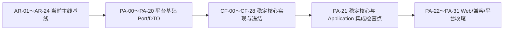
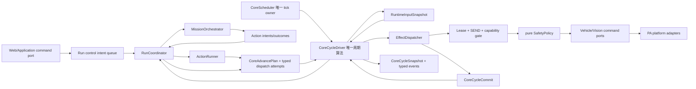
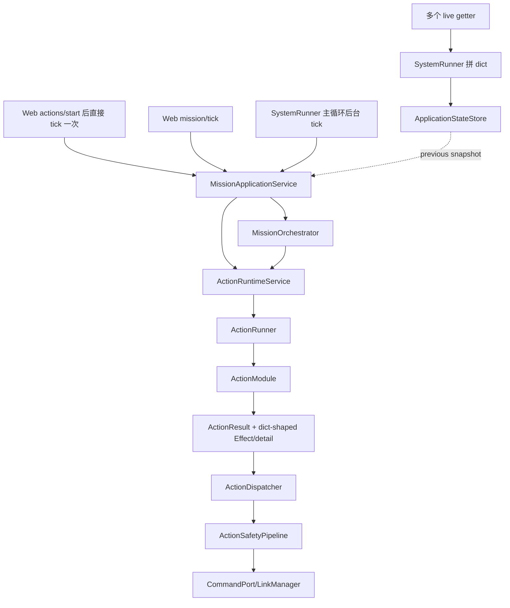
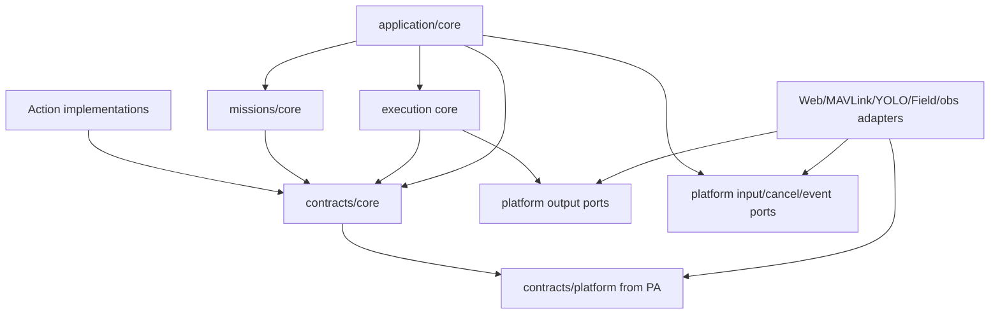
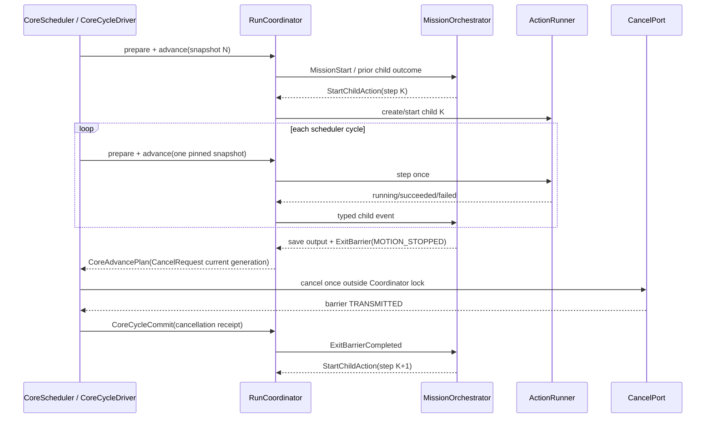
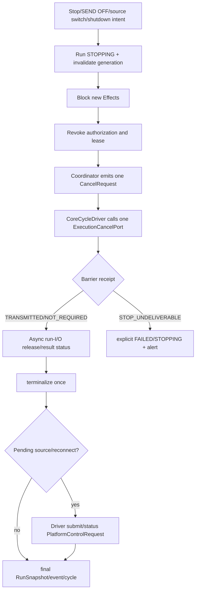
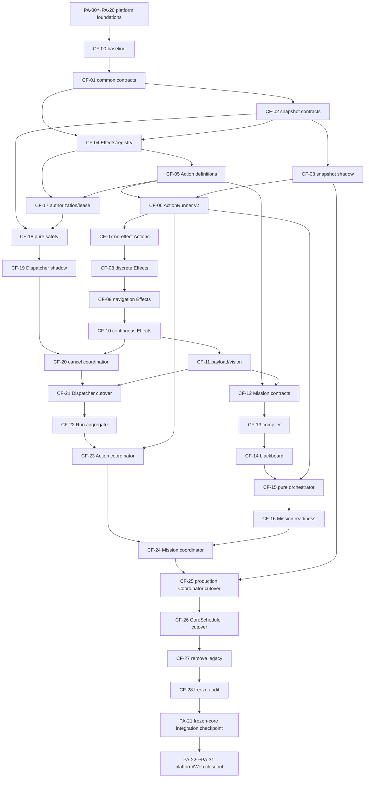

# 稳定核心层冻结与改造执行计划

本文是 [全项目架构重构任务书](architecture_refactor_tasks.md) 中 `AR-26` 的详细执行计划，专门设计并
改造下列五块稳定核心：

```text
稳定核心层：写好并通过冻结验收后，普通任务迭代原则上不再修改
  ├─ Action 契约与运行器
  ├─ Mission 编排器
  ├─ 统一调度与状态快照
  ├─ Effect 派发与安全系统
  └─ Run 生命周期
```

本文描述的是**目标接口、迁移顺序和冻结门禁**，不是当前已经生效的接口。当前事实仍以
`AGENTS.md`、[当前架构](../architecture/current_architecture.md)、
[Action 契约](../architecture/action_contracts.md)、
[平台适配层计划](platform_adapter_interface_refactor_plan.md)、实际源码和配置为准。

“原则上不再改”不是绝对禁止维护，而是指：以后增加普通 Action、调整 Mission 步骤、修改任务参数、
替换算法实现，不应修改本文冻结的核心契约和五个核心引擎。只有新增平台能力、全新 Effect 类型、
破坏性 schema 变更或安全策略边界改变时，才允许通过 ADR、major version、迁移和安全复核修改核心。

## 0. 文档状态与执行规则

- 创建日期：2026-08-16。
- 当前状态：`CF-00` 至 `CF-28` 均未开始。
- 核心启动门禁：必须先验收 `PA-00～PA-20`；截至 2026-08-16 平台计划完成到 `PA-06`，因此当前
  跨计划下一项是 `PA-07`，不是 `CF-00`。
- 当前工作区没有 `.git` 元数据，按“源码快照”处理；执行会话不得伪造 revision、diff 或 clean 状态。
- 每个新会话只执行一个明确的 `CF-xx`，不得顺手推进下一项，也不得把多个 writer 切换合并完成。
- 只有条目中所有验收和回滚条件完成后才可勾选；部分实现必须记录剩余项。
- 与 `AGENTS.md`、平台契约、坐标规范或安全文档冲突时采用更严格规则。
- 未经用户另行授权，不连接或修改远程测试机，不启动真机服务，不打开 SEND，不发送 arm、takeoff、
  land、位置、速度、yaw、servo 或 payload 命令。
- 发送相关任务默认只运行纯逻辑、fake、SITL 和 `executor.send_commands: false` 路径；拆桨台架和实飞
  不属于自动验收步骤。
- 迁移期间允许最外层 compatibility adapter，但核心不得同时理解新旧两套契约；任何 writer 都不得
  双写，任何 scheduler 都不得双推进。

执行任一 `CF-xx` 前必须完整阅读：

```text
README.md
AGENTS.md
docs/ai/README.md
docs/ai/architecture/current_architecture.md
docs/ai/architecture/action_contracts.md
docs/ai/architecture/deprecated_paths.md
docs/ai/architecture/interfaces.md
docs/ai/guides/task_checklist.md
docs/developer/coordinate_frames.md
docs/developer/field_origin_heading.md
docs/developer/safety.md
docs/ai/plans/architecture_refactor_tasks.md
docs/ai/plans/platform_adapter_interface_refactor_plan.md
docs/ai/plans/stable_core_refactor_plan.md
```

然后只读取所选任务列出的源码、测试和直接依赖，不以全仓改名或目录搬迁开始。

仅在 `PA-00～PA-20` 已全部验收后，才使用下面的核心启动指令：

```text
阅读 AGENTS.md、docs/ai/plans/architecture_refactor_tasks.md、
docs/ai/plans/platform_adapter_interface_refactor_plan.md 和
docs/ai/plans/stable_core_refactor_plan.md，严格只执行 CF-00。
先验证 PA-00～PA-20 已全部验收；若任一项未完成则停止核心任务并报告阻塞。
门禁满足后报告当前基线和风险，再修改；不要推进 CF-01，不连接真机，不打开 SEND。
```

### 快速导航

- 第 1～3 节：与平台计划的关系、最终目标、范围和非目标。
- 第 4～7 节：当前规模、职责边界、永久不变量和目标目录。
- 第 8～13 节：冻结接口、状态机和调度语义。
- 第 14～17 节：端到端工作流、扩展方式、迁移策略和质量门禁。
- 第 18 节：`CF-00～CF-28` 单会话执行清单。
- 第 19～21 节：依赖图、最终完成定义和完成记录。

任务分组：

| 范围 | 主题 | 是否切换生产 owner |
| --- | --- | --- |
| CF-00～CF-03 | 基线、共同契约、输入快照 | CF-03 仅 shadow publication |
| CF-04～CF-11 | Effect、Action 契约与全部原生 Runner/Action shadow readiness | 不切 production lifecycle/registration |
| CF-12～CF-16 | Mission v3、blackboard、纯编排器 | 否，保持 shadow；CF-25 才切 writer |
| CF-17～CF-21 | lease、capability、安全、派发、取消 | CF-21 切唯一核心 submit call site |
| CF-22～CF-26 | Run/system aggregate、Coordinator、scheduler、cycle | CF-25 切原生 effectful registration 并收敛单 tick；CF-26 切独立 scheduler |
| CF-27～CF-28 | 删除兼容、静态守卫、冻结验收 | 删除门禁 |

## 1. 与平台适配层计划的关系

### 1.1 两份计划分别负责什么

| 计划 | 负责 | 不负责 |
| --- | --- | --- |
| `AR-25 / PA-xx` 平台适配层 | Web API、MAVLink、YOLO UDP、Field、日志/黑匣子的 Port、DTO、wire、I/O 生命周期和具体 adapter | Action 状态机、Mission 决策、Effect 业务语义、Run 状态机 |
| `AR-26 / CF-xx` 稳定核心层 | Action/Mission/Run 状态机、统一 scheduler、组合快照、Effect capability、安全裁决和派发编排 | HTTP、socket、pymavlink、文件格式、相机、飞控队列实现、Field 存储实现 |

平台层回答“如何可靠地读写某种平台”；稳定核心回答“在同一运行周期内，为什么、何时、以什么权限
请求这些读写”。两层通过 typed Port/DTO 相连，任何一层都不能拿到另一层的具体对象。

### 1.2 唯一执行顺序



这里的 `AR-25` 与 `AR-26` 编号是文档归类，不代表整个 umbrella 必须先后完成；实际执行顺序以上述
子任务依赖为准：

1. 先完成并验收 `PA-00～PA-20`，得到稳定的 platform input/output/cancel/event Port。
2. 再执行 `CF-00～CF-28`，核心只依赖这些 Port，不重新定义硬件接口。
3. `PA-21` 是只读为主的跨计划 conformance checkpoint，只验证冻结核心已正确使用 PA Ports 和现有
   no-advance compatibility adapter，确认没有第二 tick/writer/state owner；不创建正式 Application facade。
4. `PA-22` 才建立正式外部 Application command/query DTO 与 mapper；随后执行 `PA-23～PA-31` 的 Web v1、
   兼容删除和平台最终审计。

### 1.3 跨计划唯一 owner

| 能力 | 唯一 canonical owner | 核心只做什么 |
| --- | --- | --- |
| Vehicle 原子状态、link session | PA-04 | pin 到 `RuntimeInputSnapshot` 并验证 freshness |
| 命令 envelope、队列、ACK、完成观察 | PA-05～PA-10 | 产生 typed command、读取 receipt/status |
| cancel、STOP barrier、wire deadman | PA-08 | 请求取消并等待 typed barrier receipt，不直接清队列 |
| Perception 原子帧/命令 ACK | PA-12～PA-14 | pin frame、产生 vision Effect |
| Field ReferenceVersion/标定事务 | PA-16～PA-17 | run start 时 pin version，不修改 Field writer |
| event/audit/blackbox sink | PA-18～PA-20 | 发布 typed event；CoreCycleSnapshot 经唯一 projector 变为 recorder envelope，不做文件 I/O |
| Action/Mission/Run 状态机 | 本计划 | 唯一修改 owner |
| scheduler 和组合快照 publication | 本计划 | 唯一推进 owner/唯一 core publication owner |
| Web command/query DTO | PA-22～PA-25 | 只包装 frozen Run command/query，不推进 run |

禁止通过本计划创建 `VehicleStatePortV2`、第二个 CommandBroker、第二个 Field snapshot 或第二套 event
sink。平台契约缺字段时应返回对应 `PA-xx` 扩展，并在其验收后继续，不得在核心里复制 DTO。

## 2. 最终目标与“冻结”定义

最终稳定关系：



冻结完成后，普通任务开发的修改面应固定为：

```text
missions/common/actions/<action>.py
missions/common/actions/<action>_params.py（需要时）
ActionDefinition / ActionRegistration
config/action_missions/<mission>.json
对应 Action/Mission 测试
```

并满足：

- 新增只读/计算类 Action：不改 Runner、MissionOrchestrator、RunCoordinator、Dispatcher、Safety。
- 新增使用已有 Effect/Capability 的普通发送 Action：只新增 Action、definition、registration 和测试，
  不改核心 policy 表；运行时自动校验 definition 声明与实际 emission 的子集关系。
- 新增或调整 Mission：只改模板和模板测试，不改编排器。
- 改算法：只改 Action 内部或 `guidance/` 纯算法，不改调度和生命周期。
- 换硬件/飞控/相机/存储：只改 PA adapter，不改核心。

以下变化才允许修改冻结核心：

| 变化 | 是否改核心 | 必须条件 |
| --- | --- | --- |
| 新 Action 使用已有 capability/effect | 否 | definition/schema/测试通过 |
| Mission 增删步骤、参数、retry/jump | 否 | v3 validator 和预算通过 |
| 调整 Action 算法或阈值 | 否 | 保持契约和效果预算 |
| 新硬件提供同一 Port | 否 | 平台 adapter contract tests |
| 新 EffectKind/新飞控能力 | 是 | ADR、core major/minor 决策、capability/safety/adapter/SITL 测试 |
| 放宽 payload、SEND、连续控制边界 | 是，高风险 | 明确授权、安全评审、迁移、回滚、人工真机门禁 |
| 破坏 Action/Mission/Run schema | 是 | major version、双读单写迁移、兼容期和删除证据 |
| 只增加可选诊断字段 | 视情况 | minor version，旧 reader contract test |

## 3. 范围与非目标

### 3.1 本计划范围

1. ActionDefinition、参数/output schema、ActionContext、ActionStepResult、Effect emission 和 ActionRunner。
2. Mission v3 compiled definition、ValueExpr、FailurePolicy、immutable Blackboard 和纯 Mission reducer。
3. RuntimeInputSnapshot、CoreCycleSnapshot、typed store、唯一 scheduler 和同一输入版本关联。
4. typed Effect union、capability profile、ExecutionLease、SafetyDecision、DispatchReceipt、translator registry。
5. Run aggregate、Action/Mission 互斥、start/stop/reset/skip、revision、terminalization 和 shutdown。
6. 兼容 adapter、shadow/differential 测试、切换门禁、静态依赖守卫和冻结后的扩展测试。

### 3.2 明确非目标

- 不恢复 `MissionRunner`、`StageRegistry`、`CommandShaper`、`FlightCommandExecutor`、旧
  mission/stage/control 栈或嵌套 Mission。
- 不重写 Web 路由、MAVLink 编码、YOLO UDP、Field repository、blackbox file writer；这些归 `PA`。
- 不在核心中导入 FastAPI、Pydantic、pymavlink、socket、RKNNLite、文件数据库或具体 LinkManager。
- 不以“稳定核心”为名建立通用脚本语言、任意表达式执行器、服务总线、ROS 或消息代理。
- 不改变当前三个正式 Mission 的业务顺序、坐标语义、目标选择语义或 payload 白名单。
- 不把 `align_descend`、`goto_waypoint` 等大型算法全文搬进核心；Action 瘦身另按单 Action 任务进行，
  只能抽取纯函数/reducer，不能拆回 Stage。
- 不在本计划中增加新飞控命令、扩大真实发送能力或把 INT8 YOLO 设为默认。
- 不以文档完成代替代码、测试、SITL 和最终冻结门禁。

## 4. 当前基线、代码规模与臃肿度

以下为 2026-08-16 源码快照，按物理行（含空行和注释）计数。执行 `CF-00` 时必须重新统计；本表只
说明计划为何这样拆分，不作为未来验收的固定行号。

| 区域 | 当前文件 | 行数 | 臃肿度 | 主要问题 |
| --- | --- | ---: | --- | --- |
| Action 契约 | `contracts/action.py` | 55 | 2/5 | 小，但 `done/failed` 可冲突，保留 dict compatibility |
| Effect 契约 | `contracts/effects.py` | 71 | 3/5 | 子类只有字符串标签，真实字段仍是 `Mapping[str, Any]` |
| 状态契约 | `contracts/state.py` | 57 | 3/5 | frozen 外壳中嵌套可变 dict，缺 snapshot identity |
| Action 基类/Runner/Registry/Catalog | 4 个文件 | 282 | 2/5 | 规模健康，但 context/params/status 动态，registry factory 与公开定义混合 |
| ActionRuntime | `application/action_runtime.py` | 171 | 4/5 | 生命周期、派发、stop、queue cleanup 和兼容动态调用混合 |
| Mission definition | `missions/definitions.py` | 27 | 2/5 | 过弱，schema/factory/版本职责未分 |
| Mission engine | `missions/engine.py` | 665 | 5/5 | 编排、blackboard、表达式、重试、计时、runtime 调用和 Action 特判混合 |
| StateStore | `application/state_store.py` | 35 | 4/5 边界风险 | 文件小但只存全量 dict，不能证明跨组件同一 publication |
| Mission service | `application/mission_service.py` | 460 | 5/5 | run、scheduler、authorization、录像、Field、结果投影和 host proxy 混合 |
| Result service | `application/result_service.py` | 556 | 4/5 | 与 MissionService/SystemRunner 动态耦合，结果分支持续膨胀 |
| SystemRunner | `application/runner.py` | 656 | 5/5 | composition、主循环、采集、tick、Web、blackbox 的 God Object |
| Authorization/Policy | 2 个文件 | 187 | 3/5 | 授权缺 lease/generation；policy 按 Action 名硬编码且可变 |
| Dispatcher | `execution/dispatcher.py` | 853 | 5/5 | gate、兼容、坐标、路由、I/O、去重、UI payload 和状态缓存混合 |
| SafetyPipeline | `execution/safety_pipeline.py` | 587 | 5/5 | 纯校验、LinkManager 读取、watchdog 线程和 stop 副作用混合 |
| Safety config | `execution/safety_config.py` | 146 | 2/5 | 规模可控，但仍围绕 dict action_type |

上述候选核心生产文件合计约 **4808 行**。其中 Dispatcher + SafetyPipeline 为 **1440 行**；
SystemRunner + MissionService + ResultService 为 **1672 行**。问题不是简单删行，而是把唯一 owner、纯
决策、I/O Port 和只读投影分开。

Action 实现和算法不计入稳定核心。当前 `missions/common/actions/` 递归共 27 个 Python 文件、5297 行；
`missions/common/lifecycle/align_descend.py` 单文件 987 行。它们说明后续 Action 可独立瘦身，但不应
促使核心重新吸收任务算法。

### 4.1 当前真实工作流



当前还存在第二命令通道：`align_descend`、`payload_release` 等把命令放入
`ActionResult.detail["command"]`，Dispatcher 再隐式构造 `FlightCommand`。`detail` 本应只用于结果或
诊断，不能产生副作用。

### 4.2 当前高风险问题

| 等级 | 问题 | 后果 | 本计划归属 |
| --- | --- | --- | --- |
| P0 | Web tick、Web start 后 tick、后台 tick 多 owner | HTTP 重试可推进两次；standalone Action 又缺持续 scheduler | CF-00、CF-25～CF-26 |
| P0 | standalone Action 与 Mission 无全局互斥 | 两者争用同一 Runner/Dispatcher，旧 Mission 可能继续运行 | CF-22～CF-24 |
| P0 | stop/clear/revoke 分散在 Runtime、Mission、SystemControl、Safety、handler | 重复 stop、漏清理或 cancel 后残余 Effect | CF-20、CF-23～CF-26 |
| P0 | 缺显式 StatePort 时 source 可能回落为 `test`，Safety 对 test 放宽 | production wiring 可能 fail-open | PA-02 必须先验收；CF-00 复核 |
| P1 | 主循环先 tick、后采集新状态 | Action 消费上一轮快照，Effect 与 blackbox 输入因果不一致 | CF-02～CF-03、CF-25 |
| P1 | component 分别读取，Web 再拼 live 状态 | 看见平台 N、Run N+1、授权 N+2 的撕裂视图 | CF-02～CF-03、CF-25 |
| P1 | Mission 用 `object/getattr/last_result` 调 runtime | start 失败或 stale result 传播不可靠 | CF-15～CF-16 |
| P1 | Effect/policy/validator/if-chain/handler 多份支持列表 | 新 Effect 改多处且漏项只在运行时发现 | CF-04、CF-18～CF-19 |
| P1 | accepted/queued 统一称 `sent` | UI/日志误报已上链或已执行 | CF-19、PA-05～PA-10 |
| P1 | shutdown 未统一 terminalize/cancel/barrier/final event | 退出时命令和 Run 状态不确定 | CF-24～CF-26 |

## 5. 五个核心部分：负责什么，不负责什么

| 核心部分 | 负责 | 明确不负责 |
| --- | --- | --- |
| Action 契约与运行器 | definition/schema、实例生命周期、同一 snapshot tick、Effect emission、单一 outcome、异常收敛 | Mission 步骤、Web、授权 owner、SEND、队列、MAVLink、文件、线程 scheduler |
| Mission 编排器 | compiled steps、ValueExpr、blackboard、retry/jump/continue/fail、步骤时序、产生 Action intent | 创建具体 adapter、直接 tick ActionRunner、直接派发 Effect、录像/Field I/O、Action 名特判 |
| 统一调度与状态快照 | 唯一周期推进、control intent 排序、一次组合快照、run/effect/cycle correlation、overrun 记录 | 传感器驱动、HTTP 请求、业务算法、后台文件 I/O、wire deadman |
| Effect 派发与安全系统 | effect provenance、pre-admission submit retry tracker、capability/lease/SEND/source gate、纯安全裁决、typed translation、submission/status→feedback | Mission 决策、MAVLink 编码、命令队列线程、post-accept wire retry、伪造 ACK、Web payload、文件日志 |
| Run 生命周期 | Action/Mission 互斥、Run ID/version、start/preflight、lease、stop/reset/skip、terminalize-once、shutdown | 具体 Action 算法、Mission 模板内容、HTTP status、adapter reconnect 实现 |

### 5.1 相互发送的数据

| 发送方 | 接收方 | 只允许发送 | 禁止发送 |
| --- | --- | --- | --- |
| CoreCycleDriver | RunCoordinator | 一个 pinned `RuntimeInputSnapshot`、本周期 control intents、`CoreTime`、归一化 observations | live LinkManager、多个不同版本 getter |
| RunCoordinator | ActionRunner | `ActionStartInput`、`ActionTickInput`、`ActionStopInput` | Web request、CommandPort、Mission template dict |
| RunCoordinator | MissionOrchestrator | typed `MissionEvent` | ActionRuntime 对象、callback、LinkManager |
| MissionOrchestrator | RunCoordinator | typed `MissionTransition` 和 `ActionIntent` | 直接 start/stop/tick 调用、副作用 |
| ActionRunner | RunCoordinator | `ActionTransition`、typed Effect payloads、typed output | dict command、queue clear、authorization mutation |
| RunCoordinator | CoreCycleDriver | `CoreAdvancePlan`：typed EffectDispatchAttempt/cancel/run-I/O/platform requests | 具体 Port 调用、mutable adapter |
| CoreCycleDriver / EffectDispatcher | Platform Port | typed `VehicleCommand` 或 `VisionCommand` | dict request、ActionResult、MissionAggregate |
| EffectDispatcher | EffectDeliveryTracker | typed `DispatchReceipt`；FAILED_TO_SUBMIT 保留原 envelope/command identity、无假 handle | 自己 sleep/backoff、保存 ACK lifecycle |
| Platform status Ports | EffectStatusProjectionPort | 原始 `CommandStatusSnapshot` / `VisionCommandStatus` | Action callback、业务状态 mutation |
| EffectStatusProjectionPort | EffectDeliveryTracker | 归一化 `EffectStatusObservation` | route DTO、broker 内部队列对象、假 `sent=True` |
| EffectDeliveryTracker | RunCoordinator/ActionRunner | correlated `EffectFeedback`、带当前 evaluation ref 的到期 pre-admission retry attempt | 新 run 的 stale feedback、post-ACCEPT resubmit |
| RunCoordinator | CoreCycleDriver | canonical `CancelRequest` 和 run-level I/O plan | 直接 cancel/录像/文件调用 |
| PA-08 cancel Port | CoreCycleDriver | terminal `CancellationReceipt` | 裸 MAVLink message、中间 QUEUED 假完成 |
| CoreCycleDriver | RunCoordinator | correlated `CoreCycleCommit` receipts | 第二次 tick、跨 generation 回执 |
| CoreCycleDriver | StateStore/EventPort | immutable `RunSnapshot`、`CoreCycleSnapshot`、typed event | 具体 sink/file handle |

## 6. 永久架构与安全不变量

1. Action Mission 是唯一任务主线；Web UI 是唯一正式人工操作入口。
2. 不恢复任何 deprecated mission/stage/control 路线。
3. `executor.send_commands: false` 永久为默认值。
4. 所有飞行和 payload 命令必须同时通过独立的系统 SEND gate 与 active ExecutionLease；两者不能合并。
5. Action 只能返回 typed Effect；`detail`、diagnostics、output、event 不能触发副作用。
6. Action、Mission、Run、Execution 核心不导入 pymavlink、LinkManager、FastAPI、socket 或文件 sink。
7. 每个 scheduler cycle 只读取一次 `RuntimeInputSnapshot`；本周期所有 Action/Safety/Effect 使用同一
   `InputSnapshotRef(snapshot_id, publication_version)`。
8. 只有 CoreScheduler 可推进 run；HTTP、WebSocket、兼容 facade、blackbox、status query 不得 tick。
9. 同时最多一个 active top-level run；Mission 的 child Action 属于同一 run，不创建并行 top-level run。
10. Run terminal state 不可回到 RUNNING；reset 不复活旧 run，下一次 start 必须生成新 `run_id`。
11. terminal Action result 不携带新 Effect。一次性 Action 必须先发 Effect、观察规定 receipt/ACK/完成条件，
    再在后续 tick 成功，避免 terminal 后授权已撤销仍残留命令。
12. 任意 stop/failure/reset/source switch/SEND OFF/shutdown 先阻止新 Effect，再撤销 lease，由 Coordinator
    把请求合并到按 source/session single-flight 的 cancellation transaction，CoreCycleDriver 调用唯一
    `ExecutionCancelPort`；普通 Action 不能构造特权 STOP barrier。
13. 连续 BODY_NED 控制必须同时拥有 core lease deadline 和 PA-08 broker/wire deadman；任一过期都必须
    stop/zero、代际隔离并清理 stale command。wire deadman 不依赖 scheduler：它只在 PA write gate 内复用当前
    cancellation generation、锁死旧 stream/lease generation；核心恢复后必须签发新 lease/stream 才能 re-arm。
14. payload 仍只能由 `payload_release` Action 产生 `SetServo`，并通过专用 protected capability 和
    PA command port；不得使用 `release_payload` 或 RC override。
15. production source 只能是明确的 `real` 或 `sitl`；`test` 仅存在于 test fixture 类型，不能由 production
    wiring fallback 得到。
16. 所有 DTO 深度不可变；`frozen=True` 外壳内不得保留可变 dict/list/set。
17. 生命周期/TTL/deadline 使用注入的 monotonic clock；UTC 只用于审计、显示和跨进程关联。
18. accepted、queued、transmitted、ACK、observed completion 是不同状态轴，禁止统一叫 `sent`。
19. Action/Mission/Effect/Run ID 与 platform session/sequence、Field version、resource revision 使用不同
    强类型，不得用一个 `sequence` 混代。
20. 核心发布事件不能改变控制结果；sink 慢、满或失败不能阻塞安全 stop。

## 7. 目标目录和依赖方向

稳定核心是一个明确的依赖边界，不要求把所有代码塞进单个 `core.py`。只有对应 `CF` 任务落地时才创建
文件，不预建空抽象。

```text
contracts/core/
  common.py                 # core-private typed IDs、reason、FrozenJson；共享 fence IDs 复用 PA
  system.py                 # SendGate contract/command/query，独立于 Web DTO
  input_state.py            # RuntimeInputSnapshot、InputSnapshotRef、CycleCorrelation
  action_ref.py             # ActionContractRef，供 Action/Mission/Execution 单向引用
  effect_feedback.py        # Action 可见的 route-neutral normalized Effect lifecycle
  effects.py                # typed Effect union、EffectEnvelope、EffectDispatchAttempt
  action.py                 # Action definition/context/result/snapshot
  mission.py                # compiled Mission/ValueExpr/FailurePolicy/snapshot
  execution.py              # lease、decision、dispatch/cancel receipts
  run.py                    # RunSpec、RunSnapshot、transition commands
  run_io.py                 # run-scoped recording/result request/submission/status contracts
  cycle.py                  # CF-25 才实现完整 CoreCycleSnapshot，单向依赖上述 projection

missions/core/
  action_catalog.py         # public definition + private registration
  action_runner.py          # 单 Action lifecycle only
  mission_compiler.py       # v2 adapter -> compiled v3
  blackboard.py             # immutable values/provenance
  mission_orchestrator.py   # pure reducer

execution/
  effect_registry.py        # EffectKind -> capability/route/safety/translator
  capability_policy.py      # frozen policy and protected capabilities
  safety_policy.py          # pure evaluator
  dispatcher.py             # gate -> safety -> translate -> submit
  translators/              # pure Effect -> platform command

application/core/
  snapshot_collector.py     # pin PA component snapshots into one publication
  state_store.py            # single-writer typed store
  system_send_state.py      # CF-25 后唯一 SEND gate mutable owner
  compat/legacy_action_tick_snapshot_driver.py # CF-06～21 shadow pin；CF-21～25 ingress snapshot provenance
  compat/legacy_run_provenance.py # CF-06～21 shadow；CF-21～25 read-only ingress identity projection
  legacy_lease_bridge.py    # CF-21～CF-25 only，严格投影旧授权为短命 lease
  execution_cancellation.py # CF-20～CF-25 compatibility cancel coordinator
  run_aggregate.py          # transition table and terminalization
  effect_delivery.py        # submit attempts、handle/status→Action feedback
  effect_status_projection.py # PA route status -> normalized observation
  platform_control.py       # source/reconnect async execution adapter
  run_coordinator.py        # one active run, plan/commit, lease/cancel policy
  cycle_driver.py           # 一个周期的确定性业务算法与唯一 core Port call sites
  scheduler.py              # only advance owner
```

Action 实现仍在：

```text
missions/common/actions/
guidance/
config/action_missions/
```

代码子包使用 `application/core/`、`missions/core/`，不创建名为 `runtime` 的 Python 包；仓库根目录
`runtime/` 继续只保存日志、录像、SITL、blackbox 等运行产物。

依赖方向只能是：



`contracts/core` 可引用稳定的 `contracts/platform` DTO/Protocol，但反向禁止；所有 concrete adapter 只在
`app/bootstrap.py` 组装。核心不能通过 `Any`、`object`、`getattr`、`__getattr__` 或 service locator 偷渡
具体实现。

跨 platform/core 边界出现的 `RunId`、`RunResourceGenerationId`、`ActionInstanceId`、`LeaseId`、
`LinkSessionId`、`CommandId`、`CancellationId`、`SubmissionReceiptId`，以及 RunExecution/Authorization/Lease/
Send/Cancellation generations，canonical 定义全部属于 PA-07 `contracts/platform/common.py`。稳定核心只直接
import 或窄化 re-export；`contracts/core/common.py` 只拥有 EffectId、MissionId、StepId、SnapshotId 等纯核心
identity。类型所有权不等于状态推进权：CF-25 后仍只有 CoreExecutionFenceAuthority 可以创建 run/action/lease
执行身份或递增 fencing generation，PA adapter 只有 read-only QueryPort。

contract 内部也保持单向：`effect_feedback.py` 只定义 Action 可见的 normalized route-neutral lifecycle；
PA Vehicle/Vision status 的映射在 application `EffectStatusProjectionPort` adapter，不反向泄漏到 Action。
`cycle.py` 是最终聚合叶节点，只引用已经
冻结的 input/action/mission/execution/run projection，其他 core contract 不得反向导入 `cycle.py`。

## 8. 所有冻结接口的共同规则

1. DTO 使用 `@dataclass(frozen=True, slots=True)`、frozen enum、named tuple 或等价深不可变结构。
2. 不在核心边界使用裸 `dict[str, Any]`、`Mapping[str, Any]`、callback 字段或任意 metadata。
3. 异构 Action 参数/output 通过注册的 codec 和 `SchemaRef` 转成具体 frozen dataclass；核心只接收已经
   验证的 marker type，不解析未知 JSON。
4. 需要通用持久化的值使用递归不可变 `FrozenJson`；对象 key 唯一且稳定排序，数组为 tuple。
5. 所有 ID 为不同 NewType/value object：`RunId`、`ActionInstanceId`、`EffectId`、`CommandId`、
   `SnapshotId`、`LeaseId`、`CancellationId` 不可互换；跨层类型复用 PA-07 canonical 定义，不在 core 重定义。
6. contract 带 `SchemaVersion(major, minor)`；minor 只能兼容性新增，破坏性变化必须增加 major。
7. reason 使用稳定 enum/code，展示文本可变；不能让 Web 解析自由字符串决定业务状态。
8. 所有修改命令都带 request/operation identity 与 idempotency key。并发前置条件按资源语义选择，禁止把
   高频 publication revision 当成所有命令的通用 CAS：run start 只靠幂等键和原子 active-slot reservation；
   stop/reset/clear 使用稳定 `RunToken`；skip 额外使用 `StepExecutionToken`；SEND/source 等真正的可写资源
   使用完整 expected `ResourceVersion`。重试必须复用原 key 和同一 canonical payload。
9. 状态返回 immutable snapshot，不返回内部 engine、Action instance、blackboard mutable object 或 Port。
10. 核心 Protocol 是窄接口；不存在 `__getattr__` 动态透传、方法名 fallback 或 inspect signature。
11. 纯 reducer/evaluator 不读系统时间、不 sleep、不启动线程、不记录文件、不调用 adapter。
12. 异常在最近边界转换为 typed failure；不得用异常跨 scheduler 周期表达正常状态。

## 9. 共同时间、版本和状态快照接口

以下代码用于冻结字段与语义，实际实现可在不改变名称、方向、状态含义和不变量的前提下调整 Python
细节。任何调整必须在对应 `CF` 任务内更新 contract tests。

### 9.1 时间和资源版本

```python
@dataclass(frozen=True, slots=True)
class CoreTime:
    clock_domain_id: ClockDomainId
    monotonic_ns: int
    utc: datetime                 # timezone-aware，仅审计/显示

class CoreClock(Protocol):
    def read(self) -> CoreTime: ...

# 直接复用 PA-03 contracts/platform/common.py 的 ResourceVersion；
# 核心不得再定义同名但不同结构的版本类型。

@dataclass(frozen=True, slots=True)
class PublicationVersion:
    process_session_id: ProcessSessionId
    sequence: int
```

规则：

- `monotonic_ns` 只在同一 `clock_domain_id` 内比较；不得把两台机器的 monotonic epoch 相减。
- `ResourceVersion.revision` 只在可观察资源状态变化时增加；无变化 scheduler tick 不增加 ETag revision。
- `scheduler_tick_sequence`、platform component sequence、publication sequence 和 resource revision 分开。
- 所有生产实现注入 clock；测试使用 manual clock，不用真实 `sleep()` 猜竞态。

### 9.2 RuntimeInputSnapshot

```python
@dataclass(frozen=True, slots=True)
class ComponentFreshness:
    component: ComponentKind
    source_session_id: SourceSessionId
    source_sequence: int
    sampled_monotonic_ns: int | None
    received_monotonic_ns: int
    age_ms: int
    status: FreshnessStatus       # FRESH | STALE | UNAVAILABLE | INVALID
    reason_code: StateReasonCode | None

@dataclass(frozen=True, slots=True)
class InputSnapshotRef:
    snapshot_id: SnapshotId
    publication_version: PublicationVersion

@dataclass(frozen=True, slots=True)
class SendGateSnapshot:
    enabled: bool
    generation: SendGeneration
    version: ResourceVersion
    changed_at: CoreTime
    reason_code: SendGateReasonCode

@dataclass(frozen=True, slots=True)
class VehicleSnapshotRef:
    source: SourceId
    link_session_id: LinkSessionId
    sequence: int

@dataclass(frozen=True, slots=True)
class PerceptionFrameRef:
    process_session_id: ProcessSessionId
    sequence: int
    frame_id: FrameId

@dataclass(frozen=True, slots=True)
class FusionSnapshot:
    fusion_session_id: FusionSessionId
    sequence: int
    produced_at: CoreTime
    source_vehicle_ref: VehicleSnapshotRef
    source_perception_ref: PerceptionFrameRef
    estimates: tuple[FusedTargetEstimate, ...]
    health: FusionHealth

class SendGateCommandPort(Protocol):
    def request_change(self, command: SetSendGateCommand) -> SendGateChangeReceipt: ...

class SendGateQueryPort(Protocol):
    def current(self) -> SendGateSnapshot: ...

class FusionComputePort(Protocol):
    def compute(
        self,
        vehicle: VehicleStateSnapshot,
        perception: PerceptionFrameSnapshot,
        now: CoreTime,
    ) -> FusionSnapshot: ...

@dataclass(frozen=True, slots=True)
class RuntimeInputSnapshot:
    schema_version: SchemaVersion
    reference: InputSnapshotRef
    captured_at: CoreTime
    vehicle: VehicleStateSnapshot
    perception: PerceptionFrameSnapshot
    field: FieldReferenceSnapshot
    fusion: FusionSnapshot
    send_gate: SendGateSnapshot
    component_freshness: tuple[ComponentFreshness, ...]
```

语义：

- 它表示“Application 在一个 publication cut 中冻结的组合”，不声称异步传感器物理同帧。
- `vehicle/perception/field` 直接使用 `PA-04/12/16` 的原子 DTO；核心不得重新复制字段。
- CF-02 只拥有 `SendGateSnapshot/CommandPort/QueryPort` 契约；最终唯一 mutable owner 是
  `application/core/system_send_state.py` 的 `SystemSendState`，由 CF-25 在静止切换点接管。CF-25 前只允许
  `LegacySendGateQueryAdapter` 投影当前 production SEND authority，mutation 仍归旧 SystemControl；不得双写。
  PA-22 只做外部 DTO/command 映射。SEND gate 与 Authorization/ExecutionLease 始终独立。
- `FusionSnapshot` 与 identity ref contract 归 CF-02，`FusionComputePort` producer 归现有 `fusion/` domain；
  collector 必须把本次已 pin 的 vehicle/perception DTO 直接传给 compute，并验证返回 refs 精确对应本次
  capture，不能混用上一轮。它不是 PA hardware DTO，也不是 Action tick 后的 derived output。
- target 与 detections 必须来自同一个 perception frame；Field origin/heading 必须来自同一
  `ReferenceVersion`。
- 缺失或 stale 是显式状态，不能用空 dict、全零或上一轮值冒充 FRESH。
- 同一 cycle 内**新推进/新产生**的 ActionContext、MissionSnapshot、SafetyContext、首次 EffectEnvelope 的
  `emission_input_ref`、所有 EffectDispatchAttempt 的 `evaluation_input_ref`、CoreAdvancePlan/CoreCycleCommit 和
  RunSnapshot 都关联本轮同一 `InputSnapshotRef`。retry 复用的 envelope 保留原 emission ref，但本次 attempt 必须使用
  当前 ref 并重新裁决。未推进时允许把上一 projection 原样带入 CoreCycleSnapshot，但其
  `last_consumed_input_ref/last_reduce_cycle_id` 必须保留旧值，不能改写成本轮引用冒充已消费。

### 9.3 SnapshotCollector 与 typed store

```python
class RuntimeSnapshotCollector(Protocol):
    def capture(self, now: CoreTime) -> RuntimeInputSnapshot: ...

class RuntimeInputPublisherPort(Protocol):
    def publish(self, snapshot: RuntimeInputSnapshot) -> None: ...

class RuntimeInputQueryPort(Protocol):
    def current(self) -> RuntimeInputSnapshot | None: ...
    def wait_next(
        self,
        after: PublicationVersion,
        timeout_s: float,
    ) -> RuntimeInputSnapshot | None: ...

class CoreCyclePublisherPort(Protocol):
    def publish(self, snapshot: CoreCycleSnapshot) -> None: ...

class CoreCycleQueryPort(Protocol):
    def current(self) -> CoreCycleSnapshot | None: ...
    def wait_next(self, after: CycleId, timeout_s: float) -> CoreCycleSnapshot | None: ...
```

唯一 owner：

- 最终只有 `CoreCycleDriver` 调用 collector 和 publisher；CF-26 后只有 CoreScheduler 获得 driver。CF-03
  的 SnapshotShadowDriver 是迁移期唯一 collector caller，只写隔离 shadow store、不 advance。
  CF-06 的 LegacyActionTickSnapshotDriver 不再次 capture：它在旧 lifecycle event 到来时只 pin CF-03 store
  当前 immutable RuntimeInputSnapshot，交给隔离 Runner v2 shadow，并记录 snapshot age/provenance；不得影响
  production ActionRuntime。CF-21 writer cut 时，只有通过 snapshot-age/session/readiness 门禁的同一 pin/
  provenance record 可供 LegacyEffectIngressAdapter 生成 production envelope；它仍不 capture、不 advance、
  不授权，CF-25 随旧 lifecycle 一起停止。
  CF-25 先停 SnapshotShadowDriver 与 LegacyActionTickSnapshotDriver、确认 collector/tick counter 静止，
  再把同一个 collector 移交 CoreCycleDriver；SystemRunner 只临时托管 production driver，不直接取得
  Coordinator/Publisher。
- Publisher 与 Query Protocol 分离并按最小权限注入；Web、blackbox 只读 CoreCycleQuery/projection，
  Action/Mission 不读 store，只接收本周期 pinned context。
- Store 保存 immutable object，不用大型 scene 的反复 `deepcopy` 建立“假不可变”。
- adapter getter 不在 store 锁内执行；发布是一次原子引用替换。

### 9.4 CoreCycleSnapshot

本节先冻结最终语义；由于它引用 CF-06/12/19/22 才完成的 Action/Mission/Dispatch/Run projections，完整
DTO、publisher/query store 和 production CoreCycleDriver **统一在 CF-25 实现**。CF-02 只实现
`RuntimeInputSnapshot`、`InputSnapshotRef`、
`ComponentFreshness` 和下列最小 correlation，不创建 forward stub、Any 或临时重复 projection。

```python
@dataclass(frozen=True, slots=True)
class CycleCorrelation:
    cycle_id: CycleId
    scheduler_session_id: SchedulerSessionId
    scheduler_tick_sequence: int
    input_ref: InputSnapshotRef

@dataclass(frozen=True, slots=True)
class SchedulerHealth:
    scheduler_session_id: SchedulerSessionId
    tick_sequence: int
    scheduled_monotonic_ns: int
    started_monotonic_ns: int
    finished_monotonic_ns: int
    overrun_ms: int
    skipped_catch_up_ticks: int

@dataclass(frozen=True, slots=True)
class CoreCycleSnapshot:
    schema_version: SchemaVersion
    correlation: CycleCorrelation
    input_snapshot: RuntimeInputSnapshot
    pre_capture_system_apply: PreCaptureSystemApplyResult
    system_snapshot: CoreSystemSnapshot
    run_snapshot: RunSnapshot | None
    action_snapshot: ActionSnapshot | None
    mission_snapshot: MissionSnapshot | None
    dispatch_receipts: tuple[DispatchReceipt, ...]
    cancellation_receipts: tuple[CancellationReceipt, ...]
    run_io_submission_receipts: tuple[RunIoSubmissionReceipt, ...]
    platform_control_submission_receipts: tuple[PlatformControlSubmissionReceipt, ...]
    scheduler_health: SchedulerHealth
    published_at: CoreTime
```

`pre_capture_system_apply` 是本轮 SEND/quiesce 在采集前已经生效的因果证据；`system_snapshot` 是消费本轮
platform observation 和 commit receipt 后的最终只读系统投影。两者不能用同一个“当前状态”对象冒充。
Web status、WebSocket、event、audit、blackbox 只从最终 `system_snapshot` 或稳定 projection 读取，不再各自
调用 live callbacks 重新拼状态。

## 10. Action 契约与运行器

### 10.1 公开定义与内部注册分离

```python
@dataclass(frozen=True, slots=True)
class SchemaRef:
    schema_id: str
    major: int
    minor: int

@dataclass(frozen=True, slots=True)
class SnapshotRequirement:
    component: ComponentKind
    required_status: FreshnessStatus
    max_age_ms: int | None

# 位于 contracts/core/effects.py，Action 与 Mission 共同只读引用，避免 action→mission import。
class ExitBarrier(Enum):
    NONE = "none"
    MOTION_STOPPED = "motion_stopped"

# 位于 contracts/core/action_ref.py，不依赖 ActionDefinition/Execution。
@dataclass(frozen=True, slots=True)
class ActionContractRef:
    action_name: ActionName
    definition_version: ResourceVersion
    contract_fingerprint: str
    parameter_schema: SchemaRef
    output_schema: SchemaRef | None

@dataclass(frozen=True, slots=True)
class ActionDefinition:
    reference: ActionContractRef
    implementation_version: str
    description: str
    snapshot_requirements: tuple[SnapshotRequirement, ...]
    effect_policies: tuple[EffectDispatchPolicy, ...]
    capability_profile_id: CapabilityProfileId
    max_effects_per_tick: int
    default_timeout_ms: int | None
    minimum_exit_barrier: ExitBarrier

class ActionParameters: ...       # marker；具体类型必须 frozen
class ActionOutput: ...           # marker；具体类型必须 frozen

@dataclass(frozen=True, slots=True)
class ContractIssue:
    code: ContractIssueCode
    path: tuple[str | int, ...]
    expected: str | None
    message: str

@dataclass(frozen=True, slots=True)
class ContractAccepted:
    pass

@dataclass(frozen=True, slots=True)
class ContractRejected:
    issues: tuple[ContractIssue, ...]

ContractValidationResult = ContractAccepted | ContractRejected

@dataclass(frozen=True, slots=True)
class ParameterFieldContract:
    path: tuple[str | int, ...]
    value_schema: SchemaRef
    required: bool

class ActionParameterContract(Protocol):
    def inspect_path(
        self, path: tuple[str | int, ...]
    ) -> ParameterFieldContract | ContractRejected: ...
    def validate_encoded(self, value: FrozenJson) -> ContractValidationResult: ...

@dataclass(frozen=True, slots=True)
class ParameterDecoded:
    value: ActionParameters

@dataclass(frozen=True, slots=True)
class CodecRejected:
    issues: tuple[ContractIssue, ...]

ParameterDecodeResult = ParameterDecoded | CodecRejected

@dataclass(frozen=True, slots=True)
class ActionOutputEnvelope:
    schema: SchemaRef
    value: FrozenJson

@dataclass(frozen=True, slots=True)
class OutputEncoded:
    value: ActionOutputEnvelope

OutputEncodeResult = OutputEncoded | CodecRejected

class ActionParameterCodec(Protocol):
    def decode(self, value: FrozenJson) -> ParameterDecodeResult: ...

class ActionOutputCodec(Protocol):
    def encode(self, value: ActionOutput) -> OutputEncodeResult: ...

@dataclass(frozen=True, slots=True)
class ActionContract:
    definition: ActionDefinition
    parameter_contract: ActionParameterContract
    parameter_codec: ActionParameterCodec
    output_codec: ActionOutputCodec | None

@dataclass(frozen=True, slots=True)
class ActionRegistration:
    contract: ActionContract
    factory: ActionFactory
```

expected 的用户输入/schema 错误一律返回 typed rejected result；不能用 KeyError/ValueError/traceback 充当公开
契约。unexpected codec exception 由 Runner 转为稳定 internal failure reason。Compiler 只通过
`inspect_path/validate_encoded` 做无 factory 检查；Action start 才调用 parameter decode。任何 Action（包括
standalone）只有在 Runner 成功调用 output codec、schema 与 pinned ActionContractRef 一致后才能提交
SUCCEEDED；最终对外/blackboard 只使用 `ActionOutputEnvelope`。

永久规则：

- Web/public catalog 只能看到 `ActionDefinition`。Mission compiler/validator 使用无 factory 的 trusted
  `ActionContractCatalog`（definition + schema inspector + codecs）；只有 composition 使用含 factory 的
  `ActionRegistrationCatalog`。
- `ActionRegistration` 只存在于 trusted composition；普通模板不能动态导入 Python 类。
- 每个 Action 的 params/output 是具体 frozen dataclass；`additionalProperties: true` 不再作为正式 schema。
- Mission compile 只做 binding schema/path/type compatibility 并 pin `ActionContractRef`；blackboard 值在
  child start 才 resolve，然后由 parameter codec decode 成 frozen ActionParameters。
- Definition 的 EffectDispatchPolicy 声明允许上限与 delivery 语义。运行时若 Action 发出未声明 Effect
  或超出 effect budget，Action 立即
  fail closed；definition 不能自行扩大 protected capability。
- 新 Action 使用已有 Effect/Capability 时只新增 registration；核心 effect registry 不按 Action 名维护
  普通 allowlist。
- `payload_release_v1` 是受保护 profile：只允许 canonical `payload_release` registration 绑定，不能由
  任意新 Action 在 definition 中自报获得。

### 10.2 Action module 接口

```python
@dataclass(frozen=True, slots=True)
class ActionStartContext:
    run_id: RunId
    action_instance_id: ActionInstanceId
    definition: ActionDefinition
    initial_snapshot: RuntimeInputSnapshot
    started_at: CoreTime
    deadline_monotonic_ns: int | None

class EffectAdmissionFeedbackState(Enum):
    PENDING = "pending"
    ACCEPTED = "accepted"
    REJECTED = "rejected"
    RETRY_WAIT = "retry_wait"
    EXHAUSTED = "exhausted"

class EffectTransportFeedbackState(Enum):
    NOT_ATTEMPTED = "not_attempted"
    QUEUED = "queued"
    TRANSMITTED = "transmitted"
    FAILED = "failed"
    SUPERSEDED = "superseded"
    EXPIRED = "expired"
    CANCELLED = "cancelled"
    UNKNOWN = "unknown"

class EffectAckFeedbackState(Enum):
    NOT_REQUIRED = "not_required"
    WAITING = "waiting"
    IN_PROGRESS = "in_progress"
    ACKED = "acked"
    NACKED = "nacked"
    TIMEOUT = "timeout"
    UNKNOWN = "unknown"

class EffectCompletionFeedbackState(Enum):
    NOT_REQUIRED = "not_required"
    WAITING = "waiting"
    OBSERVED = "observed"
    GOAL_TIMEOUT = "goal_timeout"
    SESSION_LOST = "session_lost"
    UNKNOWN = "unknown"

@dataclass(frozen=True, slots=True)
class EffectLifecycleFeedback:
    admission: EffectAdmissionFeedbackState
    transport: EffectTransportFeedbackState
    ack: EffectAckFeedbackState
    completion: EffectCompletionFeedbackState
    progress_percent: int | None
    status_version: ResourceVersion | None
    observed_at: CoreTime

@dataclass(frozen=True, slots=True)
class EffectFeedback:
    local_token: EffectLocalToken
    effect_id: EffectId
    emission_sequence: int
    lifecycle: EffectLifecycleFeedback
    reason_code: EffectFeedbackReasonCode | None

@dataclass(frozen=True, slots=True)
class ActionTickContext:
    run_id: RunId
    action_instance_id: ActionInstanceId
    tick_sequence: int
    snapshot: RuntimeInputSnapshot
    now: CoreTime
    feedback: tuple[EffectFeedback, ...]

@dataclass(frozen=True, slots=True)
class ActionStopContext:
    run_id: RunId
    action_instance_id: ActionInstanceId
    reason_code: ActionStopReason
    now: CoreTime

@dataclass(frozen=True, slots=True)
class ActionStarted:
    pass

@dataclass(frozen=True, slots=True)
class ActionStartFailed:
    reason_code: ActionFailureCode
    message: str
    retryable: bool

ActionStartResult = ActionStarted | ActionStartFailed

class ActionModule(Protocol):
    def on_start(self, context: ActionStartContext) -> ActionStartResult: ...
    def step(self, context: ActionTickContext) -> ActionStepResult: ...
    def on_stop(self, context: ActionStopContext) -> None: ...

class ActionFactory(Protocol):
    def create(self, parameters: ActionParameters) -> ActionModule: ...
```

Action 不接收 `LinkManager`、Dispatcher、logger、clock callback、Mission runtime 或 mutable blackboard。
需要时间就读 `context.now`，需要状态就读 `context.snapshot`，需要知道上一 Effect 是否被接纳就读
`context.feedback`。`EffectFeedback` 来自独立 `contracts/core/effect_feedback.py` 的 route-neutral projection，
只承载稳定 admission/transport/ACK/completion 轴和 status version，不携带 Vehicle/Vision DTO；它不依赖
DispatchRequest/ActionDefinition，因此不形成 action↔execution import 环。

stop 被接纳后 Runner 立即进入 STOPPING、冻结新 Effect并且不再调用 `step()`；v1 不提供
`cancellation_requested` cooperative tick，避免“通知取消同时又允许残余 Effect”。需要长期协作取消时必须
另做版本化状态机设计。

### 10.3 ActionStepResult

```python
class ActionOutcome(Enum):
    RUNNING = "running"
    SUCCEEDED = "succeeded"
    FAILED = "failed"

@dataclass(frozen=True, slots=True)
class ActionFailure:
    reason_code: ActionFailureCode
    message: str
    retryable: bool

@dataclass(frozen=True, slots=True)
class DiagnosticEntry:
    code: DiagnosticCode
    severity: DiagnosticSeverity
    value: FrozenJson | None

@dataclass(frozen=True, slots=True)
class EffectEmission:
    local_token: EffectLocalToken
    payload: Effect

@dataclass(frozen=True, slots=True)
class ActionStepResult:
    outcome: ActionOutcome
    effects: tuple[EffectEmission, ...] = ()
    output: ActionOutput | None = None
    failure: ActionFailure | None = None
    diagnostics: tuple[DiagnosticEntry, ...] = ()
```

强制不变量：

- `RUNNING`：允许 Effects；不得携带 final output/failure。
- `SUCCEEDED`：必须 `effects == ()`；可携带符合 output schema 的 final output；不得携带 failure。
- `FAILED`：必须 `effects == ()` 且有 failure；不得携带 final output。
- 不再同时使用 `done` 与 `failed` 两个布尔值。
- `diagnostics` 永不产生命令；不存在 `detail["command"]`、`actions` dict view 或 generic request bridge。
- 一次性命令 Action 至少经历“emit 并 RUNNING → 收到规定 feedback → SUCCEEDED”两个逻辑步骤。
- `local_token` 在一个 Action instance 内唯一且由 Action 识别。Runner 回显 token/effect_id/emission_sequence；
  同 token 的 one-shot 重复 emission 必须 payload 相同并复用原 handle/feedback，不能生成新命令；新语义
  命令必须使用新 token。连续 stream 可复用 token，但由 envelope generation 规则区分 refresh。
- module 返回 SUCCEEDED 后仍处于 Runner 的 terminal-validation step；output presence、codec rejected、schema
  mismatch 或 unexpected codec exception 都转换成 FAILED/OUTPUT_CONTRACT_VIOLATION，不能先发布成功再补错。

### 10.4 ActionRunner 状态机

```text
EMPTY
  └─ start(validated registration + params) → STARTING
STARTING
  ├─ on_start ActionStarted → RUNNING
  └─ ActionStartFailed / exception → FAILED
RUNNING
  ├─ step RUNNING → RUNNING
  ├─ step SUCCEEDED → VALIDATING_OUTPUT → SUCCEEDED | FAILED
  ├─ step FAILED / exception / timeout → FAILED
  └─ stop request → STOPPING → STOPPED
SUCCEEDED | FAILED | STOPPED
  └─ release instance → EMPTY
```

ActionRunner 只负责：

- 创建和销毁一个 Action instance；
- 校验状态转换、effect budget、definition/effect subset；
- 把异常转换为 stable reason code；
- 保存最小 immutable `ActionSnapshot`；
- 调 parameter codec、output codec 并冻结已验证的 ActionOutputEnvelope；
- 保证同一 tick 最多调用一次 `ActionModule.step()`。

`ActionSnapshot` 至少包含 action instance/contract ref、runner state、tick sequence、最近 InputSnapshotRef、
deadline、terminal `ActionOutputEnvelope | ActionFailure | None` 和 diagnostics；不保存 module/factory/Port。

`on_stop()` 只清 Action 内存状态，不承担飞行安全 I/O。若它抛异常，Runner 仍进入 STOPPED并在
ActionSnapshot 记录 `cleanup_error` diagnostic；外部 cancel/barrier 不受影响。Coordinator 可把该 warning
写入 Run terminal reason/detail，但不得因此重新运行 Action 或跳过 terminalization。

ActionRunner 不负责：

- 选择下一 Mission step；
- 授权、SEND、安全裁决、派发、队列或 stop barrier；
- scheduler 线程、真实时间、Web status、日志文件；
- 对特定 Action 名做 `goto_waypoint` 或 `align_descend` 分支。

## 11. Mission 编排器

### 11.1 Mission v3 是 compiled definition

```python
@dataclass(frozen=True, slots=True)
class LiteralExpr:
    value: FrozenJson

@dataclass(frozen=True, slots=True)
class BlackboardRefExpr:
    key: BlackboardKey
    path: tuple[str | int, ...]

ValueExpr = LiteralExpr | BlackboardRefExpr

@dataclass(frozen=True, slots=True)
class ParameterBinding:
    parameter_path: tuple[str | int, ...]
    expression: ValueExpr

class FailureMode(Enum):
    FAIL_MISSION = "fail_mission"
    RETRY_CURRENT = "retry_current"
    RETRY_THEN_JUMP = "retry_then_jump"
    JUMP = "jump"
    CONTINUE = "continue"

@dataclass(frozen=True, slots=True)
class FailurePolicy:
    mode: FailureMode
    max_attempts: int
    jump_target: StepId | None
    retry_delay_ms: int

class BlackboardWritePolicy(Enum):
    CREATE_ONLY = "create_only"
    REPLACE_EXISTING = "replace_existing"

@dataclass(frozen=True, slots=True)
class MissionStepDefinition:
    step_id: StepId
    label: str | None
    action_contract_ref: ActionContractRef
    parameter_bindings: tuple[ParameterBinding, ...]
    save_output_as: BlackboardKey | None
    blackboard_write_policy: BlackboardWritePolicy
    failure_policy: FailurePolicy
    timeout_override_ms: int | None
    declared_exit_barrier: ExitBarrier
    effective_exit_barrier: ExitBarrier

@dataclass(frozen=True, slots=True)
class MissionDefinition:
    mission_id: MissionId
    definition_version: ResourceVersion
    definition_fingerprint: str
    schema_version: SchemaVersion
    description: str
    steps: tuple[MissionStepDefinition, ...]
    max_total_step_starts: int
    max_total_retries: int
    max_total_transition_hops: int
    max_transition_hops_per_cycle: int
```

Mission JSON 仍是人可编辑输入，但核心不直接读取 JSON，也不把任意以 `$` 开头的字符串当程序。外层
compiler 把当前 v2 `$blackboard.path` 兼容语法一次转换为 `BlackboardRefExpr`，校验通过后核心只接收
v3 compiled definition。

永久限制：

- ValueExpr 只有 literal 和 blackboard reference；不执行 Python、Jinja、shell、动态属性或任意算术。
- retry、jump、continue 是固定有限策略，不允许用户脚本回调。
- label 在 compile 时解析成 `StepId`；运行时不扫描字符串标签。
- 每个 retry/hop/step start 都受 definition 总预算和 step 局部预算约束，防止模板形成无界忙循环。
- compiler pin 精确 ActionContractRef/schema/fingerprint；catalog 更新后旧 compiled Mission 不得静默执行另一
  Action 版本，必须显式重新编译或因 contract mismatch 拒绝。
- compile 阶段用 ActionParameterContract 校验 binding/path/type；child start 阶段 resolve blackboard 后才
  调 parameter codec。Mission 不能绕过 Action schema。
- `effective_exit_barrier = max(declared_exit_barrier, ActionDefinition.minimum_exit_barrier)`；人可编辑模板可
  请求更严格屏障，不能把 continuous Action 的最低屏障降为 NONE。
- Coordinator 只计算一次 effective child deadline：step override 优先，否则 Action default，并传给
  ActionRunner。Runner 是 child timeout 唯一 owner；Mission reducer 只拥有 retry-delay timer。

### 11.2 Immutable Blackboard

```python
@dataclass(frozen=True, slots=True)
class BlackboardProvenance:
    producing_step_id: StepId
    action_instance_id: ActionInstanceId
    output_schema: SchemaRef
    produced_at: CoreTime

@dataclass(frozen=True, slots=True)
class BlackboardEntry:
    key: BlackboardKey
    value: FrozenJson
    provenance: BlackboardProvenance

@dataclass(frozen=True, slots=True)
class BlackboardSnapshot:
    revision: int
    entries: tuple[BlackboardEntry, ...]
```

- Action typed output 已由 ActionRunner 的 output codec 转成 ActionOutputEnvelope/FrozenJson；Mission 只在
  child finalization/必要 barrier 完成后按 compiled policy 原子写入新的 BlackboardSnapshot，不二次编码。
- 同一 key 是否允许覆盖由 compiled `BlackboardWritePolicy` 明确，默认 CREATE_ONLY；不能原地修改 list/dict。
- core `MissionSnapshot` 默认只暴露 key、schema、provenance 和必要 summary；完整值只通过授权结果查询。
- 黑板不是 event bus、service locator 或对象仓库；不得存放 Port、Action instance、文件句柄或 callback。

### 11.3 MissionOrchestrator 是纯 reducer

```python
class MissionPhase(Enum):
    CREATED = "created"
    STARTING_CHILD = "starting_child"
    RUNNING_CHILD = "running_child"
    FINALIZING_CHILD = "finalizing_child"
    SAVING_OUTPUT = "saving_output"
    WAITING_RETRY = "waiting_retry"
    ADVANCING = "advancing"
    SUCCEEDED = "succeeded"
    FAILED = "failed"
    STOPPED = "stopped"

@dataclass(frozen=True, slots=True)
class MissionTimer:
    timer_id: MissionTimerId
    kind: MissionTimerKind             # v1 仅 RETRY_DELAY
    step_id: StepId
    child_generation: int
    deadline_monotonic_ns: int

@dataclass(frozen=True, slots=True)
class StepAttemptCounter:
    step_id: StepId
    starts: int
    retries: int

@dataclass(frozen=True, slots=True)
class TransitionEdgeCounter:
    from_step_id: StepId
    to_step_id: StepId | None
    hops: int

class ChildTerminalKind(Enum):
    SUCCEEDED = "succeeded"
    FAILED = "failed"
    STOPPED = "stopped"
    START_FAILED = "start_failed"
    SKIPPED = "skipped"

@dataclass(frozen=True, slots=True)
class ChildTerminalOutcome:
    kind: ChildTerminalKind
    reason_code: ActionFailureCode | MissionReasonCode | None
    output: ActionOutputEnvelope | None  # Runner 已完成 codec/schema validation

class MissionRouteKind(Enum):
    ADVANCE = "advance"
    RETRY = "retry"
    JUMP = "jump"
    FAIL = "fail"
    STOP = "stop"

@dataclass(frozen=True, slots=True)
class PendingMissionTransition:
    transition_id: MissionTransitionId
    origin_step_id: StepId
    child_action_id: ActionInstanceId | None
    child_generation: int
    outcome: ChildTerminalOutcome
    route_kind: MissionRouteKind
    destination_step_id: StepId | None
    effective_exit_barrier: ExitBarrier

@dataclass(frozen=True, slots=True)
class MissionAggregate:
    mission_instance_id: MissionInstanceId
    definition: MissionDefinition
    phase: MissionPhase
    current_step_index: int | None
    current_step_id: StepId | None
    child_action_id: ActionInstanceId | None
    child_generation: int
    step_attempts: tuple[StepAttemptCounter, ...]
    transition_edge_counts: tuple[TransitionEdgeCounter, ...]
    total_step_starts: int
    total_retries: int
    total_transition_hops: int
    active_reduce_cycle_id: CycleId | None
    last_consumed_input_ref: InputSnapshotRef | None
    transition_hops_in_cycle: int
    blackboard: BlackboardSnapshot
    pending_transition: PendingMissionTransition | None
    pending_timer: MissionTimer | None
    pending_cancellation_id: CancellationId | None
    pending_barrier_id: BarrierId | None
    terminal_result: MissionResult | None

@dataclass(frozen=True, slots=True)
class PendingMissionTransitionSnapshot:
    transition_id: MissionTransitionId
    origin_step_id: StepId
    child_action_id: ActionInstanceId | None
    child_generation: int
    outcome_kind: ChildTerminalKind
    route_kind: MissionRouteKind
    destination_step_id: StepId | None
    effective_exit_barrier: ExitBarrier

@dataclass(frozen=True, slots=True)
class MissionSnapshot:
    schema_version: SchemaVersion
    mission_instance_id: MissionInstanceId
    mission_id: MissionId
    definition_version: ResourceVersion
    phase: MissionPhase
    current_step_index: int | None
    current_step_id: StepId | None
    child_action_id: ActionInstanceId | None
    child_generation: int
    last_reduce_cycle_id: CycleId | None
    last_consumed_input_ref: InputSnapshotRef | None
    pending_transition: PendingMissionTransitionSnapshot | None
    pending_retry_deadline_monotonic_ns: int | None
    blackboard_revision: int
    total_step_starts: int
    total_retries: int
    total_transition_hops: int
    terminal_result: MissionResult | None

MissionEvent = (
    MissionStart
    | ChildActionStarted
    | ChildActionStartFailed
    | ChildActionRunning
    | ChildActionSucceeded
    | ChildActionFailed
    | ChildActionStopped
    | ChildFinalized
    | ChildFinalizationFailed
    | ExitBarrierCompleted
    | ExitBarrierFailed
    | RetryDelayElapsed
    | SkipRequested
    | StopRequested
)

ActionIntent = StartChildAction | RequestChildStop | FinalizeChildAction
MissionIntent = (
    ActionIntent
    | RequestExitBarrier
    | ScheduleRetryDelay
    | CancelRetryDelay
    | CompleteMission
    | FailMission
)

@dataclass(frozen=True, slots=True)
class MissionReduceContext:
    cycle_id: CycleId
    input_ref: InputSnapshotRef
    now: CoreTime

@dataclass(frozen=True, slots=True)
class MissionTransition:
    aggregate: MissionAggregate
    intents: tuple[MissionIntent, ...]
    snapshot: MissionSnapshot

class MissionOrchestrator(Protocol):
    def reduce(
        self,
        aggregate: MissionAggregate,
        event: MissionEvent,
        context: MissionReduceContext,
    ) -> MissionTransition: ...
```

Orchestrator 不持有 `ActionRuntimeService`，不调用 start/tick/stop/reset，不读取 `last_result`，也不接受
`link_manager`。RunCoordinator 执行 intent，并把 typed child outcome 再作为 event 送回 reducer。

`PendingMissionTransition` 是 child terminal 到最终 route 完成之间的唯一事实载体：它保留 Runner 已验证的
ActionOutputEnvelope、reason、child generation、目标 route 和 effective barrier，直到 finalization、可选
barrier、blackboard write 或 retry scheduling 全部完成；任何中间 phase 都不能只靠临时局部变量保存
outcome。output codec/schema failure 已由 ActionRunner 转为 correlated ChildActionFailed；Mission 不再二次编码。

### 11.4 Mission 状态机

```text
CREATED
  → STARTING_CHILD
  → RUNNING_CHILD
       ├─ child running → RUNNING_CHILD
       ├─ child terminal → FINALIZING_CHILD（总是 revoke/cancel pending；按 effective barrier 等待）
       └─ skip/stop → FINALIZING_CHILD
  → SAVING_OUTPUT | WAITING_RETRY | ADVANCING
  → STARTING_CHILD（next/retry/jump）
  → SUCCEEDED | FAILED | STOPPED
```

- 同一个 Scheduler cycle 内所有 reducer 调用使用同一 MissionReduceContext。`cycle_id` 变化时
  `transition_hops_in_cycle` 明确重置为 0；同 cycle 的内部 event 继续累加，超过
  `max_transition_hops_per_cycle` 立即 fail closed，不得无限重试。
- 每次 reducer 真正消费 event 时，同时更新 `active_reduce_cycle_id/last_consumed_input_ref`，MissionSnapshot
  投影为对应 `last_reduce_cycle_id/last_consumed_input_ref`。某周期没有 Mission event/reduce 时，周期快照可
  携带上一 MissionSnapshot，但不得推进 child generation、计数或伪造为已消费本轮输入。
- `StepAttemptCounter` 按 StepId 在整个 run 累积，jump 回原 step 不重置；FailurePolicy.max_attempts 表示该
  StepId 全 run 的最大 starts（含首次）。TransitionEdgeCounter 和 total_transition_hops 同样跨 jump 保留，
  并受 max_total_transition_hops/max_total_step_starts/max_total_retries 三重总预算约束。
- `align_descend → payload_release` 不再由 Action 名硬编码。compiler 根据 trusted Action minimum + template
  声明得出 effective MOTION_STOPPED；RunCoordinator 等 PA-08 terminal barrier receipt 后才能启动下一步。
- 无论 success/failure/retry/skip/jump/stop，child 都必须先 finalization：冻结新 Effect、撤销 child lease、
  cancel pending/step-scoped effects；MOTION_STOPPED 只决定是否额外等待 zero barrier。RUN_SCOPED vision
  desired state 按 policy 转交 Run owner，不被普通 step finalization误清。
- retry delay 只有带 timer_id/step/child generation 的 RetryDelayElapsed 能解除；stale timer 无效。child、
  barrier、output 和 timer event 都必须携带对应 instance/generation/id，不能误推进新 step。
- Mission terminal 后不再产生 Action intent；late child outcome 按旧 generation 丢弃并记录事件。

## 12. Effect 派发与安全系统

### 12.1 真正 typed Effect

Effect 是任务意图，不带 transport、MAVLink、run、source、session、ACK 或日志字段。v1 至少覆盖当前
正式主线已有能力：

```python
Effect = (
    SetFlightMode
    | Arm
    | Takeoff
    | Land
    | ConditionYaw
    | ChangeSpeed
    | LocalPositionTarget
    | GlobalPositionTarget
    | BodyVelocityTarget
    | SetServo
    | SetVisionTarget
)

@dataclass(frozen=True, slots=True)
class SetFlightMode:
    mode: FlightMode

@dataclass(frozen=True, slots=True)
class Arm:
    pass

@dataclass(frozen=True, slots=True)
class Takeoff:
    altitude_m: float

@dataclass(frozen=True, slots=True)
class Land:
    pass

@dataclass(frozen=True, slots=True)
class ConditionYaw:
    yaw_deg: float
    yaw_speed_deg_s: float
    direction: YawDirection
    relative: bool

@dataclass(frozen=True, slots=True)
class ChangeSpeed:
    speed_mps: float
    speed_type: SpeedType

@dataclass(frozen=True, slots=True)
class LocalPositionTarget:
    north_m: float
    east_m: float
    down_m: float
    frame: LocalFrame
    yaw_rad: float | None

@dataclass(frozen=True, slots=True)
class GlobalPositionTarget:
    latitude_deg: float
    longitude_deg: float
    altitude_m: float
    frame: GlobalFrame
    yaw_rad: float | None

YawControl = IgnoreYaw | HoldYaw | YawRate

@dataclass(frozen=True, slots=True)
class BodyVelocityTarget:
    forward_mps: float
    right_mps: float
    down_mps: float
    yaw_control: YawControl

@dataclass(frozen=True, slots=True)
class SetServo:
    output: ServoOutput
    pwm_us: int

@dataclass(frozen=True, slots=True)
class SetVisionTarget:
    track_id: int
```

每个具体 dataclass 都显式写单位、坐标和枚举。永久删除/禁止：

- 通用 `params: Mapping[str, Any]`、任意 metadata、字符串 action_type；
- generic `FlightCommand`；
- `ActionResult.typed([{...}])` 和 `effect_from_request()` 在核心内转换；
- `detail["command"]`、diagnostics、output 作为第二发送通道；
- Action 可构造的 `ClearMotion`、queue clear 或 safety barrier；
- 由任意 `once: bool` 决定幂等/连续语义。

### 12.2 EffectEnvelope 固定原始意图，EffectDispatchAttempt 固定每次裁决证据

```python
class EffectDelivery(Enum):
    ONE_SHOT = "one_shot"
    CONTINUOUS_REFRESH = "continuous_refresh"

class EffectLifetime(Enum):
    STEP_SCOPED = "step_scoped"
    RUN_SCOPED_DESIRED_STATE = "run_scoped_desired_state"

class EffectCleanupPolicy(Enum):
    CANCEL_PENDING = "cancel_pending"
    CANCEL_MOTION_AND_BARRIER = "cancel_motion_and_barrier"
    CLEAR_VISION_TARGET_ON_RUN_END = "clear_vision_target_on_run_end"

@dataclass(frozen=True, slots=True)
class EffectSubmitRetryPolicy:
    max_submit_attempts: int
    backoff_ms: int
    retryable_failures: frozenset[SubmissionFailureKind]
    reuse_command_id_and_key: bool = True

@dataclass(frozen=True, slots=True)
class EffectDispatchPolicy:
    effect_kind: EffectKind
    priority: int
    ttl_ms: int
    ack_policy: AckPolicy
    completion_policy: CompletionPolicy
    ack_timeout_ms: int | None
    completion_timeout_ms: int | None
    submit_retry_policy: EffectSubmitRetryPolicy
    lifetime: EffectLifetime
    cleanup_policy: EffectCleanupPolicy
    max_refresh_interval_ms: int | None

@dataclass(frozen=True, slots=True)
class ActionDispatchPolicyRef:
    action_contract_ref: ActionContractRef
    capability_profile_id: CapabilityProfileId
    policy_fingerprint: str

@dataclass(frozen=True, slots=True)
class VehicleEffectCommandIdentity:
    command_id: CommandId

@dataclass(frozen=True, slots=True)
class VisionEffectCommandIdentity:
    command_id: VisionCommandId

EffectCommandIdentity = VehicleEffectCommandIdentity | VisionEffectCommandIdentity

@dataclass(frozen=True, slots=True)
class EffectEnvelope:
    schema_version: SchemaVersion
    effect_id: EffectId
    command_identity: EffectCommandIdentity
    run_id: RunId
    run_execution_generation: RunExecutionGeneration
    action_instance_id: ActionInstanceId
    local_token: EffectLocalToken
    emission_sequence: int
    emitted_at_tick_sequence: int
    emitted_at: CoreTime
    emission_input_ref: InputSnapshotRef
    idempotency_key: IdempotencyKey
    action_policy_ref: ActionDispatchPolicyRef
    delivery: EffectDelivery
    continuous_stream_id: ContinuousStreamId | None
    stream_generation: int | None
    deadline_monotonic_ns: int
    payload: Effect

@dataclass(frozen=True, slots=True)
class EffectDispatchAttempt:
    envelope: EffectEnvelope
    attempt_number: int
    evaluation_tick_sequence: int
    evaluation_input_ref: InputSnapshotRef

@dataclass(frozen=True, slots=True)
class EffectOwnerToken:
    run_id: RunId
    run_execution_generation: RunExecutionGeneration
    action_instance_id: ActionInstanceId

@dataclass(frozen=True, slots=True)
class EffectStatusQuery:
    effect_id: EffectId
    command_identity: EffectCommandIdentity
    last_seen_version: ResourceVersion | None

@dataclass(frozen=True, slots=True)
class EffectStatusObservation:
    effect_id: EffectId
    command_identity: EffectCommandIdentity
    lifecycle: EffectLifecycleFeedback

class EffectStatusProjectionPort(Protocol):
    def observe(
        self, queries: tuple[EffectStatusQuery, ...]
    ) -> tuple[EffectStatusObservation, ...]: ...

@dataclass(frozen=True, slots=True)
class EffectDeliveryPlan:
    retry_attempts: tuple[EffectDispatchAttempt, ...]
    feedback: tuple[EffectFeedback, ...]

class EffectDeliveryTracker(Protocol):
    def status_queries(self) -> tuple[EffectStatusQuery, ...]: ...
    def advance(
        self,
        observations: tuple[EffectStatusObservation, ...],
        correlation: CycleCorrelation,
        now: CoreTime,
    ) -> EffectDeliveryPlan: ...
    def commit(
        self,
        receipts: tuple[DispatchReceipt, ...],
        now: CoreTime,
    ) -> None: ...
    def revoke(self, token: EffectOwnerToken) -> None: ...
```

Action 只返回 `EffectEmission(local_token, payload)`。ActionRunner/RunCoordinator 按 run/action/token/emission
sequence 添加 envelope、原始 emission correlation 和 trusted policy，所以 Action 无法伪造另一个 run、source、
priority、TTL、ACK 或 authorization。Envelope 一经创建永不因 retry 改写；首次提交和每次 retry 都另建
EffectDispatchAttempt。

- ONE_SHOT 在 **Port 接纳前** 的唯一 retry owner 是 `EffectDeliveryTracker`，最终由 RunCoordinator 持有；
  CF-19 只在 shadow 使用，CF-21～CF-25 production 暂由 SystemRunner 调用的唯一 LegacyEffectDeliveryPump
  托管同一实现。Dispatcher 是无状态单次尝试函数，PA broker
  未接纳 FAILED_TO_SUBMIT 时也不能替核心定时。Tracker 按 injected monotonic clock/backoff 在后续
  CycleCorrelation 产生新 EffectDispatchAttempt：复用原 envelope/effect ID/local token/command ID/idempotency
  key，只增加 attempt_number，并记录**当前** evaluation tick/input ref；原 emission ref 不变。Dispatcher 必须用
  当前 RuntimeInputSnapshot 重新执行 generation/SEND/source/freshness/Safety gate，不能复用旧安全裁决。仅 policy
  明确的 submission failure 可重试，超过 attempts/deadline 或 generation 失效即反馈 terminal failure。
- 一旦 receipt 为 ACCEPTED（包括 `replayed=true` 的原 ACCEPTED receipt），Tracker 永不重提交；PA broker
  是 queue/wire/ACK/completion 的唯一 authority。EffectEnvelope 中的 command identity 在首次尝试前已固定，
  但只有 ACCEPTED receipt 才允许 tracker 建立最小 `effect/local-token → command identity + generation`
  status 映射并输出 EffectStatusQuery；FAILED_TO_SUBMIT 不伪造“已接纳 handle”。`EffectStatusProjectionPort` 在核心外把
  Vehicle/Vision 原始 status DTO 归一化为 EffectLifecycleFeedback，再交 tracker 形成 Action 可见反馈。
  Action/Runner 永远看不到 route DTO；ACK unknown 的非幂等命令不盲目重发，late status 只记录 stale。
  Dispatcher 不保存 handle、timer、attempt 或 lifecycle，status collector 不保存业务状态。
- CONTINUOUS_REFRESH 在同一 Action/lease generation 内使用固定 stream ID + stream generation，每次刷新
  增加 emission sequence；其 max_submit_attempts 固定为 1，失败由下一次新 refresh 处理，不重试过期帧；
  step/lease 结束递增/失效 generation，由 broker latest-only + deadman 处理。
- `priority/key/once/ACK/completion/TTL/retry` 从 trusted ActionContract 的 EffectDispatchPolicy 获得，不再
  由 Action 的任意 dict 字段决定。
- `SetVisionTarget` 使用 `RUN_SCOPED_DESIRED_STATE`：target-lock step 成功后状态可供后续 step 使用，Run
  terminal 或 vision producer session 变化时由 Coordinator 产生 ClearVisionDesiredStateExecutionRequest，
  CoreCycleDriver 经唯一 PlatformControlExecutionPort 调用点委托 PA-13 privileged cleanup；旧 step lease 不
  授权新的 vision 命令。Dispatcher 生成的 VisionCommandEnvelope 必须使用 PA-13 RunVisionAuthority 并携带
  run-execution/action/lease/auth fencing；PA adapter 在每次 send/retry 前查同一 ExecutionFenceSnapshot。cleanup
  使用 exact VisionCleanupAuthority，Action 不能用 `track_id=None` 冒充清理权限。

### 12.3 唯一 frozen Effect registry

```python
@dataclass(frozen=True, slots=True)
class EffectRule:
    effect_kind: EffectKind
    capability: Capability
    route: EffectRoute              # VEHICLE | VISION
    delivery: EffectDelivery
    requires_send_gate: bool
    safety_profile_id: SafetyProfileId
    translator_id: TranslatorId
    protected_profile_id: CapabilityProfileId | None
    allowed_lifetimes: frozenset[EffectLifetime]
    minimum_cleanup_policy: EffectCleanupPolicy
    policy_bounds: EffectPolicyBounds
```

每个 EffectKind 恰好一个 rule、一个 validator、一个 translator。启动和 contract test 必须验证 union、
registry、safety evaluator、translator 完全一一对应，无遗漏、无多余、无运行时 `getattr("_validate_...")`
或 Dispatcher `if/elif` 支持列表。

普通新 Action 只在 ActionContract 中选择满足 `EffectRule.policy_bounds` 的具体 EffectDispatchPolicy，不修改
registry。新增 EffectKind 才修改 registry，并视为核心契约变化。Dispatcher 接收
`ActionDispatchPolicyRef + EffectDispatchPolicy` 并从 trusted contract catalog 校验 fingerprint，不导入完整
ActionDefinition，从而避免 execution→action→execution import 环。

### 12.4 Authorization 与 ExecutionLease

```python
@dataclass(frozen=True, slots=True)
class RunAuthorizationGrant:
    authorization_id: AuthorizationId
    authorization_generation: AuthorizationGeneration
    run_id: RunId
    actor_id: ActorId
    target_source: SourceId          # real | sitl
    allowed_capabilities: frozenset[Capability]
    issued_at: CoreTime
    expires_monotonic_ns: int
    policy_revision: ResourceVersion

@dataclass(frozen=True, slots=True)
class ExecutionLease:
    lease_id: LeaseId
    run_id: RunId
    run_execution_generation: RunExecutionGeneration
    action_instance_id: ActionInstanceId
    active_capabilities: frozenset[Capability]
    target_source: SourceId
    link_session_id: LinkSessionId
    issued_monotonic_ns: int
    expires_monotonic_ns: int
    lease_generation: int
```

- Authorization 是 operator/preflight 后的 run 范围 grant；ExecutionLease 是当前 child Action 的最小权限。
- Mission 不能因为未来某一步需要 payload，就让当前导航 Action 提前拥有 payload capability。
- step 切换、stop、terminal、source/link session 变化、SEND OFF、expiry 都使旧 lease generation 失效。
- capability 由 trusted ActionDefinition + policy 交集得出，不按自由 Action 名字符串临时放行。
- production 不存在 `source == "test"` 特例；test fixture 使用独立类型和 composition。

最终 production 只有一个 `CoreExecutionFenceAuthority`，作为 RunCoordinator/system-control aggregate 的私有
子状态，在同一个 control transaction 内把 run-execution、authorization、lease、SEND、cancellation、source、
link session 发布为 PA-07 canonical `ExecutionFenceSnapshot`。SystemSendState 的变更必须委托同一 authority，
不能各自发布半张表。PA broker 只经 `ExecutionFenceQueryPort` 原子读一次并完成 admission/dequeue/wire check；
普通 Action、Dispatcher 和 Web 都拿不到 mutation API。`cancellation_generation` 也由该 authority 在保存旧 target
generations后递增并先发布，Coordinator 随后才把 new/current generation 放入 CancelRequest；Broker 永不增代。
CF-25 前由 PA-07 LegacyExecutionFenceAuthority 临时承担同一 snapshot contract，CF-25 只在静止门禁下整套替换，
不迁移旧 run 或 generation。

CF-21 切 typed Dispatcher 时，production RunCoordinator 尚未到 CF-25 接管，因此迁移期只允许一个
`LegacyLeaseBridge`。它不是第二个授权 owner，也不能自行批准能力：输入必须同时包含当前旧生命周期
owner 已确认 active 的 `RunAuthorizationGrant`、pinned `ActionContractRef`、当前 action/step generation、
显式 `real|sitl` source、当前 link session 和 PA-07 ExecutionFenceSnapshot；输出能力只能取这些输入与 trusted
capability profile 的交集，且 generation 必须逐字段等于该 snapshot。
bridge 生成短 TTL、逐 generation 的 `ExecutionLease`，任一输入缺失/过期/不一致即 fail closed，并记录
per-reason hit/audit。CF-25 在静止切换点由 RunCoordinator lease issuer 原子替换它，CF-27 删除；同一进程
不得同时存在 bridge issuer 与 Coordinator issuer，也不得以 `source=test`、自由 Action 名或旧 allowlist 补值。

### 12.5 Dispatch 和 Safety 决策

```python
@dataclass(frozen=True, slots=True)
class DispatchRequest:
    attempt: EffectDispatchAttempt
    effect_policy: EffectDispatchPolicy
    authorization: RunAuthorizationGrant
    lease: ExecutionLease
    input_snapshot: RuntimeInputSnapshot
    requested_at: CoreTime

class SafetyDisposition(Enum):
    ALLOW = "allow"
    MODIFY = "modify"
    REJECT = "reject"

@dataclass(frozen=True, slots=True)
class SafetyDecision:
    decision_id: DecisionId
    effect_id: EffectId
    disposition: SafetyDisposition
    reason_code: SafetyReasonCode
    original_effect: Effect
    effective_effect: Effect | None
    emission_input_ref: InputSnapshotRef
    evaluation_input_ref: InputSnapshotRef
    authorization_id: AuthorizationId
    authorization_generation: AuthorizationGeneration
    run_execution_generation: RunExecutionGeneration
    lease_id: LeaseId
    lease_generation: int
    send_generation: SendGeneration
    policy_revision: ResourceVersion
    evaluated_at: CoreTime

class DispatchDisposition(Enum):
    REJECTED = "rejected"
    ACCEPTED = "accepted"
    FAILED_TO_SUBMIT = "failed_to_submit"

@dataclass(frozen=True, slots=True)
class DispatchReceipt:
    receipt_id: DispatchReceiptId
    effect_id: EffectId
    attempt_number: int
    evaluation_input_ref: InputSnapshotRef
    disposition: DispatchDisposition
    reason_code: DispatchReasonCode
    decision: SafetyDecision
    command_identity: EffectCommandIdentity
    platform_receipt_id: SubmissionReceiptId | None
    replayed: bool
    accepted_at: CoreTime | None
```

固定 pipeline：

```text
EffectEnvelope emission provenance
  → EffectDispatchAttempt current-cycle correlation
  → definition/effect subset
  → active run-execution generation
  → authorization + ExecutionLease
  → independent SEND gate
  → source/link-session/freshness
  → pure SafetyPolicy（allow/modify/reject）
  → pure typed translator
  → VehicleCommandPort 或 VisionCommandPort submit
  → DispatchReceipt
```

SafetyPolicy 是纯函数，只使用同一 `RuntimeInputSnapshot`（其中包含唯一 `send_gate` 证据）、lease 和 config
snapshot；validated factory 必须保证 `attempt.evaluation_input_ref == input_snapshot.ref`，同时保留 envelope 的
`emission_input_ref` 作审计。`DispatchRequest` 不再重复携带另一份 SendGateSnapshot，避免两个 generation 撕裂。
SafetyPolicy 不读
LinkManager、不发 stop、不启动 watchdog、不维护 servo set、不写日志。Dispatcher 只编排，不保存 Web
payload、authorization owner、last_servo、dispatched_keys、线程或 command lifecycle。

`ACCEPTED` 只表示对应 Port 接受/排队；`TRANSMITTED/ACKED/OBSERVED` 由 PA command lifecycle 另行查询。
FAILED_TO_SUBMIT 不能占用幂等 key。PA 命中幂等缓存时必须返回原 canonical platform receipt identity/outcome
并置 `replayed=true`；Dispatcher 保留原 disposition，不把 replay 伪造成第四种业务结果，也不解析自由字符串。

`RuntimeInputSnapshot.send_gate` 是本周期裁决证据，不是最后一道竞态保护。translator 生成的 PA command
envelope 必须携带 authorization、send、run、lease generation、source 和 link session；PA-08 broker/
write gate 在接纳、出队和真正 wire write 前再次比对当前 generation。SEND OFF、lease revoke 或 session
变化后，即使旧 cycle 已完成 SafetyDecision，stale command 仍必须被拒绝并触发统一 cancel/barrier。

### 12.6 Cancel 是独立特权路径

```python
# CancelRequest、CancellationReceipt、CancelScope、BarrierDisposition
# 直接复用 PA-08 contracts/platform/vehicle_commands.py 的 canonical DTO；
# contracts/core 不再定义同名副本。
class ExecutionCancelPort(Protocol):
    def cancel(self, request: CancelRequest) -> CancellationReceipt: ...
```

`ExecutionCancelPort` 的 concrete execution owner 是 PA-08 CommandBroker；Core 内只有 Coordinator 产生 request、
CoreCycleDriver 调用 Port 并回交 receipt。SEND OFF、lease
revoke、deadman、step exit、Action/Mission stop、source switch、reconnect、shutdown 全部汇入这一入口。

取消的 fencing 必须区分“要清掉谁”和“谁有权清”：`target_run_execution_generation`、`target_lease_generation`、
`target_authorization_generation`、`target_send_generation` 精确匹配被撤销的旧 command envelope；独立的当前
`cancellation_generation` 授权 privileged STOP barrier。旧 cancel 因 cancellation generation 过期而不能清掉
新 run，新安全 cancel 又能在 SEND 已关闭、旧 lease 已撤销后清理旧命令。不得把一组含糊的
`expected_*_generation` 同时解释成目标版本和执行授权版本。

PA-08 `cancel()` 可在内部异步排队，但 Port 调用必须在明确 deadline 内返回 terminal
`barrier_disposition = NOT_REQUIRED | TRANSMITTED | STOP_UNDELIVERABLE`；核心不接受中间 `QUEUED` 冒充
完成。driver 调用时 Coordinator 不持锁；超时按 STOP_UNDELIVERABLE/fail-closed 处理。若未来 PA 改成异步 API，必须
先在 PA contract 增加 typed status/event Port，再版本化修改本核心，不能由核心自行轮询内部队列。

特权 STOP barrier 可以在普通 run lease 已撤销后通过受信 safety generation 写 zero；普通 Effect 永远拿不到
这项权限。若 barrier 不可送达，必须显式 `STOP_UNDELIVERABLE` 并让 Run 保持 STOPPING/失败态，不能返回
`stop_emitted` 假成功。

### 12.7 各层状态严禁混淆

| 层 | 合法状态 |
| --- | --- |
| Action module result | RUNNING / SUCCEEDED / FAILED |
| ActionRunner | EMPTY / STARTING / RUNNING / VALIDATING_OUTPUT / STOPPING / SUCCEEDED / FAILED / STOPPED |
| Effect | EMITTED（只是意图） |
| SafetyDecision | ALLOW / MODIFY / REJECT |
| DispatchReceipt | ACCEPTED / REJECTED / FAILED_TO_SUBMIT；`replayed` 为正交 typed 标志 |
| Transport | QUEUED / TRANSMITTED / FAILED / SUPERSEDED / EXPIRED / CANCELLED |
| ACK | NOT_APPLICABLE / WAITING / IN_PROGRESS / ACKED / NACKED / TIMEOUT |
| Completion | NOT_REQUIRED / WAITING / OBSERVED / GOAL_TIMEOUT / SESSION_LOST |
| Authorization/Lease | ACTIVE / REVOKED / EXPIRED / SUPERSEDED |
| Cancel barrier terminal receipt | NOT_REQUIRED / TRANSMITTED / STOP_UNDELIVERABLE |

## 13. Run 生命周期、Coordinator 与 scheduler

### 13.1 Run 是唯一 top-level 执行资源

```python
class RunKind(Enum):
    ACTION = "action"
    MISSION = "mission"

class RunState(Enum):
    PENDING = "pending"
    VALIDATING = "validating"
    STARTING = "starting"
    RUNNING = "running"
    FINALIZING = "finalizing"
    STOPPING = "stopping"
    SUCCEEDED = "succeeded"
    FAILED = "failed"
    CANCELLED = "cancelled"

@dataclass(frozen=True, slots=True)
class RunToken:
    run_id: RunId
    generation_id: RunResourceGenerationId

@dataclass(frozen=True, slots=True)
class StepExecutionToken:
    run_token: RunToken
    step_id: StepId
    step_generation: int

@dataclass(frozen=True, slots=True)
class RunRecordingPolicy:
    mode: RecordingMode             # DISABLED | RUN_SCOPED
    required: bool

@dataclass(frozen=True, slots=True)
class ResultProjectionPolicy:
    projection_ids: tuple[ResultProjectionId, ...]
    persistence_required: bool

class RecordingLeaseState(Enum):
    REQUESTED = "requested"
    ACTIVE = "active"
    RELEASED = "released"
    FAILED = "failed"

class RunIoSubmissionDisposition(Enum):
    ACCEPTED = "accepted"
    REJECTED = "rejected"

@dataclass(frozen=True, slots=True)
class RunIoSubmissionReceipt:
    request_id: RecordingRequestId | ResultProjectionRequestId
    disposition: RunIoSubmissionDisposition
    replayed: bool
    reason_code: RunIoReasonCode | None
    accepted_at: CoreTime | None

@dataclass(frozen=True, slots=True)
class AcquireRecordingLease:
    request_id: RecordingRequestId
    idempotency_key: IdempotencyKey
    run_token: RunToken
    mode: RecordingMode
    deadline_monotonic_ns: int

@dataclass(frozen=True, slots=True)
class ReleaseRecordingLease:
    request_id: RecordingRequestId
    idempotency_key: IdempotencyKey
    run_token: RunToken
    lease_id: RecordingLeaseId
    deadline_monotonic_ns: int

@dataclass(frozen=True, slots=True)
class RecordingLeaseReceipt:
    request_id: RecordingRequestId
    lease_id: RecordingLeaseId | None
    state: RecordingLeaseState
    status_version: ResourceVersion
    reason_code: RecordingReasonCode | None
    observed_at: CoreTime

@dataclass(frozen=True, slots=True)
class RecordingLeaseStatusQuery:
    request_id: RecordingRequestId
    run_token: RunToken
    last_seen_version: ResourceVersion | None

class RecordingLeasePort(Protocol):
    def submit(
        self, request: AcquireRecordingLease | ReleaseRecordingLease
    ) -> RunIoSubmissionReceipt: ...
    def status(self, query: RecordingLeaseStatusQuery) -> RecordingLeaseReceipt: ...

class ResultProjectionState(Enum):
    REQUESTED = "requested"
    PERSISTED = "persisted"
    FAILED = "failed"

@dataclass(frozen=True, slots=True)
class ProjectRunResult:
    request_id: ResultProjectionRequestId
    idempotency_key: IdempotencyKey
    run_token: RunToken
    result: RunResultSummary
    projection_id: ResultProjectionId
    deadline_monotonic_ns: int

@dataclass(frozen=True, slots=True)
class ResultProjectionReceipt:
    request_id: ResultProjectionRequestId
    projection_id: ResultProjectionId
    state: ResultProjectionState
    status_version: ResourceVersion
    reason_code: ResultProjectionReasonCode | None
    completed_at: CoreTime | None

@dataclass(frozen=True, slots=True)
class ResultProjectionStatusQuery:
    request_id: ResultProjectionRequestId
    run_token: RunToken
    last_seen_version: ResourceVersion | None

RunIoRequest = AcquireRecordingLease | ReleaseRecordingLease | ProjectRunResult
RunIoStatusQuery = RecordingLeaseStatusQuery | ResultProjectionStatusQuery
RunIoObservation = RecordingLeaseReceipt | ResultProjectionReceipt

class ResultProjectionPort(Protocol):
    def submit(self, request: ProjectRunResult) -> RunIoSubmissionReceipt: ...
    def status(self, query: ResultProjectionStatusQuery) -> ResultProjectionReceipt: ...

@dataclass(frozen=True, slots=True)
class RunSnapshot:
    schema_version: SchemaVersion
    run_id: RunId
    version: ResourceVersion
    run_token: RunToken
    kind: RunKind
    state: RunState
    reason_code: RunReasonCode | None
    target_source: SourceId
    pinned_link_session_id: LinkSessionId | None
    pinned_field_version: FieldReferenceVersion | None
    current_action_id: ActionInstanceId | None
    current_action_name: ActionName | None
    current_step_id: StepId | None
    current_step_token: StepExecutionToken | None
    last_consumed_input_ref: InputSnapshotRef | None
    last_advanced_tick_sequence: int | None
    authorization_id: AuthorizationId | None
    execution_lease_id: LeaseId | None
    recording_policy: RunRecordingPolicy
    result_projection_policy: ResultProjectionPolicy
    recording_lease: RecordingLeaseReceipt | None
    result_projections: tuple[ResultProjectionReceipt, ...]
    pending_run_io_request_ids: tuple[RecordingRequestId | ResultProjectionRequestId, ...]
    created_at: CoreTime
    started_at: CoreTime | None
    updated_at: CoreTime
    finished_at: CoreTime | None
    result: RunResultSummary | None
```

Run 状态机：

```text
PENDING → VALIDATING → STARTING → RUNNING → FINALIZING → SUCCEEDED | FAILED
    │          │          │          ├──────────────→ FAILED
    │          │          │          └──────────────→ STOPPING → CANCELLED | FAILED
    │          │          └───────────────→ FAILED
    │          └──────────────────────────→ FAILED
    └─────────────────────────────────────→ CANCELLED
```

terminal 为 `SUCCEEDED | FAILED | CANCELLED`，一旦进入不可离开。系统“没有 active run”是 coordinator slot
状态，不是把历史 RunSnapshot 改回 IDLE。
`RunToken.generation_id` 必须等于对应 `RunSnapshot.version.generation_id`，并在该 Run 整个寿命内稳定。它与
`RunExecutionGeneration` 严格分型：后者是 Effect/lease/vehicle-command 的执行 fencing，step 切换、stop、
SEND/source/session 变化时撤销或递增；前者用于确定“还是不是这个 Run 资源”。`version.revision` 是只读 projection/
ETag 版本，可随 Action progress、input reference 等可观察变化递增；它**不是**安全 stop/skip 的 CAS。
late effect/cancel/I/O commit 先用稳定 RunToken 阻止跨代污染，再用 preparation/operation identity 去重，不能
因正常 publication revision 增长误丢合法回执。`StepExecutionToken` 只在当前 Mission step attempt 内稳定，
step 切换、retry/jump 后 generation 变化，可阻止延迟 skip 跳过后来再次进入的同名 step。

录像和结果是 Action/Mission 共用的 Run-scoped Application policy，不是 Mission reducer intent：Coordinator
只维护 run-level I/O 状态机并在 CoreAdvancePlan 产生 RunIoRequest，不直接调用 Port。只有 CoreCycleDriver
通过窄 RecordingLeasePort/ResultProjectionPort submit/status；具体线程、文件/UDP/sink 归 PA adapter。
submit 必须快速返回 typed admission receipt，持久化/录像状态由后续非阻塞 status snapshot 观察，不能让
scheduler 等磁盘或网络。Acquire/Release/Project request 都带 run/generation/idempotency/deadline；receipt
不用 bool 或异常假装完成。
`request_id` 是 operation correlation，`idempotency_key` 才是去重身份；同 key 同 canonical payload 返回原
receipt/status，同 key 异 payload 返回 typed conflict，二者不得互相替代。
required recording 让 Run 保持 STARTING，直到后续 observation 为 ACTIVE；拒绝、超时或运行中丢失触发统一
terminalization。候选成功先进入 FINALIZING；`persistence_required=true` 时必须在 deadline 前观察到
PERSISTED，只有 submit ACCEPTED 不算完成。required 失败只可把“原本将 SUCCEEDED”的候选结果降为 FAILED；
对已 CANCELLED/FAILED 只追加
secondary diagnostic，绝不跳过 cancel/barrier、保持 run active 或覆盖更早的安全失败。optional sink failure
只记录 event/health。Mission 不能用自由字符串改变这些规则。

I/O tracker 的寿命与 Action business advance 分开：一旦 recording lease 曾 ACTIVE，其 release 是 cleanup-critical，
无论最初 policy 是否 optional，都必须在有界 deadline 内观察到 RELEASED/FAILED/TIMED_OUT 后才释放 active run
slot；失败不改写既定业务 outcome，但必须进入 health/event。optional result projection 可以在 Run terminal 后由
bounded `DetachedRunIoTracker` 继续查询；它只持 operation/run token，不再修改 immutable terminal RunSnapshot，
完成/失败只发布 operation event/health，达到 deadline 后强制退休。每周期 CoreCycleDriver 仍查询这组 detached
operation，故“terminal 后不再 advance Run”不等于丢弃 cleanup/status owner；tracker 总量、deadline 和 shutdown
drain 都必须有上限。

### 13.2 start、stop、reset、skip 语义

```python
@dataclass(frozen=True, slots=True)
class ActionRunTarget:
    action_contract_ref: ActionContractRef
    encoded_parameters: FrozenJson

@dataclass(frozen=True, slots=True)
class MissionRunTarget:
    definition: MissionDefinition
    inputs: FrozenJson

RunTarget = ActionRunTarget | MissionRunTarget

@dataclass(frozen=True, slots=True)
class RunAuthorizationRequest:
    actor_id: ActorId
    request_context_id: RequestContextId
    operator_confirmed: bool

@dataclass(frozen=True, slots=True)
class StartRunCommand:
    request_id: RunCommandRequestId
    idempotency_key: IdempotencyKey
    target: RunTarget
    target_source: SourceId
    authorization_request: RunAuthorizationRequest
    recording_policy: RunRecordingPolicy
    result_projection_policy: ResultProjectionPolicy
    requested_at: CoreTime

@dataclass(frozen=True, slots=True)
class StopRunCommand:
    request_id: RunCommandRequestId
    idempotency_key: IdempotencyKey
    run_token: RunToken
    reason_code: RunStopReasonCode

@dataclass(frozen=True, slots=True)
class SkipStepCommand:
    request_id: RunCommandRequestId
    idempotency_key: IdempotencyKey
    expected_step: StepExecutionToken

@dataclass(frozen=True, slots=True)
class ClearTerminalCommand:
    request_id: RunCommandRequestId
    idempotency_key: IdempotencyKey
    run_token: RunToken

@dataclass(frozen=True, slots=True)
class RunCommandReceipt:
    request_id: RunCommandRequestId
    disposition: RunCommandDisposition
    replayed: bool
    run_id: RunId | None
    resource_version: ResourceVersion | None
    reason_code: RunCommandReasonCode | None

@dataclass(frozen=True, slots=True)
class SetSendGateCommand:
    request_id: SystemCommandRequestId
    idempotency_key: IdempotencyKey
    enabled: bool
    expected_version: ResourceVersion
    reason_code: SendGateChangeReasonCode
    requested_at: CoreTime

@dataclass(frozen=True, slots=True)
class SwitchSourceCommand:
    request_id: SystemCommandRequestId
    idempotency_key: IdempotencyKey
    source: SourceId
    expected_version: ResourceVersion
    requested_at: CoreTime

@dataclass(frozen=True, slots=True)
class ReconnectSourceCommand:
    request_id: SystemCommandRequestId
    idempotency_key: IdempotencyKey
    source: SourceId | None
    requested_at: CoreTime

@dataclass(frozen=True, slots=True)
class ShutdownCommand:
    request_id: SystemCommandRequestId
    idempotency_key: IdempotencyKey
    deadline_monotonic_ns: int
    requested_at: CoreTime

@dataclass(frozen=True, slots=True)
class BeginMaintenanceCommand:
    request_id: SystemCommandRequestId
    idempotency_key: IdempotencyKey
    deadline_monotonic_ns: int
    requested_at: CoreTime

@dataclass(frozen=True, slots=True)
class EndMaintenanceCommand:
    request_id: SystemCommandRequestId
    idempotency_key: IdempotencyKey
    operation_id: OperationId
    outcome: MaintenanceOutcome
    requested_at: CoreTime

SystemControlCommand = (
    SetSendGateCommand
    | SwitchSourceCommand
    | ReconnectSourceCommand
    | ShutdownCommand
    | BeginMaintenanceCommand
    | EndMaintenanceCommand
)

class SystemCommandDisposition(Enum):
    ACCEPTED = "accepted"
    REJECTED = "rejected"
    CONFLICT = "conflict"

class SystemOperationKind(Enum):
    SEND_CHANGE = "send_change"
    SOURCE_SWITCH = "source_switch"
    RECONNECT = "reconnect"
    SHUTDOWN = "shutdown"
    MAINTENANCE = "maintenance"

class SystemOperationState(Enum):
    PENDING = "pending"
    QUIESCING = "quiescing"
    READY_FOR_EXTERNAL = "ready_for_external"
    SUBMITTED = "submitted"
    APPLIED = "applied"
    FAILED = "failed"
    TIMED_OUT = "timed_out"
    SUPERSEDED = "superseded"

@dataclass(frozen=True, slots=True)
class SystemControlReceipt:
    request_id: SystemCommandRequestId
    disposition: SystemCommandDisposition
    replayed: bool
    resource_version: ResourceVersion | None
    operation_id: OperationId | None
    reason_code: SystemCommandReasonCode | None

@dataclass(frozen=True, slots=True)
class SystemOperationSnapshot:
    schema_version: SchemaVersion
    operation_id: OperationId
    request_id: SystemCommandRequestId
    kind: SystemOperationKind
    state: SystemOperationState
    version: ResourceVersion
    platform_operation_id: PlatformOperationId | None
    reason_code: SystemCommandReasonCode | None
    requested_at: CoreTime
    updated_at: CoreTime
    finished_at: CoreTime | None

@dataclass(frozen=True, slots=True)
class CoreSystemSnapshot:
    schema_version: SchemaVersion
    version: ResourceVersion
    send_gate: SendGateSnapshot
    execution_fence: ExecutionFenceSnapshot
    quiescing: bool
    shutdown_requested: bool
    active_operation_id: OperationId | None
    latest_operation: SystemOperationSnapshot | None

class CoreSystemIntentPort(Protocol):
    def request(self, command: SystemControlCommand) -> SystemControlReceipt: ...

class CoreSystemQueryPort(Protocol):
    def current(self) -> CoreSystemSnapshot: ...
    def operation(self, operation_id: OperationId) -> SystemOperationSnapshot | None: ...

@dataclass(frozen=True, slots=True)
class SourceSwitchExecutionRequest:
    operation_id: OperationId
    command: SwitchSourceCommand
    deadline_monotonic_ns: int

@dataclass(frozen=True, slots=True)
class ReconnectExecutionRequest:
    operation_id: OperationId
    command: ReconnectSourceCommand
    deadline_monotonic_ns: int

@dataclass(frozen=True, slots=True)
class ClearVisionDesiredStateExecutionRequest:
    operation_id: OperationId
    run_token: RunToken
    expected_vision_session_id: ProcessSessionId
    deadline_monotonic_ns: int

PlatformControlRequest = (
    SourceSwitchExecutionRequest
    | ReconnectExecutionRequest
    | ClearVisionDesiredStateExecutionRequest
)

@dataclass(frozen=True, slots=True)
class PlatformControlSubmissionReceipt:
    operation_id: OperationId
    disposition: PlatformControlSubmissionDisposition
    replayed: bool
    reason_code: PlatformControlReasonCode | None

@dataclass(frozen=True, slots=True)
class PlatformControlStatusQuery:
    operation_id: OperationId
    last_seen_version: ResourceVersion | None

@dataclass(frozen=True, slots=True)
class PlatformControlObservation:
    operation_id: OperationId
    state: PlatformControlState        # PENDING | APPLIED | FAILED | TIMED_OUT
    status_version: ResourceVersion
    reason_code: PlatformControlReasonCode | None
    observed_at: CoreTime

class PlatformControlExecutionPort(Protocol):
    def submit(self, request: PlatformControlRequest) -> PlatformControlSubmissionReceipt: ...
    def status(self, query: PlatformControlStatusQuery) -> PlatformControlObservation: ...

class CoreRunIntentPort(Protocol):
    def request_start(self, command: StartRunCommand) -> RunCommandReceipt: ...
    def request_stop(self, command: StopRunCommand) -> RunCommandReceipt: ...
    def request_skip(self, command: SkipStepCommand) -> RunCommandReceipt: ...
    def request_clear_terminal(self, command: ClearTerminalCommand) -> RunCommandReceipt: ...

class CoreRunQueryPort(Protocol):
    def current(self) -> RunSnapshot | None: ...
    def get(self, run_id: RunId) -> RunSnapshot | None: ...

@dataclass(frozen=True, slots=True)
class PreCaptureSystemApplyResult:
    drained_request_ids: tuple[SystemCommandRequestId, ...]
    system_snapshot: CoreSystemSnapshot

@dataclass(frozen=True, slots=True)
class CoreCyclePreparation:
    preparation_id: CyclePreparationId
    correlation: CycleCorrelation
    run_token: RunToken | None
    input_ref: InputSnapshotRef
    advance_allowed: bool
    effect_status_queries: tuple[EffectStatusQuery, ...]
    run_io_status_queries: tuple[RunIoStatusQuery, ...]
    platform_control_status_queries: tuple[PlatformControlStatusQuery, ...]

@dataclass(frozen=True, slots=True)
class CoreAdvancePlan:
    preparation_id: CyclePreparationId
    correlation: CycleCorrelation
    run_token: RunToken | None
    input_ref: InputSnapshotRef
    dispatch_attempts: tuple[EffectDispatchAttempt, ...]
    cancellations: tuple[CancelRequest, ...]
    run_io_requests: tuple[RunIoRequest, ...]
    platform_control_requests: tuple[PlatformControlRequest, ...]
    run_projection: RunSnapshot | None

@dataclass(frozen=True, slots=True)
class CoreCycleCommit:
    preparation_id: CyclePreparationId
    correlation: CycleCorrelation
    run_token: RunToken | None
    input_ref: InputSnapshotRef
    dispatch_receipts: tuple[DispatchReceipt, ...]
    cancellation_receipts: tuple[CancellationReceipt, ...]
    run_io_submission_receipts: tuple[RunIoSubmissionReceipt, ...]
    platform_control_submission_receipts: tuple[PlatformControlSubmissionReceipt, ...]

@dataclass(frozen=True, slots=True)
class CoreCommitResult:
    run_snapshot: RunSnapshot | None
    action_snapshot: ActionSnapshot | None
    mission_snapshot: MissionSnapshot | None
    system_snapshot: CoreSystemSnapshot

class SchedulerRunAdvancePort(Protocol):
    def apply_pre_capture_system_intents(
        self, now: CoreTime
    ) -> PreCaptureSystemApplyResult: ...
    def prepare_cycle(
        self, snapshot: RuntimeInputSnapshot, correlation: CycleCorrelation, now: CoreTime
    ) -> CoreCyclePreparation: ...
    def advance_prepared(
        self,
        preparation: CoreCyclePreparation,
        effect_observations: tuple[EffectStatusObservation, ...],
        run_io_observations: tuple[RunIoObservation, ...],
        platform_control_observations: tuple[PlatformControlObservation, ...],
        now: CoreTime,
    ) -> CoreAdvancePlan: ...
    def commit_cycle(self, commit: CoreCycleCommit) -> CoreCommitResult: ...
```

一个 concrete RunCoordinator 可以实现这些 command/query/scheduler Protocol，但 composition 必须按最小权限
分别注入：Web/Application compatibility 只取得 Core Run/System 的 intent 与 query Ports，只有
CoreCycleDriver 取得 `SchedulerRunAdvancePort`。普通 reader 永远拿不到 advance/commit。

- `request_*` 只把 typed、幂等 intent 放入 scheduler-owned queue；调用者线程不直接推进状态机。start 不带
  expected version。stop/reset/clear 校验稳定 RunToken，不能因后台 progress revision 增长而拒绝安全停止；
  skip 校验 StepExecutionToken。队列在接纳命令时原子 reservation 对应 token：同 token 的不同 skip/clear
  intent 只有一个可获准，stop 为 dominant intent 并使未执行的 step reservation 失效；同 idempotency key/
  payload 仍返回原 receipt。
- start 在同一 coordinator transaction 内预留单 active slot；已有 PENDING/VALIDATING/STARTING/RUNNING/
  FINALIZING/STOPPING run 时拒绝，不隐式替换。
- validation 固定顺序：definition/schema → source/link → required snapshot freshness → Field pin → operator
  authorization → SEND policy（需要发送时）→ capability/lease → runner start。
- `reset` 作为旧 API 兼容词时映射为 stop(reason=RESET) + terminal 后 clear active projection；不复活旧
  run。下一次 start 生成新 `run_id`。
- skip 只适用于 Mission，并通过 MissionEvent；当前 child 必须完成 stop/exit barrier 后才能开始下一步。
- `request_clear_terminal` 只清 active UI slot，不删除 immutable history/audit/result。
- 相同 idempotency key 的重试返回同一 receipt；不同 payload 复用 key 必须冲突拒绝。
- Run 与 system command 进入同一个 scheduler-owned control queue。`apply_pre_capture_system_intents()` 只处理
  SEND/source/reconnect/shutdown/maintenance 高优先级 intent：显式 SEND mutation 先通过唯一 SystemSendState
  增代；source/reconnect/shutdown/maintenance 必须在 capture 前强制 SEND=false 并增加 generation（即使原本
  已 false 也生成新的 safety generation）、置 quiescing、冻结 start/effect，并建立多周期 operation。切源/
  重连/维护完成后不自动恢复 SEND。本步骤不直接调用 LinkControlPort 或任何进程管理器。
- source switch/reconnect 必须先让 active run 走 cancel/barrier/terminal；随后 CoreAdvancePlan 才能发出一个
  PlatformControlRequest，由 driver 的唯一 PlatformControlExecutionPort 调用点 submit。后续周期观察 APPLIED/
  FAILED，期间不启动新 run。这样 SEND OFF 的本轮 RuntimeInputSnapshot 已含新 generation，source operation
  也不会越过未完成的旧 run barrier。
  即使没有 active run，SEND OFF/source/reconnect/shutdown/maintenance 仍产生 PA-08 global-scope CancelRequest 以清 pending/
  recent stream；此时 CoreAdvancePlan.run_token 可为 None，但 request 仍绑定旧 source/link/send generation。
- system-control aggregate 同时最多一个 exclusive operation：SOURCE_SWITCH、RECONNECT、SHUTDOWN、MAINTENANCE
  互斥。相同 key/payload replay 原 operation；不同请求返回 typed conflict。SEND OFF 始终可接纳并合并到当前
  quiesce；SEND ON 在 quiescing/active operation 时拒绝。SHUTDOWN 可在尚未 submit 的 operation 前成为 dominant
  intent，并把原 operation 标为 SUPERSEDED；已经 submit 的 operation 必须先观察 terminal，不能并行调用第二个
  adapter。run-scoped vision cleanup 不是 system operation，但 exclusive operation 必须等它和 vehicle barrier
  到达规定终态再 submit。
- `CoreSystemSnapshot` 只保存当前/最新投影；完整 operation history 由同一 aggregate 的 immutable query store
  按 OperationId 查询。`CoreSystemQueryPort.operation()` 是 PA-22 `SystemQueryPort.operation()` 映射 core
  operation 的唯一来源，mapper 不读取 PlatformControl adapter 内部状态，也不创建第二个 writable store。
- generic service restart 不伪装成 source reconnect 或 core shutdown。Application 的 platform-admin
  choreographer 先提交 `BeginMaintenanceCommand`，等待该 core operation 到 READY_FOR_EXTERNAL（SEND 已关闭、
  run/cancel/barrier 已收口），再由 PA allowlisted process supervisor 执行 restart，最后提交
  `EndMaintenanceCommand`。restart 的 durable external OperationSnapshot 属于 PA OperationRegistry，并引用 core
  maintenance operation；若重启的是本进程，旧进程在 READY_FOR_EXTERNAL 后只 shutdown，由外部 supervisor
  启动新进程，启动默认 SEND=false，不要求旧进程回写完成。

### 13.3 terminalize-once 顺序

任意 stop/failure/reset/SEND OFF/source switch/reconnect/shutdown/maintenance：

```text
1. 在 Coordinator 锁内：Run → STOPPING，CoreExecutionFenceAuthority 保存被撤销的 target generations，失效
   run-execution/auth/lease admission、递增并发布 new/current cancellation generation（RunToken 保持稳定），
   冻结新 Effect并停止 child reducer
2. Coordinator 用保存的旧 targets + 已发布的新 cancellation generation 在 CoreAdvancePlan 产生 canonical
   CancelRequest；自身不调用 ExecutionCancelPort，Broker 只读同一 fence snapshot 校验且不增代
3. CoreCycleDriver 在锁外通过唯一 ExecutionCancelPort 调用点执行一次，并取得 PA-08 terminal barrier receipt
4. driver 用 CoreCycleCommit 回交 receipt；Coordinator 以 RunToken + preparation/terminalization token 去重
5. Coordinator 再按 run-level I/O 状态机产生 recording release/result requests；driver submit，后续 cycle
   非阻塞观察 terminal status，任何 Mission interpreter 都不能直接调用这些 Ports
6. 所需 cancel/barrier、所有 recording release 和 required run I/O 均终态后，Coordinator 只 finalize 一次并
   返回 terminal projection；未完成的 optional result projection 原子移交 bounded DetachedRunIoTracker，
   同一个 CoreCycleDriver 发布 Run event 和最后一个
   CoreCycleSnapshot，Coordinator 不直接发布 cycle
7. scheduler 停止推进该 run 的 Action/Mission；detached I/O 仍由 driver 查询到 terminal/deadline，late
   tick/effect/receipt 只记录为 stale，不改变 terminal state
```

因此唯一 owner 分层是：RunCoordinator 是 cancel policy/request producer，CoreCycleDriver 是唯一 core Port
call site，PA-08 broker/wire 是 queue/barrier execution owner。三者不能互相越层，也不存在第二个 cancel caller。

成功完成也要撤销 lease 并清理仍 active 的 continuous stream；但不能把正常 Action 成功误报为 cancelled。
若 required STOP barrier `STOP_UNDELIVERABLE`，Run 进入 FAILED 或保持可观察 STOPPING，具体由冻结
policy 决定，
不得静默完成。

### 13.4 CoreScheduler 唯一周期算法

周期业务与定时线程分开冻结：

```python
class CoreCycleDriver(Protocol):
    def run_one_cycle(
        self,
        now: CoreTime,
        scheduled_monotonic_ns: int,
        scheduler_tick_sequence: int,
    ) -> CoreCycleSnapshot: ...
```

CoreCycleDriver 唯一持有 RuntimeInputPublisherPort、SchedulerRunAdvancePort、EffectStatusProjectionPort、
EffectDispatcher、ExecutionCancelPort、RecordingLeasePort/ResultProjectionPort、
PlatformControlExecutionPort 和 CoreCyclePublisherPort；每类 side effect 都只有这里一个 call site。
CoreScheduler 只拥有 clock/cadence/driver，不直接拿 Coordinator。CF-25 迁移期由
SystemRunner 的计时循环临时调用**同一个** driver；CF-26 原子停止该宿主后，把 driver 交给
CoreScheduler。最终不变量“只有 CoreScheduler 推进”从 CF-26 切换完成后生效，迁移期不变量是“只有一个
active driver owner”。

每个周期严格按以下顺序：

```text
1. 读取 injected CoreClock，计算 cadence/overrun
2. 调 apply_pre_capture_system_intents：先应用 SEND generation/mutation，或把 source/reconnect/shutdown/maintenance 置为
   quiescing；同一 control transaction 原子更新 CoreExecutionFenceAuthority，本步骤不做网络 I/O
3. 从 PA component ports 捕获并发布本周期唯一 RuntimeInputSnapshot；因此 SEND snapshot 已是新 generation
4. Coordinator prepare_cycle：drain 其余 run intents，固定 RunToken/preparation token；stop/system quiesce
   优先，在生成 cancel 前先发布新的 fence/cancellation generation，并抑制旧 handle query、retry 和 Action advance
5. driver 按 preparation 非阻塞读取 EffectStatus、RunIoStatus、PlatformControlStatus；原始 PA status 先
   归一化，任何查询不得推进业务
6. Coordinator advance_prepared：消费 observations，最多调用一次 ActionRunner/Mission reducer，返回
   CoreAdvancePlan；不调用任何外部 Port
7. driver 严格执行 plan：cancellation 最优先；存在 cancel 时不提交旧 generation Effect。只有前置 barrier/
   terminal 条件已满足的后续周期才 submit platform control；然后 submit run I/O；最后把每个
   EffectDispatchAttempt 逐个送唯一 Dispatcher
8. driver 用同一 preparation/correlation 构造 CoreCycleCommit，一次回交 cancel/run-I/O/platform/dispatch
   receipts；commit 不再次 tick Action，并返回含 Run/Action/Mission/System 最终 projection 的 CoreCommitResult
9. 发布一个 CoreCycleSnapshot：保留 pre-capture apply 因果证据，但对外 system state 使用 post-commit
   CoreSystemSnapshot；再发布 typed events
10. 等待下一 monotonic deadline
```

调度规则：

- Web 请求只通过 CoreRunIntentPort/CoreSystemIntentPort 排队，不取得 driver 或唤起第二次 advance。
- scheduler stall 后读取**新 snapshot 并只推进一次**；不得快速循环补跑错过的业务 tick。
- overrun、跳过的 catch-up 数和周期耗时进入 `SchedulerHealth`。
- stop intent 在 cycle 中被接纳后，本 cycle 不再提交旧 generation 的 Effect。
- Action、run I/O 与 platform-control feedback 在下一 scheduler cycle提供；commit 只吸收本轮 submission
  receipts 并形成最终 projection，不是第二次 Action tick。
- status query 必须是非阻塞 snapshot read；stop intent 已接纳或 generation 变化后，本周期 tracker 不再查询/
  retry 旧 handle。PA status revision 未变化时可复用 last-seen，无需制造重复 feedback。
- scheduler cadence 是核心配置；Action 可声明最慢更新要求，但不能自己开推进线程。
- PA-08 wire deadman 独立于 scheduler，scheduler/Coordinator 卡死时仍在 Broker write gate 内以当前
  cancellation generation 生成私有 WireDeadmanStopProof、清 stream、发送 barrier 并置 DEADMAN_LATCHED；
  它不等待 CoreExecutionFenceAuthority 增代。恢复后的旧 lease/stream refresh 仍被拒，只有核心观察 terminal
  status 后签发的新 execution lease generation/stream incarnation 才可 re-arm。

### 13.5 Bootstrap 与 shutdown

`app/bootstrap.py` 是唯一 composition root：

1. 创建 PA adapters/ports；
2. 创建 immutable config、clock、ID factory、catalog、policy；
3. 创建 Runner、Orchestrator factory、Dispatcher、Coordinator、stores；
4. 最后启动 CoreScheduler，再开放 Web mutation；
5. shutdown 先拒绝新 mutation，唤醒同一个 CoreScheduler 处理 shutdown intent；
6. Coordinator 产生 shutdown cancel plan；同一个 driver 通过 PA-08 完成有界 cancel/barrier 并 commit，
   Coordinator 再返回 terminal projection；
7. scheduler 在全局 shutdown budget 内继续正常 cycle：所有 recording release 到终态，detached optional result
   operation 到自身 terminal/deadline；到总预算仍未完成的 operation 先由 Coordinator 提交 typed TIMED_OUT/
   INTERRUPTED observation，并发布对应 health/event。不得在“final cycle”之后继续查询；
8. 当 active run、cancel/barrier、run I/O、platform control 均无未决 owner 后，同一个 driver 才发布 terminal Run
   event 和唯一 final CoreCycleSnapshot；随后 scheduler 退出并有界 join；
9. 关闭 command/vision adapters，再 flush/close observability，最后按反向顺序关闭其余服务。

禁止 `SystemRunner.__getattr__/__setattr__`、MissionService host proxy 或全局 mutable registry 继续承担
composition。

## 14. 端到端工作流

### 14.1 启动 standalone Action

```mermaid
sequenceDiagram
    participant W as Web/Application Port
    participant Q as Control Intent Queue
    participant S as CoreScheduler / CoreCycleDriver
    participant R as RunCoordinator
    participant A as ActionRunner
    participant D as EffectDispatcher
    participant P as PA Command Port

    W->>Q: StartRunCommand(Action, idempotency; no expected run version)
    W-->>W: 返回 accepted operation，不 tick
    S->>S: capture RuntimeInputSnapshot N
    S->>R: prepare + advance once(snapshot N)
    R->>R: validate/preflight/grant/lease
    R->>A: start(typed params, snapshot N)
    A-->>R: Action RUNNING
    S->>R: next cycle prepare + normalized observations
    R->>A: step(context N+1)
    A-->>R: RUNNING + typed Effects
    R-->>S: CoreAdvancePlan with EffectDispatchAttempt
    S->>D: DispatchRequest with run/action/snapshot/lease
    D->>P: typed command submit
    P-->>D: SubmissionReceipt
    D-->>S: DispatchReceipt
    S->>R: CoreCycleCommit
    R-->>S: committed RunSnapshot
```

### 14.2 Mission 推进



### 14.3 Stop、SEND OFF、切源和 shutdown



### 14.4 数据关联链

```text
Web request_id / operation_id
  → run_id + run-execution generation
  → scheduler tick sequence + InputSnapshotRef(snapshot_id, publication_version)
  → action_instance_id + emission_sequence
  → effect_id + idempotency_key
  → safety decision_id
  → command_id / vision_command_id
  → transport / ACK / completion status
  → RunSnapshot + CoreCycleSnapshot + audit/blackbox event
```

任一日志或 UI 不得跳过中间状态，把 operation accepted 直接展示成 vehicle executed。

### 14.5 Manual move 与 active run

Manual move 是普通 top-level Action Run，不是抢占旁路。若已有 active Action/Mission，新的 manual move start
返回 typed conflict，不隐式替换。正式工作流只能是：Application 明确 request_stop 旧 run → 等 terminal
RunSnapshot 和 required barrier terminal receipt → 使用新 operation key/start 创建新 run ID。当前“manual
move 自动 stop 后立刻 start”的行为列为 EXPECTED_FIX，Web 可编排两次显式操作，但不能让一个 HTTP 请求
直接 tick 或绕过 terminalization。

## 15. 冻结后的日常扩展方式

### 15.1 新增普通 Action

只做：

1. 新建具体 frozen params/output dataclass 和 codec；
2. 实现 `ActionModule`，只读 `ActionTickContext`，只返回现有 typed Effect；
3. 添加 `ActionDefinition` 和 trusted `ActionRegistration`；
4. 添加 lifecycle、schema、effect subset、snapshot freshness 和 failure 测试；
5. 如需在 Mission 使用，更新模板和 validator 测试。

不得改：ActionRunner、MissionOrchestrator、RunCoordinator、CoreScheduler、EffectDispatcher、SafetyPolicy、
PA adapter。CI 要包含一个“extension-only”测试：在临时测试 catalog 中注册 dummy Action，再用 Mission
调用它，全程不 monkeypatch 核心源码、不编辑 policy 表。

### 15.2 新增或修改 Mission

只改 `config/action_missions/*.json` 和测试。compiler/validator 必须证明：

- Action 与 definition 存在；
- 参数绑定可解析并通过目标 schema；
- label/jump 唯一有效；
- blackboard key/path 和 output schema 一致；
- retry/hop/step-start 总预算有限；
- protected capability 只来自已批准 Action；
- 需要停止连续运动的 transition 明确声明 exit barrier。

不允许为了某个新 Mission 在 orchestrator 中增加 `if action_name == ...`。

### 15.3 修改算法或大型 Action

`align_descend`、`goto_waypoint`、定位/选点等 Action 可单独瘦身，但要求：

- 只提取 params parser、纯数学函数、纯 reducer 或 diagnostics formatter；
- 不改变 frozen Action/Effect/Run contract；
- 不创建 Stage、子 Mission、第二 scheduler 或直接发送路径；
- 一次会话只拆一个 Action，保留 golden trace/differential 测试；
- 文件行数下降是结果，不是靠把状态散到全局对象实现。

### 15.4 新增 Effect 或新平台能力

这不是普通 Action 任务，必须单独做架构决策：

1. 写 ADR：业务必要性、为什么现有 Effect 不能表达、权限和威胁模型；
2. 决定 schema minor/major；
3. 扩展 PA typed command/adapter 和 capability；
4. 扩展 Effect dataclass、唯一 registry、SafetyPolicy、translator；
5. 加非法构造、source/stale/SEND/lease、clamp/reject、cancel、SITL 测试；
6. 保持旧 reader/writer 兼容或明确迁移期；
7. 真机仍需另行人工授权。

### 15.5 更换硬件或协议实现

若语义没变，只替换 PA adapter。核心继续接收相同 component snapshot 和 submission/cancel receipt。若新硬件
无法满足现有契约，不得让核心探测具体型号或方法名；应在平台计划中提出契约扩展，再按上一节评审。

## 16. 迁移、兼容和回滚策略

### 16.1 总体策略：additive → shadow → single cutover → delete

每个核心面都遵循：

1. **Additive**：先增加 frozen contract 和纯实现，不接 production writer。
2. **Characterize**：锁定当前有效业务语义与已知缺陷，缺陷不能悄悄变成 golden behavior。
3. **Shadow**：同一输入喂新旧纯逻辑，仅新路径不产生外部副作用；记录差异。
4. **Readiness**：schema、行为、并发、故障、性能和 rollback 证据齐全。
5. **Single cutover**：在静止、SEND=false、空队列、新 process/link session 下单点切换 owner。
6. **Soak**：SITL/受控部署只观察一个 writer/一个 scheduler/一个 state publisher。
7. **Delete**：hit counter 为零、静态引用为零、rollback artifact 可用后删除 compatibility。

禁止新旧 ActionRunner、Mission engine、Dispatcher、scheduler、state publisher 对同一 run 同时写入。

### 16.2 兼容边界

| 当前接口/行为 | 迁移期位置 | 最终处理 |
| --- | --- | --- |
| `ActionResult(done, failed, detail, effects=list)` | production 原 legacy class；shadow baseline 用 `LegacyActionShadowAdapter` | CF-25 原生 registration cut 后停用，CF-27 删除 |
| `ActionResult.typed(dict requests)` / `.actions` view | legacy adapter 最外层 | CF-27 删除 |
| old Action generic Effect `params` / request | CF-21～CF-25 `LegacyEffectIngressAdapter`，只允许旧→validated typed envelope | CF-25 停用，CF-27 删除 |
| typed delivery tracker cadence | CF-21～CF-25 `LegacyEffectDeliveryPump`，由 SystemRunner 调用且不 tick Action | CF-25 停用，不迁移 handle，CF-27 删除 |
| typed Runner/Action shadow output | 隔离 fake sink，绝不投影 production old Dispatcher | CF-25 直接接已上线 typed Dispatcher |
| `detail["command"]` | 只读 hit counter；不得新增 producer | CF-25 registration cut 后清零，CF-27 删除 |
| old ActionRuntime/MissionService lifecycle → typed run/action/cycle provenance | `LegacyRunProvenanceBridge` + `LegacyActionTickSnapshotDriver`，只投影显式 lifecycle | CF-25 原子停止，CF-27 删除 |
| old lifecycle authorization → typed `ExecutionLease` | `application/core/legacy_lease_bridge.py`，只投影、不批准、不提权 | CF-25 原子替换，CF-27 删除 |
| old lifecycle/SEND/source/session → PA command fence | PA-07 `LegacyExecutionFenceAuthority`，显式 event 原子发布 | CF-25 CoreExecutionFenceAuthority 整体替换，CF-27 删除 |
| old SystemControl SEND authority → SendGateSnapshot | `LegacySendGateQueryAdapter`，read-only | CF-25 SystemSendState 接管，CF-27 删除 |
| Mission v2 `$path` JSON | compiler input adapter | 可长期读取 v2；核心永远只收 compiled v3 |
| `MissionOrchestrator(runtime: object)` | compat interpreter | CF-25 切换、CF-27 删除 |
| Web `/tick` | Application compatibility facade，不推进，只返回当前 snapshot/弃用信息 | PA-27 删除 route |
| `reset` 旧语义 | 映射 stop(reason=RESET)+clear terminal | 外部兼容期可保留，核心不复活 run |
| Dispatcher `sent/skipped/errors` dict | Web/result projector | PA Web v1 切换后删除 |
| dynamic LinkManager method fallback | platform compatibility adapter only | PA-28 删除；核心从不包含 |

兼容 adapter 必须有：明确 owner、调用计数、日志 event、删除任务、截止条件和测试。不得用 `Any/getattr`
兼容层长期驻留核心。

hit counter 必须分成“按 Action/Effect family 的 producer hit”和“bridge 总调用 hit”。CF-07～CF-11 都只做
原生 Action shadow readiness，production family 继续经过旧 lifecycle/ingress 是预期行为。CF-25 原子
Runner/registration cut 后才要求所有正式 Action legacy producer hit 为零；
LegacyActionTickSnapshotDriver、LegacyRunProvenanceBridge、
LegacyLeaseBridge 和 LegacySendGateQueryAdapter 则各自在规定窗口预期持续到 CF-25，必须按独立 counter/
reason 审计，不能把合法 bridge 调用误判成 Action producer 迁移失败。

### 16.3 行为差异分类

shadow 比较差异必须分为：

- `EXPECTED_FIX`：例如 start 失败立即传播、HTTP tick 不推进、accepted 不再叫 sent；需单独测试和文档。
- `EXPECTED_NORMALIZATION`：例如 reason text 改 stable code、dict 转 typed enum；业务语义不变。
- `UNEXPECTED`：step 顺序、坐标、Effect 数量、retry 次数、payload、stop 时机变化；阻断切换。
- `NONDETERMINISTIC_INPUT`：必须先修 snapshot pin/clock，不能简单忽略。

不得通过宽松忽略列表把未知差异标成通过。

### 16.4 回滚原则

- additive/shadow 任务：删除新 wiring 或 feature flag 即可，旧 writer 未改变。
- Action/Mission engine 切换：回滚只能在无 active run、SEND=false、continuous stream 已停止时进行；新旧
  engine 不接管同一个 run ID。
- Dispatcher writer 切换：空 command queue、完成 cancellation barrier、启动新 link/process session，
  然后整体单选；不得逐 Effect 双发对比。
- Scheduler 切换：先停旧 owner并确认 tick counter 不再增加，再启动新 scheduler session；rollback 同理。
- contract major 回滚：保留旧 reader 和配置备份；不回写旧格式覆盖新数据。
- 任何 rollback 都不自动打开 SEND，不自动恢复未完成 run；用户必须重新 start 获得新 run ID/lease。

### 16.5 数据与历史

- Run history、audit、blackbox 永远 append-only/read-only 兼容，不因 core reset 删除。
- 新 CoreCycle schema 使用新 segment/schema version，不让两个 writer 写同一文件 segment。
- v2 Mission 文件可由 compiler 长期读取；可选离线迁移到 v3，但运行时 compiled result 必须一致。
- 历史 `sent` 字段在 reader 中标注“legacy submission claim”，不能回译成 ACK/observed。

## 17. 测试、规模和质量门禁

### 17.1 测试层级

| 层级 | 必测内容 |
| --- | --- |
| contracts | 深不可变、非法组合构造失败、schema version、序列化 round-trip、enum 完备 |
| pure unit | ActionRunner、Mission reducer、Run transition、Safety evaluator、Effect translator、manual clock |
| property/model | 状态机无非法回退、terminalize-once、retry/hop 有界、idempotency、generation stale 丢弃 |
| differential | v2/v3 Mission step/result/blackboard、旧/新 Action trace、允许的 EXPECTED_FIX |
| integration fake | one scheduler/one writer、snapshot correlation、lease/SEND/source、cancel/barrier、shutdown |
| platform contract | Vehicle/Vision submit receipt、State freshness、Field pin、event/cycle sink 故障 |
| SITL | 低速正式链、连续 deadman/zero、source/link session、ACK/完成语义、SEND 默认 false |
| architecture/static | 禁止 import、禁止 deprecated 类、禁止 dict/getattr side channel、registry 完备、扩展不改 core |

### 17.2 永久安全测试

至少覆盖：

1. SEND=false 即使有 active lease 也拒绝；无 lease 即使 SEND=true 也拒绝。
2. production composition 缺 StatePort、source 不匹配、stale、link session 变化全部 fail closed，永不回落
   `test`。
3. terminal result 携带 Effect 构造失败；failed Action 不会在 cancel 后提交残余 Effect。
4. Action stop + lease revoke + Mission transition 对同一 generation 只产生一个 cancellation/barrier。
5. continuous refresh 超时，scheduler 卡死时 PA wire deadman 仍 zero/stop。
6. barrier 不可调用/断线时返回 STOP_UNDELIVERABLE，不产生 `stop_emitted` 假成功。
7. payload 只有 canonical `payload_release` + protected profile + allowed servo/output/PWM 可通过。
8. FAILED_TO_SUBMIT 不占幂等 key；同 key 可合法重试；平台 replay 返回原 canonical receipt/outcome 并置
   `replayed=true`，核心不创造 DUPLICATE 业务状态。retry 保留原 envelope/command identity/deadline，但创建
   当前周期 EffectDispatchAttempt 并重新通过全部 safety gate。
9. late tick、late Effect、late ACK、late cancel receipt 不能修改新 generation 或 terminal run。
10. source switch/SEND OFF/shutdown 与 tick 并发时先冻结新 Effects。

### 17.3 scheduler 和 snapshot 测试

- 同一 tick 中**本周期新推进/新产生**的 Action/Safety/Effect/Run projection 使用同一 InputSnapshotRef；未推进
  而 carry-forward 的 Action/Mission/Run projection 必须原样保留旧 ref，并显式断言没有伪造本轮消费。
- 采集顺序是 capture → advance，不再用上一轮 publication。
- target/detections、Field version、vehicle link session 不撕裂。
- Web query 只读 CoreCycleSnapshot，不调用 live getter；HTTP 重试不增加 tick sequence。
- standalone Action 和 Mission 都由同一 scheduler 自动推进，且全局互斥。
- scheduler 过载不 catch-up 快速补 tick；overrun/skip 可观察。
- stop/start race、active Mission reconfigure、shutdown、manual clock boundary 全部可重复。

### 17.4 代码规模预算

行数不是唯一质量标准，但超过预算是强制 review/split 信号：

| 模块 | 建议上限（物理行） | 超限处理 |
| --- | ---: | --- |
| 单个 core contract 文件 | 250 | 按领域拆分，不用 generic dict 合并 |
| ActionRunner | 250 | 生命周期与 catalog/compat 分开 |
| MissionOrchestrator reducer | 400 | compiler、blackboard、policy 独立 |
| Mission compiler | 300 | v2 adapter 与 validator 分开 |
| Blackboard | 250 | persistence/projector 不进入核心 |
| Run aggregate | 300 | 纯 transition，不做 I/O |
| RunCoordinator | 400 | scheduler、preflight adapter、projection 分开 |
| CoreScheduler | 250 | 只排序和调用，不做业务/文件 I/O |
| EffectDispatcher | 350 | translator、policy、adapter 分开 |
| SafetyPolicy | 400 | 每个 effect validator 为纯函数模块 |
| 单 translator | 150 | 不做动态方法 fallback或 I/O |

任何核心文件超过 500 行必须在任务完成记录中解释并提供拆分 ADR；禁止仅为压行把代码压成难读形式。

### 17.5 性能和资源门禁

- 正常 core tick 不做文件/网络阻塞等待；Effect、run I/O、platform operation submit 快速返回接纳结果，
  ACK/完成异步观察。唯一例外是 PA-08 安全 cancel/barrier：driver 可在 coordinator 锁外按明确短 deadline
  等 terminal receipt；超时计入 scheduler overrun 并保持 fail-closed，wire deadman 仍独立生效。
- snapshot publication 为 immutable reference swap，不对整幅场景反复 deepcopy。
- event/blackbox 使用 PA-18～20 的有界队列和异步 sink；overflow 可观察。
- scheduler cadence、Action effect refresh 和 PA wire deadman 的预算必须有测试公式，且 deadman 小于命令
  stale 风险窗口。
- CoreScheduler shutdown 有界；不得遗留 non-daemon watchdog/scheduler 线程。

### 17.6 建议验证命令

实际命令以当时可用解释器和 CI 为准；不得复制历史 pass 数作为当前结果：

```bash
python -m compileall app application contracts execution field guidance missions observability telemetry_link fusion yolo_app web_ui scripts
PYTEST_DISABLE_PLUGIN_AUTOLOAD=1 python -m pytest -q tests/unit tests/contracts tests/integration
PYTEST_DISABLE_PLUGIN_AUTOLOAD=1 python -m pytest -q tests/sitl
python scripts/validate_action_missions.py
python scripts/validate_architecture.py
```

若本机 Python 不可用，必须明确写“未运行”，使用 CI/目标环境补证据前不得完成切换任务。

## 18. 分会话执行任务清单

### Milestone A：冻结基线和共同数据契约

- [ ] **CF-00：只读稳定核心 inventory、平台 readiness 与 characterization 基线**

  前置：`AR-01～AR-24` 已完成，且 `PA-00～PA-20` 已逐项验收。任一平台前置未完成时不得开始或
  勾选 CF-00；应返回对应 `PA-xx`，在平台任务中记录 blocker。

  目标：在任何核心接口改造前，形成可复核的 current truth、调用图、owner 表、行为基线和缺口清单。

  修改范围：

  ```text
新建 docs/ai/records/stable_core_baseline.md
  本计划只追加 CF-00 完成记录
  可新增只读 inventory/characterization 测试，禁止改生产行为
  ```

  实现要求：

  - 重新统计第 4 节所有文件的物理/非空行、类/方法、`Any/dict/getattr`、线程和直接 I/O 调用。
  - 画出 Action start/tick/stop、Mission start/tick/skip/retry、Effect dispatch、SEND OFF、source switch、
    shutdown 的真实调用链和唯一/重复 owner。
  - 列出 catalog 中每个 Action 的 params/output、EffectKind、continuous/one-shot、snapshot input、超时和
    当前命令 side channel。
  - 固化三个正式 Mission 的 step 数、label、retry/jump、blackboard keys、Action trace 和当前 expected output。
  - 核对 PA-02 production fail-closed、PA-04/12/16 snapshots、PA-08 cancel/barrier、PA-18/20 event/cycle
    ports；不得从计划文字推定已经完成。
  - 记录当前测试命令和真实结果；Python/依赖不可用就记录 blocker，不引用历史 pass 数冒充。
  - 为双 tick、Action/Mission 互斥、start failure、重复 cleanup、late generation、上一轮 snapshot、shutdown
    缺口各建立明确后续 task mapping。

  定向测试：现有 ActionRunner、MissionOrchestrator、ActionRuntime、Dispatcher、Safety、StateStore、Web
  tick/status 测试；仅可加 characterization，不修实现。

  验收：baseline 能回答“谁写、谁读、发什么数据、何时 tick、何时撤权、何时 stop、哪个版本相关”；
  PA readiness 全部有证据或明确 blocker。

  回滚：删除 baseline 和纯 characterization 测试即可；无生产变化。

  禁止：借 inventory 顺手修 P0、移动目录、创建空接口或勾选未验收 PA。

- [ ] **CF-01：共同 typed ID、时间、版本、FrozenJson 与 reason contract**

  前置：CF-00；PA-03 共同 contract 与 PA-07 跨层 identity/fence canonical types 已验收且命名无冲突。

  目标：建立第 8、9.1 节所有核心 contract 的最小标准库-only 基础，不接生产 wiring。

  主要文件：

  ```text
  contracts/core/common.py
  contracts/core/time.py（如按预算拆分）
  tests/contracts/core/test_common_contracts.py
  tests/unit/core/test_manual_clock.py
  ```

  实现要求：

  - 只定义互不混用的 core-private IDs（包括 DispatchReceiptId、EffectId、MissionId、StepId、fusion/snapshot
    IDs）、PublicationVersion、CoreTime、stable reason 基类；RunId、RunResourceGenerationId、ActionInstanceId、
    LeaseId、LinkSessionId、CommandId、CancellationId、SubmissionReceiptId、五类 fencing generation、
    SchemaVersion 与 ResourceVersion 全部直接复用/窄化 PA-07 canonical contract，不再定义同名或同义结构。
  - 实现递归深不可变 FrozenJson codec；拒绝 NaN/Infinity、非字符串 object key、对象/callback/bytes 等
    未定义类型。
  - 提供 production monotonic/UTC clock adapter 和 test manual clock，核心测试不真实 sleep。
  - UTC timezone-aware；monotonic 比较验证 clock domain。
  - 所有 contract 可稳定序列化并有 deterministic equality/hash；不得依赖 dict 插入顺序。

  定向测试：非法 ID 互换的 type/static fixture、import graph 证明共享 fence types 只有 PA canonical owner、
  FrozenJson mutation、round-trip、wall-clock 回拨不影响 deadline、跨 clock domain 拒绝。

  验收：本任务纯 additive；生产 import graph 和运行行为不变。

  回滚：删除 additive files；无 writer 切换。

  禁止：在 common.py 建 service locator、通用 EventBus、任意 metadata bag。

- [ ] **CF-02：RuntimeInputSnapshot、InputSnapshotRef 与最小 cycle correlation 契约**

  前置：CF-01；PA-04、PA-12、PA-16 已验收；现有 fusion 输入/输出清单已由 CF-00 固化。

  目标：只实现第 9.2 节输入 DTO 和第 9.4 节最小 CycleCorrelation，明确 component version、composition
  cut、fusion provenance 和 SEND generation；完整 CoreCycleSnapshot 延至 CF-25。

  主要文件：

  ```text
  contracts/core/system.py
  contracts/core/input_state.py
  tests/contracts/core/test_state_contracts.py
  tests/contracts/core/test_cycle_correlation.py
  ```

  实现要求：

  - 直接组合 PA component DTO，不复制 vehicle/perception/field 字段。
  - 实现 InputSnapshotRef、ComponentFreshness、VehicleSnapshotRef、PerceptionFrameRef、SendGateSnapshot、
    SetSendGateCommand/typed receipt、SendGateCommandPort/QueryPort、FusionSnapshot/FusionComputePort、
    RuntimeInputSnapshot、CycleCorrelation。
  - 明确 CF-02 只拥有 SendGate contract，不创建 mutable owner；最终 SystemSendState 归 CF-25，此前只允许
    read-only legacy query adapter。FusionComputePort producer 为 `fusion/` domain。
  - 不实现/forward stub ActionSnapshot、MissionSnapshot、DispatchReceipt、RunSnapshot 或 CoreCycleSnapshot，
    避免对未来任务形成类型依赖环。
  - 证明 nested values 深不可变，snapshot identity 与 component identity 可独立追踪。
  - 明确 missing/stale/invalid，不使用空 dict/零值兜底。

  定向测试：target/scene 同 frame、Field version pin、link session、fusion source refs、SEND generation、
  component age、InputSnapshotRef/correlation、serialization minor compatibility。

  验收：contract 独立于 SystemRunner/Web/LinkManager，可由 fake PA snapshots 构造。

  回滚：纯 additive。

  禁止：在 snapshot 中放 concrete adapter、logger、Action instance、mutable blackboard 或 raw MAVLink。

- [ ] **CF-03：typed SnapshotCollector/Store shadow publication**

  前置：CF-02；PA component read Ports ready。

  目标：建立唯一 typed collector/store，但只 shadow 发布，不改变现有 Action/Mission 输入或 Web 状态源。

  主要文件：

  ```text
  application/core/snapshot_collector.py
  application/core/state_store.py
  application/core/snapshot_shadow_driver.py
  application/core/compat/legacy_send_gate_query.py
  fusion/（按 CF-00 inventory 选定实现 FusionComputePort 的最窄文件）
  app/bootstrap.py
  tests/unit/core/test_snapshot_store.py
  tests/integration/core/test_snapshot_collection.py
  ```

  实现要求：

  - collector 依赖窄 PA component read Ports、SendGateQueryPort 和 FusionComputePort，一次 capture pin 每个
    component snapshot；不得以 `PlatformPorts` aggregate 注入。
  - 先 capture vehicle/perception，再把同一 immutable DTO 传给 fusion compute；返回的 VehicleSnapshotRef/
    PerceptionFrameRef 必须与本次 DTO identity 完全匹配，否则整轮 fusion 标记 INVALID，不沿用上一轮。
  - CF-25 前 SendGateQueryPort 由 read-only LegacySendGateQueryAdapter 投影当前唯一 production SEND authority；
    adapter 可记录观察代际但不能接受 mutation 或自称状态 owner。
  - publisher/query Port 分离；shadow store single-writer、atomic reference publication，callback/Port 调用不在
    store 锁内。
  - SnapshotShadowDriver 只 capture/publish，不含 Coordinator/advance/dispatch；为 CF-25 的 CoreCycleDriver
    规定同一 capture API，但不能伪造完整 CoreCycleSnapshot。
  - shadow snapshot 进入独立 metric/event，不喂旧 engine、不让 Web 混读新旧。
  - 对比旧 dict snapshot，仅分类并记录差异，不把异步输入误判为算法差异。
  - process session 重启 sequence 归零时仍由新 PublicationVersion 区分。

  定向测试：并发 readers、producer restart、component stale、large scene 不 deepcopy、collector exception、
  capture latency、shutdown wait_next。

  验收：shadow publication 稳定；旧 production writer/reader 唯一且行为未变。

  回滚：bootstrap 取消 shadow wiring；旧 store 不动。

  禁止：同时让 Action 读新 store、Web 读旧 store并声称系统已切换。

### Milestone B：冻结 Effect 与 Action 契约

- [ ] **CF-04：typed Effect union、EffectEnvelope/DispatchAttempt 与唯一 registry 骨架**

  前置：CF-01、CF-02；PA-05 command vocabulary、PA-13 vision command 已冻结。

  目标：实现第 12.1～12.3 节 typed Effect 和一一完备 registry，不切 production Dispatcher。

  主要文件：

  ```text
  contracts/core/action_ref.py
  contracts/core/effect_feedback.py
  contracts/core/effects.py
  execution/effect_registry.py
  execution/compat/legacy_effect_adapter.py
  tests/contracts/core/test_effect_contracts.py
  tests/unit/execution/test_effect_registry.py
  ```

  实现要求：

  - 每个现有正式命令定义具体字段、单位、frame、范围；不保留 generic params/metadata，不新增 Disarm。
  - 冻结 EffectEmission/local token、route-neutral EffectLifecycleFeedback、EffectDispatchPolicy（priority/TTL/
    ACK/completion/pre-admission submit-retry/lifetime/cleanup/refresh）和 ActionDispatchPolicyRef。
  - EffectEnvelope emission provenance/stream generation 与 EffectDispatchAttempt evaluation correlation 只能由
    可信 core factory 创建；attempt ref 必须匹配本轮 input snapshot。
  - frozen registry 为 EffectKind 指定 capability、route、delivery、safety profile、translator id。
  - payload protected profile 写成不可变安全规则；普通 registration 无法自行扩大。
  - 迁移只允许一个方向：纯 `LegacyActionEffectDecoder` 把登记过的旧 Action result/request 解码为 typed
    Effect，供 CF-21 的 LegacyEffectIngressAdapter 使用；它无 Port、无授权提升并带 per-family hit counter。
    原生 Runner/Action shadow 永不投影回旧 production Dispatcher，不能做双向万能转换器；core 不调用
    `effect_from_request()`。
  - contract test 强制 Effect union 与 registry 一一对应。

  定向测试：非法单位/frame/servo/PWM、深不可变、stable serialization、unknown effect fail closed、
  local-token feedback correlation、normalized lifecycle axes/no route DTO、continuous stream generation、one-shot idempotency/
  retry handle、policy bounds/lifetime cleanup。

  验收：生产 Dispatcher 仍是唯一 writer；新 Effect 可在纯测试中完成 construct→registry lookup。

  回滚：删除 additive effect/registry/compat files。

  禁止：用一个 `CommandEffect(kind, params)` 伪装 typed union，或在 registry 注册 Action 名普通 allowlist。

- [ ] **CF-05：ActionDefinition、SchemaRef、codec 与 trusted catalog**

  前置：CF-04。

  目标：实现第 10.1 节，拆开公开 definition 和内部 factory registration，并让 schema 真正约束参数。

  主要文件：

  ```text
  contracts/core/action.py
  contracts/core/action_ref.py
  missions/core/action_catalog.py
  missions/common/actions/action_lab.py（compat projector only）
  scripts/validate_action_missions.py
  tests/contracts/core/test_action_definition.py
  tests/unit/mission/test_action_catalog.py
  ```

  实现要求：

  - 为 baseline 中每个正式 Action 建 contract ref/fingerprint、definition/version、param schema/output schema/
    input requirements/effect dispatch policies/capability/effect budget/minimum exit barrier；本任务不改 Action
    行为。
  - 具体 params/output codec 返回 frozen dataclass；正式 schema 不允许无界 `additionalProperties: true`。
  - 实现第 10.1 节 inspect_path/validate_encoded/decode/encode Protocol 与 typed accepted/rejected result；expected
    schema/user error 不抛公开异常，output encode 生成 schema-pinned ActionOutputEnvelope。
  - 拆 `ActionDefinitionCatalog`（public）、`ActionContractCatalog`（definition+schema inspector+codecs，无
    factory）和 `ActionRegistrationCatalog`（trusted factory）；按最小权限注入。
  - compile 阶段只校验 unresolved binding 的 schema/path/type 并 pin ActionContractRef；start 阶段才 resolve
    blackboard + codec.decode。
  - catalog reject duplicate name/version/fingerprint、schema mismatch、unknown EffectKind、policy 越界、
    protected profile 冒用。
  - Web 只读 definitions；Mission compiler 可读 contract catalog；factory 只由 composition root 取得。
  - 旧 Action Lab 输出通过只读 projector 兼容，不能把 factory/class 暴露给 Web。

  定向测试：catalog deterministic order、invalid params、extra property、missing snapshot requirement、
  protected capability、dummy extension-only registration。

  验收：现有 catalog 可由新 definition 完整表达，Mission validator 可 shadow 校验但不改变生产启动。

  回滚：移除 shadow catalog/projector；旧 registry 保持。

  禁止：把 schema 校验推迟到 Action 内用 `dict.get`，或让模板动态指定 factory import path。

- [ ] **CF-06：ActionContext/Result、ActionRunner v2 与全量兼容 shadow readiness**

  前置：CF-05、CF-03 typed collector/shadow readiness。

  目标：实现第 10.2～10.4 节 Action lifecycle，在隔离 shadow 中锁定 terminal-no-effect/一次 step/异常、
  feedback 与 output 语义；不切 production ActionRuntime/Runner/Dispatcher/Run/Mission owner。

  主要文件：

  ```text
  missions/core/action_runner.py
  contracts/core/action.py
  missions/core/compat/legacy_action_shadow_adapter.py
  application/core/compat/legacy_action_tick_snapshot_driver.py
  application/core/compat/legacy_run_provenance.py
  application/action_runtime.py
  application/mission_service.py
  app/bootstrap.py
  tests/unit/mission/test_action_runner_v2.py
  tests/property/test_action_state_machine.py
  ```

  实现要求：

  - Runner 接受 typed registration/params/snapshot/time，不接收 Dispatcher/LinkManager/Mission；预期的启动
    拒绝用 ActionStartFailed，不用异常表达。
  - Runner 是 parameter decode 与 terminal output encode/schema validation 的唯一 owner；standalone/Mission
    共用同一路径。codec rejected/exception/schema mismatch 必须在发布 SUCCEEDED 前转成 stable FAILED。
  - 完整实现 EMPTY→STARTING→RUNNING→terminal/STOPPED 状态表和 immutable ActionSnapshot。
  - 强制 terminal-no-effect、effect budget、definition/effect subset、snapshot requirements、timeout。
  - feedback 只关联本 action instance/effect generation；late feedback 不进入新实例。
  - legacy adapter 把旧 Action 包在外层；新 Runner 内部不理解 dict result。
  - `LegacyActionShadowAdapter` 必须覆盖当前全部旧 Action 的 start/update/stop/reset/context/result 映射，并
    带 per-action shadow hit counter；它只用于“旧实现经 Runner v2”的 differential baseline，不能扩大 Effect、
    伪造 feedback 或直接派发。production catalog/旧 Runner 始终继续注册原 legacy class，不注册此 adapter。
  - LegacyActionShadowAdapter→Runner v2 只连接隔离 fake Effect/status sink；不得投影到旧或新 production
    Dispatcher，不得让 shadow Effect 占用 production idempotency key。
  - CF-03 SnapshotShadowDriver 继续作为唯一 collector caller。LegacyActionTickSnapshotDriver 每个现有
    lifecycle event 只 pin shadow store 当前 immutable RuntimeInputSnapshot，不再次 capture；snapshot age/
    identity 与旧 event 一起进入 differential trace。
  - LegacyRunProvenanceBridge 只响应旧 ActionRuntime/MissionService 的显式 start/child/tick/stop lifecycle event，
    并 pin 同一 event 已由 PA-07 LegacyExecutionFenceAuthority 发布的 RunId/run-execution/auth/action/lease
    identity；不得再分配第二套 production generation。它只为隔离 Runner v2 differential shadow 创建明确
    `shadow` namespace 的 RunToken/ActionInstanceId，并用临时 scheduler session/tick + 本轮 InputSnapshotRef 构造
    CycleCorrelation；shadow identity 永不进入 production ingress/idempotency。缺显式 lifecycle event、fence version
    不匹配或晚到 tick 一律拒绝；不得按 Action 名猜 run，也不得授权/派发。
  - bridge 只解决 CF-06～CF-25 shadow 的 identity/provenance，不宣称已经实现 Action/Mission 全局互斥；CF-25 必须
    在无 active lifecycle 下用新 process/scheduler session 切到 RunCoordinator，绝不接管旧 bridge run ID。
  - 使用 manual clock；异常转换 stable reason，保留安全诊断但不泄露 traceback 到 Web contract。
  - 本任务结束时 production ActionRuntime/ActionRunner/Dispatcher wiring、完成语义和 cadence 必须完全不变；
    Runner v2 仅由 manual/shadow driver 推进。production 切换统一延至 CF-25。

  定向测试：parameter decode reject/exception、factory/start/step/stop exception、double start/tick/stop、timeout
  boundary、terminal Effect reject、output presence/encode reject/exception/schema mismatch、stale feedback、
  one-step-once、one-shadow-snapshot-pin-per-event、standalone/Mission-child provenance、late generation、
  terminal Effect buffering、no external submit、stop idempotency。

  验收：所有旧 Action 都能经 adapter 在隔离 Runner v2 复现/分类 baseline，new Runner 的 terminal/no-effect/
  output/provenance contract 通过；shadow 外部 submit 为零。production 旧 Runner/Dispatcher 仍唯一，
  ActionRuntime 行为无切换。

  回滚：关闭 LegacyActionTickSnapshotDriver/LegacyRunProvenanceBridge 和隔离 Runner shadow；production
  wiring 无需回滚，CF-03 SnapshotShadowDriver 可继续运行。

  禁止：在 Runner 内派发 Effects、清队列、撤授权、sleep 或按 Action 名分支。

- [ ] **CF-07：准备并 shadow 验证无 Effect/只读计算类 Action**

  前置：CF-06；CF-00 已给出准确 Action 分类。

  目标：先实现 `allowed_effect_kinds == ∅` 的原生 Action，并在隔离 catalog/Runner shadow 验证未来普通
  扩展不改核心；production registration 仍延至 CF-25。

  修改范围：仅 CF-00 清单中无飞行/payload/vision Effect 的 Action、对应 params/output codec 和测试。

  实现要求：

  - Action 原生实现 v1 ActionModule，读取 typed RuntimeInputSnapshot，返回 typed output/diagnostics。
  - 移除这些 Action 内的 params/context/detail 任意 dict；兼容输入只在 codec。
  - 不改变算法、阈值、blackboard output 内容或业务成功条件。
  - 用 golden input/output trace 对比旧实现；EXPECTED_NORMALIZATION 必须列明。
  - 至少新增一个 dummy Action + dummy Mission extension-only test，证明核心零修改。

  定向测试：每个迁移 Action 的 invalid params、missing/stale input、success/failure/output schema；新旧 trace。

  验收：这些原生 Action 的 shadow trace/codec/output 全通过；production legacy hit 仍是预期值并可观察，
  shadow 不 submit，production writer/lifecycle 不变。

  回滚：关闭隔离 shadow registration；production catalog 无切换。

  禁止：顺手重写大型算法或把结果保存/文件 I/O 放入 Action。

- [ ] **CF-08：准备并 shadow 验证离散飞行 Effect Action**

  前置：CF-07。

  目标：为 mode、arm、takeoff、land、yaw、speed 等 one-shot Action 建立原生 typed module/registration，
  在 contract-compatible fake feedback + manual cadence 下验证；本任务不切 production registration，不新增
  当前正式主线没有的
  disarm capability。

  主要范围：相关 `missions/common/actions/`、params/output codecs、Action tests、legacy effect adapter metrics。

  实现要求：

  - 直接构造 SetFlightMode/Arm/Takeoff/Land/ConditionYaw/ChangeSpeed typed Effect。
  - Action 第一次用稳定 local token emit 后保持 RUNNING，依据 ActionContract 的 EffectDispatchPolicy 和
    归一化 EffectLifecycleFeedback 决定 success。
  - priority/TTL/ACK/completion/retry 不从旧 Action dict 搬入 payload，而写入 trusted contract policy；
    pre-admission one-shot submit retry 由 EffectDeliveryTracker 复用原 effect/command ID/key；ACCEPTED 后只由
    PA broker 维护 lifecycle，核心不重提交。
  - 不让 Action 读取 SEND、authorization 或 LinkManager；Dispatcher feedback 是唯一提交反馈。
  - land 不再在 handler/Action 内重复 clear queue；Run/Cancel 迁移前由唯一 compat owner 处理。
  - 单位和 mode enum 在 codec/constructor 校验，handler 不重复解析字符串。
  - 原生 registration 只进入独立 shadow catalog；production catalog 继续选择原 legacy class/registration。
    `LegacyActionShadowAdapter` 只在另一条隔离 differential baseline 中包装同一个旧实现，绝不进入 production
    catalog。native shadow 与 legacy baseline 使用不同实例/ID/fake sink，由 manual/fake cycle driver 自动推进，
    不能借 Web `/tick` 冒充 readiness。

  定向测试：SEND/lease 尚由旧链保持；测试 Effect 字段、归一化反馈、typed replay idempotency、NACK/timeout、
  terminal-no-effect、行为 trace。

  验收：离散原生 Action 在 shadow trace 中不调用 `ActionResult.typed(dict)`，自动推进、反馈和 terminal
  语义通过；production 对应 family 的 legacy hit 仍是预期值并可观察，直到 CF-25 原子 registration cut。

  回滚：删除/关闭 shadow registration；production 无切换，禁止 shadow submit 真 Port。

  禁止：在本任务切 Dispatcher writer 或改变飞行高度/速度默认值。

- [ ] **CF-09：准备并 shadow 验证 local/global 导航与手动移动 Effect Action**

  前置：CF-08；PA 坐标/command contracts ready。

  目标：准备 goto/manual move/local/global target 的原生 Action/Effect contract，冻结 frame、单位和完成
  观察，在隔离 shadow 中验证；不改坐标数学，不切 production registration 或全局 Run owner。

  主要范围：`goto_waypoint`、manual step/相关 Action、坐标 codec、guidance 调用边界、测试。

  实现要求：

  - 直接构造 LocalPositionTarget/GlobalPositionTarget；不得兼容多个字段别名进入 core。
  - FIELD→LOCAL_NED 转换继续使用唯一 Field/coordinate service，Action pin 同一 FieldReferenceVersion。
  - 发送与达到目标分离：ACCEPTED 不等于位置完成，完成条件读后续 typed snapshot/command completion。
  - 本任务把 manual move 实现为正式 `manual_step` ActionDefinition/ActionModule，禁止新增 Web→command 直发；
    CF-22 冻结 top-level Run 模型、CF-25 才让它与 Mission 共用唯一 active slot。CF-09 期间旧 Web 外层行为
    仍由现有 compatibility lifecycle 承担，不得宣称已经具备全局 Run 互斥或顺手改变 active Mission 语义。
  - 删除 dispatcher/handler 对 `goto_local_ned`、`local_position` 方法名和 signature 的动态探测；在
    production writer 切换前由平台 compat adapter 单点处理。

  定向测试：NED 方向/单位、Field version 变化、source/session stale、accepted-not-complete、goal timeout、
  manual move Effect/policy contract、旧新 trace；全局互斥和显式 stop→terminal→new run 归 CF-25。

  验收：相关原生 Action 在 shadow catalog 完整 typed；manual_step shadow registration 不越权创建第二 Run
  owner；production 继续由单一 legacy registration 工作且 hit 可观察，shadow 不 submit。

  回滚：关闭 shadow registration；坐标公式和 Field writer 不回滚/复制。

  禁止：在 Action/Dispatcher 新增第二套坐标转换。

- [ ] **CF-10：准备连续 BODY_NED/align-descend typed path 并 shadow 证明单 Effect 通道**

  前置：CF-09；PA-08 continuous broker/deadman/cancel contracts 已验收。

  目标：让原生连续控制只产生 BodyVelocityTarget stream，在 shadow 中证明无隐式第二命令通道；
  production legacy producer 延迟到 CF-25 registration cut 后删除。

  主要文件：

  ```text
  missions/common/lifecycle/align_descend.py
  对应 Action wrapper/definition/codec
  guidance/align_descend.py（仅必要纯算法接口）
  execution compat adapter/hit counter
  tests/unit/mission/test_align_descend*.py
  tests/integration/test_continuous_command_lifecycle.py
  ```

  实现要求：

  - `detail["command"]` 不再出现；每个 refresh 是 typed BodyVelocityTarget + stable local token，stream ID/
    generation 由 Runner/Coordinator envelope 创建，不由 Action 伪造。
  - Action 不清队列、不发 zero、不持有 watchdog；stop 由 RunCoordinator plan → CoreCycleDriver
    ExecutionCancelPort，wire deadman 由 PA-08。
  - 保留当前对齐/下降算法和安全阈值，以 recorded/golden snapshot trace 比较输出。
  - effect refresh cadence、deadline、stale snapshot、lost target 的失败/停止条件明确。
  - shadow 只连接 fake Dispatcher/Port；production 仍单选原 legacy class/registration，不能注册
    `LegacyActionShadowAdapter`，也不能同时启用 typed continuous submit。CF-25 切换前必须再次完成
    barrier/空队列门禁。
  - 本任务只改接口与状态分层，不把 987 行一次性全面重写；需要瘦身另开单 Action 任务。

  定向测试：manual clock refresh、scheduler stall、target stale、source switch、stop zero/barrier、late stream
  generation、no residual effect after fail、golden velocity trace。

  验收：原生 align-descend shadow trace 中 detail command producer 为零且只有 Effect path；production
  legacy hit 被明确标为待 CF-25 删除，不存在 shadow/production 双发。

  回滚：关闭 shadow registration；production 不切换，不得让 shadow 接触 active stream。

  禁止：同时保留 detail command 与 typed BodyVelocity 双发。

- [ ] **CF-11：准备并 shadow 验证 payload 与 vision Effect，封住 protected capability**

  前置：CF-10；PA-13 vision port、PA command/servo contracts ready。

  目标：完成 SetServo/SetVisionTarget 原生 typed module 的 shadow readiness，固定 payload 唯一路径；
  production registration 与剩余 legacy side channel 统一延至 CF-25 静止切换。

  主要范围：`payload_release`、target lock/vision command Action、definitions/codecs、security tests。

  实现要求：

  - payload 仅产生 typed SetServo，canonical registration 绑定 `payload_release_v1` protected profile。
  - output/PWM whitelist 在 safety config/policy；Action params 不能绕过或自选任意 RC override。
  - payload Action 在得到规定 submission/ACK 状态前不 SUCCEEDED；失败可重试语义由 idempotency receipt 决定。
  - vision target command 走 VisionCommandPort 和实际 VisionCommandStatus feedback；不调用 yolo client concrete
    method。SetVisionTarget 使用 RUN_SCOPED_DESIRED_STATE，Run terminal/vision session change 的清锁由
    Coordinator plan → CoreCycleDriver PlatformControlExecutionPort → PA-13 privileged cleanup owner 执行，
    不靠旧 step lease 或 PA-08 vehicle cancel。普通 envelope 必须是 RunVisionAuthority；清锁必须是 exact
    VisionCleanupAuthority，旧 run/lease generation 的 UDP retry 不得重锁。
  - 原生 shadow path 的 `detail["command"]`、`ActionResult.typed(dict)` producer 为零；production legacy
    producer 必须全部登记 hit counter/对应 native replacement，并在 CF-25 切换后归零，reader 到 CF-27 删除。

  定向测试：非 canonical Action 冒用 profile、非法 servo/PWM、typed replay/submit failure retry、vision ACK/
  producer restart、Vision authority one-of、old-run retry/cleanup owner、SEND/lease、terminal-no-effect、no RC override。

  验收：所有正式 effectful Action 的原生 v1 contract、fake cadence/status trace 与 production cutover manifest
  已就绪；production legacy Action/effect producer hit 仍允许且必须可归因，CF-25 前不得谎报为零。

  回滚：关闭 shadow registration；payload/vision production wiring 不变。

  禁止：新增 `release_payload`、RC override、YOLO→MAVLink 或让 vision ACK 伪装本地成功。

### Milestone C：冻结 Mission compiled model 与纯编排器

- [ ] **CF-12：Mission v3、ValueExpr、FailurePolicy 与 MissionSnapshot contract**

  前置：CF-05、CF-11。

  目标：实现第 11.1、11.4 节 typed compiled model 和状态，不读取/执行模板，不切 production engine。

  主要文件：

  ```text
  contracts/core/mission.py
  tests/contracts/core/test_mission_contracts.py
  tests/property/test_mission_definition_invariants.py
  ```

  实现要求：

  - 定义 MissionDefinition/StepDefinition、ActionContractRef、Literal/BlackboardRef、FailurePolicy、
    BlackboardWritePolicy、declared/effective ExitBarrier、PendingMissionTransition、MissionAggregate/
    MissionSnapshot/MissionReduceContext。
  - step_id、label resolution result、jump target、retry/transition budget、child generation/timer/barrier pending
    state 全部 immutable/typed。
  - pending transition 必须保存 correlated child terminal outcome、Runner-validated ActionOutputEnvelope、reason、
    route 和 barrier，能贯穿 finalization→barrier→save/retry；不得依赖 reducer 局部变量或二次编码。
  - step attempts 按 StepId 全 run 累积，transition edge/total hop 独立计数；定义变更 cycle 时 hop counter 的
    唯一 reset 规则，并同时冻结 per-cycle 与 run-total 上限。
  - 状态 enum 与 Run/Action 状态分开；snapshot 不暴露 engine 或完整 mutable blackboard。
  - MissionSnapshot 冻结 mission/definition/step/child generation、last_reduce_cycle_id、
    last_consumed_input_ref、pending-transition summary 和预算计数；无 reducer event 的周期只能原样 carry
    forward，不能伪造消费本轮 snapshot。
  - 构造时拒绝重复 step/label、无界 retry、未知 jump、负 timeout、非法 barrier 组合。
  - schema v3 字段版本化；不把当前 JSON dict 直接包进 frozen dataclass。

  定向测试：所有 FailureMode、jump-back step counters、edge/total/per-cycle 预算、cycle reset、pending outcome
  跨 phase、MissionSnapshot input/cycle correlation 与 no-reduce carry-forward、terminal 状态、serialization、
  非法表达式、deep immutability。

  验收：可在纯测试中构造一份完整 3-step compiled Mission，contract 不依赖 runtime/Web。

  回滚：纯 additive。

  禁止：增加 EvalExpr、PythonExpr、callback 或 nested Mission。

- [ ] **CF-13：v2 JSON → v3 compiled Mission compiler/validator**

  前置：CF-12。

  目标：保留当前人可编辑模板和业务语义，在外层一次编译成 v3；核心不再解析 `$` 字符串。

  主要文件：

  ```text
  missions/core/mission_compiler.py
  missions/core/compat/v2_template_adapter.py
  scripts/validate_action_missions.py
  tests/unit/mission/test_mission_compiler.py
  tests/contracts/test_action_mission_templates.py
  ```

  实现要求：

  - 明确 v2 schema，只在 adapter 中把合法 `$blackboard.path` 转 BlackboardRefExpr；escape/literal 语义明确。
  - label 在 compile 时解析为 StepId；FailurePolicy 固定类型化。
  - compile 阶段通过无 factory ActionContractCatalog 对递归 binding 做 schema/path/type compatibility；
    blackboard 值未知时不提前 decode。compiled step pin ActionContractRef/fingerprint。
  - child start 阶段由 Coordinator resolve blackboard，再调用同一 contract 的 param codec；错误包含
    template/step/path/stable code。
  - 验证 output schema 与 `save_as`/后续 ref path，禁止读未来 step 或未知 key。
  - 编译三个正式模板并产 deterministic compiled fingerprint；不自动重写源 JSON。
  - compiler 纯函数，不读 live catalog/config 之外的系统状态。

  定向测试：三份正式模板、literal `$` escape、nested path、unknown action/key/label、retry budget、schema
  mismatch、compiled determinism。

  验收：v2 当前模板全部可编译，step/action/params/failure trace 与 baseline 一致；差异有分类。

  回滚：validator 切回旧 reader；源模板未改。

  禁止：为兼容接受任意 `$` 表达式或把 validation failure 延迟到飞行中。

- [ ] **CF-14：immutable Blackboard 与 output provenance**

  前置：CF-13、CF-05 output codecs。

  目标：实现第 11.2 节 blackboard，替换 dict/list 原地修改语义，保持业务值一致。

  主要文件：

  ```text
  missions/core/blackboard.py
  tests/unit/mission/test_blackboard_v3.py
  tests/property/test_blackboard_immutability.py
  ```

  实现要求：

  - `put` 返回新 snapshot/revision，保存 producing step/action/output schema/time provenance，并执行 compiled
    BlackboardWritePolicy。
  - `resolve(BlackboardRefExpr)` 只遍历 FrozenJson path，错误 typed；不使用 getattr。
  - 默认禁止覆盖 key；需要覆盖必须由 compiled definition 明确且有 provenance history 规则。
  - secret/sensitive output 的 Web projection 另由 Application policy处理，不把 auth 放 blackboard。
  - 提供旧 dict blackboard 只读 comparison adapter，带 hit counter。

  定向测试：nested object/tuple、missing path、type mismatch、overwrite、old snapshot 不变、concurrent readers、
  output codec provenance。

  验收：正式模板 baseline 的 save/resolve 值逐项一致。

  回滚：纯 shadow blackboard；旧 production engine 不变。

  禁止：把 Port/Action instance/numpy mutable object/文件句柄塞入 blackboard。

- [ ] **CF-15：纯 MissionOrchestrator reducer shadow**

  前置：CF-14、CF-06 Action outcome contract。

  目标：实现第 11.3～11.4 节 reducer，只消费 event、只产生 intent，不调用 runtime。

  主要文件：

  ```text
  missions/core/mission_orchestrator.py
  tests/unit/mission/test_mission_orchestrator_v3.py
  tests/property/test_mission_state_machine.py
  tests/differential/test_mission_orchestrator_traces.py
  ```

  实现要求：

  - 实现 MissionAggregate 的 start、child start/running/terminal/finalized、validated output save、retry delay、
    jump/continue/fail、skip、stop；RequestExitBarrier/ScheduleRetryDelay 等 intent 均由外层 interpreter
    执行后回送 correlated event。
  - 同一 MissionReduceContext.cycle_id 内 transition hop 有界；新 cycle 明确 reset per-cycle counter；按
    StepId 累积 attempts，jump 回环不重置，total starts/retries/transition hops 均有 run-total 上限。
  - child terminal 后先建立 PendingMissionTransition；finalization/barrier/save/retry 完成前 outcome、validated
    output、reason 和 destination 不丢失，重复/late event 不能覆盖。
  - start failure 是 correlated ChildActionStartFailed event，不能保持 stale STARTING_CHILD/RUNNING_CHILD。
  - ExitBarrierFailed/ChildFinalizationFailed/blackboard write failure 都有明确 transition；Runner output
    codec/schema failure 作为 correlated ChildActionFailed 进入同一 FailurePolicy；RetryDelayElapsed 带 timer
    ID，Mission 不再拥有 child timeout timer。
  - late action instance/generation、barrier ID、timer ID event 被拒绝且不改变状态。
  - reducer 不持有 ActionRuntime/clock/LinkManager，不读取 `last_result`。
  - 用 baseline trace 同时驱动旧 engine 与新 reducer；外部 interpreter 在测试中模拟 intents，不产生 I/O。

  定向测试：现有 Mission engine 语义全集、start exception、mandatory child finalization、skip during
  starting/running/waiting-retry/saving、retry+barrier failure、jump-back step/edge/per-cycle/run-total budget、
  pending output across finalization、Runner output-contract failure、blackboard write failure、terminal late event、
  manual retry timer。

  验收：三个正式 Mission 的 expected step/outcome/blackboard trace 一致；EXPECTED_FIX 单列并有新断言。

  回滚：纯 shadow，无 production engine 变化。

  禁止：为了通过差异测试在 reducer 中按具体 Action 名分支。

- [ ] **CF-16：Mission v3 readiness、exit barrier 和旧特判清除准备**

  前置：CF-15、CF-10 continuous Action ready；PA-08 cancel/barrier contract ready。

  目标：把所有正式模板完整编译/演练到 v3，替换 `align_descend → payload_release` 特判的表达方式；仍不
  切 production Mission writer，切换归 CF-25。

  修改范围：三个正式 Mission 模板（仅必要 schema/exit barrier 显式化）、compiler、differential tests、
  compatibility hit counters、文档。

  实现要求：

  - 模板可显式声明通用 `MOTION_STOPPED`，compiler 同时从 trusted ActionDefinition/EffectRule 推导最低
    barrier，取更严格结果；不在 engine 写 Action pair，也不信任模板可降低安全要求。
  - 证明 success/failure/retry/skip/jump 都使用同一 child finalization→必要 barrier→next 流程。
  - 记录旧 engine Action-name 特判 hit 和新 reducer intent；production 仍只执行旧路径，shadow 不请求 barrier。
  - output/save/ref 和 retry timing 通过 typed aggregate/event 表达。recording/result 不进入 MissionIntent；
    本任务只把 baseline 需求映射到 CF-22 的 RunRecordingPolicy/ResultProjectionPolicy 与 CF-24 interpreter，
    reducer 不调用文件或录像 service。
  - 形成 CF-25 production cutover checklist 和 rollback trace。

  定向测试：三 Mission end-to-end fake trace、continuous→payload barrier、barrier failure、retry/skip/jump、
  no Action-name branch static check。

  验收：v3 readiness 报告无未知差异；旧生产行为未切换。

  回滚：模板如需兼容字段必须可恢复备份；没有 active run writer 变化。

  禁止：本任务在旧/new Mission engine 间双推进或直接改 Web routes。

### Milestone D：冻结授权、Safety、Dispatcher 与唯一取消路径

- [ ] **CF-17：RunAuthorizationGrant、ExecutionLease 与 per-effect capability gate**

  前置：CF-04、CF-05；PA-02 source/fail-closed、PA-05 command contract ready。

  目标：实现第 12.4 节最小权限和 generation 语义，替换“Action 名 allowlist + source=test”模型；先 shadow。

  主要文件：

  ```text
  contracts/core/execution.py
  execution/capability_policy.py
  application/core/authorization_service.py（如需要，保持窄职责）
  application/core/legacy_lease_bridge.py（先定义严格投影，CF-21 才启用）
  tests/unit/execution/test_execution_lease.py
  tests/unit/core/test_legacy_lease_bridge.py
  tests/property/test_capability_gate.py
  ```

  实现要求：

  - grant 绑定 actor/run/source/expiry/policy revision 和独立 AuthorizationGeneration；lease 再绑定 active
    action/link session/RunExecutionGeneration/lease generation。RunToken generation 不得冒充 execution fencing。
  - active capability = operator grant ∩ trusted profile ∩ ActionDefinition ∩ current step；缺任一项拒绝。
  - 每个具体 Effect 单独 gate，不用“找到某个允许该 Action 的任意 rule”决定整批状态。
  - step/stop/source/session/SEND/expiry 使 authorization/run-execution/lease 对应 generation 按规则失效；
    revocation immutable、可观察，并能无歧义投影到 PA command/cancel DTO。
  - production wiring 没有 `test` source 或 fallback；test composition 使用明确 fixture。
  - payload profile exact binding；Mission 未来 step capability 不提前授予当前 Action。
  - 定义 LegacyLeaseBridge 的 fail-closed projection：只消费 active grant、pinned ActionContractRef、当前
    LegacyRunProvenanceBridge 的 active run/action/step generation、明确 source/link session 和 PA-07 canonical
    ExecutionFenceSnapshot；能力只做交集，所有 generation/ID 必须逐字段一致，短 TTL 且不可续到下一
    generation；缺 typed provenance 不能退回自由 Action 名。
  - bridge 在本任务只做 shadow/contract test；它不成为授权 owner、不修改旧 production lifecycle，CF-21
    才作为 typed Dispatcher 的临时 lease provider 启用。

  定向测试：capability subset、effect-by-effect、expiry boundary、generation supersede、source/link mismatch、
  SEND independent、payload escalation、bridge missing-input/future-step/no-elevation/short-expiry、production
  no-test static/integration。

  验收：shadow gate 对 baseline 合法 Effect 全部一致，非法情况更严格且列为 EXPECTED_FIX。

  回滚：关闭 shadow evaluation；旧 authorization owner 尚未切。

  禁止：把 actor 设成自由 `operator` 字符串，或保留 test bypass 作为生产容错。

- [ ] **CF-18：纯 SafetyPolicy 与 typed SafetyDecision**

  前置：CF-17、CF-02 snapshots、PA safety state inputs ready。

  目标：把 SafetyPipeline 的纯裁决从 I/O、线程、stop、去重和日志中分离，先 shadow 运行。

  主要文件：

  ```text
  execution/safety_policy.py
  execution/safety_rules/
  contracts/core/execution.py
  tests/unit/execution/test_safety_policy.py
  tests/property/test_safety_envelopes.py
  tests/differential/test_safety_decisions.py
  ```

  实现要求：

  - evaluator 输入 DispatchRequest/SafetyContext，输出 immutable ALLOW/MODIFY/REJECT decision。
  - original/effective Effect 均 typed/immutable，包含 snapshot/auth/lease/send/policy identity。
  - 每个 Effect validator 显式注册，不动态 getattr；范围/clamp/frame/source/stale 规则一次定义。
  - 不读 LinkManager、不维护 servo set、不启动 ContinuousCommandGuard、不发 stop、不写 event。
  - 当前 safety config 转 frozen config snapshot；运行中换 config 使用新 revision，不原地改。
  - shadow 差异区分真实 defect 与旧 dict normalization。

  定向测试：全部 Effect allow/modify/reject 边界、NaN/Inf、source/stale、SEND/lease、snapshot identity、
  decision immutability、no I/O/thread static test。

  验收：pure policy 可用 manual inputs 完整测试；production old pipeline 仍是裁决 owner。

  回滚：关闭 shadow policy。

  禁止：返回 `stop_emitted`、调用 Port 或把 adapter exception 当 safety decision。

- [ ] **CF-19：typed translator、EffectDispatcher 与 EffectDeliveryTracker shadow**

  前置：CF-18；PA-10 Vehicle command status、PA-13 Vision command status 及带 canonical receipt identity/
  typed replay 的 submit receipt ready。

  目标：实现固定单次 dispatch pipeline、typed DispatchReceipt 和第 12.2 节 delivery tracker；shadow
  Dispatcher 只翻译/裁决不 submit，tracker 用 fake receipts/status 演练完整反馈与 pre-admission retry。

  主要文件：

  ```text
  execution/dispatcher_v2.py（切换后改为 canonical dispatcher.py）
  execution/translators/
  application/core/effect_delivery.py
  application/core/effect_status_projection.py
  contracts/core/execution.py
  tests/unit/execution/test_effect_dispatcher_v2.py
  tests/unit/core/test_effect_delivery.py
  tests/contracts/test_translator_registry.py
  tests/differential/test_dispatch_plans.py
  ```

  实现要求：

  - Dispatcher 只做 provenance→gate→safety→translator→Port submit 编排；shadow mode 在 submit 前截断。
  - translator 是纯 Effect→PA command，frame/units 字段明确；无 LinkManager/inspect/getattr/fallback。
  - DispatchReceipt 不含 `sent/skipped/errors` dict；accepted/rejected/failed-to-submit 与正交 typed replay
    标志严格区分；PA receipt 必须有 canonical identity，不能解析 reason 字符串猜 replay。
  - EffectDeliveryTracker 是 effect/local-token→EffectCommandIdentity/status-version 的唯一最小 status owner；
    FAILED_TO_SUBMIT
    backoff/attempt/deadline 在 tracker，Dispatcher 不存 timer，PA broker 未接纳前不负责 retry。
  - ACCEPTED（含 replayed original receipt）后 tracker 只通过 EffectStatusProjectionPort 获得归一化
    EffectLifecycleFeedback，永不 resubmit；raw Vehicle/Vision status 不进入 Action contract；continuous
    submit attempts 固定 1，late generation/status 丢弃并记录。
  - union/rule/validator/translator completeness 在启动和 CI 双重校验。
  - PA idempotency authoritative owner 使用 broker/store；command identity 由 trusted envelope factory 在首次提交前
    固定，tracker 在接纳前复用同一 command ID/key/EffectId，
    submit 成功后由 PA 记录，FAILED_TO_SUBMIT 不占 PA key。
  - UI/status/event projector 在核心外层，不放 Dispatcher cache。

  定向测试：每 Effect translation golden、per-effect gate、modify translation、adapter exception、failed submit
  backoff/attempt/deadline、retry 保留 emission ref/使用 current evaluation ref/重新 safety gate、accepted no-resubmit、
  vehicle/vision→normalized status projection、replayed canonical
  receipt identity/outcome、late
  generation、continuous no-retry、registry mismatch startup failure、shadow no submit。

  验收：对 baseline Effect 生成的 typed PA command 与旧有效命令语义一致；无外部写。

  回滚：关闭 shadow Dispatcher。

  禁止：在新 Dispatcher 保留旧 800 行 if-chain、UI payload、authorization field 或 last-servo state。

- [ ] **CF-20：统一 cancel 请求协调、PA-08 执行边界与连续 deadman 归位**

  前置：CF-19；PA-08 cancel/STOP barrier/wire deadman 完整验收。

  目标：让当前 Runtime/Mission/SystemControl/Safety 的所有停止请求委托同一个 typed cancel 边界；不切 Effect
  writer，不等待未来 Coordinator 才修多 owner。

  主要文件：

  ```text
  application/core/execution_cancellation.py
  application/action_runtime.py
  application/mission_service.py
  application/system_control.py
  execution/safety_pipeline.py
  execution/handlers/
  app/bootstrap.py
  tests/integration/core/test_cancellation_ownership.py
  ```

  实现要求：

  - compatibility facades 只提交 typed cancel intent；compat cancellation service 按 source/session 维护唯一
    single-flight transaction。已覆盖 trigger 复用同一 cancellation ID/generation；新 targets 在 request 未提交时
    合并，提交后排入下一批，当前 terminal/commit 前绝不推进下一 generation，最终每批只调用 PA-08 owner 一次。
  - 移除 SafetyPipeline watchdog 直接 LinkManager stop；PA broker/wire deadman 独立生效。wire deadman 不走此
    control-plane transaction：它在 write gate 内复用当前 cancellation generation、锁死旧 lease/stream，不能
    因 scheduler 恢复自动 re-arm。
  - land handler、Dispatcher transition、ActionRuntime、Mission retry/skip 不再各自 clear/hold/zero。
  - SEND OFF/source switch/reconnect/shutdown/platform-maintenance 的旧 use case 也委托此边界；service restart
    必须先进入 maintenance quiesce，不能继续直改旧 SEND state；不得把 StatePort 当 CommandPort。
  - stop reason/generation/source/session/barrier receipt 全可观察；STOP_UNDELIVERABLE fail closed。
  - 在 RunCoordinator 上线前，compat cancellation service 同时是唯一 request producer/core Port caller；
    CF-25 production cutover 后拆为 Coordinator 唯一 policy/request producer + CoreCycleDriver 唯一
    ExecutionCancelPort caller，facade 只提交 intent，PA-08 始终是执行 owner。

  定向测试：每批 stop targets 恰好一次 cancel/barrier、并发 single-flight/coalesce、后到 trigger 不使在途请求
  stale 且不丢 targets、disconnected STOP_UNDELIVERABLE、scheduler 阻塞时 wire deadman 仍归零/锁死旧 refresh、
  no safety thread leak、failed Action no residual effect。

  验收：动态 queue/stop/hold 调用从 ActionRuntime/Mission/handlers/Safety 清零；Effect writer 仍旧且唯一。

  回滚：只允许在 SEND=false、无 active continuous stream、空队列时整体恢复旧 cancel adapter；不得多 owner
  并存。

  禁止：普通 Action 构造 ClearMotion/STOP barrier 或把 `hold_current_position` 当取消成功。

- [ ] **CF-21：切换唯一 typed Dispatcher writer 并删除旧动态发送链**

  前置：CF-20；CF-17 LegacyLeaseBridge contract/shadow ready；CF-07～CF-11 原生 Action/Runner shadow
  readiness 全通过；CF-00 已列全 production old effect family，LegacyEffectIngressAdapter mapping/negative
  cases 已在 fake 中覆盖；Dispatcher shadow readiness 全通过。

  目标：让 v2 Dispatcher 成为唯一 Effect submit call site，停止旧 dict Dispatcher/Safety/handler I/O 路径；
  同时用现有 SystemRunner cadence 临时托管唯一 delivery-only pump，保证 pre-admission retry/status tracking
  不因 standalone Action 无持续 tick 而停住。旧 Runner 的业务完成语义保持 baseline，完整 normalized feedback
  consumer 到 CF-25 与 Runner v2 一起切换。

  主要文件：

  ```text
  execution/dispatcher.py
  execution/dispatcher_v2.py（合并/删除）
  execution/compat/legacy_effect_ingress.py
  execution/policy.py
  execution/safety_pipeline.py
  execution/handlers/
  application/action_runtime.py
  application/core/effect_delivery.py
  application/core/compat/legacy_effect_delivery_pump.py
  application/core/effect_status_projection.py
  application/core/legacy_lease_bridge.py
  app/bootstrap.py
  tests/integration/core/test_dispatch_cutover.py
  ```

  切换前置状态：无 active run、SEND=false、continuous streams 已 barrier 停止、PA command queue 为空、新
  process/link session、compat hit counter 已记录。

  实现要求：

  - production 只实例化 typed Dispatcher；本任务只切发送 writer/feedback owner，不切 ActionRunner、
    Action registration 或 lifecycle。旧 production Action output 只经一个 LegacyEffectIngressAdapter 映射为
    trusted ActionContractRef + legacy provenance/snapshot/lease 约束下的 typed EffectEnvelope 和本轮 initial
    EffectDispatchAttempt，再进入新 Dispatcher；未知 family/字段/能力 fail closed，adapter 自身不写 Port。
  - ingress 只能消费同一旧 lifecycle event 由 LegacyActionTickSnapshotDriver pin 的 InputSnapshotRef 和
    LegacyRunProvenanceBridge identity，以及该 event 已关联的 PA-07 ExecutionFenceSnapshot version；event/
    snapshot age、run/action/lease/auth/send generation、source/link session 任一不匹配即拒绝。不得在 result 到达后
    临时读取“当前 snapshot store”补旧 provenance，也不得由 bridge 批准 authorization。retry attempt 可按第
    12.2 节读取当前 input/fence 重新裁决，但不改写原 envelope。
  - 原生 CF-07～CF-11 Runner/registrations 继续隔离 shadow 到 CF-25，避免在唯一自动 cadence 上线前挂起。
  - 停用旧 Dispatcher 和旧 submission-outcome projector；LegacyEffectIngressAdapter 生成的 initial
    EffectDispatchAttempt 进入 typed Dispatcher，raw status 只经 EffectStatusProjectionPort 形成 frozen EffectFeedback，不存在
    typed→旧 submit 回退。旧 Action business-completion projector 明确保留到 CF-25，不能与 submission projector
    混称一个 owner。
  - CF-21～CF-25 只允许一个 `LegacyEffectDeliveryPump`，由 SystemRunner 已有周期每拍调用一次；它不启动线程、
    不 tick Action/Mission，也不依赖 legacy lifecycle event。pump 读取 active accepted handles 的 Vehicle/Vision
    status，并只 pin CF-03 shadow store 当前 immutable RuntimeInputSnapshot（不再次 capture）来建立本轮
    correlation/推进 tracker；它把 FAILED_TO_SUBMIT 的到期 retry attempt（当前 cycle evaluation ref）送同一
    Dispatcher；Dispatcher/PA broker/
    Action 均不另重试。这样 standalone 没有 update 事件时 delivery cadence 仍存在。
  - production 旧 Runner/Action 不消费 route-neutral EffectLifecycleFeedback；CF-21 不伪造这个能力。pump 的
    normalized status 只用于 tracker lifecycle、cleanup/audit 和 cutover readiness，旧 Action 的业务 completion
    继续走已有 baseline projector。原生 CF-07～CF-11 shadow 仍只消费 fake feedback；到 CF-25 才停止旧 projector/
    pump，并让 Runner v2 成为 normalized feedback 的唯一 production consumer。
  - ACCEPTED（含 replayed original receipt）后 PA lifecycle 是唯一权威；tracker 不缓存第二套 ACK/completion
    状态，只保存最小
    handle/last-seen ResourceVersion。stop/generation change 先冻结 retry，再汇入 CF-20 cancel；late status 不进新 Action。
  - 显式注入 StatePort 与 CommandPort，缺任一项 fail closed；无 source=test fallback。
  - 在 Coordinator 尚未 production 的 CF-21～CF-25 窗口，只启用一个 LegacyLeaseBridge；旧 lifecycle
    authorization 仍是唯一批准者，bridge 只按第 12.4 节投影短命 lease，不能新批 capability 或延长 grant。
  - composition 断言 bridge issuer 与 Coordinator issuer 互斥；bridge projection failure 直接拒绝 Effect，
    不回退到 Action 名 allowlist。其合法 hit 预期非零并单独监控，到 CF-25 切换后必须停止增长。
  - 从 Dispatcher/Safety/handler 移除 detail-command、dict normalizer、dynamic handler/signature、any-rule
    gate、last_servo/dispatched_keys、UI payload、ContinuousCommandGuard。CF-25 前仅允许
    LegacyActionEffectDecoder 在上游把登记过的旧 Action result 单向转成 typed Effect；不得直发。
  - ACK/completion 不伪造；ACCEPTED 仅提交语义。
  - Dispatcher event publication 使用 PA event Port，sink failure 不改变 receipt 或阻塞 cancel。
  - 先跑 fake/integration，再 SITL 低速/SEND=false；真机不自动执行。

  定向测试：全部 Effect、双门控、source/stale/session、payload、continuous、idempotency、adapter failure、
  failed-submit backoff、accepted no-resubmit、Vehicle/Vision status→normalized feedback、bridge no-elevation/expiry/
  generation、standalone-no-lifecycle-tick 仍由 pump retry/status、retry emission ref 保持而 evaluation ref 使用当前
  snapshot、stale snapshot fail closed、pump 不 capture/不 tick Action、cancel race、no dual submit/
  retry/lease issuer static/runtime counter。

  验收：只有一个 submit call site、一个 pre-admission retry/status tracker 和一个 SystemRunner pump call site；
  旧 writer hit 为零，旧 business-completion projector 在本迁移窗仍唯一且不得声称消费 normalized feedback；
  production LegacyEffectIngressAdapter hit 此阶段允许且与 native cutover manifest 对齐；
  迁移期仅 LegacyLeaseBridge 可提供 typed lease且授权批准仍只有旧 owner；architecture validator 无
  core→LinkManager。

  回滚：在同样静止门禁下先确认 EffectDeliveryTracker 无 retry/active handle并停止 pump，再整体单选旧 writer/
  feedback path、停用 LegacyLeaseBridge并启动新 session；不得同进程双发、双 retry 或留下无消费方的
  lease issuer。

  禁止：用 feature flag 让同一 Effect 同时 shadow submit 新旧 Port。

### Milestone E：统一 Run、状态 publication 与唯一 scheduler

- [ ] **CF-22：Run aggregate、transition table 与 terminalize-once 纯模型**

  前置：CF-21；CF-01 time/version contracts。

  目标：实现第 13.1～13.3 节纯 Run aggregate，不接 Web、scheduler 或 adapter。

  主要文件：

  ```text
  contracts/core/run.py
  contracts/core/run_io.py
  contracts/core/system.py
  application/core/run_aggregate.py
  application/core/system_control_aggregate.py
  application/core/execution_fence_authority.py
  tests/unit/core/test_run_aggregate.py
  tests/unit/core/test_system_control_aggregate.py
  tests/property/test_run_state_machine.py
  ```

  实现要求：

  - 实现 ActionRunTarget/MissionRunTarget、RunSnapshot、RunToken、run/system command/receipt、
    RunRecordingPolicy、ResultProjectionPolicy、RunIoRequest/submission/status、ResourceVersion 和 transition
    table；MissionIntent 不包含录像/文件操作。
  - 实现 Action/Mission 共用的 run-level I/O 纯状态机：required recording 让 STARTING 等 ACTIVE，候选成功
    让 FINALIZING 等 required PERSISTED；release/loss/timeout 规则按第 13.1 节冻结。I/O 在 aggregate 外由
    driver plan/commit 执行，optional sink failure 不改变 Run outcome。
  - 实现 system-control 纯状态：SEND command full-version CAS、source/reconnect/shutdown/maintenance quiescing、
    exclusive-operation conflict matrix、旧 run cancel/barrier 前置、PlatformControlRequest submit/status、
    SystemOperationSnapshot/CoreSystemSnapshot/CoreSystemQueryPort；不在 aggregate 调 SystemSendState、
    LinkControlPort 或 process supervisor。
  - 实现 CoreExecutionFenceAuthority 纯 transition table：run-execution/auth/lease/SEND/source/session 变化原子形成
    一个 PA ExecutionFenceSnapshot；cancel 保存旧 targets 后分配 new/current cancellation generation。控制面
    cancellation 状态是按 source/session single-flight 的 aggregate substate：当前 transaction terminal/commit 前
    后到 trigger 只能 coalesce 或排下一批，不能分配更高 generation；pending batches 排空前保持 admission/new-run
    冻结。只暴露 read-only ExecutionFenceQueryPort adapter，禁止通用 publisher/mutation Port。PA wire deadman 是
    已冻结的 transport-local safety exception：复用 gate 当前 generation 和 stream provenance，不调用此 transition
    table、不取得通用 mutation capability；其 DEADMAN_LATCHED observation 必须驱动旧 lease terminal/revoke。
  - terminal 不可逆；每次 RunSnapshot observable mutation（包括新 last_consumed_input_ref/
    last_advanced_tick_sequence）只增加 projection `version.revision`。没有 run advance/状态变化的 scheduler tick
    只出现在 CoreCycleSnapshot，RunSnapshot 必须 bit-for-bit 不变。该高频版本只供强 ETag/cache，不作为
    stop/skip CAS。
  - start 只带 idempotency key，由 active-slot 原子 reservation 解决冲突；stop/reset/clear 使用 RunToken，skip
    使用 StepExecutionToken，并在 intent admission 原子 reservation；typed conflict 不能被后台 tick 制造。
    兼容 reset 映射 stop(reason=RESET)。
  - optional result projection terminal 后交 DetachedRunIoTracker；所有 recording release 在释放 active slot 前
    到达 bounded terminal status，不能因 Run terminal 停止 Action advance 就丢失 cleanup owner。
  - reset 明确映射 cancel(reason=RESET)，旧 run 不复活，history 不删除。
  - terminalization token/generation 保证并发/重复 callback 只 finalize 一次。
  - action instance、step、lease、pinned Field/link/input versions 使用不同 typed IDs。

  定向测试：完整 transition matrix、非法回退、double terminal、reset/new ID、RunToken/StepExecutionToken
  conflict、并发 intent reservation、后台 progress 不阻塞 stop、idempotency
  payload conflict、late generation、required/optional recording/result receipt matrix、ACCEPTED-not-PERSISTED、
  detached optional result、recording release cleanup、system operation query/conflict/maintenance、atomic fence cut、
  cancel generation allocator/single-flight/coalesce/no-lost-targets、deadman observation 后旧 lease 不可 re-arm、
  无变化 tick ETag。

  验收：model/property tests 能证明没有从 terminal 回 RUNNING 的路径，且任何 run 最多一次 terminalization。

  回滚：纯 additive。

  禁止：在 aggregate 调 Port、Action、Mission、clock 或 event sink。

- [ ] **CF-23：RunCoordinator standalone Action 路径 shadow**

  前置：CF-22、CF-06 Runner、CF-17 lease、CF-20 cancel、CF-21 Dispatcher。

  目标：用 fake/manual driver 完整实现单 Action run，从 validation 到 terminal；不切 production inbound/tick。

  主要文件：

  ```text
  application/core/run_coordinator.py
  application/core/preflight.py
  application/core/effect_delivery.py
  tests/unit/core/test_run_coordinator_action.py
  tests/integration/core/test_action_run_lifecycle.py
  ```

  实现要求：

  - 单 active slot 原子 reservation；typed start validation 顺序固定。
  - 创建 authorization/step-scoped lease、ActionRunner instance、Effect envelope；同 snapshot advance 一次。
  - Coordinator 拥有 EffectDeliveryTracker 的最终接口；shadow 使用隔离 fake tracker/ports，不触达 CF-21
    production LegacyEffectDeliveryPump/tracker。dispatch receipt 在 commit 阶段记录，FAILED_TO_SUBMIT 形成下周期到期
    retry plan；ACCEPTED handle 的 Vehicle/Vision status 在后续周期归一化为 EffectLifecycleFeedback，commit
    不第二次 tick。
  - effect/local-token→command/status handle、attempt/backoff 和 late generation 只有 tracker 一处保存；
    Dispatcher 不持 lifecycle，PA broker 只负责 accepted 后权威状态。
  - success/failure/stop/reset/timeout/source/session/SEND change 全部冻结新 Effect、revoke、cancel、terminalize。
  - Coordinator 只产生 CancelRequest/RunIoRequest；fake CoreCycleDriver 在锁外调用唯一 cancel/run-I/O Port
    call site，再用 RunToken + preparation token commit。Coordinator 本身不调用 Port。
  - standalone Action 同样完整覆盖 recording acquire/loss/release、result submit/status 和 required/optional
    规则；通过窄 EventPort 发事件，不调用文件/录像/Web。

  定向测试：long-running standalone 自动手动驱动、start conflict、schema/preflight reject、failed-submit
  backoff/exhaustion、accepted→Vehicle/Vision status→feedback、no post-accept resubmit、continuous stop、cancel
  STOP_UNDELIVERABLE、double stop、late dispatch/ACK、terminalize-once。

  验收：fake Action run 全生命周期只由 Coordinator 修改 RunSnapshot；production 仍未切。

  回滚：纯 shadow Coordinator wiring。

  禁止：让 request thread 调 `advance()` 或为了兼容暴露 ActionRunner instance。

- [ ] **CF-24：RunCoordinator Mission 路径、child intent interpreter 与 v3 engine shadow**

  前置：CF-23、CF-16 Mission readiness。

  目标：让 Coordinator 解释纯 MissionIntent、管理 child Action/lease/barrier，完成完整 Mission run shadow。

  主要文件：

  ```text
  application/core/run_coordinator.py
  application/core/mission_interpreter.py
  missions/core/mission_orchestrator.py
  tests/unit/core/test_run_coordinator_mission.py
  tests/integration/core/test_mission_run_lifecycle.py
  ```

  实现要求：

  - Mission top-level run 与 standalone Action 共用同一 active slot；child 不是新 top-level run。
  - Coordinator 执行 Start/StopChildAction、RequestExitBarrier、Complete/FailMission intents，并回送 typed event。
  - 每个 step 创建新 ActionInstanceId/lease generation；未来 step capability 不提前生效。
  - Runner-validated ActionOutputEnvelope→blackboard、retry/jump/skip、deadline、barrier 全按 v3 reducer；无具体
    Action 名分支。
  - recording/result/observability 使用 CF-22 RunRecordingPolicy/ResultProjectionPolicy；MissionIntent 和
    mission_interpreter 都不携带/调用录像、文件、sink 或 run-I/O Port。
  - 与 standalone 相同的 Coordinator run-level I/O 状态机按 run/generation/idempotency/deadline 产生 plan；
    fake driver submit/status 并 commit。required/optional matrix 完全按 CF-22，不把 ACCEPTED 当 PERSISTED。
  - 用三个正式 Mission fake/differential trace 与 baseline 比较。

  定向测试：全部 failure policies、start exception、continuous→payload barrier、skip/retry race、Mission stop、
  child late outcome、blackboard provenance、Action/Mission start conflict、terminalize-once。

  验收：shadow Coordinator 可完整跑三 Mission，旧 production Mission engine 仍唯一。

  回滚：关闭 Mission shadow driver。

  禁止：Coordinator 解析 JSON/`$` 字符串，或 Orchestrator 直接调用 ActionRunner。

- [ ] **CF-25：生产 RunCoordinator + typed snapshot 切换，由现有主循环临时托管唯一 CoreCycleDriver**

  前置：CF-24 全部 readiness；CF-03 collector contract 与 CF-06 temporary capture/provenance driver 稳定；无
  active legacy lifecycle、SEND=false、队列为空。

  目标：一次切换 Action/Mission 生命周期和输入快照 owner；暂由现有 SystemRunner 的计时循环调用唯一
  `CoreCycleDriver.run_one_cycle()`，SystemRunner 不直接取得 Coordinator advance/publisher 权限，为独立
  scheduler 切换降低变量。

  主要文件：

  ```text
  application/runner.py
  application/state_store.py
  application/action_runtime.py
  application/mission_service.py
  application/system_control.py
  application/core/*
  application/core/cycle_driver.py
  application/core/effect_delivery.py
  application/core/effect_status_projection.py
  application/core/compat/legacy_effect_delivery_pump.py
  application/core/platform_control.py
  application/core/system_control_aggregate.py
  application/core/system_send_state.py
  application/core/execution_fence_authority.py
  application/compat/legacy_execution_fence_authority.py
  missions/core/action_runner.py
  missions/core/compat/legacy_action_shadow_adapter.py
  execution/compat/legacy_effect_ingress.py
  application/core/compat/legacy_action_tick_snapshot_driver.py
  application/core/compat/legacy_run_provenance.py
  application/core/compat/legacy_send_gate_query.py
  application/core/compat/legacy_run_adapter.py
  contracts/core/cycle.py
  app/bootstrap.py
  web_ui compatibility facade（只禁推进，不迁移 v1 DTO）
  tests/integration/core/test_run_coordinator_cutover.py
  tests/contracts/core/test_cycle_contracts.py
  ```

  实现要求：

  - 所有 Action/Mission start/stop/reset/skip 与 SEND/source/reconnect/shutdown/maintenance 都进入同一个
    scheduler-owned control queue；外层分别只持 CoreRunIntentPort/CoreSystemIntentPort，无第二 active-run
    或 system-control owner。
  - 在 production cutover 前，基于已冻结的 Action/Mission/Execution/Run projections 实现完整
    CoreCycleSnapshot、SchedulerHealth、CoreCyclePublisherPort/CoreCycleQueryPort 和内存 query store；不再
    留到 CF-26，也不创建临时 Web/blackbox snapshot。
  - 此时只冻结内部 `CoreRunIntentPort/CoreSystemIntentPort/CoreRunQueryPort/CoreSystemQueryPort` 与仅委托、
    不推进的 legacy compatibility adapter；
    正式外部 Application `RunCommandPort/RunQueryPort/SystemCommandPort/SystemQueryPort` 和 Web resource DTO
    归 PA-22，本任务不定义同名副本。
  - CoreCycleDriver 固定 pre-capture system intent → capture/publish → prepare/query/advance once → cancel/
    platform/run-I-O/effect submit → single commit → cycle；主循环只负责按时调用 driver。
  - 先拒绝 legacy start，等待 ActionRuntime/MissionService 全部 terminal；停止 CF-03 SnapshotShadowDriver、
    LegacyActionTickSnapshotDriver 与 LegacyRunProvenanceBridge，确认 collector/tick/provenance counters 静止，
    再把同一 collector 只交给 CoreCycleDriver。新路径只创建新 RunId/scheduler session，不接管 legacy identity。
  - 同一静止点确认 LegacyEffectDeliveryPump 托管的 EffectDeliveryTracker 无 pending retry/active handle，停止
    SystemRunner 的 pump call 并确认 counter 静止，再由 RunCoordinator 独占新的 tracker instance；不迁移旧
    effect handle/command status，新 run 从空状态开始。
  - 在同一无 active run/SEND=false/空队列门禁内，停止旧 ActionRunner 与 LegacyEffectIngressAdapter，
    把 CF-06 Runner v2 和 CF-07～CF-11 已通过 shadow 的全部原生 registrations 与 CoreCycleDriver 一起切为
    production；LegacyActionShadowAdapter differential shadow 和旧 business-completion projector 同时停止。
    这是 Runner/registration/lifecycle/normalized-feedback-consumer 的单次切换，
    不重新切 CF-21 已稳定的 Dispatcher writer。切换后由唯一
    CoreCycleDriver 自动推进 waiting-feedback Action，禁止 Web tick 或临时 Action 线程补 cadence。
  - Web `/tick`、Action start 后立即 tick、compat method 都不得推进；可返回当前 snapshot/弃用状态。
  - standalone Action 与 Mission 都由同一个主循环 advance，且全局互斥。
  - 切换 Mission production 到 v3 reducer；旧 engine 只读 shadow/hit counter 停止。
  - SystemControl 的 SEND/source/reconnect/shutdown/maintenance 只提交 CoreSystemIntentPort，不直接调用 cancel、
    LinkControlPort、SystemSendState 或 Dispatcher；同周期 snapshot/cancel/source operation 顺序按第 13.2～13.4 节。
    service restart adapter 必须走 BeginMaintenance→READY_FOR_EXTERNAL→PA supervisor→EndMaintenance；不得调用
    已退役旧 SEND state。
  - 在同一个静止 composition cut 中，Coordinator 成为唯一 authorization/ExecutionLease issuer 和 cancel
    policy/request producer；CoreCycleDriver 是唯一 ExecutionCancelPort caller，PA-08 仍是执行 owner。先停
    LegacyLeaseBridge/compat cancellation service，再接通这组 plan/call/commit wiring，任何 caller 不重叠。
    未终态 compat cancellation transaction 必须先 drain/terminal，不迁移 generation 或 pending targets；新
    Coordinator 从空 single-flight state 启动。旧 bridge/caller counter 切换后必须保持静止，文件保留到 CF-27
    仅用于静态删除门禁。
  - 只有 driver 取得 EffectStatusProjectionPort、RecordingLeasePort/ResultProjectionPort 和
    PlatformControlExecutionPort；Coordinator 只产生 query/plan 并消费 observation/receipt。required recording/
    result 不在 scheduler 中阻塞等待。
  - 同一 cut 中把 SEND mutation owner 从旧 SystemControl state 原子移交给唯一 SystemSendState，并停用
    LegacySendGateQueryAdapter；所有 mutation 走 SendGateCommandPort，collector/Safety/Coordinator 只读
    SendGateQueryPort，同一代际由 PA wire gate 再验证。source/reconnect/shutdown/maintenance 强制 off + 新 safety generation
    必须先于本轮 capture，操作完成后不自动恢复 SEND。
  - 同一静止点停止 PA-07 LegacyExecutionFenceAuthority 并确认 publication counter 静止；不迁移旧 run/
    generations，以 SEND=false、无 active run、新 process/link session 初始化唯一 CoreExecutionFenceAuthority，
    把 PA broker 的 ExecutionFenceQueryPort 原子改接该 authority。RunCoordinator 与 SystemSendState 只能在同一
    control transaction 通过其 transition table 更新；Broker/Dispatcher/Web 无 mutation capability。
  - Web/status 读取 CoreCycleSnapshot 的 post-commit system/run 只读 projection，不再现场组合多个 live
    callbacks；CoreSystemQueryPort 按 operation ID 查询同一 aggregate history；CoreCycleQueryPort
    已可供 recorder projector 使用，但旧 blackbox writer 在 CF-26 S2 前仍保持唯一且不混读新旧。
  - RunToken + run-execution generation guard 覆盖检查和 advance，中间换 run 的 late tick 被丢弃。

  定向测试：one advance owner、HTTP retry no tick、standalone long Action、Mission、mutual exclusion、capture-
  before-tick、新推进对象 same input ref/carry-forward 保留旧 ref、post-commit system operation、capture/provenance/
  effect-delivery/lease issuer/cancel coordinator/SEND/fence authority atomic transfer、
  cycle publication、
  configure active Mission reject、manual move conflict→explicit stop→terminal barrier→new run ID、SystemControl
  race、shutdown sequence。

  验收：runtime counters 证明旧 Action/Mission engine、LegacyActionShadowAdapter/LegacyEffectIngressAdapter/
  LegacyEffectDeliveryPump/LegacyExecutionFenceAuthority/旧 feedback projector/effect producer、tick/capture/
  provenance owner hit 均为零；生产只有一个 active driver owner，且只有 driver 取得
  SchedulerRunAdvancePort；waiting-feedback standalone Action 自动推进，没有 legacy run ID 被新 Coordinator 接管。

  回滚：停止进程，在 SEND=false/无 active run/空队列下整体恢复旧 lifecycle wiring并启动新 process/link
  session；不接管旧 run。

  禁止：保留 Web tick 作为“紧急备用”，或让新旧 state store 分别供 Action/Web 长期使用。

- [ ] **CF-26：独立 CoreScheduler owner 切换、shutdown 与 PA-20 recorder 接入**

  前置：CF-25 soak/测试通过；PA event/cycle sink ready。

  目标：把第 13.4～13.5 节同一个 CoreCycleDriver 的定时 owner 从 SystemRunner 原子移交给唯一
  CoreScheduler，完成 cadence、overrun 和 shutdown；随后在独立门禁中把 CF-25 已冻结的 CoreCycleSnapshot
  接入 PA-20 recorder。核心业务不再由 God Object 推进，两个切换不得捆绑成一个不可独立回滚的动作。

  主要文件：

  ```text
  application/core/scheduler.py
  application/core/cycle_driver.py
  application/runner.py
  app/bootstrap.py
  application/core/state_store.py
  contracts/core/cycle.py（read-only，复用 CF-25 frozen DTO）
  observability adapter wiring（只通过 PA ports）
  tests/unit/core/test_core_scheduler.py
  tests/contracts/core/test_cycle_contracts.py
  tests/integration/core/test_scheduler_cutover.py
  ```

  两个独立切换阶段：

  - **S1 Scheduler**：阻止新 run → 完成 active run stop/cancel/barrier → 停止 SystemRunner 对 driver 的
    调用并确认 counter 静止 → 创建新 scheduler session → 把同一 driver 注入 CoreScheduler → 再开放
    mutation → 完成独立 soak。此阶段仍只使用旧 blackbox writer。
  - **S2 Recorder**：S1 soak 通过后再次阻止新 recorder session → 停止并 flush/join 旧 writer、确认 writer
    counter 静止 → 创建新的 recorder session/schema/segment → 接通
    `CoreCycleRecordProjector → PA-20 CycleRecorderPort`。任何时刻最多一个 production blackbox writer。

  S1、S2 必须分别留证据和回滚点；不得在同一 deployment cut 内同时切换。

  实现要求：

  - injected clock/cadence，manual clock tests；stall 后 fresh snapshot + one advance，不 catch-up replay。
  - 验证并复用 CF-25 已冻结的 CoreCycleSnapshot/SchedulerHealth/CoreCyclePublisherPort/
    CoreCycleQueryPort；CF-26 不修改其业务字段或创建第二 store。
  - control intent priority 固定；SEND/source/reconnect/shutdown/maintenance 在 capture 前置 mutation/quiesce，stop 早于
    start/skip，且同周期旧 generation 不查询、不 retry、不 submit。
  - 每周期一个 RuntimeInputSnapshot、最多一次 advance、一个 CoreCycleSnapshot。
  - event/cycle sink 异步且 bounded；sink failure 不阻塞 scheduler/cancel。
  - 最终记录链固定为 `CoreScheduler → CoreCycleSnapshot → CoreCycleRecordProjector → PA-20
    CycleRecorderPort`；projector 只做无状态版本化投影，recorder 不反向构造 Run/Action/Safety 状态。
  - shutdown 按第 13.5 节：先在 budget 内 drain 或 force-terminal detached I/O/platform operations，再发布 final
    event/cycle；final 后 driver counter 不再增长，之后才关闭 sink，线程/任务有界 join。
  - SystemRunner 收缩为 process lifecycle/composition facade，不再采集/tick/拼状态。

  定向测试：manual cadence、overrun、no catch-up、stop priority、late old scheduler tick、sink stall/overflow、
  scheduler exception、shutdown cancel/barrier、detached I/O deadline、final 后零 cycle、thread leak。

  验收：静态和 runtime 均只有 CoreScheduler 可调用 `driver.run_one_cycle()`，只有 driver 可调用 advance；
  SystemRunner/Web 无 tick/advance/publish 权限。

  回滚：S1 与 S2 独立。Scheduler 回滚按反向门禁停止 CoreScheduler、确认 session counter 静止后才恢复
  主循环 owner，并使用新 session/new run；Recorder 回滚先停新 recorder、flush/join/关闭新 segment，再以
  新 recorder session/segment 单选旧 writer，不要求恢复旧 scheduler。任何回滚都不得双写同一 segment。

  禁止：两个 scheduler 以锁串行但同时存在，或在 scheduler 线程做文件 flush/MAVLink ACK 等待。

### Milestone F：删除兼容并冻结核心 v1

- [ ] **CF-27：删除核心 legacy bridge、动态代理和多 owner 实现**

  前置：CF-26；目标部署/SITL soak 中 compatibility hit 为零；rollback artifact 已留存。

  目标：删除只服务旧核心的 dict/Any/getattr/side-channel/旧 engine/旧 writer，保留 PA/Web 自己尚未到
  删除门禁的最外层兼容。

  删除/迁移范围：

  - 旧 `ActionResult.typed(dict)`、`.actions` view、generic Effect/FlightCommand/ClearMotion、detail command reader；
  - 旧 ActionRunner、LegacyActionShadowAdapter/LegacyEffectIngressAdapter/LegacyEffectDeliveryPump、
    registry compatibility 和旧
    `missions/engine.py` runtime-calling implementation；
  - CF-25 后 hit 不再增长的 `LegacyLeaseBridge` 和旧 compatibility cancellation coordinator；
  - CF-25 后停止的 LegacyActionTickSnapshotDriver、LegacyRunProvenanceBridge、LegacySendGateQueryAdapter 与
    LegacyExecutionFenceAuthority；
  - 旧 Dispatcher、dict normalizer、dynamic handlers、ACTION_DISPATCH_POLICY 普通 Action allowlist、Safety
    watchdog/LinkManager getattr；
  - `MissionApplicationService`/`SystemRunner` host `__getattr__/__setattr__` 和直接内部字段代理；
  - 旧 dict ApplicationStateStore、Web/status live callback composition、任何 request-thread tick；
  - production source=test fallback、重复 stop/queue clear/authorization owner。

  实现要求：

  - 全仓静态引用与 runtime hit counter 均为零再删；历史 reader/PA compatibility 不误删。
  - compatibility Web `/tick` route 可留到 PA-27，但只能返回 deprecated/no-advance，不能包含 core tick 方法。
  - 保留明确 rollback tag/archive/部署包和迁移记录；当前源码快照无 Git 时记录实际可用备份方法。
  - 更新 tests 从实现细节断言到 frozen public contract；不能靠删除失败测试全绿。

  定向测试：forbidden symbol/import scan、no dict side channel、no getattr proxy、one scheduler/writer/store/cancel
  owner、legacy fixture 只在 historical reader 包。

  验收：核心 import graph、runtime counters、全量测试和 SITL 均证明旧核心不可达。

  回滚：本任务是删除门禁；只有完整旧部署 artifact 可整体回滚，不能把个别旧类复制回新核心混用。

  禁止：删除 PA-27～PA-30 尚需的 protocol/history reader，或恢复 deprecated Stage 路线满足旧测试。

- [ ] **CF-28：稳定核心 v1 冻结审计、扩展证明和文档收口**

  前置：CF-00～CF-27 全部完成。

  目标：证明普通后续开发只改 Action/Definition/Mission，并把核心契约、变更流程和当前事实正式冻结。

  主要文件：

  ```text
docs/ai/architecture/current_architecture.md
docs/ai/architecture/action_contracts.md
docs/ai/architecture/interfaces.md
docs/ai/architecture/deprecated_paths.md
  docs/developer/safety.md
docs/ai/records/stable_core_contract_manifest.md
docs/ai/guides/task_checklist.md
  scripts/validate_architecture.py
  scripts/validate_stable_core.py（如需要）
  tests/contracts/core/
  tests/integration/core/
  ```

  实现要求：

  - manifest 列出 core v1 public symbols、schema versions、states、reason codes、EffectKind/capability、allowed
    imports、unique owners、size metrics 和 ADR/major change 流程。
  - 实际目录/工作流/接口与本文逐项对照；计划接口若在实施中合理调整，必须有 ADR 和等价不变量，不能
    静默让文档过时。
  - 运行 dummy Action + dummy Mission extension-only test，证明核心源码零修改。
  - 运行新硬件 fake adapter replacement test，证明同 Port 下核心零修改。
  - architecture validator 禁止 deprecated symbols、core concrete I/O imports、多 tick/submit/cancel 请求
    协调者；同时验证 PA broker/wire writer 与 cancel/barrier 执行 owner 唯一、分层不混淆，
    unbounded core dict/Any/getattr。
  - compileall、全量 tests、validators、SITL、目标 Linux x86_64/aarch64 可用部分全部给当前证据。
  - `executor.send_commands: false`，不自动真机/实飞。
  - 将 PA-21 标记为下一检查点 ready；不得在本任务代做 PA-21/22 Web Port 迁移。

  验收：第 20 节所有 Definition of Done 均满足，manifest 和当前代码一致，普通扩展演示无需改核心。

  回滚：文档/validator 可回滚；任何生产代码问题应回到对应 CF owner 修复，不能在 freeze task 大改。

  禁止：因为接近结束而跳过未通过平台/SITL证据，或用“原则上稳定”掩盖仍在运行的兼容 writer。

## 19. 任务依赖图



可以并行准备纯 contract 或测试，但任何 production owner 切换按依赖串行。CF-21、CF-25、CF-26 是三次
独立高风险切换，不能合并到一个会话。

## 20. 最终 Definition of Done

只有全部满足，才可完成 `CF-28` 并把总任务 `AR-26` 标记完成：

- 五块稳定核心都有明确“负责/不负责”、唯一 concrete owner、frozen contract 和架构守卫。
- `contracts/core` 深不可变、标准库-only（除稳定 platform DTO 类型引用），无裸 Any/dict/callback/service
  locator。
- 普通新增 Action 使用已有 Effect/Capability 时只改 Action、definition/registration 和测试；extension-only
  CI 证明核心零修改。
- 普通 Mission 只改模板/测试；compiler/validator 处理 schema、reference、failure policy 和有界预算；
  Orchestrator 无 Action-name 特判或脚本执行。
- Action terminal result 无 Effect；所有生产命令只来自 typed EffectEnvelope + 当前周期 EffectDispatchAttempt，
  不存在 detail/output/event
  第二发送通道。
- Effect union、registry、validator、translator 一一完备；新增 Effect 必须走 ADR/version/safety/platform
  扩展流程。
- Authorization、ExecutionLease、SEND gate 独立；production 无 `source=test` fallback；payload 仍只有
  `payload_release → SetServo` protected path。
- PA broker 的 admission/dequeue/wire check 只读一个 atomic ExecutionFenceSnapshot；CoreExecutionFenceAuthority
  是唯一 control-plane generation/cancellation allocator，Broker 不增代，legacy fence authority 已删除；control
  cancel 按 source/session single-flight/coalesce，不存在后请求使在途前请求 stale 或遗失 targets。
- SafetyPolicy 纯函数、无 I/O/线程/stop；Dispatcher 不拥有 Web/authorization/cache/queue，ACCEPTED 不
  冒充 transmitted/ACK/completed。
- stop/reset/failure/SEND OFF/source switch/reconnect/shutdown/maintenance 使用同一 typed cancel 路径；PA-08 是 queue/
  STOP barrier/wire deadman 唯一 owner；wire deadman 在 scheduler 卡死时可复用 gate 当前 cancellation generation
  自主归零并 DEADMAN_LATCHED，旧 lease/stream 不自动 re-arm；STOP_UNDELIVERABLE 可观察。
- Action 与 Mission 全局单 active run；Mission child 属于同一 run；terminal 不可逆，reset 创建新 run ID，
  terminalize-once 和 stale generation 测试通过。
- Run progress ETag 与 mutation fencing 分离；stop/reset/clear 用 RunToken，skip 用 StepExecutionToken，后台 tick
  不会阻塞安全 stop。core system operation 可按 ID 查询，service restart 必须通过 maintenance barrier。
- 只有 CoreScheduler 可 advance；Web/compat/status/blackbox 不 tick；standalone Action 与 Mission 都自动
  推进且 HTTP 重试不改变进度。
- 每 cycle capture-before-advance，一个 RuntimeInputSnapshot、最多一次 Action step、一个 CoreCycleSnapshot；
  本轮新产生对象共享同一 input ref，carry-forward 保留旧 ref；pre-capture safety evidence 与 post-commit system
  projection 同时可关联。
- scheduler overrun 不 catch-up replay；shutdown 有界，先 cancel/barrier、drain/force-terminal tracked I/O，再发布
  唯一 final cycle，之后关闭 adapters/sinks。
- 旧 Action/Mission/Dispatcher/Safety/store/dynamic proxy/side channel runtime hit 和静态引用为零；未到
  PA 删除门禁的外层兼容保持只读/无推进。
- 核心文件规模符合第 17.4 节或有明确 ADR；God Object、通用 core.py、第二 event bus 未出现。
- compileall、contracts/unit/property/differential/integration、architecture/action-mission validators、SITL 和
  目标平台适用测试都有当前证据，不引用历史 pass 数替代。
- `executor.send_commands: false`，没有自动真机命令或实飞；真机前检查仍由人工另行授权。
- current architecture、Action contracts、interfaces、safety、deprecated paths、task checklist 和 frozen
  manifest 与实际代码一致。

## 21. 单任务完成记录格式

每个 `CF-xx` 完成后，在任务条目末尾追加：

```text
完成记录（YYYY-MM-DD）：
- 当前源码/平台前置：...
- 主要变更：...
- 当前与目标接口：...
- 行为差异分类：EXPECTED_FIX / EXPECTED_NORMALIZATION / none；说明...
- 唯一 owner / writer / scheduler 状态：...
- 安全不变量：SEND、lease、source、payload、continuous、cancel...
- compatibility hit / 删除状态：...
- 定向测试：命令、结果...
- 全量/SITL/目标平台测试：命令、结果或明确未运行原因...
- 回滚验证：...
- 后续任务前置状态：ready / blocked（原因）
```

未完整实现时不得勾选，不得复制旧 pass 数，不得用兼容空壳、skip 测试或“仅文档已完成”掩盖生产
owner 尚未切换。
