# 02：配置清单

## 本章目标

本章整理两套可复现的硬件方案：一套记录我们 CUADC 比赛使用的低成本思路，另一套是在
软件架构不变的前提下，为长期实飞准备的升级方向。购买前请结合自己的机架、法规、预算
和实物参数重新核对。

## 两种方案怎么选

- **方案 A：低成本复现方案**：尽量接近比赛时的低成本思路，适合学习、比赛复现和预算
  有限的团队；
- **方案 B：稳定实飞方案**：沿用方案 A 的飞控、RK3588、视觉、投放和软件架构，重点升级
  动力系统与定位系统，适合长期调试和频繁实飞。

## 图片与价格说明

本章所有硬件截图统一存放在 [`images/hardware/`](images/hardware/)。当前图片主要是购买
页面截图，不等同于实物验收照片；后续应以实际装机照片替换或补充。

表中的参考价格来自当时的购买记录，可能是单件价、套装价或活动价。下方合计按当前每行
所示价格计算；复现前请打开采购链接核对商品规格、数量、运费和当前价格。

## 方案 A：低成本复现方案

低成本方案优先考虑“能够完成任务”，而不是追求最大的动力余量和最高定位精度。下表会
随着实际复现记录持续补充。

### 核心硬件

| 硬件 | 型号 / 关键参数 | 数量 | 参考价格 | 采购链接 | 图片 | 备注 |
| --- | --- | ---: | ---: | --- | --- | --- |
| 机架 | ZD550 | 1 | ¥344 | [购买链接](https://item.taobao.com/item.htm?id=772594864648) | 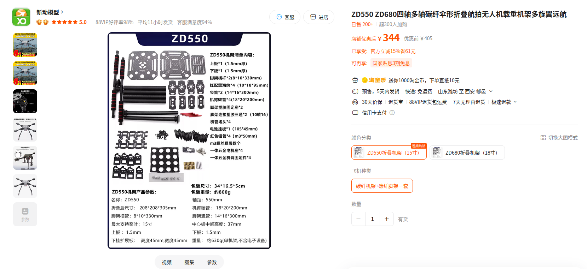 | 比赛方案记录 |
| 电机 | 3115，900 KV | 4 | ¥325 | [购买链接](https://item.taobao.com/item.htm?id=835992685039) | 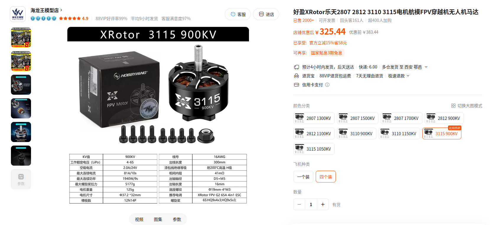 | 价格对应购买记录，需复核单价或套装价 |
| 电调 | 45 A | 4 | ¥170 | [购买链接](https://item.taobao.com/item.htm?id=919012488592) | 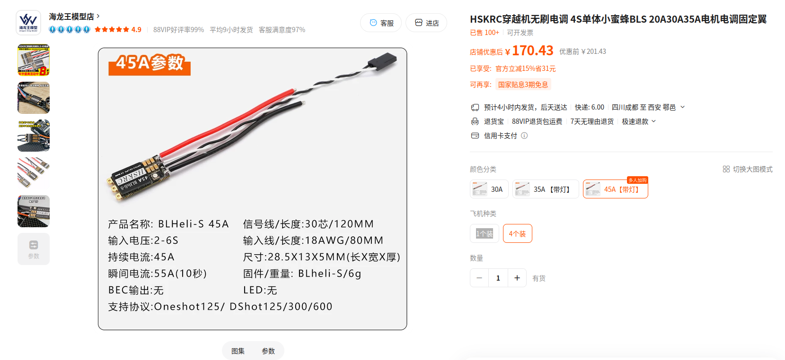 | 需与电机和电池整体匹配 |
| 螺旋桨 | 待补 | 1 套 | ¥30 | [购买链接](https://item.taobao.com/item.htm?id=801921429884) | 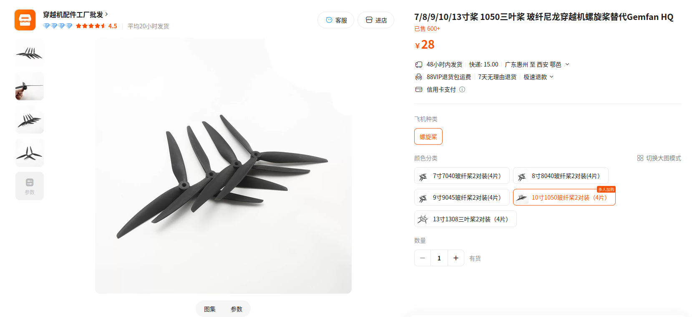 | 规格需与电机匹配 |
| 无人机动力电池 | 21700，6S2P | 1 | ¥300 | [购买链接](https://item.taobao.com/item.htm?id=1048043420333) | 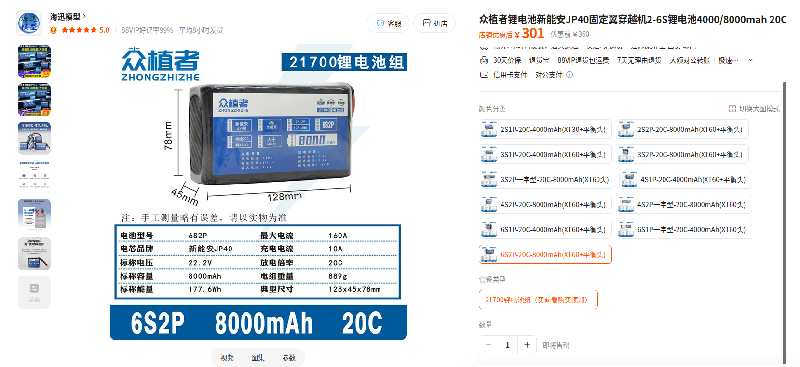 | 动力电源 |
| RK3588 供电电池 | 3S，500 mAh | 1 | ¥35 | [购买链接](https://item.taobao.com/item.htm?id=539051113365) | 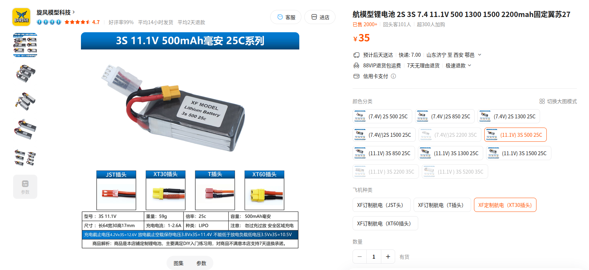 | 机载电脑独立供电 |
| 飞控 | CUAV 7Nano | 1 | 高校赞助 / ¥1,300 | [购买链接](https://detail.tmall.com/item.htm?id=1038880597269) | 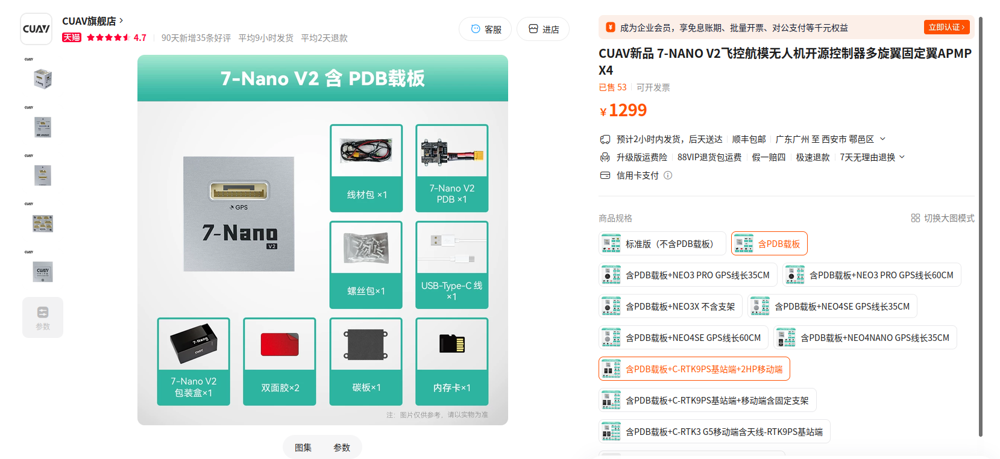 | 高校赞助；也可换用约 ¥300 的 H743 飞控 |
| GPS / 罗盘 | CUAV NEO 3X | 1 | 高校赞助 / ¥650 | [购买链接](https://detail.tmall.com/item.htm?id=753897860160) | 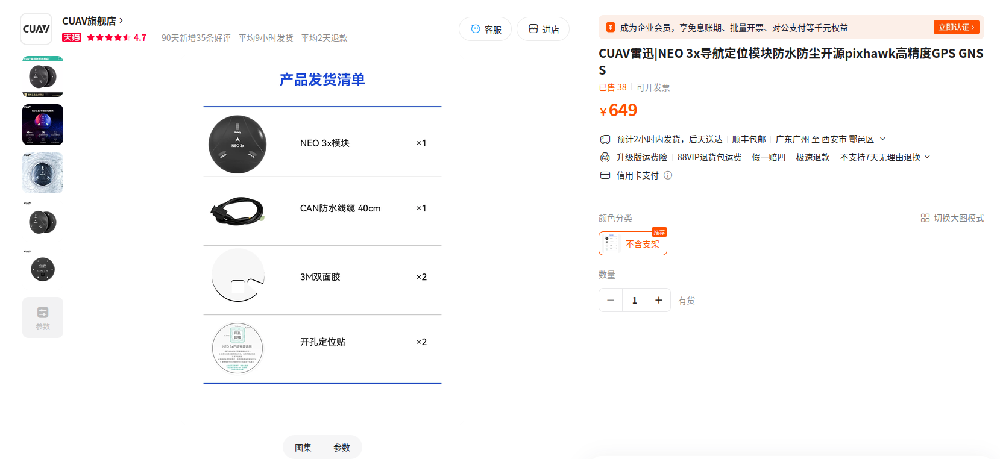 | 高校赞助；也可换用约 ¥100 的 M10 GNSS |
| 遥控器 | 自备 | 1 | 自备 | — | 待补 | 不计入本次采购成本 |
| 接收机 | ELRS | 1 | ¥40 | [购买链接](https://item.taobao.com/item.htm?id=975876166260) | 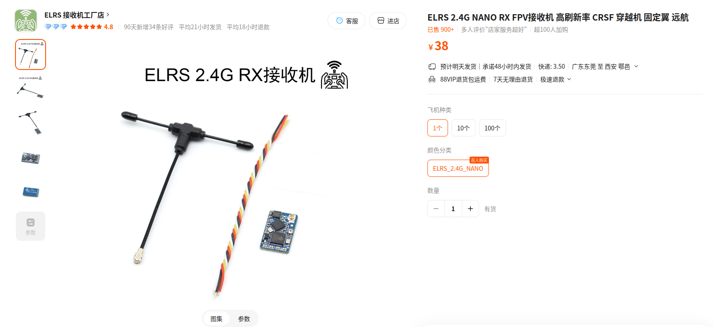 | 需与遥控器协议匹配 |
| RK3588 | FriendlyElec NanoPi T6 | 1 | 指导老师提供 / ¥1,450 | [购买链接](https://item.taobao.com/item.htm?id=1004961741219) | 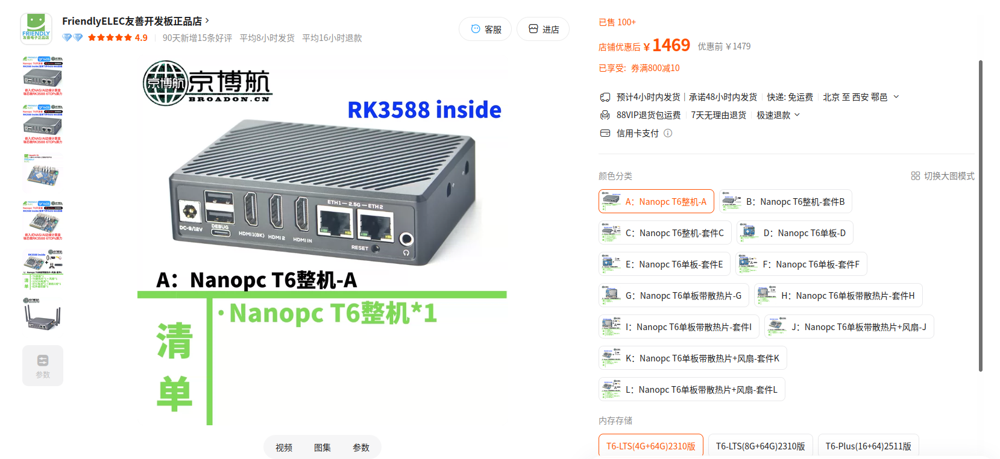 | 也可替换树莓派等一定要有NPU|
| 下视相机 | 720P，2.8 mm 无畸变镜头 | 1 | ¥60 | [购买链接](https://detail.tmall.com/item.htm?id=743082278344) | 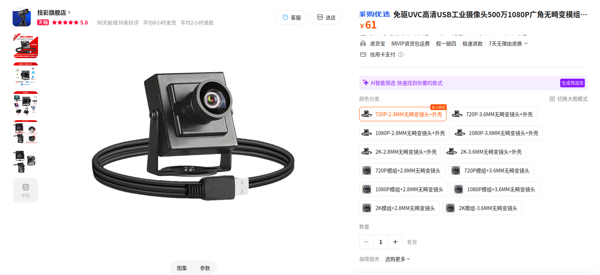 | 可换广角，不用无畸变摄像头也可以 |
| 投放舵机 | 20 kg | 2 | ¥60 | [购买链接](https://item.taobao.com/item.htm?id=1026969791475) | 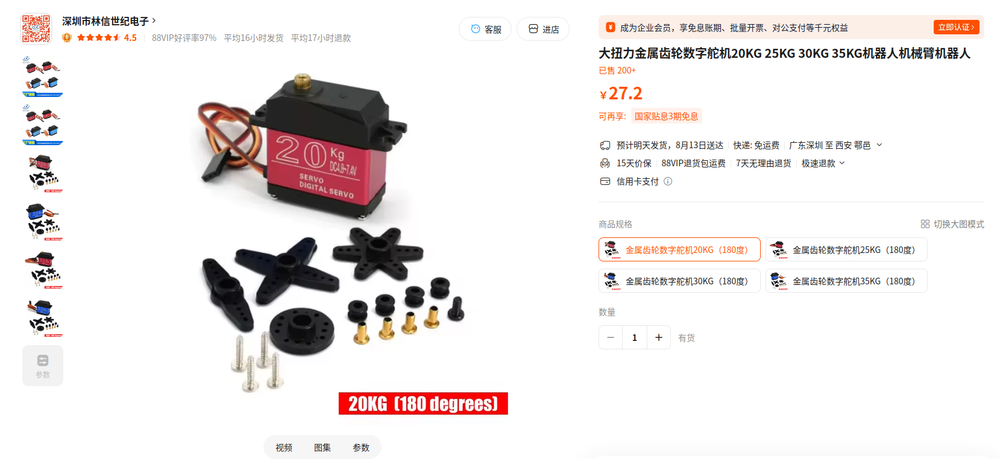 | 价格与单价/套装关系待复核 |
| 投放机构 | 抛投器 + 舵臂 | 2 | ¥36 | [购买链接](https://item.taobao.com/item.htm?id=658959892899) | 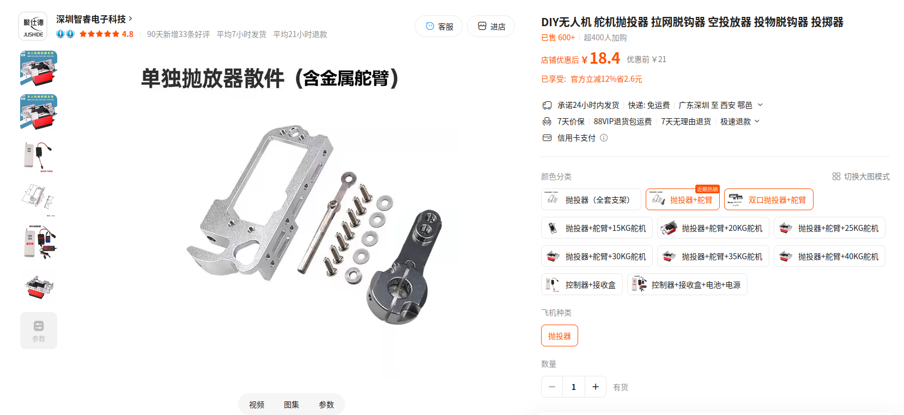 | 两路载荷投放 |
| RK3588 电源线 | XT30 公头 + DC 5.5 公头 | 1 套 | ¥4 | [线材 1](https://detail.tmall.com/item.htm?id=635021850009) / [线材 2](https://detail.tmall.com/item.htm?id=652326430345) | 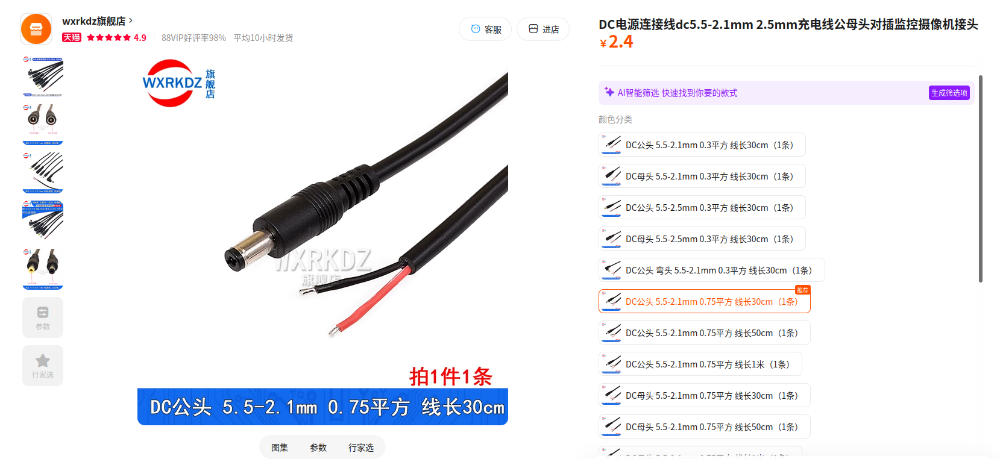 | 用于 RK3588 供电连接 |
| 机架立柱改装 | M3 × 55 mm | 1 套（5 个） | ¥8 | [购买链接](https://item.taobao.com/item.htm?id=930751955202) | 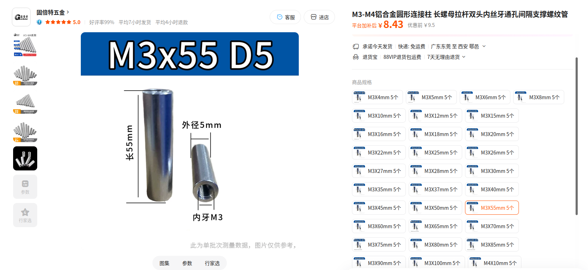 | 电池仓力主 |
| 脚架改装 | 外径 16 mm、内径 14 mm、长 1 m | 1 根 | ¥30 | [购买链接](https://item.taobao.com/item.htm?id=920426695110) | 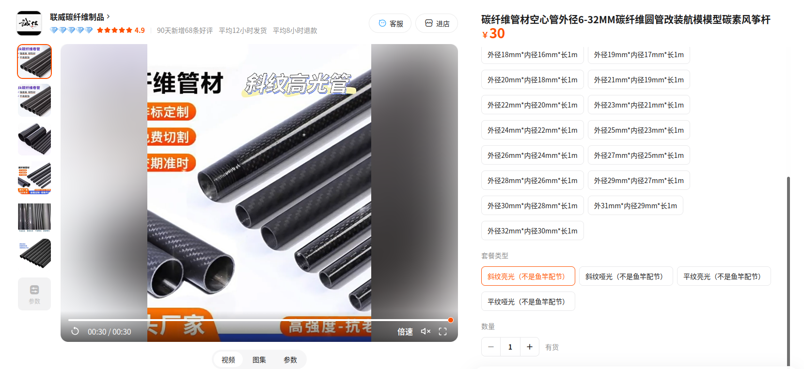 | 35 + 35 + 30 cm |
| 电池扎带 | 20 × 380 mm | 2 条 | ¥15 | [购买链接](https://item.taobao.com/item.htm?id=855669781420&skuId=5826707930759) | 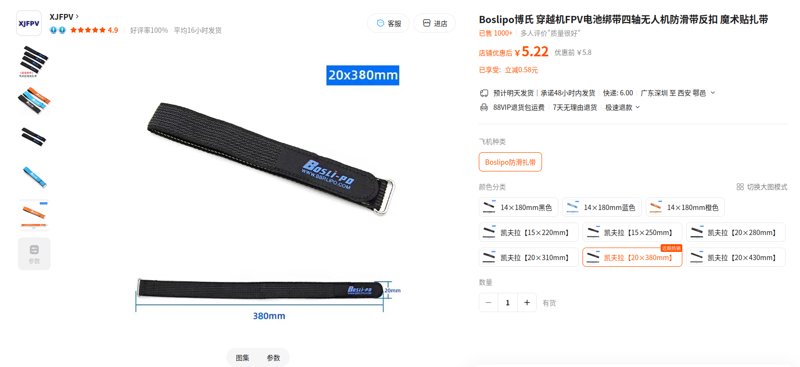 | 固定动力电池 |

### 参考总价与实际自费

遥控器为自备，不计入本次采购成本。飞控、GPS 获高校赞助，RK3588 由指导老师提供。

| 统计项 | 金额 | 计算说明 |
| --- | ---: | --- |
| 全部自行购买的参考总价 | ¥4,857 | 按当前方案 A 各行价格合计，不含自备遥控器 |
| 极低成本全自购参考价 | **约 ¥3,307** | 将 CUAV 7Nano / NEO 3X 分别替换为约 ¥300 的 H743 飞控和约 ¥100 的 M10 GNSS |
| 飞控、GPS、RK3588 的支持 | ¥3,400 | 飞控 ¥1,300 + GPS ¥650 + RK3588 ¥1,450 |
| 我们比赛的实际自费 | **¥1,457** | 参考总价减去上述支持 |

如后续补充采购链接、照片或更换硬件，请同步更新对应价格和这张合计表。

## 方案 B：稳定实飞方案

方案 B 继续沿用方案 A 的飞控、RK3588、下视相机、投放机构、通信方式和软件架构，仅对
动力系统和定位系统升级。

### 需要升级的硬件

| 硬件 | 型号 / 关键参数 | 数量 | 参考价格 | 采购链接 | 图片 | 备注 |
| --- | --- | ---: | ---: | --- | --- | --- |
| 电机 | 朗宇 X4112S，KV450 | 4 | ¥1,000 | [购买链接](https://item.taobao.com/item.htm?id=914531697555&skuId=5780908945798) | 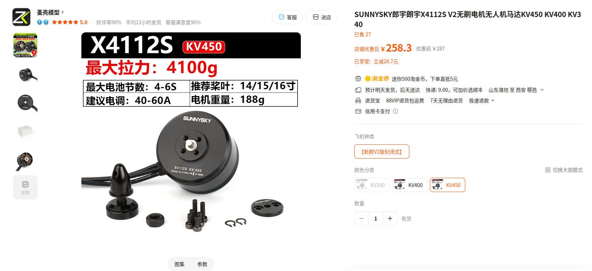 | 需与桨、电池、电调整体匹配 |
| 螺旋桨 | 14 寸；具体桨距需与电机和电池匹配 | 1 套 | ¥62 | [购买链接](https://item.taobao.com/item.htm?id=857576617028&skuId=5834708807825) | 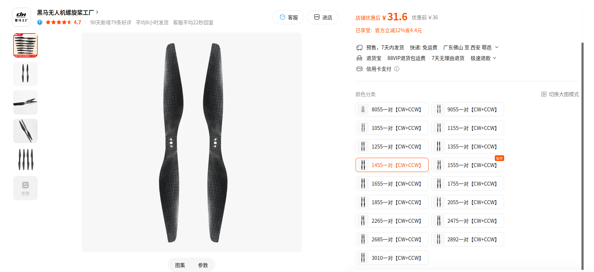 | 不可直接沿用 10 寸方案 |
| RTK GNSS | 支持 ArduPilot / MAVLink 的 RTK 定位方案 | 1 | ¥4,200 | [购买链接](https://detail.tmall.com/item.htm?id=727597534594&skuId=5065889745892) | 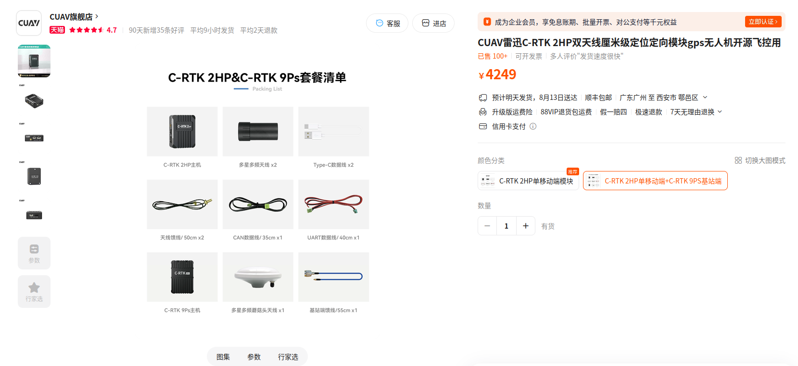 | 替换方案 A 的普通 GNSS |

<!-- TODO: 在 images/hardware/ 中补充稳定方案的实物照片 -->

### 预计总成本

| 统计项 | 金额 | 计算说明 |
| --- | ---: | --- |
| 当前已填写的升级件 | ¥5,262 | 电机 ¥1,000 + 14 寸螺旋桨 ¥62 + RTK GNSS ¥4,200 |
| 稳定方案全自购参考总价 | **¥9,114** | 方案 A ¥4,857 − 原电机 ¥325 − 原螺旋桨 ¥30 − 原 GPS ¥650 + 升级件 ¥5,262；机架、电调和动力电池继续沿用方案 A |

## 两种方案对比

| 项目 | 低成本方案 | 稳定方案 |
| --- | --- | --- |
| 定位 | CUAV NEO 3X / 普通 GNSS | RTK GNSS |
| 动力 | 比赛记录中的低成本动力 | 14 寸级高余量动力 |
| RK3588 | NanoPi T6 | 相同 |
| 下视视觉 | 相同 | 相同 |
| 飞控架构 | 相同 | 相同 |
| 软件 | 相同 | 相同 |

## 工具准备

- Linux系统笔记本电脑，最好ubuntu22.04；
- 万用表；
- 焊接和基础装机工具；
- 显示器，鼠标键盘，前期查看rk3588连接wifi查看ip地址。

详细环境配置见 [RK3588 环境配置](04_rk3588_setup.md)。

## 采购前注意事项

1. 14 寸桨不能直接装到原有 10 寸动力上，必须重新匹配电机、电调、电池和机架；
2. 电机、螺旋桨、电池和电调必须作为完整动力系统匹配；
3. RK3588 电源不能直接根据线色或经验判断；
4. 舵机供电和飞控 SERVO 信号需要分别确认；
5. 普通 GNSS 和 RTK 都不能替代下视视觉的最终目标对准；
6. 不要根据本章的历史价格或“待补”内容直接下单；
7. 后续优先参考真实 BOM、实际复现记录和硬件说明书。

## 完成检查

- [ ] 已选择低成本方案或稳定方案
- [ ] 所有必需硬件已有明确型号
- [ ] 已确认动力系统匹配
- [ ] 已确认飞控、GPS/RTK 与 ArduPilot 兼容
- [ ] 已确认 RK3588、相机和飞控之间的连接方案
- [ ] 已确认 RK3588 和舵机供电方案
- [ ] 已统计实际预算
- [ ] 已准备装机工具和必要线材

**下一章：[无人机组装](03_drone_assembly.md)**
